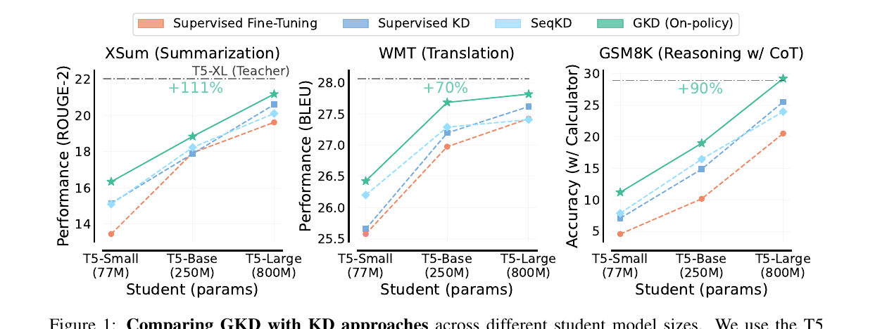
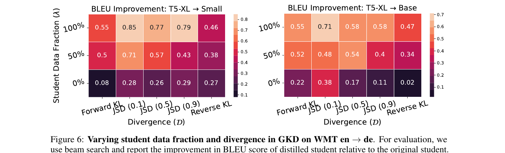
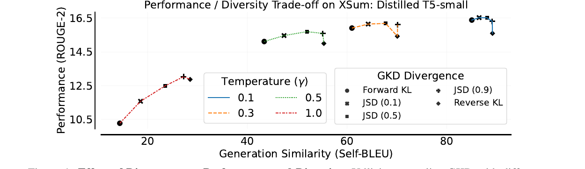
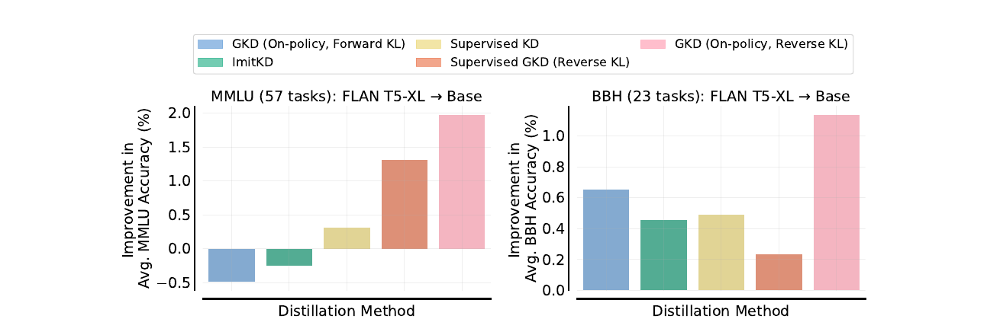

# On-policy Distillation of Language Models: Learning from Self-Generated Mistakes (GKD)

> **Venue**: **ICLR 2024** (arXiv:2306.13649, v3 2024.01.17)
> **Authors**: Rishabh Agarwal¹²\*, Nino Vieillard¹\*, Yongchao Zhou¹³, Piotr Stanczyk¹†, Sabela Ramos¹†, Matthieu Geist¹, Olivier Bachem¹
> ¹**Google DeepMind** · ²Mila · ³University of Toronto
> (\* 공동 1저자, † 인프라 기여)
> **arXiv**: [2306.13649](https://arxiv.org/abs/2306.13649)

**한 줄 정의**: auto-regressive 모델의 KD를 **interactive expert가 있는 imitation learning 문제**로 재정의하고, 두 개의 손잡이 — **student data fraction λ**(얼마나 on-policy로 갈 것인가)와 **divergence D**(무엇으로 잴 것인가) — 를 노출한 일반화 프레임워크. 기존 supervised KD·SeqKD·ImitKD·f-distill이 전부 이 프레임의 **특정 점**으로 환원되고, 아무도 탐색하지 않았던 **λ = 1(완전 on-policy)** 영역이 거의 항상 최선이다.

> ⚠️ **이름 혼동 주의**: 같은 시기 arXiv에 **"GKD: A General Knowledge Distillation Framework for Large-scale Pre-trained Language Model"** ([arXiv:2306.06629](https://arxiv.org/abs/2306.06629), Tan 외 · Zhipu.AI)이라는 **동명의 다른 논문**이 있다. 그쪽은 100B급 PLM 증류를 위한 메모리 최적화·병렬화 엔지니어링 툴킷이고 on-policy distillation과 무관하다. 이 시리즈에서 GKD는 **항상 Agarwal 외 2306.13649**를 가리킨다.

> 📌 **이 노트의 위치**: on-policy distillation의 **원류 두 편 중 하나**. 나머지가 [`minillm.md`](minillm.md)이며, 두 논문은 **2023년 6월 같은 달에 독립적으로** 같은 문제를 공격해 **다른 결론**에 도달했다. §7의 대조표 참조.

---

## 1. Background

### auto-regressive KD의 두 갈래와 공통 결함

| 방법 | 학습 데이터 | 문제점 |
|---|---|---|
| **SeqKD** (Kim & Rush 2016) | teacher가 생성한 **고정된** 출력 시퀀스 | 생성 비용이 비싸다. 그리고 여전히 고정 데이터셋이다 |
| **Supervised KD** (Hinton 2015, Sanh 2019) | **고정된** 데이터셋 + teacher의 토큰 수준 확률 | teacher 분포를 풍부하게 쓰지만 데이터가 고정이다 |
| **공통 결함** | — | **학습 중 보는 시퀀스**와 **추론 중 student가 자기회귀로 만드는 시퀀스** 사이의 **분포 불일치**. imitation learning에서 잘 알려진 문제(Pomerleau 1991; Ross & Bagnell 2010) |

이 불일치는 auto-regressive 모델에서 특히 치명적이다. 각 스텝의 예측이 이전 스텝에 의존하므로 **초기 오류가 이후 예측 전체에 연쇄(cascading)** 한다.

### forward KL의 두 번째 결함

증류의 통상적 목적함수는 forward KL이다. 이는 student가 teacher 토큰 분포 `p_T(·|y<n, x)`의 **전체 support를 덮도록** 요구한다. 그 과정에서 student는 자기 분포 하에서 확률이 낮은 토큰 `v`에도 확률 질량을 배정하고, 그 결과가 **hallucination과 저품질 생성**이다. student 용량이 teacher보다 훨씬 작을 때, 그리고 **temperature sampling을 쓸 때** 이 문제가 두드러진다.

### 사전 지식 — 두 divergence 계열

```
# 비대칭성
D_KL(P‖Q) = Σ_c P(c) · log( P(c) / Q(c) )

  forward KL : D_KL(P‖Q)   — mode-covering. 경험적 데이터 분포에서 최대우도와 대응
  reverse KL : D_KL(Q‖P)   — mode-seeking

# (1) generalized JSD — KL과 달리 support가 disjoint여도 유계(bounded)
D_JSD(β)(P‖Q) = β · D_KL( P ‖ βP + (1−β)Q )  +  (1−β) · D_KL( Q ‖ βP + (1−β)Q )

  β → 0 : gradient가 forward KL 처럼 거동   (Huszár 2015: lim_{β→0} D_JSD(β)(P‖Q)/β = D_KL(P‖Q))
  β → 1 : gradient가 reverse KL 처럼 거동
```

JSD(β)는 forward KL과 reverse KL 사이를 **연속적으로 보간**하는 손잡이다.

---

## 2. Motivation

### 핵심 통찰 1: KD는 interactive expert가 있는 imitation learning이다

이것이 논문의 프레임 전환이다. auto-regressive 모델의 KD를 **imitation learning** 문제로 보면, 고정 데이터셋 학습은 **behavior cloning**에 해당하고 분포 불일치는 그 계열의 고전적 실패 모드다.

해법도 imitation learning에서 그대로 가져온다 — **on-policy imitation**(Ross et al. 2011, DAgger 계보): student 정책으로 시퀀스를 **반복 수집**하고, 그 시퀀스에 **expert(teacher) 라벨**을 붙여 재학습한다.

> 로보틱스와 deep RL에서는 표준인 이 접근이 **auto-regressive 모델 증류에는 쓰이지 않고 있었다** — 논문의 출발점.

### 핵심 통찰 2: student가 실제로 만드는 오류에 피드백을 줘야 한다

on-policy KD에서 student는 **자기가 생성한 시퀀스의 잘못된 토큰**에 대해 teacher logit으로부터 토큰 수준 피드백을 받는다. RL과 유사한 피드백 루프가 형성된다.

부수 효과가 하나 더 있다: **student가 학습 중 개선되면 student가 만드는 데이터의 품질도 함께 올라간다.** 데이터 분포가 정체되지 않는다.

### 핵심 통찰 3: 최적 divergence는 태스크에 따라 다르다

이것이 MiniLLM과 갈리는 지점이다. reverse KL 같은 mode-seeking divergence는 teacher가 높은 확률을 주는 토큰을 우선해 저품질 생성을 피하지만, **주어진 입력에 대한 생성 다양성을 희생**한다.

논문의 실험 결론: **최적 divergence는 태스크 의존적**이며, 다양성과 성능의 트레이드오프를 태스크별로 따져야 한다. 따라서 divergence를 **고정하지 말고 하이퍼파라미터로 노출**해야 한다.

---

## 3. Contributions

1. **GKD 프레임워크**: on-policy student 생성 출력 위에서 teacher의 토큰 수준 확률을 감독으로 쓰는 일반화된 증류. **λ(student data fraction)** 와 **D(divergence)** 두 축으로 기존 방법들을 통합.
2. **task-specific 검증**: 요약·번역·산술 추론 3종에서, 초기 student 대비 성능 향상을 기준으로 **베이스라인 KD 대비 요약 2.1배 · 번역 1.7배 · 추론 1.9배**의 상대적 이득.
3. **task-agnostic 검증**: instruction tuning(FLAN)에서 held-out **MMLU·BBH** 기준 절대 정확도 개선.
4. **RL fine-tuning과의 결합**: on-policy GKD를 **RLAIF와 동시에** 최적화하는 목적함수 제시 — 이전에 시도된 바 없는 조합.
5. **설계 선택의 체계적 평가**: student 생성 데이터의 중요성과, 최적 divergence가 태스크 의존적이라는 실용적 통찰.

---

## 4. Method

### 4.1 문제 설정

```
p_T : teacher 자기회귀 모델 (고정)
p_S^θ : student 모델 (θ에 대해 미분 가능)
X : 입력 데이터셋.  (X, Y) : 입력–출력 쌍 데이터셋 (없으면 teacher 샘플링으로 생성 가능)

# (2) 토큰 수준 분포 간 divergence를 시퀀스에 대해 평균
D(p_T ‖ p_S^θ)(y|x) := (1 / L_y) · Σ_{n=1..L_y}  D( p_T(·|y<n, x) ‖ p_S^θ(·|y<n, x) )

  L_y : 시퀀스 y의 길이
```

기존 방법들을 이 표기로 정리하면:

```
# Supervised FT — teacher 접근 없이 고정 데이터셋의 음의 로그우도
L_SFT(θ) = E_{(x,y) ~ (X,Y)} [ − log p_S^θ(y|x) ]

# SeqKD — teacher 생성 출력에 대한 supervised FT

# Supervised KD — 고정 데이터셋 위에서 teacher의 토큰 수준 확률을 타깃으로
L_SD(θ) = E_{(x,y) ~ (X,Y)} [ D_KL( p_T ‖ p_S^θ )(y|x) ]
```

### 4.2 On-policy KD

student가 생성한 출력 시퀀스 위에서 teacher 분포를 모방한다.

```
# (4)
L_OD(θ) = E_{x ~ X} [ E_{y ~ p_S(·|x)} [ D_KL( p_T ‖ p_S^θ )(y|x) ] ]
```

**결정적 설계 선택 — student의 샘플링 분포 `p_S(·|x)`로 역전파하지 않는다.** on-policy imitation과 동일한 처리이며, 저자들은 이것이 학습을 **안정적이고 계산적으로 효율적**으로 만든다고 명시한다. (MiniLLM은 정반대를 택한다 — §7 참조)

부가 사항:
- 학습 중 샘플링은 **temperature γ = 1** 로 student 생성의 다양성을 유도
- 라벨 없는 입력 prompt만 있으면 되고, **student로 생성하는 것이 teacher로 생성하는 것보다 싸다**(모델 크기 차이)

### 4.3 GKD — 일반화

```
# 최종 목적함수
L_GKD(θ) = (1 − λ) · E_{(x,y) ~ (X,Y)} [ D( p_T ‖ p_S^θ )(y|x) ]
         +      λ  · E_{x ~ X} [ E_{y ~ p_S(·|x)} [ D( p_T ‖ p_S^θ )(y|x) ] ]

  λ ∈ [0, 1] : student data fraction — on-policy student 생성 출력의 비율
  D          : 임의의 divergence (forward KL / reverse KL / JSD(β) / …)
```

**두 손잡이로 기존 방법을 전부 표현한다.**

| 방법 | λ | D |
|---|---|---|
| Supervised KD | **0** | forward KL |
| On-policy KD | **1** | forward KL |
| ImitKD (Lin 2020) | 비증가 스케줄 (예: 0.5) | forward KL (token-level) |
| f-distill (Wen 2023) | 0.5 (mixed) | total variation distance |
| **GKD** | **자유** | **자유** |

> 논문의 주장: ImitKD와 f-distill은 **GKD의 특정 인스턴스**이며, 실증적으로 on-policy GKD보다 나쁜 결과를 낸다(Figure 2, 9).

**Algorithm 1**

```
Given: teacher p_T, student p_S^θ, 데이터셋 (X, Y)
Hyperparameters: student data fraction λ ∈ [0,1], divergence D, learning rate η

for k = 1 .. K:
    u ~ Uniform(0, 1)
    if u ≤ λ:
        X에서 입력 x 샘플 → y ~ p_S^θ(·|x) 생성 → B = {(x_b, y_b)}   # on-policy
    else:
        (X, Y)에서 입력·출력 배치 샘플 → B = {(x_b, y_b)}             # 고정 데이터셋
    θ ← θ − η · (1/B) Σ_{(x,y) ∈ B} ∇_θ D( p_T ‖ p_S^θ )(y|x)
```

**Remark**: teacher가 피드백을 줄 만한 품질의 시퀀스를 student가 생성할 수 있어야 한다. 그래서 실험은 전부 **supervised FT를 거친 student**에서 출발한다 — RLHF의 2단계(SFT → RL) 구조와 동일하다.

### 4.4 RL Fine-tuning + On-policy GKD

teacher로부터의 증류는 종종 **진짜 목표의 프록시**일 뿐이다. 진짜 목표(사실 일관성 등)를 RL로 직접 최적화하면서 teacher 근처에 머물게 하려면:

```
# (5)
E_{x ~ X} [ (1 − α) · E_{y ~ p_S^θ(·|x)}[ r(y) ]   −   α · E_{y ~ p_S(·|x)}[ D(p_T ‖ p_S^θ)(y|x) ] ]
            └──────── RL 목적함수 ────────┘         └──── Generalized On-Policy Distillation ────┘

  α ∈ [0, 1] : 증류 손실의 강도.  α = 1 이면 순수 증류
```

이 결합은 **alignment tax**(인간 선호 정렬 시 일반 능력이 떨어지는 현상)를 증류로 상쇄할 수 있다는 발상이다. 저자들이 아는 한 **증류와 RL fine-tuning을 동시에 수행한 최초의 시도**다.

> **권고**: RLHF/RLAIF는 보통 reverse KL로 학습 정책을 초기 정책 근처에 묶는다. 기존 RL 워크플로에 최소 변경으로 GKD를 넣으려면 **reverse KL 또는 JSD(0.9)** 를 쓰라.

### 4.5 학습 vs 추론

| 단계 | 과정 |
|---|---|
| **학습** | 매 스텝 λ 확률로 student 생성 / (1−λ) 확률로 고정 데이터셋 선택 → 해당 시퀀스에 teacher가 토큰 수준 분포 부여 → D 최소화. **샘플링 분포로 역전파하지 않음** |
| **추론** | student 단독 |

---

## 5. Experiments

### 5.1 Setup

| 항목 | 내용 |
|---|---|
| **모델** | 오픈소스 **T5** 계열 (동일 데이터로 사전학습). Teacher = supervised FT된 **T5-XL (~3B)** |
| **Student** | T5-small(**77M**) / T5-base(**250M**) / T5-large(**800M**) — teacher 대비 각각 **38× · 12× · 3.8×** 작다 |
| **태스크** | 요약(XSum) · 번역(WMT14 en→de) · 산술 추론(GSM8K) · instruction tuning(FLAN2021) |
| **GKD 변형** | D ∈ {forward KL, reverse KL, JSD(0.1), JSD(0.5), JSD(0.9)} × λ ∈ {1(**On-policy**), 0.5(**Mixed**), 0(**Supervised**)} |
| **베이스라인** | SeqKD, Supervised KD, **ImitKD**, **f-distill**. 전부 GKD와 **동일한 supervised FT student 체크포인트**에서 출발 |

### 5.2 Main Results



> **Figure 1**: student 크기별 GKD와 기존 KD 비교. 수평 점선이 teacher(T5-XL) 성능. Supervised KD와 FT는 ground-truth 출력으로, SeqKD는 teacher 생성 출력으로 학습한다. GKD는 WMT에 JSD(0.1), 그 외에 forward KL을 사용. 평가는 XSum·GSM8K에 greedy sampling, WMT에 beam search.

초기 student 대비 성능 향상을 기준으로, 여러 크기의 T5 student에 대해 평균한 **베이스라인 KD 대비 상대적 이득**:

| 태스크 | 지표 | 상대 이득 |
|---|---|---|
| **XSum** (요약) | ROUGE-2 | **2.1× (+111%)** |
| **WMT** (번역) | BLEU | **1.7× (+70%)** |
| **GSM8K** (추론) | Accuracy | **1.9× (+90%)** |

특기 사항: **on-policy GKD로 증류한 T5 모델이 PaLM(540B)의 few-shot 성능을 넘는다** — 약 **7000× 작은 모델**로.

#### 데이터 효율



> **Figure 6**: WMT en→de에서 λ와 divergence를 동시에 변화시킨 결과. 숫자는 원본 student 대비 **BLEU 개선폭**(3 시드 평균). Teacher는 T5-XL(BLEU 28). **왼쪽** student = T5-small(BLEU 25.58), **오른쪽** student = T5-base(BLEU 26.98).

**λ = 100% 행이 모든 열에서 λ = 0% 행을 압도한다.** T5-small에서 최고는 JSD(0.1) × λ=100%의 **0.85**이고, 같은 divergence에서 λ=0%는 **0.28**이다 — **3배 차이**. T5-base에서도 0.71 vs 0.38.

XSum의 데이터 스케일링 실험(Figure 3)은 더 강한 결과를 보여준다: **on-policy GKD를 5%로 서브샘플링한 데이터에 적용한 것이, supervised KD와 ImitKD를 ground-truth 요약이 붙은 전체 데이터셋에 적용한 것보다 낫다.**

### 5.3 Divergence 선택 — 태스크 의존적이다



> **Figure 4**: divergence가 성능과 다양성에 미치는 영향. XSum에서 샘플링 온도를 바꿔가며 측정. 다양성은 **Self-BLEU**로 정량화(100 = 결정적 출력, 0 = 최대 다양성). forward KL → generalized JSD → reverse KL로 갈수록 mode-seeking 성질이 강해져 **다양성이 감소**한다. mode-seeking divergence는 **특히 높은 온도(γ=1)에서 더 나은 품질**을 낸다. 온도를 낮추면 다양성이 줄어드는 동시에 divergence 간 성능 차이도 좁혀진다.

태스크별로 최적 divergence가 갈린다.

| 태스크 | 최적 divergence | 근거 |
|---|---|---|
| **XSum** (temperature sampling) | **JSD(0.9)** | Figure 2에서 ImitKD·f-distill·supervised KD를 모두 상회 |
| **XSum** (greedy) | 차이 미미 | 온도가 낮으면 divergence 선택의 영향이 작다 |
| **WMT** | **JSD(0.1)** | Figure 6에서 두 student 크기 모두 최고 |
| **GSM8K** | **forward KL** (reverse KL도 좋음) | Figure 7에서 λ=100% 기준 8.8(forward) vs 8.0(reverse) |
| **FLAN instruction tuning** | **reverse KL** (압도적) | Figure 10 |

> **정리**: mode-seeking divergence는 **평가에 temperature sampling을 쓸 때** 더 잘 작동한다. greedy sampling에서는 divergence 선택이 성능에 큰 영향을 주지 않는다. **student가 커질수록 forward/reverse KL 간 성능 격차가 줄어든다.**

### 5.4 산술 추론 (GSM8K)

**Setup** — GSM8K 문제 앞에 Wei et al.(2022)의 CoT exemplar 4개를 붙이는 few-shot prompting. supervised 학습에는 Magister et al.(2022)이 생성한 CoT 출력 사용(원본 train split에서 약 **5.3K** (문제, CoT) 쌍). Flan-T5 모델을 이 CoT 데이터셋으로 10K 스텝 supervised FT한 것이 증류 출발점. Teacher = FLAN T5-XL(테스트 정확도 **27.9**).

**결과** (T5-XL → T5-Base, λ와 divergence 격자):

| λ (student data fraction) | Forward KL | JSD(0.1) | JSD(0.5) | JSD(0.9) | Reverse KL |
|---|---|---|---|---|---|
| **100%** | **8.8** | 7.6 | 7.0 | 6.7 | 8.0 |
| 50% | 6.8 | 6.2 | 6.4 | 5.9 | 6.9 |
| 0% | 4.7 | 5.1 | 5.1 | 5.0 | 5.7 |

- **고정 CoT 데이터셋만 쓰거나 student 생성 CoT와 섞는 것 모두, student 생성 CoT만 쓰는 것에 일관되게 못 미친다.**
- on-policy 데이터 비율이 **25%를 넘으면** 성능이 계속 개선된다(Figure 8).
- forward KL이 잘 작동한다 — greedy sampling을 쓰는 XSum에서의 관찰과 일치.

### 5.5 RL Fine-tuning + On-policy GKD (XSum)

요약에서 진짜 목표는 **입력 문서와의 사실 일관성**이다. 증류만으로는 이것이 개선되지 않을 수 있다(큰 모델도 환각한다). T5-XXL NLI 분류기의 textual entailment 점수를 reward로 쓰는 RLAIF와 on-policy GKD를 결합했다.

> **Figure 5 (요약)**: α를 키우면 ROUGE-2가 오르고 사실 일관성 개선폭은 줄어드는 트레이드오프가 나타난다. **on-policy GKD + RL이 RLEF\*(Roit et al. 2023) 대비 더 높은 ROUGE-2를 달성하면서, teacher보다 더 사실 일관적인 요약을 생성한다.**

증류 손실이 alignment tax를 상쇄할 수 있다는 가설의 실증이다.

### 5.6 Task-agnostic 증류 — Instruction Tuning

**Setup** — FLAN T5-XL을 teacher로, **FLAN T5-Base**를 student로 증류. 데이터는 **FLAN2021**(62개 태스크, **536만** 예제). 평가는 증류 데이터에 포함되지 않은 **held-out** 벤치마크 2종 — **MMLU**(57 태스크) · **BBH**(23 태스크, PaLM 540B가 인간 평균 이하인 난제 모음). 50K 스텝 체크포인트로 few-shot prompting 정확도 측정.



> **Figure 10**: FLAN에서의 task-agnostic 증류. **reverse KL을 쓴 on-policy GKD가 다른 방법들을 크게 앞선다.** teacher FLAN T5-XL은 MMLU **52.4%** / BBH **41%**. SeqKD는 학습 중 teacher 생성 비용 때문에 제외.

| 방법 | MMLU 개선 | BBH 개선 |
|---|---|---|
| GKD (On-policy, Forward KL) | **−0.5** | +0.65 |
| ImitKD | −0.2 | +0.45 |
| Supervised KD | +0.3 | +0.49 |
| Supervised GKD (Reverse KL) | +1.3 | +0.23 |
| **GKD (On-policy, Reverse KL)** | **+2.0** | **+1.1** |

> ⚠️ 위 수치는 논문에 표가 없어 **Figure 10의 막대에서 읽은 근사값**이다. 본문·초록은 이를 *"BBH와 MMLU에서 각각 2%·1% 절대 개선"* 으로 서술하는데, 그림상으로는 **MMLU가 ~2.0, BBH가 ~1.1** 로 순서가 뒤바뀌어 있다(원문 내 불일치). 부호와 순위는 확실하나 소수점은 신뢰하지 말 것.

**주목할 점**: instruction tuning 맥락에서 **reverse KL이 forward KL보다 훨씬 낫다** — forward KL은 MMLU에서 **음수**다. 저자들의 가설: reverse KL의 mode-seeking 성질이 student를 **지시가 명시한 주된 의도·행동에 집중**하게 만들고, 덜 중요한 세부에 확률을 낭비하지 않게 해서 held-out 태스크 성능이 좋아진다.

---

## 6. Key Takeaways

1. **KD를 imitation learning으로 재정의한 것이 이 논문의 진짜 기여다.** 고정 데이터셋 증류 = behavior cloning, on-policy 증류 = DAgger 계열. 이 프레임이 있으면 "왜 student 생성 데이터가 필요한가"가 자명해진다.

2. **λ = 100%(완전 on-policy)가 거의 항상 최선이다.** WMT에서 JSD(0.1) 기준 λ=100%가 **0.85** vs λ=0%가 **0.28**(3배). GSM8K에서도 λ=100% 행이 λ=0% 행을 전 divergence에서 상회. **아무도 탐색하지 않았던 영역이 정답이었다**는 것이 논문의 핵심 발견.

3. **최적 divergence는 태스크 의존적이다 — 고정하면 안 된다.** XSum(temperature sampling)은 JSD(0.9), WMT는 JSD(0.1), GSM8K는 forward KL, FLAN instruction tuning은 reverse KL. **instruction tuning에서 forward KL은 MMLU 개선이 −0.5로 음수**인 반면 reverse KL은 **+2.0**이다.

4. **mode-seeking의 이득은 평가 방식에 달려 있다.** temperature sampling에서는 mode-seeking divergence가 유리하지만, **greedy sampling에서는 divergence 선택의 영향이 거의 없다.** 또한 student가 커질수록 forward/reverse KL 격차가 줄어든다.

5. **데이터 효율이 극적이다.** on-policy GKD를 XSum의 **5% 서브샘플**에 적용한 것이, supervised KD·ImitKD를 **ground-truth 요약이 붙은 전체 데이터셋**에 적용한 것보다 낫다. student 생성 데이터가 ground truth보다 유용한 국면이 존재한다.

6. **샘플링 분포로 역전파하지 않는 것이 의도적 설계다.** 이 한 가지 결정이 GKD를 supervised 학습에 가깝게 만들고, MiniLLM이 필요로 한 안정화 장치 3종을 불필요하게 만든다. **단순함이 곧 주장이다.**

7. **증류와 RL을 동시에 돌릴 수 있다.** on-policy GKD + RLAIF가 RLEF\* 대비 더 높은 ROUGE-2를 내면서 teacher보다 사실 일관성이 높은 요약을 생성한다. 증류 손실이 **alignment tax를 상쇄**할 수 있다는 실증.

8. **압축률이 실용적 수준이다.** T5-XL(3B) → T5-small(77M)은 **38× 압축**이고, 증류된 T5 모델이 **약 7000× 큰 PaLM(540B)의 few-shot 성능을 넘는다.**

---

## 7. MiniLLM과의 대조 — 같은 시기, 같은 문제, 다른 답

[`minillm.md`](minillm.md)(Gu 외, Tsinghua·MSR)와 **같은 2023년 6월에 독립적으로** 발표됐다. GKD 논문 §5가 MiniLLM을 동시기 연구로 명시하고 직접 비판한다.

| 축 | **GKD** | **MiniLLM** |
|---|---|---|
| divergence | **자유 선택** — forward KL / reverse KL / JSD(β) | **reverse KLD 고정** |
| on-policy 정도 | **λ ∈ [0,1] 하이퍼파라미터** | **항상 100%** |
| 최적화 수준 | **token-level** — 각 위치의 divergence | **sequence-level** — 시퀀스 전체 reverse KL |
| 샘플링 역전파 | **하지 않는다** (명시적 설계 결정) | **한다** (policy gradient) |
| 안정화 장치 | **없음** | **3종 필수** + PPO clipping + LM loss |
| 프레임 | 이것은 **imitation learning이다** | 이것은 **RL이다** (IRL 등가성 증명) |
| RL 결합 | **RLAIF와 동시 최적화** 제안 | 다루지 않음 |
| 검증 규모 | T5 77M~800M ← T5-XL 3B | GPT-2/OPT/LLaMA **120M~13B** |

**GKD의 비판 (§5 원문 요약)**: *"MiniLLM은 sequence level에서 reverse KL을 policy gradient 방식으로 최적화한다. 우리는 GKD가 더 단순하고 안정적이라고 본다. student의 샘플링 과정으로 역전파하지 않아 supervised 학습에 더 가깝기 때문이다. 실제로 MiniLLM은 높은 분산, reward hacking, 생성 길이 편향을 다루기 위한 여러 안정화 트릭에 의존한다. GKD는 forward KL이나 JSD 같은 다른 divergence도 쓸 수 있어 더 일반적이며, 이들이 reverse KL보다 나은 경우가 있다."*

**양쪽 다 근거가 있다.**

- **GKD가 맞는 부분** — MiniLLM의 ablation이 이 비판을 스스로 입증한다. Length Normalization 하나만 빼도 Rouge-L이 **24.6 → 14.7 (−40%)** 로 붕괴한다. divergence 유연성도 GKD가 실증했다(FLAN에서 forward KL은 −0.5, reverse KL은 +2.0).
- **MiniLLM이 맞는 부분** — GKD 자신의 λ 실험이 **λ = 100%가 거의 항상 최선**임을 보여준다. 그건 MiniLLM이 처음부터 고정해둔 설정이다. 그리고 **산업 규모 후속 연구는 MiniLLM 계보를 따랐다** — [`mopd.md`](mopd.md)의 policy-gradient 구현이 *"MiniLLM(Gu 2026)을 따라"* 라고 명시한다.

**그런데 GKD의 "reverse KL이 항상 답은 아니다"는 결론은 후속 연구에서 되살아난다.** [`revisiting_opd.md`](revisiting_opd.md)와 Entropy-Aware OPD가 고엔트로피 토큰에서 forward KL을 섞는 처방을 내놓고, [`rethinking_opd.md`](rethinking_opd.md)가 reverse KL의 mode-seeking이 **조건부 장점**임을 지적한다. GKD의 divergence 축은 3년 뒤에 다시 열린다.

### 시리즈 내 위치

| 후속 노트 | GKD와의 관계 |
|---|---|
| [`minillm.md`](minillm.md) | **동시기 원류**. 위 대조표가 전부 |
| [`exopd_learning_beyond_teacher.md`](exopd_learning_beyond_teacher.md) | GKD가 노출한 λ·D 두 축에 더해 **reward scaling λ(≡1/β)와 reference model**이라는 두 축을 추가로 연다. GKD의 "무엇으로 재는가"에서 "무엇 대비 재는가"로 |
| [`rethinking_opd.md`](rethinking_opd.md) | GKD가 다루지 않은 **teacher 선정 조건**을 정면 조사. GKD는 전 실험이 같은 T5 계열이라 이 문제를 만나지 않았다 |
| [`mopd.md`](mopd.md) | GKD가 열어둔 divergence 축을 **닫는다** — same-origin 조건에서는 loss 형태가 사실상 무관(PG 0.937 vs Top-64 0.909)하고 **teacher 분포 정렬이 지배적**이라고 결론 |
| 원문 블로그 | 블로그가 정리한 "dense × on-policy" 2×2 표에서 **on-policy 축의 출처가 이 논문**이다 |

### GKD가 남긴 빈칸

- **규모** — T5-XL(3B)이 가장 큰 teacher다. 수십~수백 B 규모에서 같은 결론이 성립하는지는 미확인이며, [`mopd.md`](mopd.md)의 309B 실험이 divergence 유연성보다 **teacher 분포 정렬**이 지배적이라고 답한다.
- **teacher 선정** — 전 실험이 같은 데이터로 사전학습된 T5 계열 안에서 이뤄져 **분포 격차 문제를 만나지 않았다**. 이것이 후속 연구의 최대 논점이 된다.
- **λ 스케줄링** — λ를 상수로 다룬다. ImitKD의 비증가 스케줄을 비판했지만 **더 나은 스케줄이 존재하는지**는 탐구하지 않았다.
- **long-horizon** — 요약·번역·GSM8K CoT는 전부 짧은 생성이다. 수천 토큰 추론 궤적에서의 거동은 미탐구.
- **비-텍스트 확장** — 저자들이 future work로 오디오·비디오·text-to-image 자기회귀 모델로의 확장을 언급한다.

---

[← 후속 연구 정리](opd_follow_up_research.md) · [MiniLLM (동시기 원류)](minillm.md) · [원문 요약](on_policy_distillation.md) · [MOPD](mopd.md) · [ExOPD](exopd_learning_beyond_teacher.md)
