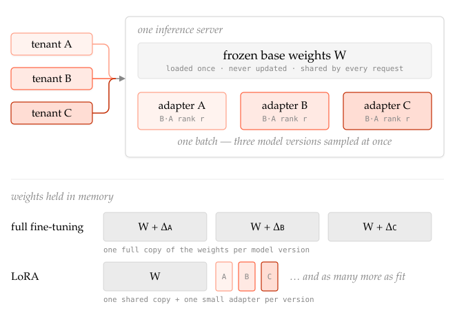
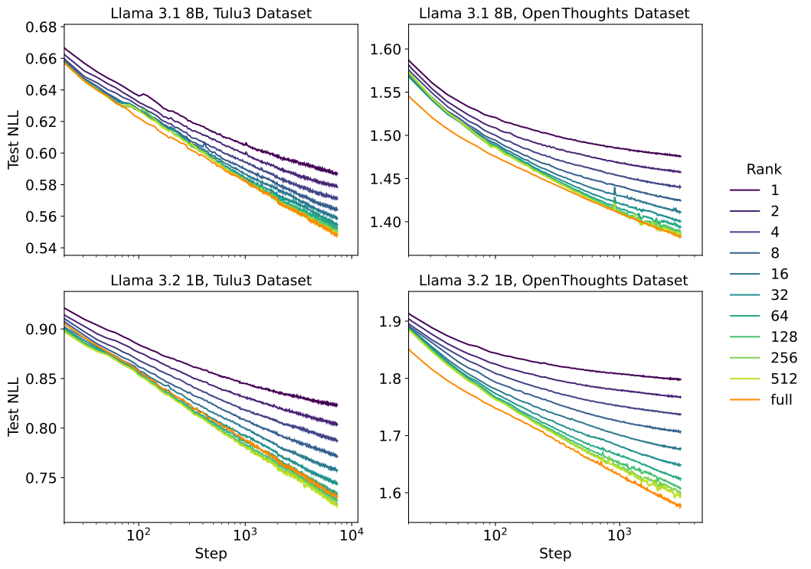
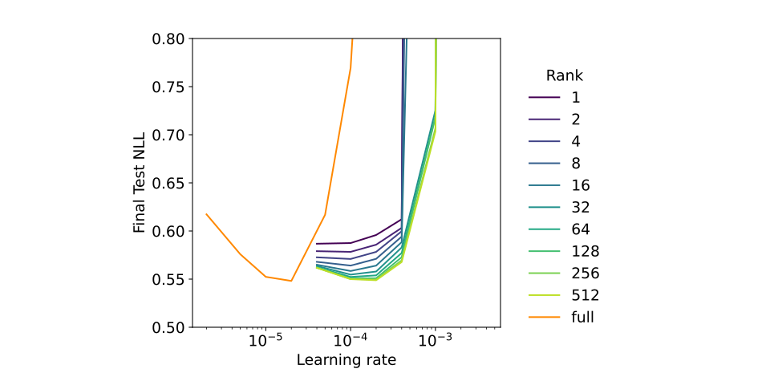
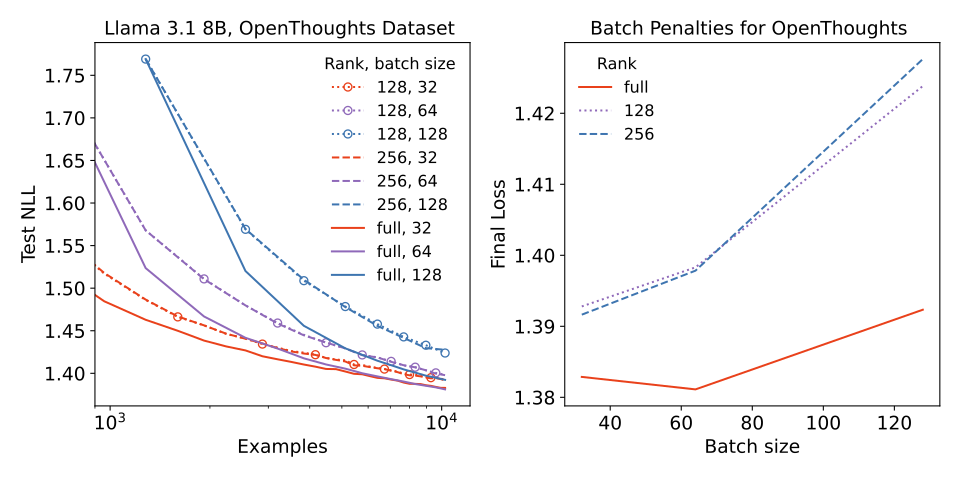
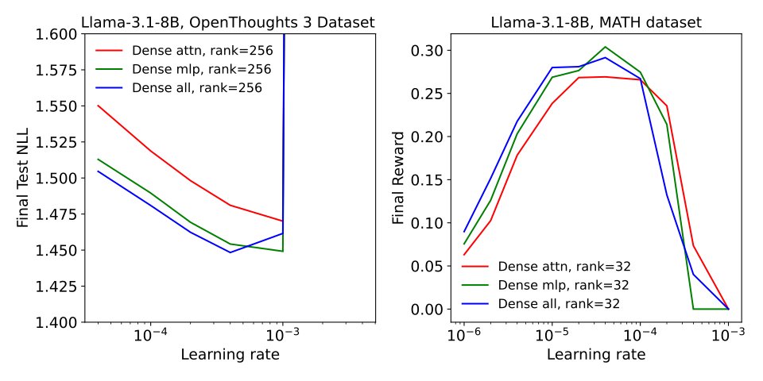
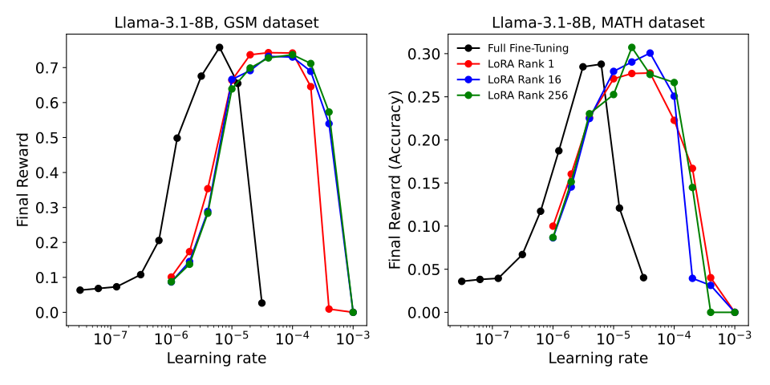
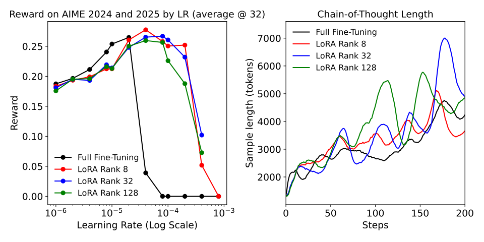
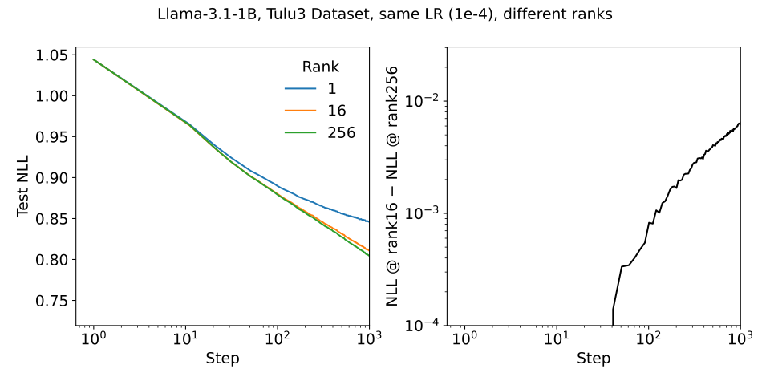

# LoRA Without Regret — 원문 구조 한국어 정독본

> **원문**: [LoRA Without Regret](https://thinkingmachines.ai/blog/lora/) — John Schulman, in collaboration with others at Thinking Machines · Thinking Machines Lab: Connectionism, 2025.09.29 · DOI `10.64434/tml.20250929`
>
> **이 문서의 성격**: 원문의 **절 순서·소제목·figure·각주·수식을 그대로 따라가며** 한국어로 풀어 쓴 정독본이다. 기술 용어는 원문의 영어 표현을 유지하고, 논지의 핵심이 되는 문장은 영어 원문을 인용으로 병기했다. 원문 전체의 축자 번역이 아니라 **원문을 따라 읽기 위한 독해 노트**이므로, 정확한 표현이 필요하면 반드시 원문을 함께 볼 것.
>
> **관련 문서**: 논지 중심으로 재구성한 요약은 [`lora_without_regret.md`](lora_without_regret.md), 같은 블로그의 자매 글은 [`on_policy_distillation.md`](on_policy_distillation.md).


---

## 목차 (원문 구성)

- [들어가며](#들어가며)
- [What matters for LoRA](#what-matters-for-lora)
- [Methods and results](#methods-and-results)
  - [LoRA rank](#lora-rank)
  - [Batch size effects](#batch-size-effects)
  - [Layers Where LoRA Is Applied](#layers-where-lora-is-applied)
  - [Reinforcement learning](#reinforcement-learning)
- [Setting LoRA hyperparameters](#setting-lora-hyperparameters)
  - [Optimal learning rate and rank](#optimal-learning-rate-and-rank)
  - [Parametrization invariances](#parametrization-invariances)
  - [Optimal learning rates for LoRA vs. FullFT](#optimal-learning-rates-for-lora-vs-fullft)
  - [Learning rates in short and long runs](#learning-rates-in-short-and-long-runs)
- [Discussion](#discussion)
  - [Why LoRA might be needed on all layers](#why-lora-might-be-needed-on-all-layers)
  - [How much capacity is needed by supervised and reinforcement learning?](#how-much-capacity-is-needed-by-supervised-and-reinforcement-learning)
  - [Compute efficiency advantage of LoRA](#compute-efficiency-advantage-of-lora)
  - [Open questions](#open-questions)
- [Closing thoughts](#closing-thoughts)
- [Acknowledgements · Citation](#acknowledgements--citation)

---

## 들어가며

오늘날의 leading language model은 1조 개가 넘는 parameter를 담고 있고, 수십 조 개의 token으로 pretrain된다. base model 성능은 scale과 함께 계속 좋아지는데, 이 수조 개의 parameter는 **글로 쓰인 인간 지식의 모든 패턴을 학습하고 표현하는 데 실제로 필요하기** 때문이다.

**post-training은 대조적이다.** 훨씬 작은 dataset을 다루고, 일반적으로 더 좁은 지식 도메인과 더 좁은 행동 범위에 집중한다. 그래서 원문은 이렇게 말한다.

> "It seems wasteful to use a terabit of weights to represent updates from a gigabit or megabit of training data."

이 직관이 **PEFT**(parameter efficient fine-tuning)의 동기가 되었다 — 훨씬 작은 parameter 집합만 update해서 큰 network를 조정하는 방식이다.

**대표적인 PEFT 기법이 LoRA**(low-rank adaptation)다. LoRA는 원본 model의 각 weight matrix `W`를 다음으로 대체한다.

```
W' = W + γ · B·A

  B, A : 합쳐도 W보다 parameter 수가 훨씬 적은 두 matrix
  γ    : constant scaling factor
```

효과적으로 LoRA는 **fine-tuning이 가하는 update의 low-dimensional representation**을 만든다.

### full fine-tuning(이하 FullFT) 대신 LoRA를 쓰는 운영상의 이유

LoRA는 post-training의 비용과 속도에서 이점이 있을 수 있다. 그리고 그와 별개로, FullFT보다 선호할 만한 **운영상의 이유가 셋** 있다. 셋 모두 **"원본 weight를 건드리지 않는다"** 는 하나의 성질에서 나온다.

| #   | 이유                               | 내용                                                                                                                                                                                                                                                                                                   |
| --- | -------------------------------- | ---------------------------------------------------------------------------------------------------------------------------------------------------------------------------------------------------------------------------------------------------------------------------------------------------- |
| 1   | **Multi-tenant serving**         | adapter(A·B matrix)만 학습하고 원본 weight는 그대로 두므로, **하나의 inference server가 여러 adapter(= 서로 다른 model version)를 메모리에 올려두고 batch 방식으로 동시에 sampling**할 수 있다<br>📎 *Punica: Multi-Tenant LoRA Serving* (Chen, Ye et al., 2023) — vLLM·SGLang 같은 현대 inference engine이 이 기능을 구현하고 있다                             |
| 2   | **Layout size for training**     | FullFT는 원본 weight와 **함께 optimizer state를 저장**해야 하고 그것도 종종 더 높은 precision으로 저장한다 → **같은 model에서 sampling할 때보다 an order of magnitude 더 많은 accelerator**를 요구하고, 따라서 **layout 자체가 달라진다**<br>LoRA는 학습 weight 수도 메모리도 훨씬 적으므로 **sampling용 layout보다 아주 조금만 큰 layout에서 학습**할 수 있다 → 학습이 더 접근 가능하고 종종 더 효율적이다 |
| 3   | **Ease of loading and transfer** | 저장할 weight가 적으니 adapter의 셋업과 머신 간 전송이 빠르고 쉽다                                                                                                                                                                                                                                                         |

> 📎 *2번 항목의 원문 각주*: 학습에는 weight 저장 외에도 **모든 weight에 대한 gradient와 optimizer moment**를 저장해야 한다. 더구나 이 변수들은 inference용 weight 저장에 쓰이는 precision(bfloat16 이하)보다 **높은 precision(float32)** 으로 저장되는 경우가 많다. 이 두 배수가 곱해져 "an order of magnitude 차이"가 된다.



> **보충 그림.** *(원문에 없는, 이 문서의 자체 제작 도해)* **위**: 서로 다른 tenant의 request가 하나의 batch로 묶여 **단일 inference server**로 들어가고, 그 안에서 **frozen base weight `W`는 한 벌만 공유**된 채 각 request가 자기 adapter(`B·A`)를 탄다. **아래**: 메모리에 올라가는 weight 비교 — FullFT는 **버전마다 full weight 한 벌씩**이 필요하지만, LoRA는 **`W` 한 벌 + 버전당 작은 adapter 하나**면 된다.

> 원문은 **"이 세 가지 이유만으로도 2021년 원 LoRA 논문(Hu et al., 2021) 이후의 인기 상승이 충분히 설명된다"** 고 정리한다. 즉 여기까지는 *인기*의 설명이지 *성능*의 설명이 아니다.

### 그런데 문헌은 성능에 대해 불명확하다

- **합의된 부분**: **pre-training을 닮은 setting** — 즉 LoRA parameter의 storage limit을 초과하는 아주 큰 dataset — 에서는 LoRA가 underperform한다. (📎 *LoRA Learns Less and Forgets Less*, Biderman et al., 2024)
- **합의되지 않은 부분**: post-training에서 전형적인 dataset size라면 LoRA는 **essential information을 저장할 충분한 capacity**를 갖는다. **그러나 이 사실은 sample efficiency와 compute efficiency에 대해 아무것도 보장하지 않는다.**

그래서 원문이 던지는 질문은 이것이다.

> "can LoRA match the performance of full fine-tuning, and if so, under which conditions?"

그리고 답은 이렇다. **몇 가지 key detail만 제대로 잡으면, LoRA는 FullFT와 동일한 sample efficiency로 학습하고 동일한 ultimate performance에 도달한다.**

### LoRA의 주요 hyperparameter와 calibration

여기서 말하는 "몇 가지 key detail"이 무엇인지 먼저 한 표로 정리한다. 각 항목의 근거는 뒤 절에서 다룬다.

| hyperparameter           | 무엇인가                                | calibration 방법                                                                                                                                                                                                                                                                 | 근거                                                                                                                              |
| ------------------------ | ----------------------------------- | ------------------------------------------------------------------------------------------------------------------------------------------------------------------------------------------------------------------------------------------------------------------------------ | ------------------------------------------------------------------------------------------------------------------------------- |
| **rank `r`**             | adapter의 **capacity**를 결정           | **"학습할 정보량 < trainable param × 2 bits"** 를 만족하는 최소 rank. dataset 정보량은 `데이터셋 token 수 × 약 1 bit`로 상한 추정. **진단이 더 실용적이다** — learning curve가 FullFT의 **log-linear decay에서 이탈하기 시작하면 capacity 부족 신호**이므로 rank를 올린다. **RL은 episode당 약 1 bit**라 요구 capacity가 극히 낮아 **small rank로 충분** | [LoRA rank](#lora-rank) · [How much capacity…](#how-much-capacity-is-needed-by-supervised-and-reinforcement-learning)           |
| **`α` (scaling factor)** | `W' = W + (α/r)·B·A` 의 scale factor | **32 고정. 튜닝 대상이 아니다.** `1/r` prefactor가 **optimal LR을 rank에 무관하게** 만들어 주므로 rank를 바꿔도 LR을 다시 잡을 필요가 없다. rank를 올릴 때 α를 함께 올리는 관행(Unsloth 등)은 사실상 **`init_A/LR_A` 축을 움직이는 것과 등가**                                                                                                 | [Optimal learning rate and rank](#optimal-learning-rate-and-rank) · [Parametrization invariances](#parametrization-invariances) |
| **batch size**           | 한 step에 보는 example 수                | **작게 — 32 부근.** LoRA는 large batch에 FullFT보다 less tolerant이고, 이 penalty는 **rank를 올려도 사라지지 않는다**(product-of-matrices parametrization 고유의 성질). 다만 **FullFT도 작은 batch에서 best loss**이므로 실무상 제약은 크지 않다                                                                               | [Batch size effects](#batch-size-effects)                                                                                       |


---

## What matters for LoRA

원문은 LoRA가 FullFT의 efficiency에 match하는 조건을 규명하기 위해 일련의 supervised fine-tuning 및 reinforcement learning 실험을 수행했다. 이를 위해 **이전 LoRA 실험들과 두 가지를 다르게** 했다.

1. 특정 dataset·task에 집중하는 대신, **training set size와 LoRA parameter 수 사이의 일반적 관계**를 조사했다.
2. supervised learning에서 sampling-based eval 대신 **log loss**를 측정했다. 같은 generality 목표에서 나온 선택이다.
   > "Log loss measurement gives clean results and scaling laws over ranges of training steps and training parameters."

### 발견 요약 (원문의 5개 bullet)

| #   | 발견                                                                                                                                                                                                                                                                                                   |
| --- | ---------------------------------------------------------------------------------------------------------------------------------------------------------------------------------------------------------------------------------------------------------------------------------------------------- |
| 1   | small-to-medium-sized instruction-tuning·reasoning dataset에서의 supervised fine-tuning에서는 **LoRA가 full fine-tuning과 동일하게 동작한다**                                                                                                                                                                        |
| 2   | **LoRA capacity를 초과하는 dataset**에서는 LoRA가 FullFT에 underperform한다. 다만 그 방식이 **loss가 더 못 내려가는 distinct floor에 도달하는 것이 아니라**, model capacity와 dataset size의 관계에 의존하는 **worse training efficiency**로 나타난다                                                                                                 |
| 3   | 일부 시나리오에서 LoRA는 **large batch size에 FullFT보다 less tolerant**다 — 어느 지점을 넘어 batch size가 커지면 loss에서 더 큰 penalty를 지불한다. **이 penalty는 LoRA rank를 올려도 mitigate되지 않는다.** 이는 **product-of-matrices parametrization의 property**이며, 이 parametrization은 원본 weight matrix를 직접 최적화하는 것과 다른 training dynamics를 갖는다 |
| 4   | **small data setting에서조차** LoRA는 **all weight matrices, 특히 MLP·MoE layer**에 적용할 때 더 잘 동작한다. attention-only LoRA는 **higher rank로 trainable parameter 수를 맞춰줘도 여전히 underperform**한다                                                                                                                     |
| 5   | **reinforcement learning에서는 small rank로도 LoRA가 FullFT와 equivalent**하다. RL은 very low capacity만 요구하며, 이는 **information-theoretical argument로 미리 예측한** 결과다                                                                                                                                              |

여기에 더해 hyperparameter의 영향도 연구했다. init scale과 multiplier 같은 hyperparameter의 **invariance**를 살펴보고, **`1/r` prefactor가 왜 optimal learning rate를 rank에 대해 approximately independent로 만드는지** 설명하며, LoRA의 optimal LR이 FullFT의 optimal LR과 어떤 관계인지를 실험적으로 보인다.

> **실험의 결론**: dataset size와 LoRA parameter의 관점에서 **LoRA가 FullFT와 유사하게 동작하는 "low-regret regime"** 을 characterize했다는 것. 그리고 **이 regime이 대부분의 post-training 시나리오를 덮는다.**

---

## Methods and results

실험 setup의 주요 사항:

| 항목 | 내용 |
|---|---|
| **rank** | **1 ~ 512**, 즉 **three orders of magnitude**에 걸쳐 변화시키고 full fine-tuning과 비교 |
| **learning rate** | suboptimal LR에서 오는 **potential confound를 제거**하기 위해 **각 experimental condition마다 LR을 sweep**. **constant learning rate schedule** 사용(warmup·cooldown 없음) |
| **model** | **Llama 3** 계열 (📎 Dubey et al., 2024), **Qwen3** 계열 (📎 Qwen Team, 2025) — **mixture of experts(MoE) model 포함** |
| **supervised dataset** | **Tulu3** (📎 Ivison et al., 2024, instruction following)와 **OpenThoughts3** (📎 Guha et al., 2025, reasoning). 두 dataset은 **scope·structure·application이 크게 달라** 결과의 generality를 뒷받침한다 |
| **RL task** | **mathematical reasoning task**, **answer correctness as the reward** |

#### 모델 — 어디에 무엇을 썼는가

원문은 model family만 밝히고 전체 목록은 공개하지 않는다. 각 실험에서 **이름이 특정된** 것은 다음과 같다.

| 실험 | model | 규모 | 왜 이 model인가 |
|---|---|---|---|
| **LoRA rank** (Figure 1·2) | Llama 3 / Qwen3 계열 | 본문·figure에 **1B**, **8B** 규모가 언급 | dense model 전반에서의 rank–capacity 관계 확인 |
| **Layer 위치** (Figure 4) | **Llama-3.1-8B** (dense)<br>**Qwen3-30B-A3B-Base** (MoE) | 8B<br>총 **30.5B / active 3.3B**, expert 128개 중 **8개 active** | **dense와 sparse MoE 양쪽에서** 같은 결론이 나오는지 보려고 |
| **LR sweep** (multiplier 9.8 추정) | **Llama·Qwen 14개 model** | 개별 목록 비공개. **hidden_size를 입력 변수로** 사용 | model 규모에 따른 optimal LR 의존성을 fit하기 위해 |
| **RL — MATH/GSM** (Figure 6) | **Llama-3.1-8B** (base) | 8B | **Qwen2.5·Qwen3는 tech report상 math 데이터로 pretrain**되어 있어, RL 중에 실제로 학습된 것이 무엇인지 분리 측정이 어렵다 |
| **RL — DeepMath** (Figure 7·8) | **Qwen3-8B-base** | 8B | larger-scale reasoning RL 검증 |

> 📎 **MoE의 rank 처리**: expert마다 별도 LoRA를 학습하고 각 rank를 `total rank / active expert 수`(Qwen3 MoE는 **8**)로 두었다. 자세한 이유는 [Layers Where LoRA Is Applied](#layers-where-lora-is-applied) 참조.

#### supervised dataset — 규모·포맷·용도

| | **Tulu3** | **OpenThoughts3** |
|---|---|---|
| **성격** | instruction following (general chat·math·code·safety 혼합) | reasoning (long chain-of-thought) |
| **규모** | SFT mixture 기준 **약 94만 example** | **약 120만 example** (math 85만 / code 25만 / science 10만) |
| **example당 길이** | **짧다** — 일반적인 대화 턴 수준 | **길다** — 수천 token 규모의 추론 trace |
| **데이터 포맷** | multi-turn **chat message 배열**. loss는 **assistant turn에만** | **문제 → 긴 CoT → 최종 답** 한 덩어리. teacher model(QwQ-32B)의 추론 trace를 distill한 것 |
| **원문에서의 사용** | **전체를 1 epoch** 학습 (rank sweep, LR sweep) | **subset만 사용** — layer 비교는 rank=256의 small subset, batch size 실험은 **10,000-example subset** |

```
Tulu3 (짧은 instruction following)
  [{"role":"user","content":"..."},
   {"role":"assistant","content":"..."}]        ← 이 부분에만 loss

OpenThoughts3 (긴 reasoning trace)
  문제 → "<think> ... 수천 token의 풀이·backtracking ... </think>" → 최종 답
```

> **왜 OpenThoughts3는 subset만 쓰는가**: example 수는 두 dataset이 비슷한 자릿수지만 **example당 token 수가 자릿수로 다르다.** capacity 요구량은 example 수가 아니라 **token 수**를 따라가므로(`데이터셋 token 수 × 약 1 bit`), OpenThoughts3는 작은 subset만으로도 rank의 capacity 한계를 관측할 수 있다. 반대로 Tulu3는 전체를 써야 그 지점에 닿는다.

> **두 dataset을 함께 쓴 이유**: 원문 표현으로 **"scope·structure·application이 크게 다르다"** — 짧은 instruction following과 긴 CoT reasoning이라는 양극단에서 같은 결론이 나와야 일반성이 확보되기 때문이다.

#### 평가 — 무엇으로 성능을 쟀는가

**supervised 실험에는 downstream benchmark 점수가 없다.** 원문은 전 구간을 **loss**로만 평가한다.

| 실험 | 평가 지표 |
|---|---|
| **SFT (Tulu3 / OpenThoughts3)** | **training loss / final loss** 하나뿐. figure의 곡선은 **각 step에서 모든 LR에 대한 pointwise minimum** |
| **RL (MATH, GSM8K)** | **reward = answer correctness**. LR 대비 **final reward(accuracy)** |
| **RL (DeepMath)** | training reward + **held-out benchmark: AIME 2024 / AIME 2025** + 정성 지표로 **CoT length** |

- 📎 **MATH** (Hendrycks et al., 2021), **GSM8K** (Cobbe et al., 2021), **DeepMath-103K** (He et al., 2025) — DeepMath는 MATH보다 크고 대체로 더 어렵다.
- DeepMath 실험은 속도를 위해 training·evaluation sample을 **8,192 token**으로 제한했다. backtracking·reasoning은 가능하지만 **더 긴 CoT 대비 성능은 제한**된다.

> **읽을 때 주의**: SFT 결론(“LoRA = FullFT”)은 **loss 기준**이며 MMLU·IFEval 같은 downstream benchmark로 검증된 것이 아니다. downstream 성능까지 동일한지는 원문이 다루지 않는다.

> 📎 **출처 구분**: 위 세 표에서 **model family·특정 model 이름·subset 크기(10,000)·8,192 token·평가 방식**은 원문에 명시된 것이다. **dataset의 example 수와 구성 비율**은 원문에 없어 각 dataset 카드에서 보충한 값이므로, 원문 인용 시에는 주의할 것.

---

### LoRA rank

Tulu3 dataset 전체와 OpenThoughts3의 subset에 대해 **single epoch** 학습했다. 각 dataset과 model size마다 **LoRA rank와 learning rate를 sweep**했다.

> **plot 읽는 법**: 아래 그림에서 rank마다 colored line이 하나씩 그려지는데, 그 선은 **각 training step에서 모든 learning rate에 대해 pointwise minimum을 취해** 얻은 것이다.



> **Figure 1.** Tulu3와 OpenThoughts3 dataset에서 rank별 LoRA training curve. FullFT와 high-rank LoRA는 **loss가 step 수의 logarithm에 linear하게 감소**하는 유사한 learning curve를 보인다. lower-rank LoRA는 **adapter가 runs out of capacity할 때 minimum-loss curve에서 fall off**한다. 아래쪽 plot(1B model)에서는 high-rank LoRA가 한 dataset에서는 FullFT보다 낫고 다른 dataset에서는 못한데, training dynamics나 generalization behavior의 차이에서 오는 **random variation**일 수 있다.

## 관찰 1:  FFT 와 high rank lora는 log-linear decay But **medium·low-rank LoRA는 step이 커지면서 saturation 되기 시작한다. 

- FullFT와 high-rank LoRA는 **loss가 log(number of steps)에 linear하게 감소**하는 유사한 learning curve를 보인다. 
- **medium·low-rank LoRA는 rank와 correlate되는 어떤 step threshold에서 minimum-loss learning curve를 fall off**한다.
- 직관적으로: **adapter가 runs out of capacity하면 학습이 느려진다.** 그리고 그 capacity는 rank가 결정한다.

## 관찰2:
다음으로 각 rank에 대해 sweep이 실제로 best learning rate를 덮었는지 확인하기 위해 loss가 LR에 따라 어떻게 변하는지를 본다.



> **Figure 2.** Tulu3에서 여러 LoRA rank에 대한 learning rate 대비 final loss. **minimum loss는 high-rank LoRA와 FullFT가 approximately the same이다. optimal LR은 LoRA 쪽이 10배 높다.**

- **FullFT의 optimal learning rate는 high-rank LoRA보다 a factor of 10만큼 낮다.**
  > 📎 Biderman et al. (2024), Figure S1 — sampling eval 기반 실험에서 유사한 **10x ratio**를 발견했다.
- **optimal LR은 서로 다른 rank의 LoRA run에서 대체로 비슷해 보인다.** (이에 대한 theoretical explanation은 아래 [Optimal learning rate and rank](#optimal-learning-rate-and-rank)에서 제시된다.) 다만 **some rank dependence는 있다** — **rank=1이 higher-rank LoRA보다 optimal LR이 낮다.** rank 4와 rank 512 사이에서 optimal LR은 **a factor of less than 2**로 변한다.

---

### Batch size effects
## Lora에서는 작은 batch sizse가 좋다.(32 정도)

일부 setting에서 **LoRA는 FullFT보다 large batch size에 less tolerant**임을 발견했다. 그리고 **performance gap은 batch size가 커질수록 커지며, 이는 rank와 무관하다.** 이 실험에는 OpenThoughts3의 **10,000-example subset**을 사용했다.



> **Figure 3.** LoRA vs FullFT의 batch size effect. **왼쪽**: batch size별 learning curve — large batch size에서 LoRA(dashed)와 FullFT(solid) 사이에 **persistent gap**이 나타난다. **오른쪽**: batch size의 함수로 그린 final loss — LoRA가 batch size 증가에 **larger penalty**를 지불한다.

- **왼쪽 plot**: large batch size에서 LoRA(dashed line)와 FullFT(solid line)의 learning curve 사이에 **persistent gap**이 보인다. **smaller batch size 32**에서는 gap이 더 작고 시간이 지나며 shrink한다.
- **오른쪽 plot**: batch size의 함수로 그린 final loss. batch size가 커질수록 LoRA의 loss gap이 FullFT로부터 **increasingly diverging**한다.

**핵심 해석**

> "The learning gap at large batches doesn't seem to depend on rank, but rather seems to be a property of LoRA."

likely reason은 **product-of-matrices parametrization(BA)이 이 dataset에서 full matrix(W)보다 less favorable optimization dynamics**를 갖기 때문이다.

**다만 실무적 함의는 완화된다**: **LoRA와 FullFT 모두 smaller batch size에서 best loss를 달성**하므로, 이 gap이 실무에서 그렇게 중요하지 않을 수 있다.

---
=======================================================================
### Layers Where LoRA Is Applied

network의 서로 다른 layer에 LoRA를 적용했을 때의 효과를 조사했다. **Hu et al.의 원 논문은 attention matrix에만 LoRA를 적용할 것을 권했고** 이후 많은 논문이 그것을 따랐지만, 최근에는 all layers에 적용하는 추세다.

**결과**: **all layers, 특히 MLP(MoE 포함) layer에 적용했을 때 far better result를 얻었다.** 사실 —

> "applying LoRA to the attention matrices shows no additional benefits beyond applying it to the MLPs only."

> 📎 **선행 연구와의 관계**
> - **QLoRA 논문**도 유사하게 attention-only가 MLP나 MLP+attention보다 나쁘다는 것을 발견했다. 다만 QLoRA는 `MLP+attention > MLP > attention` 순으로 봤고, **원문은 앞의 둘이 roughly equal**하다고 본다.
> - **Biderman et al. (2024)** 도 attention-only LoRA가 MLP-only 위에 **no additional benefit**을 준다는 유사한 결과를 얻었다.


> **Figure 4.** attention-only LoRA는 MLP-only LoRA보다 **significantly underperform**하고, LoRA-on-MLP 위에 얹어도 성능을 **further improve하지 못한다**. 이 효과는 **dense model(Llama-3.1-8B)과 sparse MoE(Qwen3-30B-A3B-Base) 양쪽에서** 성립한다.

#### parameter 수로는 설명되지 않는다

attention-only LoRA의 underperformance는 **parameter가 더 적어서가 아니다.** 이 경우 **attention-only rank 256이 MLP-only rank 128보다 underperform하는데, 둘은 parameter 수가 approximately the same이다.** (아래 표의 볼드 두 행을 비교)

| LoRA configuration | Params |
|---|---|
| mlp, rank=256 | 0.49B |
| **attn, rank=256** | **0.25B** |
| all, rank=256 | 0.70B |
| **mlp, rank=128** | **0.24B** |

> *Parameter counts for LoRA on Llama-3.1-8B*

#### MoE 실험에서의 rank 처리

MoE 실험에서는 **각 expert마다 separate LoRA를 학습**했고, 각각의 rank를 `total rank / number of active experts`(Qwen3 MoE의 경우 **8**)로 두었다.

> **이유**: 이 scaling이 **MoE layer에서도 "LoRA parameter 대 FullFT parameter" 비율을 다른 layer와 동일하게** 유지해 주기 때문이다.

#### 두 개의 additional setting에서 재확인

layer 구성을 비교하는 유사한 실험을 두 setting에서 추가로 수행했다.

1. **OpenThoughts3의 small subset에서의 supervised learning** (rank=256)
2. **MATH dataset에서의 reinforcement learning**

이 두 setting에서도 **attention-only LoRA가 MLP-only LoRA보다 underperform**했다 (MLP-only는 MLP+attention과 유사하게 동작).



> **Figure 5.** LoRA를 어느 layer에 적용하는지를 바꿔가며 측정한 learning rate 대비 final loss 또는 reward.

---

### Reinforcement learning

원문의 핵심 발견 하나:

> "LoRA fully matches the learning performance of FullFT when running policy gradient algorithms for reinforcement learning, even with ranks as low as 1."

**RL setup**

```
objective = Σ_t  ( p_learner / p_sampler ) · Adv_t
```

- **importance sampling correction**을 붙인 basic policy gradient algorithm.
  > 📎 *Your Efficient RL Framework Secretly Brings You Off-Policy RL Training*
- **GRPO-like centering scheme** (📎 *DeepSeekMath*, Shao et al., 2024): 문제당 multiple completion을 sampling하고 **subtract the mean reward per group**.
- **dataset**: **MATH** (📎 Hendrycks et al., 2021), **GSM** (📎 GSM8K, Cobbe et al., 2021). 각각에 typical hyperparameter 사용.
- **base model 선택**: **Llama-3.1-8B**. Qwen2.5·Qwen3는 **tech report가 밝힌 대로 math 성능을 끌어올리는 data로 pretrain된 것으로 알려져 있어** RL 중에만 학습된 것이 무엇인지 측정하기 어렵기 때문이다.



> **Figure 6.** grade school math(GSM, 왼쪽)와 MATH(오른쪽) dataset에서 RL을 돌렸을 때의 learning rate 대비 final reward(accuracy).

**관찰**: LoRA는 **wider range of performant learning rates**를 보이고, FullFT(black line)와 **same peak performance**에 도달한다 — 적어도 **RL의 noisiness가 허용하는 precision limit** 안에서.

#### information-theoretic argument

이 결과는 **정보이론 논증으로 미리 예측된** 것이다.

```
supervised learning     : O(number of tokens) bits per episode
policy gradient methods : O(1) bits per episode
                          (학습이 advantage function에 의해 구동되므로)

episode가 수천 token을 담고 있으면
→ RL은 학습 시 token당 supervised learning보다 ~1000배 적은 정보를 흡수한다
```

실험 수치로 더 정밀하게:

```
MATH 실험:  ~10,000 problems × 32 samples per problem

각 completion이 a single bit of information를 준다고 가정하면
  → 전체 training process가 흡수해야 할 정보량 = 320,000 bits

Llama-3.1-8B의 rank-1 LoRA parameter 수 = 3M   ← almost 10 times that number
```

> 📎 *원문 각주*: 3M이라는 수치는 model의 모든 weight matrix에 대해 `rank · d_in`(matrix A)와 `rank · d_out`(matrix B)를 합산해 계산했다.

> **"Even at rank-1, LoRA has more than enough capacity to absorb all the information provided during training."**

**또 하나의 point of comparison — DeepSeek-R1-Zero**

```
DeepSeek-R1-Zero: 5.3M episodes  →  5.3M bits of information
  (10,400 steps × 32 unique questions × 16 samples per question)

이는 low-rank LoRA의 parameter 수보다 적다
  → 원문의 예측: "we predict that the results can be replicated with LoRA"
```

#### larger-scale validation — DeepMath

reasoning RL에서의 LoRA 효과성을 추가로 검증하기 위해, **Qwen3-8b-base**로 **DeepMath** dataset (📎 *DeepMath-103K*, He et al., 2025)에서 larger-scale 실험을 수행했다. DeepMath는 MATH보다 much larger하고 일반적으로 더 어려운 문제를 담고 있다.

- 실험 속도를 위해 training·evaluation sample을 **8192 tokens**로 제한했다. 이 길이는 **backtracking과 reasoning은 허용하지만, longer chain-of-thought 대비 성능은 제한**한다.


> **Figure 7.** Qwen3-8b-base로 DeepMath dataset에서 수행한 실험. **왼쪽**: 서로 다른 rank와 full fine-tuning의 learning curve. 각 setting에서 **final performance가 가장 높은 best learning rate**를 표시했다. **오른쪽**: learning rate 대비 final performance. 이전 math 실험과 마찬가지로 **LoRA가 near-optimal learning rate의 wider peak**를 보인다.



> **Figure 8.** DeepMath 실험의 additional plot. **왼쪽**: training set보다 더 challenging한 **AIME test set의 benchmark score**. **오른쪽**: training step에 따른 **chain-of-thought(CoT) length** — **a sign of learning to reason**으로 볼 수 있다.

**관찰 세 가지**

| | 내용 |
|---|---|
| **learning progression** | 각 setting에서 optimal learning rate를 고르면, **서로 다른 size의 LoRA와 full fine-tuning이 almost identical하게** 진행된다 |
| **held-out generalization** | **AIME 2024와 AIME 2025**의 held-out problem에서 평가해도 유사한 결과를 얻는다 |
| **qualitative behavior** | LoRA run과 full fine-tuning run **양쪽 모두** **backtracking·self-verification·in-context exploration** 같은 **advanced reasoning behavior를 발달**시키며, 이는 **model CoT의 lengthening으로 관측**된다 |

---

## Setting LoRA hyperparameters

LoRA 채택의 barrier 하나는 **FullFT에 최적화된 것과는 다른 optimal hyperparameter를 골라야 한다**는 점이다. 이 절은 **그 문제가 첫인상만큼 daunting하지 않다**는 것을 보인다.

### Optimal learning rate and rank

Hu et al.을 따라 다음 parametrization을 사용한다.

```
W' = W + (α / r) · B·A

  r     : LoRA rank
  α     : LoRA scaling factor
  A, B  : rank r 의 LoRA weight matrix
```

이 글의 전 실험에서 **α = 32**를 사용했다 (다른 구현들의 standard practice를 따름).

**핵심 주장**: **`1/r` scaling factor가 optimal learning rate를 rank에 대해 approximately independent로 만든다.** 사실 **a stronger condition**이 성립한다 —

> "the learning curve is exactly the same at the beginning of training, regardless of rank."

이 효과가 워낙 striking해서, 원문의 저자들은 **서로 다른 rank의 learning curve가 너무 가까워 rank parameter가 무시되는 bug가 있는 게 아닌지 걱정했다**고 적고 있다.

따라서 **short training regime에서는 optimal LR도 rank에 independent**하다. 다만 위 Figure 2(learning rate vs loss)에서 봤듯 **longer-training regime에서는 optimal LR에 some rank-dependence가 생긴다.**



> **Figure 9.** 동일한 learning rate에서 서로 다른 rank의 learning curve 차이를 **학습 초기**에 들여다본 것. **왼쪽**은 learning curve, **오른쪽**은 **rank 16과 rank 256의 차이** — 시간이 지나며 커진다. 특이하게도 **처음 몇 step에서는 이 차이가 (아주 작지만) negative**여서, 해당 부분은 plot에서 빠져 있다.

#### 왜 그런가 — first training update의 expected update

```
LoRA product BA 를 r 개의 rank-1 outer product의 합으로 본다:

  BA = Σ_{i=1..r} b_i a_iᵀ = Σ_{i=1..r} Δ_i        (Δ_i := b_i a_iᵀ)

여기서
  ∂Loss/∂Δ_i 는 모든 i 에 대해 같다.
  그러나 gradient ∂Loss/∂b_i 와 ∂Loss/∂a_i 는 initialization에 의존한다
    (예: ∂Loss/∂b_i 는 a_i 에 의존)

a_i 와 b_i 의 initialization이 rank에 의존하지 않으므로
  → E[Δ_i] 는 모든 i 에 대해 같고, rank에 의존하지 않는다

first step of training에서 각 항의 expected update는 equal하며 rank에 independent다.
따라서 (1/r)·Σ_{i=1..r} Δ_i 는 same expectation을 갖는 r 개 항의 sample average이고,
그 average의 expectation — 즉 adapter (1/r)BA 의 change — 는 rank에 의존하지 않는다.
```

---

### Parametrization invariances

LoRA에 적용 가능한 hyperparameter는 potentially **4개**다.

| # | hyperparameter | 의미 |
|---|---|---|
| 1 | **α** | `α / r` 에 등장하는 **scale factor** |
| 2 | **LR_A** | **down-projection matrix A**의 learning rate |
| 3 | **LR_B** | **up-projection matrix B**의 learning rate |
| 4 | **init_A** | **matrix A의 initialization scale**. random initialization의 경우 A 초기 원소들의 **standard deviation**. **matrix B는 zero로 initialize되므로 init_B는 정의할 필요가 없다** |

4개를 모두 튜닝해야 한다면 overwhelming하게 느껴질 수 있다. **그러나 invariances in the training dynamics 때문에 이 중 2개는 redundant고, learning behavior는 나머지 2개로 결정된다.**

**Adam으로 학습하고 ε = 0일 때, optimization process는 다음 two-parameter transformation에 invariant다.**

```
p, q > 0 에 대해:

  α      →  (1 / (p·q)) · α
  init_A →  p · init_A
  LR_A   →  p · LR_A
  LR_B   →  q · LR_B
```

> 📎 *원문 각주*: 이 결과는 **ε > 0으로도 확장**할 수 있다. gradient가 `1/q` 만큼 scale되므로 그만큼 보정해 주면 된다.

4개 중 **two degrees of freedom이 learning process에 영향을 주지 않으므로, 남는 것은 2D parameter space**다. 이 2D space에는 여러 basis를 고를 수 있는데, **straightforward interpretation을 갖는 basis** 하나는 다음과 같다.

| basis 축 | 해석 |
|---|---|
| **α · init_A · LR_B** | **scale of initial updates**, 즉 **learning curve의 initial slope**를 결정한다. **B가 zero로 initialize되므로 LR_A와 A에 대한 initial update는 irrelevant하다** |
| **init_A / LR_A** | Adam이 매 step A의 원소를 approximately `LR_A` 만큼 update하므로, 이 **timescale parameter**는 **A가 initial state에서 significantly 벗어나는 데 걸리는 step 수**를 결정한다 |

#### 기존 제안들을 이 basis로 다시 읽으면

| 제안 | 이 basis에서의 해석 |
|---|---|
| **LoRA+** (📎 Hayou et al., 2024) — A와 B에 different LR을 쓰되 **B에 higher rate** | **LR_B를 올리는 것 = `init_A/LR_A`를 올리는 것**과 equivalent → **A가 longer timescale로 변한다** |
| **Unsloth's LoRA Hyperparameter Guide** — high-rank LoRA에 **higher α** 사용 (예: `1/r` scaling 회피) | 이것도 **`init_A/LR_A`를 올리는 것과 equivalent**하다. α를 올리면 same update size를 얻기 위해 LR_A와 LR_B를 낮춰야 하고, 그러면 **LR_A가 init_A에 비해 작아진다** |

> **두 제안이 사실은 같은 축을 움직이고 있었다**는 것이 이 정리의 값이다.

#### 원문이 실제로 쓴 parametrization

원문의 실험은 **Huggingface `peft` library** (📎 Mangrulkar et al., 2022)의 standard parametrization — Hu et al.이 제안한 것 — 을 사용했다.

| 대상 | 설정 |
|---|---|
| **A** | scale `1/√d_in` 의 **uniform distribution** |
| **B** | **zero initialization** |
| **LR** | A와 B에 **동일한 값** |
| **α** | **32** |

> "We were unable to improve on these hyperparameters in our experimentation."

---

### Optimal learning rates for LoRA vs. FullFT

> "the optimal LR for LoRA is consistently 10x the one used for FullFT in the same application, for both supervised learning and reinforcement learning."

이는 performance(loss 또는 reward)를 learning rate에 대해 그린 **every U-shaped plot에서 나타난다.** 덕분에 **FullFT의 hyperparameter를 LoRA로 옮기는 일이 더 straightforward해진다.**

**theoretical explanation은 아직 adequate하지 않다.** optimal LoRA LR이 rank에 invariant라는 사실과 full-rank LoRA가 FullFT와 directly comparable하다는 사실에서 유도를 시도하면 **`hidden size / (2·α)`** 라는 LR ratio가 나오는데, 이는 **base model과 무관하게 10으로 고정**되는 empirical result와 맞지 않는다.

#### empirical analysis — 14개 model sweep

**Llama와 Qwen의 14개 model**에 대해 Tulu3 dataset에서 LoRA와 FullFT 양쪽의 LR sweep을 수행했다. 그 sweep으로부터 **model의 hidden size와 Llama/Qwen 여부를 입력으로 optimal learning rate를 예측하는 함수**를 fit했다. functional form은 다음과 같다.

```
LR = M_LoRA · ( 2000 / hidden_size ) ^ (model_pow + LoRA_pow)

  M_LoRA      : LoRA를 쓸 때 적용되는 multiplier (FullFT면 1)
  model_pow   : model source(Llama / Qwen)마다 따로 계산되는 exponent adjustment
  LoRA_pow    : LoRA에 대한 additional exponent adjustment
  hidden_size : model residual stream의 dimension
```

- **scoring 방법**: predicted learning rate의 점수는 sweep data에 기반한 **linear interpolation으로 loss를 예측**하고, **14개 문제에 대해 predicted loss를 합산**해 매겼다.
- **결과**:
  - **LoRA의 multiplier = 9.8** (FullFT 대비)
  - Qwen3와 Llama model에 대해 **서로 다른 hidden_size dependence**
  - 그러나 **LoRA LR은 FullFT LR과 hidden_size에 대해 same dependence**를 가졌다 — 즉 optimization이 찾은 값은 **`LoRA_pow = 0`**

> **실무 함의**: FullFT에서 튜닝한 LR을 **그대로 10x 해서 LoRA에 쓰면 된다.** hidden_size에 따른 별도 보정은 필요 없다.

---

### Learning rates in short and long runs

LoRA의 typical initialization은 **effective learning rate 변화의 implicit schedule**을 만든다. 이것이 **short training run과 long training run 사이의 차이**를 낳고, FullFT와 비교했을 때 **learning curve 모양의 차이**도 만든다.

```
학습 시작:  B 가 zero 로 initialize된다
            → B 가 very small 인 동안, A 의 change 는 원본 network weight 에 더해지는
              adapter BA 에 negligible effect 만 준다

학습 진행:  B 가 커진다
            → A 에 대한 update 가 network output 에 bigger impact 를 주기 시작
            → B 가 A 의 scale 에 근접하면서
              effective learning rate 가 학습 과정에 걸쳐 증가한다
```

실제로 **Tulu3와 OpenThoughts dataset의 full training run이 끝날 무렵, B matrix가 A matrix보다 larger spectral norm**을 갖게 되었다.

**함의**: **short training run에서는 optimal LR을 더 높게 잡아야 한다.**

| training run 길이 | FullFT 대비 optimal multiplier |
|---|---|
| **short run** | **약 15x** (📎 *원문 각주*: anecdotal evidence 기준 **~100 steps 이하**에서 이 higher multiplier가 효과적) |
| **long run** | 앞서 말한 **10x**로 수렴 |

---

## Discussion

원문은 empirical result를 넘어, LoRA의 성능과 적용 가능성에 관해 연구자와 실무자 모두에게 관심 있을 broader consideration을 논의한다.

먼저 main result — **LoRA가 full fine-tuning과 유사하게 동작하는 두 조건** — 을 다시 짚는다.

| # | 조건 |
|---|---|
| **(1)** | **LoRA is applied to all layers of the network**, 특히 **parameter 대부분을 담고 있는 MLP/MoE layer** |
| **(2)** | **not capacity constrained** — 즉 **number of trainable parameters가 학습해야 할 정보량을 초과**할 것. 이 정보량은 **dataset size의 관점에서 추정**할 수 있다 |

> **(1)이 만족되면 학습의 맨 처음에 FullFT와 similar learning dynamics를 얻는다. 그리고 (2)에 따라, capacity limit에 도달하기 시작할 때까지 LoRA는 계속 FullFT처럼 보인다.**

즉 **(1)은 출발점을 맞추고, (2)는 그것이 얼마나 오래 유지되는지를 정한다.**

---

### Why LoRA might be needed on all layers

앞서 보였듯, **attention layer에만 LoRA를 붙이면 tiny-data regime에서조차 slower learning을 얻는다.**

한 가지 가능한 설명은 **empirical neural tangent kernel(eNTK)** 관점에서 온다 — 소량의 fine-tuning에서 일어나는 일의 approximation으로 eNTK를 보는 관점이다 (📎 *A Kernel-Based View of Language Model Fine-Tuning*, Malladi et al., 2022).

```
eNTK 는 gradient 의 dot product 에 기반한다:

  g_i     = ∂/∂θ  log p(token_i | prefix_i)
  K(i, j) = g_i · g_j
```

**결과적으로 parameter가 가장 많은 layer가 typically kernel에 the most influence를 준다.** 그리고 Malladi et al.의 논문은 **all layers를 학습할 때 LoRA의 eNTK가 full fine-tuning의 eNTK와 approximately the same**임을 지적한다. 따라서:

```
LoRA training  ≈  eNTK(LoRA)  ≈  eNTK(FullFT)  ≈  FullFT
```

> **결정적 단서**: approximation **`eNTK(LoRA) ≈ eNTK(FullFT)`는 dot product를 구성하는 parameter 대부분을 담은 layer에 LoRA를 적용할 때만 성립한다.** attention에만 붙이면 이 사슬이 첫 고리에서 끊어진다.

---

### How much capacity is needed by supervised and reinforcement learning?

#### 2 bits per parameter

선행 연구 (📎 *Physics of Language Models: Part 3.3, Knowledge Capacity Scaling Laws*, Allen-Zhu & Li, 2024)는 **neural network가 parameter당 2 bits를 저장할 수 있다**는 것을 보였다.

> **단서**: 이 결과는 **long-training limit에서 흡수되는 maximum amount of information**에 관한 것이지, **compute efficiency나 rate of learning**에 관한 것이 아니다.

#### realistic problem의 information content 추정은 어렵다

2-bits-per-parameter 결과는 **precise amount of information을 담도록 cleverly constructed된 synthetic dataset**에 의존했다. **realistic learning problem에 요구되는 information content를 추정하는 것은 그만큼 straightforward하지 않다.**

```
classic observation:
  log-loss 를 최소화할 때, first epoch of training 동안 측정된 total log-loss 가
  dataset 의 description length 를 측정한다
  = dataset 을 memorize 하는 데 필요한 bit 수의 upper bound

LLM dataset 은 대개 token 당 around 1 bit (0.69 nats)
  — dataset 과 model size 에 따라 다름
```

> **단서**: 이 추정은 **dataset을 perfectly memorize하는 데 필요한 capacity**를 재는 것이라, **test data의 log-loss를 줄이는 "generalizable" learning에 실제로 필요한 capacity를 overestimate**한다. supervised learning의 capacity requirement와 그것이 number of trainable parameters와 어떻게 상호작용하는지를 측정하는 것은 **an open question for future work**다.

#### RL의 1 bit per episode — 그리고 그 자기 제한

RL에 대해서는 **policy gradient algorithm이 roughly 1 bit of information per episode를 학습**한다고 주장했다. **episode 끝에 single reward value 하나뿐**이기 때문이다.

**그러나 원문은 곧바로 스스로를 제한한다.**

> "This isn't a fundamental property of RL, as other algorithms could conceivably learn a lot more from each episode."

예컨대 **model-based RL algorithm**은 learning agent가 observation을 예측하도록 학습시켜 **world model**을 만들며, **episode당 더 많은 정보를 extract할 잠재력**이 있다. 따라서 **1-bit-per-episode 주장은 policy gradient algorithm에만 narrowly 적용될 수 있다.**

#### bits-counting argument를 information theory로 날카롭게

```
episode(trajectory τ 와 final reward 로 구성)를,
unknown reward function R 에 대한 정보를 주는 message(= noisy channel)로 본다.
current policy 와 training history 에 condition 을 걸고,
policy gradient estimator 와 R 사이의 mutual information 을 본다.

REINFORCE update:  G = S · Adv,     S = ∇ log p_θ(τ)

  S 는 history 가 주어지면 R 과 independent 다
  → R 에 의존하는 유일한 component 는 scalar advantage 뿐이다

data processing inequality 에 의해:

  I(G ; R | history)  ≤  I((S, Adv) ; R | history)
                      =  I(Adv ; R | S, history)
                      ≤  H(Adv)

advantage 를 B 개의 bin 으로 quantize 하면  H(Adv) ≲ log(B)

→ episode 당 gleaned 되는 useful information 의 bit 수는 O(1) 이고,
   model size 와 무관하다
```

이 bit들은 **우리가 discrete set of reward functions(equivalently, optimal-policy classes) 중 어디에 있는지**를 알려준다. 이 mutual information 분석은 **optimization algorithm의 theoretical analysis에서 쓰이는 것과 같은 방식**이다 (📎 *Information Complexity of Black-Box Convex Optimization*, Raginsky & Rakhlin, 2009).

> **단서**: 이 추정은 training이 흡수하는 정보량의 **upper bound**다. 실제로 학습되는 양은 **policy initialization과 기타 details에 의존**한다. 예컨대 **reward를 전혀 받지 못하는 policy로 initialize하면 advantage의 entropy는 log(B)가 아니라 0이고, 아무것도 학습하지 못한다.**

---

### Compute efficiency advantage of LoRA

위의 실험들은 **training step 수에 대해** learning progress를 측정했지만, 서로 다른 방법의 **compute efficiency**도 관심사다.

> "We calculate that LoRA takes slightly more than ⅔ of the FLOPs that full fine-tuning does per pass."

결과적으로 LoRA는 **overall compute efficiency에서 FullFT를 종종 능가**한다.

#### ⅔ ratio의 유도

주어진 weight matrix에 대한 **forward–backward pass의 FLOPs**를 분석해 유도한다. 이 연산들이 neural network model의 **FLOPs 대부분을 차지**한다.

**표기**

```
W ∈ R^{N×N}   weight matrix
x ∈ R^N       input vector
y = Wx ∈ R^N  output vector
x̄, ȳ ∈ R^N    backward pass 에서 계산되는, x 와 y 에 대한 loss 의 gradient
W̄ ∈ R^{N×N}   W 에 대한 loss 의 gradient
```

**full fine-tuning이 수행하는 연산**

```
Forward
  y  = Wx                   N² multiply–adds

Backward
  x̄  = Wᵀ ȳ                 N² multiply–adds
  W̄ += x ȳᵀ                 N² multiply–adds
                            ─────────────────
  합계                        3N²
```

forward pass가 `N²`, backward pass가 추가로 `2·N²` → **총 `3N²`**. 따라서 **training은 forward-only inference의 3배 FLOPs**를 쓴다.

**LoRA가 수행하는 연산**

`W`를 `W + BA`로 대체한다 (`B ∈ R^{N×R}`, `A ∈ R^{R×N}`, `R ≪ N`).

```
Ā, B̄ 만 update 하므로
  → W̄ 를 update 하는 세 번째 step 이 much cheaper operation 으로 대체된다

A 와 B 는 N·R matrix 이므로, 각각의 full forward-backward 는
  W 에 대한 3N² 대신 3NR multiply-adds     → 둘 합쳐 6NR
Wx 와 x̄ 에 대한 forward-backward 도 수행해야 한다
  (FullFT 의 첫 두 step 과 동일)             → 2N²
                                            ────────────
총 multiply-adds                              2N² + 6NR

R ≪ N 이면  →  3N² 의 ⅔ 보다 slightly more
```

> **결과**: **training step이 아니라 FLOPs에 대해** LoRA performance를 plot하면 **FullFT 대비 clear advantage**가 드러난다.
>
> 📎 *원문 각주*: 이 분석은 **attention에 쓰이는 FLOPs를 omit**한다 — **long-context setting에서는 그 몫이 significant할 수 있다.**

---

### Open questions

원문이 앞으로 조사되길 바라는 질문들:

| # | 질문 |
|---|---|
| **1** | **LoRA 성능 예측의 sharpening** — LoRA가 full fine-tuning과 match하는 **precise condition**. equal performance의 regime을 **roughly characterize**하고 required capacity를 **token·episode 단위로 추정**할 수는 있지만, **아직 accurate forecast는 못 한다** |
| **2** | **LoRA learning rate와 training dynamics에 대한 theoretical understanding이 limited**하다. **LoRA와 FullFT learning rate의 ratio를 설명하는 fuller theory**가 가치 있을 것 |
| **3** | **PiSSA** (📎 Meng, Wang & Zhang, 2024) 같은 **LoRA variant**가 이 글의 methodology로 측정하면 어떻게 나오는가 |
| **4** | **MoE layer에 LoRA를 적용하는 various option**이 있다. 각각이 얼마나 잘 동작하는지, 그리고 대형 MoE model에 중요한 **tensor parallelism·expert parallelism 같은 방법과 얼마나 compatible한지**에 대한 investigation |

---

## Closing thoughts

- Thinking Machines는 **fine-tuning의 힘이 많은 전문 도메인에서 AI의 유용성을 끌어올린다**고 믿는다. LoRA에 대한 관심은 **그 힘을 널리 접근 가능하게, 그리고 특정 요구에 쉽게 customizable하게 만들려는 목표**에서 나온다.
- 실용적 쓰임 외에도, LoRA 연구는 **model capacity, dataset complexity, sample efficiency**에 대한 더 깊은 탐구로 이어졌다.

> "Looking at how learning speed and performance depend on capacity provides a lens for studying fundamental questions in machine learning."

---

## Acknowledgements · Citation

원문은 **Dan Alexander Biderman, Weizhu Chen, Daniel Han, Sadhika Malladi**에게 초고에 대한 피드백을 감사하고 있다.

```bibtex
@article{schulman2025lora,
  author  = {John Schulman and Thinking Machines Lab},
  title   = {LoRA Without Regret},
  journal = {Thinking Machines Lab: Connectionism},
  year    = {2025},
  note    = {https://thinkingmachines.ai/blog/lora/},
  doi     = {10.64434/tml.20250929},
}
```

> Figure 1~9는 모두 원문(https://thinkingmachines.ai/blog/lora/)의 figure이며, 출처 표시 하에 개인 학습 목적으로 인용했다. 단 **"보충 그림"(Multi-tenant serving 도해)만은 원문에 없는 이 문서의 자체 제작물**이다.

---

[← 논지 중심 요약](lora_without_regret.md) · [On-Policy Distillation (같은 블로그)](on_policy_distillation.md) · [OPD 후속 연구 정리](opd_follow_up_research.md)
