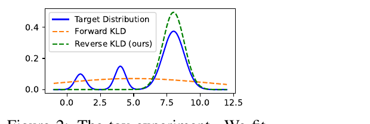
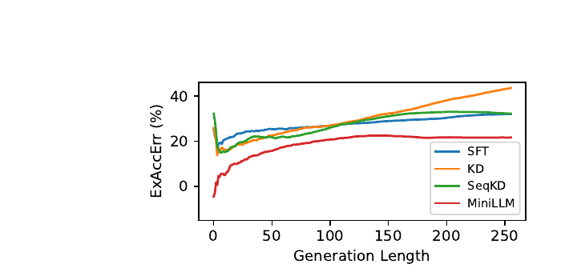
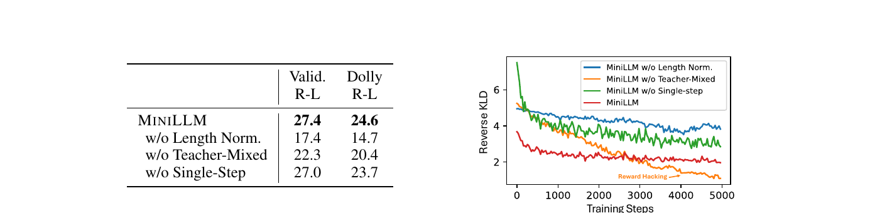

# MiniLLM: On-Policy Distillation of Large Language Models

> **Venue**: arXiv preprint (2306.08543, v6 2026.01.31) — PDF에 학회 배너 없음
> **Authors**: Yuxian Gu¹² (MSR 인턴 중 수행), Li Dong², Furu Wei², Minlie Huang¹\* (\* 교신)
> ¹The CoAI Group, Tsinghua University · ²Microsoft Research
> **arXiv**: [2306.08543](https://arxiv.org/abs/2306.08543)
> **Code**: `github.com/microsoft/LMOps/tree/main/minillm`

**한 줄 정의**: 표준 KD의 **forward KLD**(`KL[p‖q_θ]`)를 **reverse KLD**(`KL[q_θ‖p]`)로 바꾸면 student가 teacher의 void region에 확률을 낭비하지 않고 **major mode에 집중**하게 된다. 그런데 reverse KLD는 student 분포에 대한 기대값이라 미분하려면 **policy gradient**가 필요하고, 그 결과 학습이 자연스럽게 **on-policy**가 된다 — 이것이 OPD 계보의 출발점이다. 단, 그 대가로 **분산·reward hacking·길이 편향을 막는 3종 안정화 장치**가 필수다.

> 📌 **이 노트의 위치**: 이 시리즈의 다른 노트들이 다루는 on-policy distillation의 **원류 두 편 중 하나**. 나머지 하나가 [`gkd_on_policy_distillation.md`](gkd_on_policy_distillation.md)이고, 두 논문은 **같은 시기(2023.06)에 독립적으로** 같은 문제를 공격했으며 **서로 다른 결론**에 도달했다. §7의 대조표가 이 노트의 핵심이다.

---

## 1. Background

### LLM 압축과 KD의 두 갈래

- LLM의 연산 요구를 줄이는 대표적 기법이 knowledge distillation(KD)이다. 큰 teacher의 감독 아래 작은 student를 학습시킨다.
- KD는 접근 가능한 정보에 따라 두 갈래로 나뉜다.

| 갈래 | 접근 가능한 것 | 대표 사례 |
|---|---|---|
| **Black-box KD** | teacher가 **생성한 텍스트만** | ChatGPT API 응답으로 Alpaca·Vicuna류 학습 |
| **White-box KD** | teacher의 **출력 분포·hidden state** | 오픈소스 LLM을 teacher로 쓰는 경우 |

- 오픈소스 LLM이 늘면서 white-box KD의 가치가 커졌다. student가 출력 분포에서 훨씬 풍부한 신호를 받기 때문이다. 그런데 **white-box KD 연구는 대부분 1B 미만의 분류형 언어 이해 모델**에 머물러 있었고, **생성형 LLM에 대한 white-box KD는 미탐구** 상태였다.

### 기존 KD 목적함수의 한계

표준 KD는 사실상 전부 **forward KLD** `KL[p‖q_θ]` 의 근사를 최소화한다. 이는 q_θ가 p의 **모든 mode를 덮도록(mode-covering)** 강제한다.

| 방법 | 신호 | 문제점 |
|---|---|---|
| **KD (word-level)** | 실제 데이터 시퀀스 위에서 teacher의 토큰 분포 | forward KLD. 출력 공간이 유한한 분류에서는 잘 되지만, 생성 태스크에서는 **q_θ가 표현할 수 있는 것보다 p의 mode가 훨씬 많다** |
| **SeqKD** | teacher가 생성한 시퀀스로 SFT | 역시 forward KLD 계열. teacher 샘플을 **전부 암기**하도록 강제 |
| 공통 | — | **p의 void region(확률 0 영역)에 비합리적으로 높은 확률을 부여** → free-run 생성 시 p 하에서 극히 있을 법하지 않은 샘플을 뱉는다 |

핵심은 **capacity mismatch**다. student가 teacher 분포를 완벽히 모방할 수 없을 때, forward KLD는 "덮을 수 없는 것까지 덮으라"고 요구하고 그 결과가 저품질 생성으로 나타난다.

---

## 2. Motivation

### 핵심 통찰 1: mode-covering이 아니라 mode-seeking이어야 한다


sidi
> **Figure 2**: toy experiment. 가우시안 혼합 분포(파란 실선)를 **단일 가우시안**으로 근사한다. **Forward KLD(주황 점선)** 는 모든 mode를 덮으려다 납작하게 퍼져 어느 mode도 맞추지 못하고 **봉우리 사이의 빈 구간에도 확률을 부여**한다. **Reverse KLD(초록 점선)** 는 가장 큰 mode 하나에 정확히 붙는다.

이 그림이 논문 전체의 직관이다. student 용량이 teacher보다 작다는 것은 곧 "단일 가우시안으로 혼합 가우시안을 근사"하는 상황이고, 그렇다면 **어설프게 다 덮는 것보다 확실한 것 하나를 맞추는 게 낫다**.

텍스트 생성으로 옮기면: reverse KLD는 student가 teacher 분포의 **long-tail variant를 배우지 않게** 하고 **생성의 정확성(correctness)** 에 집중시킨다. 진실성·신뢰성이 중요한 실용 시나리오에서 결정적인 성질이다.

### 핵심 통찰 2: reverse KLD를 최소화하려면 필연적으로 on-policy가 된다


> **Figure 3**: sequence-level KD(왼쪽)와 MiniLLM(오른쪽)의 비교. SeqKD는 **teacher가 생성한 샘플 `y ~ p`** 를 student가 암기하게 만든다(forward KLD). MiniLLM은 **student가 생성한 샘플 `y ~ q_θ`** 에 teacher가 피드백을 주고(reverse KLD), 그 gradient가 student의 샘플링 과정을 거쳐 되돌아온다(On-Policy Distillation).

이것이 이 논문의 구조적 핵심이다. `KL[q_θ‖p]`의 기대값은 **q_θ에 대해** 잡히므로, 정의상 student가 스스로 샘플링해야 한다. 즉 **reverse KLD를 고른 순간 on-policy가 따라온다** — 설계 선택이 아니라 수학적 귀결이다.

부수 효과로 exposure bias가 완화된다. student가 학습 중에 **자기가 만든 상태**를 보기 때문이다.

### 핵심 통찰 3: 그런데 policy gradient는 그냥 쓰면 망가진다

MiniLLM 논문의 정직한 부분이다. 순수 policy gradient는 세 가지로 실패한다.

1. **높은 분산** — 시퀀스 전체의 보상 누적 `R_t`를 Monte-Carlo로 추정
2. **Reward hacking** — student가 반복 구문 같은 **degenerate 문장**을 뱉는데 teacher가 거기에 높은 점수를 준다. 작은 student에서 특히 심하다
3. **길이 편향** — `R_t`가 짧은 문장을 선호해 student가 **빈 응답**을 내놓는 방향으로 붕괴

§4.2의 3종 장치는 전부 이 셋을 하나씩 막는 대응물이다.

---

## 3. Contributions

1. **생성형 LLM white-box KD에 reverse KLD 도입**: forward KLD가 low-probability region을 과대평가하는 문제를 진단하고, mode-seeking divergence로 교체.
2. **on-policy 최적화 유도**: policy gradient theorem으로 목적함수의 gradient를 유도하고, 이를 실제로 학습 가능하게 만드는 **3종 안정화 전략**(single-step decomposition, teacher-mixed sampling, length normalization) 제안.
3. **120M ~ 13B 전 구간 검증**: GPT-2 / OPT / LLaMA 세 계열, 5개 instruction-following 데이터셋에서 SFT·KD·SeqKD를 **거의 전 조합에서** 상회.
4. **부수 성질 4종 규명**: 더 낮은 exposure bias, 더 나은 calibration, 긴 응답에서의 우위, **다양성 손실은 무시할 수준**.
5. **IRL 관점의 등가성 증명**(Appendix A.1): MiniLLM의 목적함수가 teacher logit을 Q-function으로 둔 **maximum-entropy inverse RL**과 근사적으로 동치.

---

## 4. Method

### 4.1 목적함수 — Reverse KLD

```
# (1) MiniLLM의 학습 목표
θ = argmin_θ L(θ) = argmin_θ  KL[q_θ ‖ p]
                  = argmin_θ  E_{x ~ p_x, y ~ q_θ} [ − log( p(y|x) / q_θ(y|x) ) ]

  p     : teacher 분포 (고정)
  q_θ   : student 분포 (학습 대상)
  p_x   : prompt 분포
```

표준 KD의 `KL[p‖q_θ]`(forward)와 **인자 순서만 뒤집힌** 형태지만, 기대값을 잡는 분포가 p에서 q_θ로 바뀌는 것이 모든 차이를 만든다.

### 4.2 On-Policy 최적화

#### Gradient 유도

Policy Gradient Theorem으로 (1)의 gradient를 구하면:

```
# (2)
∇L(θ) = − E_{x ~ p_x, y ~ q_θ(·|x)} [ Σ_{t=1..T} (R_t − 1) · ∇ log q_θ(y_t | y<t, x) ]

  r_t = log( p(y_t | y<t, x) / q_θ(y_t | y<t, x) )     # 스텝 t의 생성 품질
  R_t = Σ_{t'=t..T} r_t'                                # t 이후 누적
  T   = |y|
```

**직관**: 생성된 텍스트는 teacher 분포 하에서 높은 확률(`p(y_t'|·)` ↑)을 가져야 하지만, 동시에 student 자신은 다양하게 남아야(`q_θ(y_t'|·)` ↓) 한다. 기대값은 Monte-Carlo 샘플링으로 계산한다.

> 이 식이 **OPD 계보 전체의 원형**이다. 후속 논문들이 `advantage = −reverse_kl` 한 줄로 요약하는 그 형태가 여기서 나온다.

#### 안정화 전략 1 — Single-Step Decomposition

앞쪽 토큰의 오류가 문장 전체로 누적되므로 **단일 스텝 품질 `r_t`가 결정적**이다. `r_t`를 `R_t`에서 분리해 `E_{y_t ~ q_θ(t)}[r_t]`의 gradient를 **직접** 계산한다.

```
# (3)
∇L(θ) = E[ − Σ_t ∇ E_{y_t ~ q_θ(t)}[r_t] ]  +  E[ − Σ_t R_{t+1} ∇ log q_θ(y_t | y<t, x) ]
      = (∇L)_Single  +  (∇L)_Long
```

**핵심**: `E_{y_t ~ q_θ(t)}[r_t]`는 Monte-Carlo 샘플링 대신 **vocabulary 전체에 대한 합**으로 직접 계산할 수 있고 θ에 대해 미분 가능하다. → 단일 스텝 품질을 **정확하고 효율적으로** 추정 → **분산 감소, 수렴 가속**.

#### 안정화 전략 2 — Teacher-Mixed Sampling

reward hacking 대응. 매 스텝 teacher와 student 분포를 섞은 분포에서 샘플링한다.

```
# (4)  α = 0.2 (실험 전체 고정)
p̃(y_t | y<t, x) = α · p(y_t | y<t, x) + (1 − α) · q_θ(y_t | y<t, x)
```

teacher의 도움으로 저품질 생성이 억제된다. 샘플링 분포가 바뀌었으므로 **importance sampling**으로 unbiased estimator를 복원한다.

```
# (5)
w_t = Π_{t'=1..t} [ q_θ(y_t' | y<t', x) / p̃(y_t' | y<t', x) ]      # 정확한 중요도 가중치

# 그러나 per-token 가중치를 여러 스텝에 걸쳐 곱하면 분산이 누적된다. 따라서 근사:
w_t ≈ q_θ(y_t | y<t, x) / p̃(y_t | y<t, x)                          # 실제 사용
```

#### 안정화 전략 3 — Length Normalization

긴 시퀀스일수록 `R_{t+1}`이 작아져 **짧은 응답을 선호**하게 된다. 그래서 길이로 나눈다.

```
# (6)
R^Norm_{t+1} = (1 / (T − t − 1)) · Σ_{t'=t+1..T} log( p(y_t' | y<t', x) / q_θ(y_t' | y<t', x) )
```

#### 최종 gradient

```
# (7)
∇L(θ) = − E_{x ~ p_x, y ~ p̃(·|x)} [ Σ_t w_t · (
            ∇ Σ_{y' ∈ V} q_θ(y'|y<t, x) · log( p(y'|y<t, x) / q_θ(y'|y<t, x) )    ← (∇L)_Single
          + R^Norm_{t+1} · ( ∇ q_θ(y_t|y<t, x) / q_θ(y_t|y<t, x) )                ← (∇L)_Long
        ) ]

  V : vocabulary
```

### 4.3 학습 알고리즘 (Algorithm 1)

```
Input : 조건부 생성 데이터셋 D (prompt–ground truth 쌍)
        사전학습 코퍼스 D_PT (long-document plain text)
        teacher p, 초기 student q_{θ0}
        learning rate η, batch size M, clipping threshold ε

# Phase 1 — 초기화
D의 ground-truth 응답으로 student를 fine-tune,
검증 손실이 가장 낮은 체크포인트를 θ로 채택
  (주의: SFT w/o KD 베이스라인은 Rouge-L로 고르지만, 여기서는 validation loss로 고른다)

# Phase 2 — MiniLLM 학습
repeat
    D에서 prompt 미니배치 → p̃ 에서 응답 수집 → S = {(x^m, y^m)}
    D_PT 에서 미니배치 D'_PT 수집

    (∇L)_Single  ← Eq. 5
    (∇L)^Norm_Long ← Eq. 5 + Eq. 6,  단 PPO식 클리핑 적용:
         ρ_t(θ) = q_θ(y_t|y<t,x) / p̃(y_t|y<t,x)
         min[ ρ_t(θ), clip(ρ_t(θ), 1−ε, 1+ε) ]
    ∇L_PT ← − (1/M) Σ_{d ∈ D'_PT} ∇ log q_θ(d)       # 언어 모델링 손실

    θ ← θ − η [ (∇L)_Single + (∇L)^Norm_Long + ∇L_PT ]
until 수렴
```

두 가지 추가 장치:
- **PPO식 clipping** — 안정성 보강
- **언어 모델링 손실 `L_PT`** — 표준 NLP 벤치마크에서의 일반 성능이 무너지지 않도록 앵커 역할

> 전체 파이프라인이 **RLHF와 구조적으로 동일**하다. 실제로 저자들은 이를 명시하고, 하이퍼파라미터 설정도 RLHF 관행을 따랐다.

### 4.4 IRL 관점 (Appendix A.1)

토큰 생성을 MDP로 보면 — 상태 = prefix `(y<t, x)`, 행동 = 토큰 `y_t`, 정책 = `q_θ(y_t|y<t, x)`.

- **표준 KD = behavior cloning(BC)** — 시연을 그대로 모방
- BC는 **inverse RL(IRL)** 보다 성능이 떨어지는 것으로 알려져 있다. IRL은 환경에서 reward를 먼저 복원한 뒤 policy optimization으로 그 reward를 최대화한다.

teacher logit `f`를 Q-function으로 두면(γ=1) soft Bellman equation에서 reward가 유도되고,

```
r(y_t, (y<t, x)) = f(y_t, (y<t, x)) − log Σ_{y' ∈ V} exp[ f(y', (y≤t, x)) ]
```

maximum-entropy RL 목적함수 `J(θ) = E[ Σ_t ( r(y_t,·) + H[q_θ(·|y<t,x)] ) ]` 를 전개하면

```
J(θ) ≈ E[ Σ_t ( log p(y_t|y<t,x) − log q_θ(·|y<t,x) ) ] = −KL[q_θ‖p] = −L(θ)
```

즉 **`J(θ) 최대화 ≈ L(θ) 최소화`**. MiniLLM은 BC가 아니라 IRL을 하고 있는 셈이다.

### 4.5 학습 vs 추론

| 단계 | 과정 |
|---|---|
| **학습 Phase 1** | ground-truth 응답으로 SFT, validation **loss** 최소 체크포인트 선택 |
| **학습 Phase 2** | student가 `p̃`(teacher 20% 혼합)에서 샘플링 → teacher가 per-token logprob 제공 → importance-weighted policy gradient + LM loss로 갱신. teacher forward가 **학습 루프 안**에 있음 |
| **추론** | student 단독. teacher 불필요, 추가 비용 없음 |

---

## 5. Experiments

### 5.1 Dataset

| | 학습 | 평가 |
|---|---|---|
| 출처 | `databricks-dolly-15k` (사람이 작성한 15K instruction–response) | 5종 (아래) |
| 전처리 | 문맥 길이 초과 샘플 제거 → **train ~12.5K / valid 1K / test 0.5K** | — |
| D_PT | GPT-2 계열: **OpenWebText** · 그 외: **RoBERTa 학습 코퍼스** | — |

**평가셋 5종**

| 데이터셋 | 규모 | 성격 |
|---|---|---|
| **DollyEval** | 500 | dolly-15k에서 분리한 테스트셋 (in-domain) |
| **SelfInst** | 252 | 사용자 지향 instruction-following |
| **VicunaEval** | 80 | Vicuna 평가용 challenging 질문 |
| **S-NI** | 9K (119 tasks) | SuperNaturalInstructions 테스트셋. 응답 길이로 `[0,5] / [6,10] / [11,∞]` 3분할 |
| **UnNI** | 10K | UnnaturalInstructions 코어셋에서 샘플링 |

**지표 3종** — **R-L**(Rouge-L, 대규모 자동평가에 적합) · **GPT4**(GPT-4가 모델 응답과 ground truth를 1–10점으로 채점, 그 비율) · **Human**(Win/Tie/Loss).
모든 테스트셋에서 **temperature = 1**, 랜덤 시드 5개 생성의 **평균**을 보고.

### 5.2 Implementation Details

| 항목 | 값 |
|---|---|
| Student / Teacher | GPT-2 120M·340M·760M ← **GPT-2-1.5B** · OPT 1.3B·2.7B·6.7B ← **OPT-13B** · LLaMA-7B ← **LLaMA-13B** |
| Phase 2 lr | 5e-6 |
| mini-batch | 64 |
| rollout | 한 번에 **256 문장** 수집 후 **4 inner epoch** 정책 최적화 (RLHF 관행) |
| clipping ε | 0.2 |
| max length | 512 |
| 샘플링 온도 | 1 |
| 학습 스텝 | 5,000 (validation Rouge-L로 최종 체크포인트 선택) |
| teacher-mix α | **0.2** (전 실험 고정) |
| 하드웨어 | NVIDIA V100 32G. **LLaMA-13B → LLaMA-7B 증류가 16 GPU에서 10시간 미만** |

**베이스라인 3종** — **SFT w/o KD**(ground truth로 직접 fine-tune) · **KD**(word-level, 각 토큰 위치에서 teacher 분포를 감독) · **SeqKD**(teacher 생성 데이터로 fine-tune).

### 5.3 Main Results

**Table 1 (발췌)** — GPT4는 GPT-4 피드백 평균, R-L은 Rouge-L. `*` = student가 teacher를 넘긴 항목.

| Model | #Params | Method | Dolly GPT4 | Dolly R-L | SelfInst GPT4 | SelfInst R-L | Vicuna GPT4 | Vicuna R-L | S-NI R-L | UnNI R-L |
|---|---|---|---|---|---|---|---|---|---|---|
| GPT-2 | 1.5B | *Teacher* | 58.4 | 27.6 | 42.9 | 14.3 | 48.6 | 16.3 | 27.6 | 31.8 |
| | 120M | SFT w/o KD | 38.6 | 23.3 | 26.3 | 10.0 | 32.8 | 14.7 | 16.3 | 18.5 |
| | | KD | 40.3 | 22.8 | 27.8 | 10.8 | 31.9 | 13.4 | 19.7 | 22.0 |
| | | SeqKD | 41.2 | 22.7 | 26.2 | 10.1 | 31.0 | 14.3 | 16.4 | 18.8 |
| | | **MiniLLM** | **44.7** | **24.6** | **29.2** | **13.2** | **34.1** | **16.9\*** | **25.3** | **26.6** |
| | 760M | SFT w/o KD | 50.7 | 25.4 | 38.3 | 12.4 | 43.1 | 16.1 | 21.5 | 27.1 |
| | | **MiniLLM** | **54.7** | **26.4** | **44.6\*** | 15.9 | **45.7** | **18.3\*** | **29.3\*** | **37.7\*** |
| OPT | 13B | *Teacher* | 70.3 | 29.2 | 56.1 | 18.4 | 58.0 | 17.8 | 30.4 | 36.1 |
| | 1.3B | SFT w/o KD | 52.6 | 26.0 | 37.7 | 11.4 | 40.5 | 15.6 | 23.1 | 28.4 |
| | | **MiniLLM** | **60.7** | **26.7** | **47.0** | **14.8** | **50.6** | **17.9\*** | **28.6** | **33.4** |
| | 6.7B | SFT w/o KD | 67.9 | 27.6 | 56.4 | 16.4 | 57.3 | 17.8 | 30.3 | 28.6 |
| | | **MiniLLM** | **70.8\*** | **29.0** | **58.5\*** | **17.5** | **60.1\*** | **18.7\*** | **32.5\*** | **36.7\*** |
| LLaMA | 13B | *Teacher* | 79.0 | 29.7 | 75.5 | 23.4 | 65.1 | 19.4 | 35.8 | 38.5 |
| | 7B | SFT w/o KD | 73.0 | 26.3 | 69.2 | 20.8 | 61.6 | 17.5 | 32.4 | 35.8 |
| | | **MiniLLM** | **76.4** | **29.0** | **73.1** | **23.2** | **64.1** | **20.7\*** | **35.5** | **40.2\*** |

**세 가지 관찰**

1. **거의 전 조합에서 우위** — 서로 다른 base 모델, 서로 다른 평가셋, Rouge-L과 GPT-4 두 지표 모두에서 베이스라인을 넘는다. 특히 **Dolly 외 데이터셋에서 격차가 더 크다** → out-of-distribution 일반화가 좋다.
2. **student가 teacher를 넘는 지점이 실재한다** — Vicuna·S-NI·UnNI에서 `*` 표시가 다수. 저자들의 설명은 **exposure bias**다. 표준 teacher-forcing fine-tuning은 학습–추론 괴리를 도입하는 반면, MiniLLM은 학습 중 자기 응답을 샘플링해 이를 완화한다.
3. **120M ~ 13B 전 구간에서 일관** — 세 모델 계열 모두에서 개선폭이 유지된다(Figure 1). LLM 시대의 **확장성**을 보여주는 증거.

**Human evaluation** (LLaMA-7B student ← LLaMA-13B teacher, SelfInst): MiniLLM이 모든 베이스라인보다 높은 선호를 얻고, **teacher와 대등한 수준**으로 평가된다.

### 5.4 Analysis

#### (a) Teacher scaling law

teacher를 키우면 오히려 증류 성능이 나빠지는 현상이 알려져 있었다. GPT-2-125M을 student로 고정하고 teacher를 340M / 760M / 1.5B로 키우면 — **MiniLLM은 teacher 크기와 student 성능이 양의 상관**을 유지하고 SeqKD를 일관되게 상회한다.

> ⚠️ **후속 연구와 정면 충돌하는 지점.** 이 시리즈의 [`rethinking_opd.md`](rethinking_opd.md)와 [`mopd.md`](mopd.md)는 정반대를 보고한다 — 더 강한 teacher가 오히려 붕괴를 일으킨다(MOPD: 0.937 → −1.190). 차이는 **규모와 계열**이다. MiniLLM의 실험은 전부 같은 계열(GPT-2) 안에서 340M~1.5B 범위이고, 후속 연구의 실패 사례는 30B student ← 235B 외부 teacher처럼 **분포 격차가 훨씬 큰** 설정이다. MiniLLM의 결론은 **같은 계열·좁은 범위에 한정된 관찰**로 읽어야 한다.

#### (b) Exposure Bias



> **Figure 6**: 학습–디코딩 괴리로 누적되는 초과 오차(**ExAccErr**)를 생성 길이에 대해 측정. 낮을수록 노출 편향이 적다. GPT-2-125M student ← GPT-2-1.5B teacher, Dolly 테스트셋, prompt당 10회 샘플.

**베이스라인 3종(SFT·KD·SeqKD)은 생성이 길어질수록 ExAccErr가 계속 증가**하는 반면, **MiniLLM은 훨씬 낮고 150 토큰 이후로는 오차 누적이 멈춘다**. on-policy 학습이 노출 편향을 실제로 줄인다는 직접 증거다.

#### (c) Calibration

정책 최적화로 학습된 모델은 calibration이 나쁘다는 지적이 있다. SST2·BoolQ에서 zero-shot 분류 지시문으로 ECE를 측정(LLaMA-7B 기반):

| | SST2 ECE | SST2 Acc. | BoolQ ECE | BoolQ Acc. |
|---|---|---|---|---|
| *Teacher* | 0.025 | 93.0 | 0.356 | 74.5 |
| KD | 0.191 | 84.7 | 0.682 | 63.5 |
| SeqKD | 0.243 | 66.5 | 0.681 | 62.8 |
| **MiniLLM** | **0.099** | **89.7** | **0.502** | **67.8** |

KD·SeqKD가 teacher보다 **훨씬 나쁘게** calibrated되어 있고, MiniLLM이 그 격차를 좁힌다. 저자들의 가설: **forward KLD가 모델로 하여금 타깃 분포의 void region에 확률을 밀어넣게 만들고**, 그것이 student–teacher 분포 차이로 나타난다.

#### (d) 응답 길이별 성능

S-NI를 ground-truth 응답 길이로 3분할했을 때:
- **짧은 응답 `[0, 5]`** — 모든 방법이 낮은 점수. 출력 공간이 작아 student가 대부분의 mode를 덮을 수 있으므로 **reverse KLD와 forward KLD의 성능이 비슷**하다.
- **긴 응답 `[6, 10]`, `[11, ∞]`** — teacher 분포의 mode가 student보다 훨씬 많아지고, 여기서 **MiniLLM의 우위가 뚜렷**해진다.

즉 **reverse KLD의 이득은 출력 공간의 복잡도에 비례**한다.

#### (e) 생성 다양성 — 대가는 무시할 수준

reverse KLD 최적화는 다양성을 잃는다는 것이 통설이다. 3가지 측면으로 검증:

| | Dolly Dist-4 | Dolly Loss | SelfInst Dist-4 | SelfInst Loss |
|---|---|---|---|---|
| Teacher | 99.3 | 3.55 | 99.1 | 4.44 |
| SFT | 99.5 | 3.89 | 99.0 | 5.28 |
| **MiniLLM** | 99.0 | 3.95 | 98.6 | 5.33 |

distinct 4-gram 비율과 언어 모델링 손실 모두 **SFT와 사실상 동일**하다. (i) 하나의 prompt에 여러 응답을 내는 능력은 다소 손해를 보지만, 저자들은 **진실성·신뢰성이 요구되는 응용에서는 정확한 응답 하나면 충분**하다고 주장한다.

### 5.5 Ablation — 3종 안정화 전략



> **Table 4 / Figure 8**: GPT-2-1.5B → GPT-2-125M. 왼쪽은 검증·테스트 Rouge-L, 오른쪽은 학습 중 student–teacher reverse KLD 곡선(32스텝 스무딩).

| 설정 | Valid. R-L | Dolly R-L | Δ |
|---|---|---|---|
| **MiniLLM (전체)** | **27.4** | **24.6** | — |
| w/o Length Norm. | 17.4 | 14.7 | **−9.9** |
| w/o Teacher-Mixed | 22.3 | 20.4 | **−4.2** |
| w/o Single-Step | 27.0 | 23.7 | −0.9 |

**세 장치의 역할이 서로 다르다는 것이 Figure 8에서 드러난다.**

- 놀랍게도 **어느 변형이든 reverse KLD 자체는 감소한다.** 그런데 Length Norm.과 Teacher-Mixed를 빼면 모델이 **반복적이거나 짧거나 무의미한 문자열**을 생성하도록 빠르게 학습한다 — teacher 분포에서 확률이 높은 문자열들이다. 이것이 **reward hacking**이고, Table 4의 낮은 생성 성능으로 직결된다.
- 즉 **"reverse KLD가 잘 내려간다 = 학습이 잘 된다"가 아니다.** Length Norm. 제거는 R-L을 **24.6 → 14.7 (−40%)** 로 붕괴시킨다. 세 장치 중 가장 치명적이다.
- **Single-Step Decomposition**은 성능 기여는 가장 작지만(−0.9) **학습 과정의 분산을 효과적으로 줄인다**.

> 이 ablation이 [`gkd_on_policy_distillation.md`](gkd_on_policy_distillation.md)가 MiniLLM을 비판하는 근거이자, 동시에 후속 연구들이 "OPD에는 안정화 장치가 필요하다"고 반복 확인하게 되는 **최초의 증거**다.

---

## 6. Key Takeaways

1. **divergence의 방향이 생성 품질을 지배한다.** capacity mismatch 상황에서 forward KLD(mode-covering)는 teacher의 void region에 확률을 낭비하지만, reverse KLD(mode-seeking)는 major mode에 집중한다. Figure 2의 toy experiment가 이 논문 전체의 직관을 한 장에 담고 있다.

2. **on-policy는 선택이 아니라 reverse KLD의 수학적 귀결이다.** `KL[q_θ‖p]`의 기대값이 q_θ에 대해 잡히므로 student가 스스로 샘플링해야 하고, policy gradient가 필연적으로 따라온다. **OPD 계보 전체가 이 한 걸음에서 시작한다.**

3. **exposure bias 감소가 실측된다.** ExAccErr가 베이스라인 대비 뚜렷하게 낮고, **150 토큰 이후 오차 누적이 멈춘다**. 그 결과 Vicuna·S-NI·UnNI에서 **student가 teacher를 넘기는 항목이 다수** 나온다.

4. **성능 이득은 출력 공간의 복잡도에 비례한다.** 짧은 응답(`[0,5]`)에서는 forward/reverse KLD가 대등하고, 긴 응답에서 격차가 벌어진다. reverse KLD는 "덮을 게 많을 때" 이득이 난다.

5. **안정화 장치 3종은 옵션이 아니다.** Length Norm. 제거 시 R-L **24.6 → 14.7(−40%)**, Teacher-Mixed 제거 시 **−4.2**. 더 중요한 건 **reverse KLD는 잘 내려가는데 생성 품질은 붕괴한다**는 관찰이다 — 손실값이 학습 성공의 지표가 아니다.

6. **다양성 손실은 걱정만큼 크지 않다.** Dist-4와 언어 모델링 손실 모두 SFT와 사실상 동일(99.0 vs 99.5, 3.95 vs 3.89). mode-seeking의 대가는 실무에서 감당 가능한 수준이다.

7. **비용이 현실적이다.** LLaMA-13B → LLaMA-7B 증류가 **V100 16장에서 10시간 미만**. 다만 teacher forward가 학습 루프 안에 있어야 하며, 이 제약을 [`mopd.md`](mopd.md)가 사이드카 서비스 분리로 해소한다.

---

## 7. GKD와의 대조 — 같은 시기, 같은 문제, 다른 답

[`gkd_on_policy_distillation.md`](gkd_on_policy_distillation.md)(Agarwal 외, Google DeepMind)는 **2023년 6월 같은 달에 독립적으로** 발표됐고, GKD 논문 §5가 MiniLLM을 동시기 연구로 지목해 직접 비판한다.

| 축 | **MiniLLM** | **GKD** |
|---|---|---|
| divergence | **reverse KLD 고정** | **자유 선택** — forward KL / reverse KL / JSD(β) |
| on-policy 정도 | **항상 100%** | **λ ∈ [0,1] 하이퍼파라미터** (student data fraction) |
| 최적화 수준 | **sequence-level** — 시퀀스 전체 reverse KL | **token-level** — 각 위치의 divergence |
| 샘플링 역전파 | **한다** (policy gradient) | **하지 않는다** (명시적 설계 결정) |
| 안정화 장치 | **3종 필수** (single-step, teacher-mixed, length norm) + PPO clipping + LM loss | **없음** — supervised 학습에 가까움 |
| 프레임 | 이것은 **RL이다** (IRL 등가성 증명) | 이것은 **imitation learning이다** (Ross et al. 계보) |
| RL 결합 | 다루지 않음 | **RLAIF와 동시 최적화** 제안 (§3.2) |

**GKD의 비판 (§5 원문 요약)**: *"GKD가 더 단순하고 안정적이며 supervised 학습에 더 가깝다. student의 샘플링 과정으로 역전파하지 않기 때문이다. MiniLLM은 높은 분산, reward hacking, 생성 길이 편향을 다루기 위해 여러 안정화 트릭에 의존한다. 또한 GKD는 forward KL이나 JSD 같은 다른 divergence도 쓸 수 있어 더 일반적이며, 이들이 reverse KL보다 더 나은 경우가 있다."*

**이 비판은 타당한가?** — §5.5의 ablation이 첫 번째 지적을 **논문 스스로 입증**한다. Length Norm. 하나로 −40%다. 두 번째 지적도 GKD가 실증한다: WMT에서 JSD(0.1)가, GSM8K에서 forward KL이 reverse KL보다 낫다.

**다만 반대 방향도 성립한다.** GKD의 λ 실험(Figure 6·7)은 결국 **λ = 100%(완전 on-policy)가 거의 항상 최선**임을 보여준다 — MiniLLM이 처음부터 고정해둔 그 설정이다. 그리고 **산업 규모 후속 연구는 MiniLLM 쪽 계보를 따랐다**: [`mopd.md`](mopd.md)의 policy-gradient 구현은 *"MiniLLM(Gu 2026)을 따라"* 라고 명시하며, MOPD의 advantage 정의 `sg[log π_teacher(y_t) − log π_student(y_t)]`는 MiniLLM Eq. 2의 `r_t`와 정확히 같은 양이다.

### 시리즈 내 위치

| 후속 노트 | MiniLLM과의 관계 |
|---|---|
| [`mopd.md`](mopd.md) | PG 구현을 **직접 계승**(Eq. 2의 `r_t` = MOPD의 per-token advantage). MOPD는 여기에 다도메인 teacher 라우팅과 인프라 분리를 얹었다 |
| [`exopd_learning_beyond_teacher.md`](exopd_learning_beyond_teacher.md) | MiniLLM이 암묵적으로 고정한 **β=1 결합을 푼다**. OPD를 dense KL-constrained RL의 특수 케이스로 일반화 |
| [`rethinking_opd.md`](rethinking_opd.md) | MiniLLM의 **teacher scaling law 결론을 사실상 뒤집는다** — teacher가 크다고 좋은 게 아니라 thinking pattern 호환성이 관건 |
| [`revisiting_opd.md`](revisiting_opd.md) · [`demystifying_opd.md`](demystifying_opd.md) | MiniLLM의 3종 장치가 **왜 필요했는지**를 분산·길이 팽창 관점에서 재조사. Demystifying이 되살린 clipping과 LM loss 앵커는 MiniLLM에 이미 있던 것 |

### MiniLLM이 남긴 빈칸

- **teacher scaling의 상한** — 340M~1.5B 범위, 같은 계열 안에서만 확인했다. 계열이 다르거나 격차가 크면 어떻게 되는지 미탐구(후속 연구가 부정적으로 답한다).
- **divergence 선택** — reverse KLD를 고정하고 대안을 탐색하지 않았다. GKD가 이 축을 연다.
- **long-horizon** — max length 512다. 수천~수만 토큰 추론 궤적에서의 거동은 [`rethinking_opd.md`](rethinking_opd.md)가 다룬다.
- **teacher forward 비용** — 학습 루프 안에 teacher가 있어야 한다. [`mopd.md`](mopd.md)의 사이드카 분리 이전까지 인프라 부담으로 남는다.

---

[← 후속 연구 정리](opd_follow_up_research.md) · [GKD (동시기 원류)](gkd_on_policy_distillation.md) · [원문 요약](on_policy_distillation.md) · [MOPD](mopd.md) · [ExOPD](exopd_learning_beyond_teacher.md)
