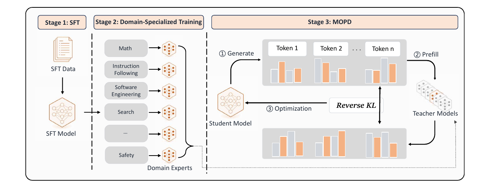
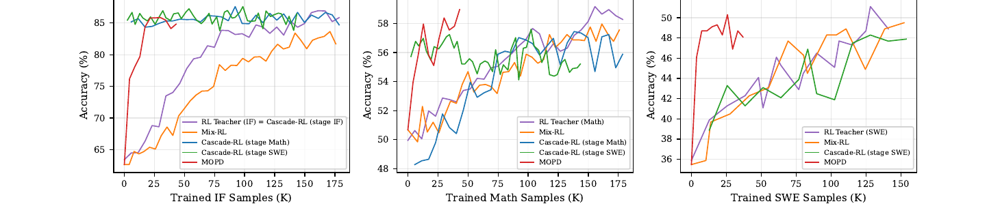
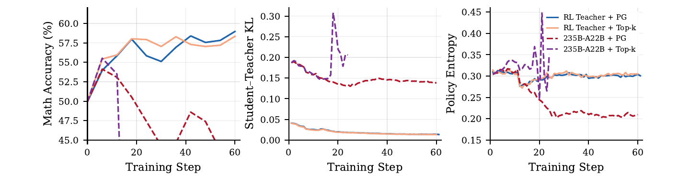

# MOPD: Multi-Teacher On-Policy Distillation for Capability Integration in LLM Post-Training

> **Venue**: arXiv preprint (2026.06.29, v1)
> **Authors**: Wenhan Ma¹² (Xiaomi 인턴), Jianyu Wei², Liang Zhao², Hailin Zhang², Bangjun Xiao¹², Lei Li²³, Qibin Yang¹², Bofei Gao¹², Yudong Wang¹², Rang Li¹², Jinhao Dong⁴², Zhifang Sui¹\*, Fuli Luo²\* (\* 공동교신)
> ¹Peking University · ²**LLM Core, Xiaomi** · ³University of Hong Kong · ⁴Renmin University of China
> **arXiv**: [2606.30406v1](https://arxiv.org/abs/2606.30406)
> **Platform**: **MiMo-V2-Flash (309B)** post-training 파이프라인에 실제 배포

**한 줄 정의**: 다도메인 능력 통합을 **weight space(파라미터 평균/task arithmetic)도, dataset space(prompt 혼합)도 아닌 policy space** 에서 수행한다 — 도메인별 RL teacher를 **병렬로** 만든 뒤, student가 **자기 rollout** 을 뽑고 그 궤적을 **해당 도메인 teacher에게 라우팅**해 토큰 단위 reverse KL로 흡수한다. Qwen3-30B-A3B에서 정규화 점수 **0.937**(차선 0.882), 309B MiMo-V2-Flash에서도 재현.

---

## 1. Background

### 다도메인 post-training의 현황

- 도메인별 RL 파이프라인은 이미 각자 성숙했다. **수학**은 verifiable-answer RL, **소프트웨어 엔지니어링**은 실행 가능 샌드박스 안의 agent-style RL, **instruction following·창작**은 rubric-based RL, **검색 에이전트**는 web-environment RL. 각 파이프라인은 자기 도메인 능력을 **안정적으로** 끌어올린다.
- 그런데 최종 산출물은 언제나 **하나의 모델**이어야 한다. "각각은 잘 되는데 합치는 게 안 된다" — 이것이 현대 LLM post-training의 미해결 문제다.
- 이 논문의 관점은 학술적이라기보다 **엔지니어링·조직 운영적**이다. 도메인 팀들이 서로의 학습 일정에 묶이지 않고 병렬로 일할 수 있는가, 한 팀의 실패가 전체 run을 되돌리는가 — 가 문제 정의의 중심에 있다.

### 기존 4계열의 한계

| 방법 | 동작 | 문제점 |
|---|---|---|
| **Mix-RL** (Yang 2025) | 모든 도메인 prompt를 한 데이터셋에 풀고 joint RL. 각 샘플은 자기 도메인의 reward·advantage 사용 | 도메인 간 학습 신호가 **간섭** → **see-saw effect**. joint 모델이 개별 도메인 teacher보다 아래에 머문다 |
| **Cascade RL** (Wang 2026, Nemotron-Cascade) | 도메인을 순차 학습, 각 stage는 이전 stage에서 초기화 | 초기 stage 능력이 후속 stage에서 **감쇠**. 전체 run이 길어 **안정성 리스크가 누적**되고, 한 번 재시작하면 처음으로 되돌아감 |
| **Off-Policy Finetune** (Liu 2025) | 도메인별 RL teacher를 만든 뒤, teacher rollout 위에서 student를 SFT | off-policy 감독 → 전형적인 **exposure bias**(Ranzato 2016). 학습 분포와 추론 시 방문 분포가 어긋남 |
| **Param-Merge** (Ilharco 2023, Wortsman 2022) | teacher 가중치를 평균하거나 task vector로 합성 | 융합 모델이 **불안정**하고 모든 teacher의 온전한 능력에 **미치지 못함**. 병합 레시피에 따라 결과가 크게 요동 |

논문의 정리: 이들은 **학습 효율 · 도달 가능한 최고점 · 학습 안정성** 셋을 서로 트레이드오프할 뿐, 만족스러운 중간 지점이 없다.

Table 1은 이를 실무적으로 중요한 3축으로 압축한다.

| | Dense optimization | On-policy | Parallelisable |
|---|:---:|:---:|:---:|
| Param-Merge | ✗ | — | ✓ |
| Off-Policy Finetune | ✓ | ✗ | ✓ |
| Mix-RL | ✗ | ✓ | ✗ |
| Cascade RL | ✗ | ✓ | ✗ |
| **MOPD (ours)** | **✓** | **✓** | **✓** |

> **Table 1**: 세 축을 **동시에** 만족하는 것은 MOPD뿐이다. Param-Merge는 학습 자체가 없어 on-policy 여부가 정의되지 않는다(—).

---

## 2. Motivation

### 핵심 통찰 1: 통합은 weight space가 아니라 policy space에서 일어나야 한다

Param-Merge가 불안정한 근본 원인은 서로 다른 목적으로 이동한 파라미터 벡터를 **한 점으로 강제로 평균**하기 때문이다. MOPD는 대신 **prompt 단위 라우팅**을 쓴다 — 수학 prompt는 수학 teacher가, SWE prompt는 SWE teacher가 채점한다. 파라미터 충돌 자체가 발생하지 않으므로 융합의 불안정성이 **구조적으로 소거**된다.

Table 2가 그 대가를 정량화한다: linear averaging은 정규화 점수 **0.328**, task arithmetic은 **0.857** — 같은 teacher 집합인데 병합 레시피만 바꿔도 0.53이 왔다 갔다 한다. 파라미터 병합은 **신뢰할 수 있는 통합 도구가 아니다.**

### 핵심 통찰 2: dense supervision과 on-policy를 동시에 가져갈 수 있다

- **Dense**: teacher가 궤적의 **매 토큰마다** 확률분포를 제공한다. 표준 RL의 trajectory-level scalar reward보다 훨씬 조밀해 **분산이 낮고 샘플 효율이 높다.**
- **On-policy**: student가 **자기 rollout** 위에서 학습하므로 학습 분포 = 추론 분포. exposure bias가 **정의상** 없다.

기존 4계열은 이 둘 중 하나를 반드시 포기한다(Table 1). MOPD는 "student가 샘플링하고 teacher가 채점한다"는 OPD 템플릿을 **multi-teacher + prompt routing** 으로 확장해 둘 다 잡는다.

### 핵심 통찰 3: teacher를 "고르는" 게 아니라 same-origin으로 "만든다"

MOPD의 teacher는 전부 **Stage-1의 동일 SFT 체크포인트에서 도메인 RL로 파생**된다. student도 같은 체크포인트에서 초기화된다. 따라서 학습 시작 시점의 student–teacher 정책 분포가 **밀접하게 정렬**되어 있고, per-token KL이 **~0.04** 로 낮게 출발한다.

이건 우연한 설계가 아니라 **전제조건**이다. §5.4(b)에서 수학 teacher만 더 강한 외부 모델(Qwen3-235B-A22B)로 교체하면 정규화 점수가 0.937 → **0.600**, top-k 형태에서는 **−1.190**(SFT student보다도 나쁨)으로 붕괴한다. 이 시리즈의 [`rethinking_opd.md`](rethinking_opd.md)가 "teacher 선정 조건"으로 제기한 문제에, MOPD는 **"선정하지 말고 생성하라"** 는 다른 처방을 내놓는다.

### 핵심 통찰 4: 조직 차원의 동기 — 직렬 의존성 해체

논문이 §5 Discussion에서 명시적으로 강조하는 부분이며, 산업 배포 논문답게 실질적이다.

- **병렬 개발**: Stage-2 teacher들은 상호 독립. 도메인 팀이 각자의 reward·샌드박스·데이터 파이프라인으로 **순서 없이** 동시에 반복한다.
- **레시피 디커플링**: 각 도메인이 알고리즘·rollout 절차·reward 함수·하이퍼파라미터를 **자유롭게** 고를 수 있다. 다른 도메인과의 충돌을 걱정할 필요가 없다.
- **리스크 격리**: RL 학습은 재시작이 잦다. joint multi-domain RL에서 재시작은 **전체 run을 원점으로** 돌리지만, MOPD에서는 **해당 도메인 하나로 국한**되고 나머지 teacher는 그대로 살아 있다.

---

## 3. Contributions

1. **MOPD 패러다임 제안**: 다도메인 능력 통합을 policy space에서 수행하는 3-stage post-training 레시피. student 자기 rollout 위에 dense한 토큰 수준 감독을 얹는다.
2. **통제 비교에서 4개 baseline 전부 상회**: Qwen3-30B-A3B, 3도메인(Math·IF·SWE)에서 정규화 점수 **0.9373** — 차선 Mix-RL(0.8818) 대비 **+0.055**. 도메인별 편차도 최소(폭 0.044).
3. **산업 규모 검증**: 309B 프런티어 모델 **MiMo-V2-Flash** 에 동일 레시피 적용, 7개 벤치마크 중 5개에서 해당 teacher 초과.
4. **분석 3종**: (i) policy-gradient 형태와 top-k 형태가 사실상 등가, (ii) **same-origin teacher가 안정 최적화의 필요조건**, (iii) multi-round student–teacher 반복으로 계속 흡수 가능(0.937 → 0.986).

---

## 4. Method



> **Figure 1**: MOPD 3-stage 파이프라인. Stage 1이 공유 SFT 체크포인트를 만들고, Stage 2가 도메인 teacher들을 **병렬로** 학습하며, Stage 3이 ① prompt 샘플 → ② student rollout(Generate) → ③ 도메인 teacher 라우팅 → ④ teacher prefill로 per-token 확률 획득(Prefill) → ⑤ reverse KL로 student 갱신(Optimization)을 반복한다.

### 4.1 3-Stage 파이프라인

| Stage | 내용 | 산출물 |
|---|---|---|
| **1. General SFT** | 목표 능력 전부를 커버하는 광범위 코퍼스로 base 모델 fine-tune | **공유 SFT 체크포인트** — Stage-2 모든 teacher의 초기값이자 Stage-3 student의 초기값 |
| **2. Domain-specialised RL** | 도메인 d마다 SFT 체크포인트에서 출발해 그 도메인에 **가장 자연스러운 레시피**로 RL (수학=verifiable-answer, SWE=실행 샌드박스 agent RL). **완전 병렬 실행 가능** | 도메인 전문가 집합 {π_φd} |
| **3. MOPD** | student는 Stage-1에서 초기화, Stage-2 teacher들은 **frozen** 상태로 teacher group 구성. 다도메인 데이터셋 위에서 distillation | **단일 통합 모델** |

**Stage 3 한 스텝의 동작**

```
1. 데이터셋에서 prompt 배치를 샘플
2. student가 각 prompt에 대해 궤적을 생성하고, 궤적을 따라 per-token 확률분포를 기록
3. 각 궤적을 task의 도메인에 따라 대응 teacher로 dispatch
   → teacher가 그 궤적 위에서 prefill 하여 per-token 확률분포 획득
4. 궤적을 따라 student ↔ 해당 도메인 teacher 사이의
   per-token reverse KL을 최소화하도록 student 갱신
```

**구조적 이점 5가지** (논문이 §3.1에서 나열)

- **No exposure bias** — student 자기 rollout 위에서 학습하므로 학습·추론 상태분포가 구성상 일치
- **Dense per-token supervision** — 궤적의 모든 토큰에 확률분포. trajectory-level reward 대비 분산↓, 샘플 효율↑
- **Stable integration in policy space** — teacher 파라미터의 평균/task arithmetic이 아니라 prompt 라우팅으로 병합
- **Modular & parallel teachers** — teacher RL이 완전 병렬이고 각자의 하이퍼파라미터를 가짐. 한 teacher의 실패·튜닝이 다른 teacher에 영향 없음
- **Same-origin teacher stability** — 동일 SFT 체크포인트 파생이라 초기 KL이 낮고 최적화가 매끄러움(§5.4b)

### 4.2 Training Objective

Stage 3는 dispatch된 teacher를 향한 **per-token reverse KL** 로 student를 최적화한다.

```
# (1) 목적함수 — π_φd 는 prompt x 에 dispatch된 teacher
#     π_θ(v), π_φd(v) 는 π_θ(v | x, y<t), π_φd(v | x, y<t) 의 축약

L_rev-KL = E_{x, y ~ π_θ} [ (1/|y|) Σ_t Σ_v  π_θ(v) · log( π_θ(v) / π_φd(v) ) ]
```

이 목적함수의 **두 가지 효율적 구현**을 제시한다.

#### (a) Policy-gradient 구현 — 기존 RL 프레임워크에 드롭인

MiniLLM(Gu 2026)을 따라 distillation을 RL 과정으로 캐스팅한다. (1)의 gradient는

```
∇_θ L = − E_{x,y} [ (1/|y|) Σ_t  log( π_φd(y_t) / π_θ(y_t) ) · ∇_θ log π_θ(y_t) ]
```

정확히 policy-gradient 형태이며, **teacher–student log 차이가 per-token advantage 역할**을 한다.

```
# (3) per-token advantage.  sg[·] = stop-gradient
Â_MOPD,t = sg[ log π_φd(y_t) − log π_θ(y_t) ]

# 안정성을 위한 양방향 클립 (기본 A_max = 5)
Â^clip_MOPD,t = clip( Â_MOPD,t , −A_max , +A_max )

# (4) 최종 손실
L^PG_MOPD(θ) = − E_{x,y} [ (1/|y|) Σ_t  Â^clip_MOPD,t · log π_θ(y_t) ]
```

> **실무적 함의**: 이 형태는 기존 PPO/GRPO 학습 프레임워크에 **그대로 들어간다.** 바뀌는 것은 **advantage 계산 한 줄**뿐이다.

#### (b) Top-k distillation 구현 — 저분산 대안

PG 형태는 각 rollout 위치에서 **실제 샘플된 토큰 하나**만 쓴다. Peng(2024)를 따라 teacher의 top-k 토큰 위에서 증류하면 teacher 분포를 더 많이 활용하면서 구현은 단순하게 유지된다. `T_t^d = TopK_k( π_φd(· | x, y<t) )` 라 두고,

```
# (5) k = 64 (기본값)
L^TopK_MOPD(θ) = E_{x,y} [ (1/|y|) Σ_t Σ_{v ∈ T_t^d}
                    ( π_θ(v)·log(π_θ(v)/π_φd(v)) − π_θ(v) + π_φd(v) ) ]
```

**`− π_θ(v) + π_φd(v)` 항이 왜 필요한가** — 표준 reverse KL에 논문이 **추가로 붙인 보정항**이다. top-k 절단이 만드는 bias를 상쇄해 손실이 **π_θ = π_φd 에서 최소가 되도록 보장**한다. 이 항이 없으면 naive top-k truncated reverse KL은 이 성질을 잃는다.

**정확성 외의 이득 — 인프라 부담 감소**: top-k 형태는 teacher prefill payload를 작게 유지해 **경량 reward 신호처럼 전송**할 수 있다. full-vocabulary distillation은 토큰마다 vocab 전체 분포를 실어 날라야 한다.

### 4.3 Infrastructure — teacher prefill을 사이드카로 분리

Stage 3에 추가되는 유일한 연산은 **teacher prefill** 이다. 모든 student rollout을 dispatch된 teacher에 통과시켜 per-token log-prob(또는 top-k logit)을 얻어야 한다.

- **하지 않은 선택**: teacher prefill을 RL 학습 루프 안에 접어 넣기 → 인프라가 복잡해지고 **직렬 지연**이 추가된다.
- **한 선택**: teacher prefill의 성질이 RL의 **reward 계산과 동일**하다는 관찰에서 출발해, 각 도메인 teacher를 RL 트레이너 **바깥의 독립 prefill 서비스**로 배포한다.

```
runtime:
  student sampler ──(계속 rollout 생성)──▶
        └─ 시퀀스 하나가 끝나는 즉시 ─▶ 해당 teacher 서비스에 **비동기** prefill 요청
                                        └─▶ per-token log-prob 반환
```

teacher prefill이 **다른 시퀀스들의 샘플링과 시간적으로 겹치므로**, MOPD의 wall-clock 비용은 **sampling 하나로 지배**되고 teacher 비용은 student 샘플링 뒤에 사실상 숨는다. 저자들의 배포 환경에서 **teacher가 유발한 측정 가능한 wall-clock 오버헤드는 거의 없었다.**

### 4.4 학습 vs 추론

| 단계 | 과정 |
|---|---|
| **학습 (Stage 3)** | student가 rollout 생성 → 도메인 라우팅 → teacher **k개가 아니라 해당 1개만** prefill → per-token reverse KL 갱신. teacher는 frozen |
| **추론** | **student 단일 모델만** 사용. teacher·라우터·병합 로직 전부 불필요 — 추론 비용은 일반 단일 모델과 동일 |

---

## 5. Experiments

### 5.1 Experimental Setup

**모델·도메인**

| | 내용 |
|---|---|
| Base | **Qwen3-30B-A3B-Base** (Yang 2025). 전 도메인을 커버하는 코퍼스로 SFT → 모든 baseline과 MOPD의 **공통 출발점** |
| Math | SFT: Mixture-of-Thoughts 수학 subset · RL: BigMath(Albalak 2025) + ORZ(Hu 2025) 필터링. max len **32,768** |
| Instruction Following | SFT: IFBench 방식 prompt를 gpt-oss-120b로 distill · RL: IFBench 레시피로 합성. max len **32,768** |
| Software Engineering | SFT: R2E-Gym task를 오픈소스 모델로 distill · RL: **R2E-Gym-Lite**(Jain 2025). max len **65,536**, 상호작용 턴 **최대 50** |
| 평가 | Math: AIME25 / AIME26 · IF: IFBench / IFEval · SWE: SWE-bench Verified |

**하이퍼파라미터** (Appendix A)

| 설정 | 값 |
|---|---|
| RL 알고리즘 | on-policy **GRPO** + **Dynamic Sampling**(DAPO). rollout 데이터는 1회 gradient update 후 폐기 |
| 도메인 RL lr | 3 × 10⁻⁶ |
| Math·IF RL | BS 144, N = 8 rollouts/prompt, 약 **175K** 시퀀스 |
| SWE RL | BS 80, N = 8, 약 **150K** 시퀀스 |
| Mix-RL | lr 4 × 10⁻⁶, BS 256, N = 8, 배치 내 도메인 비율 Math:IF:SWE = 0.35 : 0.35 : 0.3 |
| Cascade RL | 도메인 RL과 동일 설정, 순서 **IF → Math → SWE** |
| **MOPD** | **Dynamic Sampling 미사용**, BS **2048**, **N = 1**, 도메인 비율 0.35 : 0.35 : 0.3 |
| clip / top-k | A_max = **5** (PG 형태), k = **64** (top-k 형태) |
| 평가 프로토콜 | AIME25/26은 문항당 **32회 샘플 avg@32**, IF·SWE는 1회. temperature **1.0**, top-p·top-k truncation **미적용** |

> N = 1 · BS 2048은 MOPD가 GRPO류와 근본적으로 다른 지점을 보여준다. group 내 상대 비교로 advantage를 만들 필요가 없으므로 **prompt당 rollout 1개**면 충분하고, 대신 배치를 크게 가져간다.

**정규화 점수 (normalised score)**

세 도메인은 절대 headroom이 크게 달라 raw accuracy 평균은 headroom 넓은 도메인에 과대 가중된다. 그래서 공통 척도로 옮긴다.

```
s̃_d = (s_d − s_d^s) / (s_d^t − s_d^s)

  s_d^s : 해당 도메인에서 Stage-1 SFT student 정확도   → s̃_d = 0
  s_d^t : 해당 도메인 Stage-2 specialist teacher 정확도 → s̃_d = 1
  s_d   : 평가 대상 방법의 정확도

헤드라인 지표:  s̃ = (1/|D|) Σ_{d ∈ D} s̃_d     (도메인 균등 평균)

  s̃ > 1 : specialist teacher 초과
  s̃ < 0 : Stage-1 student보다 퇴행
```

### 5.2 Main Results

**Table 2** — Qwen3-30B-A3B 다도메인 능력 통합 (정확도 %, 높을수록 좋음)

| Method | AIME25 | AIME26 | IFBench | IFEval | SWE-bench Verified | **Norm. score** |
|---|---|---|---|---|---|---|
| Student (SFT-only) | 45.42 | 54.48 | 42.69 | 84.17 | 35.80 | 0.0000 |
| RL Teacher | 54.79 | 63.65 | 78.40 | 95.50 | 51.20 | 1.0000 |
| Mix-RL | **52.71** | 63.75 | 75.00 | 94.58 | <u>48.80</u> | <u>0.8818</u> |
| Cascade RL | 48.54 | 61.88 | 77.11 | <u>95.80</u> | 47.80 | 0.7752 |
| Off-Policy Finetune | <u>51.56</u> | 63.44 | **80.95** | 93.35 | 45.80 | 0.8241 |
| Param-Merge (Avg.) | 47.81 | 59.58 | 53.74 | 88.79 | 39.60 | 0.3280 |
| Param-Merge (Task Arith.) | 49.38 | <u>63.96</u> | <u>78.23</u> | **95.81** | <u>48.80</u> | 0.8574 |
| **MOPD (ours)** | 51.46 | **65.31** | 77.89 | 93.84 | **50.40** | **0.9373** |
| Δ(MOPD − RL Teacher) | −3.33 | +1.66 | −0.51 | −1.66 | −0.80 | −0.0627 |

> **Table 2**: "RL Teacher"는 해당 도메인의 Stage-2 specialist. 6개 통합 방법 안에서 **볼드**=열 최고, <u>밑줄</u>=차점.



> **Figure 2**: Qwen3-30B-A3B 학습 동역학. 각 패널은 도메인별 정확도(%), x축은 누적 학습 샘플 수(K). 보라색 Domain-RL이 단일 도메인 specialist teacher(참조선). **빨간색 MOPD 곡선이 세 패널 모두에서 압도적으로 왼쪽에서 포화**하는 것이 핵심.

#### 관찰 1 — Mix-RL / Cascade RL / Off-Policy는 **서로 다른 모양의** 도메인 결손을 남긴다

정규화 점수는 0.882 / 0.775 / 0.824로 총합은 비슷하지만 약점의 위치가 다르다.

- **Cascade RL의 순서 의존성**: IF → Math → SWE 순서에서 **첫 번째 IF는 headroom의 98%** 를 닫지만, 두 번째 **Math는 57%** 에 그친다. Figure 2 중앙 패널은 더 나아가 **후속 SWE 단계에서 Math 정확도가 실제로 떨어지는 것**을 보여준다 — 명시적 cross-domain interference.
- **Off-Policy Finetune의 불균등 전이**: IF에서는 teacher를 **초과**(도메인 정규화 점수 1.01)하는데 SWE는 **65%** 만 닫는다. teacher 궤적의 offline 모방이 **task 유형에 따라 전이 효율이 크게 다르다**.
- **Mix-RL**은 가장 균형 잡힌 baseline(도메인별 폭 0.064)이지만 MOPD에 **5.5 정규화 점수 뒤진다**.

#### 관찰 2 — MOPD가 최고점이자 **가장 균일한 프로파일**

- 정규화 점수 **0.937**, 차선 Mix-RL(0.882) 대비 **+0.055**
- 도메인별 정규화 점수가 전부 **[0.91, 0.95]** — 폭 **0.044** 로 전 방법 중 최소
- 비교: Cascade RL **0.57–0.98(폭 0.41)**, Off-Policy Finetune **0.65–1.01(폭 0.36)**

즉 "평균이 높다"가 아니라 **"어느 도메인도 버리지 않는다"** 가 MOPD의 진짜 성질이다.

#### 관찰 3 — Param-Merge는 병합 레시피에 극도로 민감

linear averaging은 **0.328** 로 광범위하게 실패한다. Task arithmetic은 **0.857** 로 회복하지만 도메인별 편차가 크다 — IF에서는 teacher를 **초과(1.00)** 하는데 Math는 **73%** 만 닫는다. 결과가 **병합 계수와 벤치마크 양쪽에 의존**하므로 **신뢰할 수 있는 통합 도구가 아니다.**

#### 관찰 4 — 샘플 효율이 확연히 높다

Figure 2의 x축(도메인별 소비 샘플)을 기준으로:

| 방법 | teacher 수준 도달 지점 |
|---|---|
| **MOPD** | IF **~25K** 샘플, SWE **~30K** 샘플 |
| Mix-RL | **각 도메인마다 150–180K 전량** 을 써야 비슷한 수준에 근접 |

teacher의 dense per-token supervision이 trajectory-level RL reward보다 **샘플당 훨씬 풍부한 gradient 신호**를 주기 때문이라는 것이 저자들의 설명.

### 5.3 산업 규모 검증 — MiMo-V2-Flash (309B)

전체 3-stage 파이프라인을 **MiMo-V2-Flash**(Core Team 2026)에 적용. 도메인 teacher는 **Math · Code · IF · SWE · Tool Use** 5종.

**Table 3** — 모든 teacher가 RL 학습 모델

| | AIME25 | HMMT25 | LCB | IFBench | SWE-Bench V. | τ²-Bench | τ²-Telecom |
|---|---|---|---|---|---|---|---|
| Student | 89.3 | 76.9 | 77.5 | 55.4 | 67.8 | 75.9 | 92.7 |
| Teacher | 93.9 | 82.6 | 82.6 | 68.9 | 74.2 | 79.6 | 95.0 |
| **MOPD** | **94.1** | **84.4** | **83.2** | 66.7 | 73.4 | **80.3** | **95.3** |
| Δ | **+0.2** | **+1.8** | **+0.6** | −2.2 | −0.8 | **+0.7** | **+0.3** |

> **Table 3**: 7개 벤치마크 중 **5개에서 해당 teacher를 초과**. 회귀는 IFBench(−2.2)와 SWE-Bench Verified(−0.8) 두 건이고, 나머지 벤치마크의 이득에 비하면 완만하다.

Qwen3-30B-A3B(A3B, MoE)와 MiMo-V2-Flash(309B) — **규모와 아키텍처가 모두 다른 두 모델**에서 같은 레시피가 작동한다는 것이 이 절의 요지다.

### 5.4 Ablation Study

#### (a) Policy-gradient vs Top-k — 사실상 등가

동일 파이프라인(같은 teacher·데이터 예산·하이퍼파라미터), k = 64.

| Loss Variant | AIME25 | AIME26 | IFBench | IFEval | SWE-bench V. | Norm. score |
|---|---|---|---|---|---|---|
| Policy gradient | 51.46 | 65.31 | 77.89 | 93.84 | 50.40 | **0.9373** |
| Top-k distillation | 51.77 | 64.79 | 75.85 | 93.07 | 50.20 | 0.9093 |

Top-k는 Math에서 대등하고 IF·SWE에서 약간 낮다. Figure 3이 보여주듯 **두 loss의 학습 궤적이 거의 겹친다** — 수학 정확도가 매끄럽게 상승하고, per-token reverse KL이 이미 낮은 초기값(~0.04)에서 **단조 감소**하며, policy entropy가 **0.30 근방에서 안정** 유지.

> **해석**: teacher와 student 분포가 밀접하면 student의 rollout이 teacher의 **고확률 영역에 집중**되므로, 두 gradient estimator 모두 유사하게 정보량 있는 신호를 받아 비슷한 종점으로 수렴한다. **same-origin teacher 조건에서는 PG 형태가 이미 충분히 안정하고, top-k가 추가적인 안정성·분산 감소를 주지 못한다.**

#### (b) Same-origin teacher가 안정 최적화를 만든다 — **가장 중요한 ablation**

MOPD의 teacher는 student로부터 RL로 만들어진다. 그렇다면 **더 강하지만 분포적으로 이질적인 외부 모델**을 teacher로 쓰면 더 나을까? 통제 실험: **Math 도메인의 teacher만** Qwen3-30B-A3B 기반에서 **Qwen3-235B-A22B**(훨씬 크고 수학 실력이 강한 모델)로 교체. IF·SWE teacher, 데이터, 하이퍼파라미터는 전부 동일.

| Math Teacher | Loss Variant | AIME25 | AIME26 | IFBench | IFEval | SWE-bench V. | Norm. score |
|---|---|---|---|---|---|---|---|
| RL Teacher (same-origin) | Policy gradient | 51.46 | 65.31 | 77.89 | 93.84 | 50.40 | **0.9373** |
| RL Teacher (same-origin) | Top-k distillation | 51.77 | 64.79 | 75.85 | 93.07 | 50.20 | 0.9093 |
| Qwen3-235B-A22B (외부) | Policy gradient | 45.63 | 51.56 | 79.25 | 93.99 | 50.60 | **0.6003** |
| Qwen3-235B-A22B (외부) | Top-k distillation | **0.94** | **0.42** | 72.96 | 88.97 | 51.20 | **−1.1898** |



> **Figure 3**: Table 4의 네 run에 대한 Math 도메인 학습 동역학. **왼쪽**: Math 정확도(%). **가운데**: per-token student–teacher reverse KL. **오른쪽**: student policy entropy. **실선 두 개(same-origin)** 는 매끄럽고 안정적. **점선 두 개(외부 teacher)** 는 점진적으로 불안정해지며, top-k 변형은 **step 18 부근에서 파국적으로 붕괴**한다.

메커니즘:

- **초기 per-token KL이 ~0.19 vs same-origin ~0.04 — 약 5배**. 분포 격차가 정량적으로 확인된다.
- **PG 형태**: Math 정확도가 점진적으로 열화하고 **entropy가 0.30 → 0.21로 수축**한다. student 정책이 단일 모드로 좁아진다 — teacher의 **저확률 영역에서 오는 처벌성(punitive) gradient 신호를 주로 받기** 때문.
- **Top-k 형태**: 훨씬 심각. **step 18 부근에서 발산**하고 KL·entropy가 모두 격렬하게 진동 — 최적화 안정성의 **완전한 상실**. AIME25 **0.94**, AIME26 **0.42** 는 사실상 모델 붕괴다.

> **결론**: MOPD의 same-origin teacher 사용은 선택 사항이 아니라 **필요조건**이다. "더 강한 teacher"라는 직관은 여기서 정면으로 반박된다.

#### (c) Multi-round student–teacher evolution

한 라운드의 MOPD가 대부분의 headroom을 닫지만, Math와 IF에는 아직 여지가 남는다. 그래서 **post-MOPD 모델을 새 student로 삼아 절차 전체를 반복**한다 — 이 student에서 도메인 teacher를 재학습하고, 새 teacher들로 다시 MOPD.

Qwen3-30B-A3B에서 1회 검증. 이번 라운드는 **Math·IF에만** RL·distillation을 적용(SWE는 둘 다 미수행).

| Round | AIME25 | AIME26 | IFBench | IFEval | SWE-bench V. | Norm. score |
|---|---|---|---|---|---|---|
| Iter 1 MOPD | 51.46 | 65.31 | 77.89 | 93.84 | 50.40 | 0.937 |
| Iter 2 RL Teacher | 54.27 | 65.52 | 81.46 | 95.65 | 50.40 | **1.030** |
| Iter 2 MOPD | 53.44 | 64.90 | 79.76 | 95.44 | 50.20 | **0.986** |

> **Table 5**: Iter-2 RL Teacher는 Iter-1 MOPD student에서 초기화한 도메인 teacher. SWE 점수는 이번 라운드에서 학습되지 않았으므로 **Math·IF distillation의 간접 효과만** 반영한다.

두 가지 결론:

1. **다음 라운드 도메인 RL을 Iter-1 student에서 시작하면 더 강한 teacher가 나온다** — Iter-2 RL Teacher가 정규화 점수 **1.030**, Iter-1 MOPD 대비 **+0.093**. 즉 **단일 MOPD 라운드가 뽑아내는 것 너머에 도메인별 headroom이 아직 남아 있다.**
2. **그 teacher를 다시 흡수할 수 있다** — Iter-2 student가 0.937 → **0.986**(+0.049). MOPD 파이프라인은 **더 강한 teacher로부터 계속 능력을 흡수**할 수 있다.

---

## 6. Key Takeaways

1. **policy space 통합이 weight space 통합을 압도한다.** prompt 단위 teacher 라우팅은 파라미터 충돌을 원천 소거한다. 같은 teacher 집합으로 Param-Merge는 레시피에 따라 **0.328(linear) ~ 0.857(task arithmetic)** 을 오가지만 MOPD는 **0.937** 을 안정적으로 낸다.

2. **dense × on-policy × parallelisable 3축을 동시에 만족하는 유일한 방법.** Mix-RL·Cascade RL은 병렬성을 잃고, Off-Policy는 on-policy를 잃고, Param-Merge는 dense optimization을 잃는다(Table 1). 그 대가가 정규화 점수 **+0.055(vs 차선)** 와 **도메인별 편차 0.044(vs Cascade 0.41)**.

3. **same-origin teacher는 옵션이 아니라 전제조건이다.** Math teacher만 더 강한 Qwen3-235B-A22B로 바꾸면 **0.937 → 0.600(PG)**, top-k에서는 **−1.190** 으로 SFT student보다도 아래로 붕괴한다. 초기 per-token KL이 **0.04 → 0.19(5배)** 로 벌어지고, PG에서는 entropy가 **0.30 → 0.21** 로 수축, top-k에서는 **step 18에 발산**. "teacher는 강할수록 좋다"는 직관은 여기서 무너진다.

4. **loss 형태보다 teacher 분포 정렬이 지배적이다.** same-origin 조건에서 PG(0.937)와 Top-64(0.909)는 사실상 등가이고 학습 궤적이 거의 겹친다. 그러나 teacher를 바꾸는 순간 같은 두 loss가 **0.600 vs −1.190** 으로 갈라진다. **어떤 loss를 쓸지보다 어떤 teacher를 쓸지가 훨씬 중요하다.**

5. **dense supervision이 샘플 효율로 직결된다.** MOPD는 IF **~25K** / SWE **~30K** 샘플에서 teacher 수준에 도달하는데, Mix-RL은 **도메인마다 150–180K 전량**을 소비해야 근접한다. per-token 분포가 trajectory-level scalar reward보다 샘플당 훨씬 많은 정보를 준다.

6. **teacher prefill을 사이드카 서비스로 빼면 비용이 사실상 0이다.** teacher prefill은 RL의 reward 계산과 성질이 같으므로 트레이너 바깥의 독립 서비스로 배포하고 비동기 호출한다. 다른 시퀀스의 샘플링과 겹치므로 **측정 가능한 wall-clock 오버헤드가 거의 없다.** top-k 형태는 payload까지 작아 경량 reward 신호처럼 전송된다.

7. **반복 라운드로 계속 흡수 가능하다.** Iter-1 MOPD student를 초기값으로 삼은 Iter-2 teacher가 **1.030**(+0.093) — 단일 라운드가 남긴 headroom이 실재한다는 증거이며, Iter-2 MOPD가 **0.986**(+0.049)로 그것을 다시 흡수한다.

8. **조직 차원의 가치가 벤치마크 이득만큼 중요하다.** capability 생산(Stage-2)과 capability 통합(Stage-3)의 분리 → **병렬 개발**(도메인 팀이 순서 없이 동시 반복) · **레시피 디커플링**(각 도메인이 알고리즘·reward·하이퍼파라미터를 자유 선택) · **리스크 격리**(재시작이 전체 run이 아니라 해당 도메인 하나로 국한). 309B MiMo-V2-Flash 배포가 이 주장의 실증이다.

---

## 7. 기존 OPD 노트 대비 위치

이 시리즈의 다른 노트들이 세운 결론과 MOPD가 어떻게 맞물리는가.

| 기존 노트의 주장 | MOPD와의 관계 |
|---|---|
| [`rethinking_opd`](rethinking_opd.md): teacher는 **thinking pattern이 호환**되어야 하고, 벤치마크 점수가 높다고 좋은 teacher가 아니다 | **독립 재확인 — 그러나 처방이 다르다.** Qwen3-235B-A22B 교체 실험이 산업 규모에서 같은 결론을 낸다(0.937 → 0.600 / −1.190). `rethinking_opd`는 호환 teacher를 **고르는** 진단 지표(overlap ratio 등)를 제시했지만, MOPD는 아예 **same-SFT-checkpoint RL로 만들어 낸다** — 선정 문제를 생성 문제로 치환 |
| [`rethinking_opd`](rethinking_opd.md): sampled-token만으로 Top-k와 대등하고 Top-1은 붕괴한다 | **일치.** MOPD의 PG(sampled-token) 0.937 vs Top-64 0.909. 다만 MOPD는 여기에 **조건**을 붙인다 — 이 등가성은 **same-origin 조건에서만** 성립하고, 외부 teacher에서는 top-k 쪽이 **오히려 더 크게 붕괴**한다(−1.190 vs 0.600) |
| [`exopd`](exopd_learning_beyond_teacher.md): λ>1 reward extrapolation으로 multi-teacher 병합에서 **모든 domain teacher를 초과** | **상보 관계.** ExOPD는 teacher **초과**가 목표, MOPD는 다도메인 teacher 능력의 **손실 없는 통합**이 목표다. MOPD의 Δ(MOPD − Teacher)는 **−0.063** — teacher를 넘지 않는다. 반대로 ExOPD는 도메인 스케일 통합·인프라·산업 배포를 다루지 않는다. **ExOPD의 λ 외삽을 MOPD Stage 3에 얹는 것**이 가장 자연스러운 조합이며 어느 논문도 시도하지 않았다 |
| [`exopd`](exopd_learning_beyond_teacher.md): multi-teacher OPD는 도메인 간 간섭으로 code −1.1 손실 | **MOPD가 그 간섭을 라우팅으로 줄인다.** 도메인별 정규화 점수 폭이 **0.044** 로 전 방법 중 최소. 다만 여전히 teacher 이하(−0.063)이므로 "간섭 제거 ≠ teacher 초과" |
| 원문 블로그: "**어떤 open-weight teacher든** 쓸 수 있다" | **반박 측에 한 표 더.** 더 강한 외부 teacher가 오히려 **−1.190** 까지 붕괴시킨다. 이제 이 주장을 반박하는 독립 논문이 최소 2편 |
| 원문 블로그: teacher가 사실상 성능 상한 | **MOPD는 상한을 인정하는 쪽** (Δ −0.063). 대신 **multi-round로 상한 자체를 올린다** — Iter-2 teacher 1.030. `exopd`가 λ 외삽으로 한 번에 넘는 것과 대비되는 접근 |
| 시리즈 전반: OPD를 **단일 teacher·단일 도메인** 문제로 다룸 | **MOPD가 비어 있던 축을 채운다** — multi-teacher capability integration, 그리고 **인프라·조직 운영** 관점. 이 시리즈에서 프런티어 모델(309B) 실배포를 보고하는 유일한 논문 |

### 이 논문이 남긴 빈칸

- **회귀의 원인 미분석**: MiMo-V2-Flash에서 IFBench −2.2 / SWE-Bench Verified −0.8이 왜 발생하는지 다루지 않는다. 도메인 비율(0.35:0.35:0.3)의 문제인지, 라우팅 경계가 모호한 prompt 때문인지 미확인.
- **same-origin의 경계 조건**: 초기 KL 0.04는 되고 0.19는 안 된다면 **임계값은 어디인가.** 같은 base에서 파생됐지만 RL을 훨씬 오래 돌린 teacher는 어느 쪽인가.
- **도메인 라우팅의 전제**: 모든 prompt에 명확한 도메인 라벨이 있다고 가정한다. 도메인이 섞인 prompt(수학이 포함된 SWE task 등)나 라벨이 없는 실사용 트래픽에서의 동작은 미탐구.
- **multi-round의 수렴점**: 1회 반복만 검증했다. 라운드를 계속 돌리면 어디서 멈추는지, [`rethinking_opd`](rethinking_opd.md)가 경고한 entropy 붕괴가 나타나는지 미확인.

---

[← 후속 연구 정리](opd_follow_up_research.md) · [원문 요약](on_policy_distillation.md) · [ExOPD](exopd_learning_beyond_teacher.md) · [Rethinking OPD](rethinking_opd.md)
