# On-Policy Distillation

> **Venue**: Thinking Machines Lab — Connectionism blog (2025.10.27)
> **Authors**: Kevin Lu (Thinking Machines Lab)
> **Platform**: Tinker / Tinker Cookbook (오픈 레시피 공개, 약 75줄)
> **Link**: https://thinkingmachines.ai/blog/on-policy-distillation/

**한 줄 정의**: student가 직접 rollout을 샘플링하고, teacher가 그 rollout의 **모든 token을** 채점한다.
RL의 on-policy 관련성 + distillation의 dense 신호를 한 자리에 모은 post-training 기법.

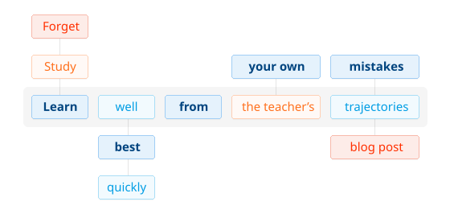

---

## 1. Background

### LLM post-training의 현황

- 전문 모델은 세 단계로 만들어진다.
  - **Pre-training** — 일반 능력 (언어 사용, 폭넓은 추론, 세계 지식) / 웹 코퍼스
  - **Mid-training** — 도메인 지식 (코드, 의료 DB, 사내 문서) / 도메인 코퍼스
  - **Post-training** — 목표 행동 (instruction following, 수학 풀이, chat) ← **OPD의 자리**
- 잘 학습된 작은 모델은 자기 도메인에서 큰 범용 모델을 이긴다. 실무적 이점이 크다.
  - 로컬 배포 (프라이버시·보안), 지속 업데이트 (재학습이 가볍다), 추론 비용 절감 (서빙 단가)
- 따라서 관건은 **마지막 단계를 어떤 방법으로 하느냐**이다.

### post-training을 가르는 두 축

- **축 1 — sampling**: 누가 만든 시퀀스로 배우나 (off-policy = 남의 시퀀스 / on-policy = student 자신의 rollout)
- **축 2 — reward signal**: 피드백이 얼마나 촘촘한가 (dense = O(N) bits/episode / sparse = O(1) bits/episode)

| | **Sparse** — O(1) bits/episode | **Dense** — O(N) bits/episode |
|---|---|---|
| **Off-policy** (남이 만든 시퀀스) | 남의 시퀀스에 점수 하나 — episode당 신호 최소 | **SFT / off-policy distillation**<br>teacher 시퀀스에 cross-entropy |
| **On-policy** (student 자신의 rollout) | **RL (RLVR: GRPO / DAPO)**<br>자기 rollout이지만 신호는 정오답 하나 | **On-policy distillation**<br>student rollout 위에서 token마다 teacher가 채점 |

> OPD는 비어 있던 새 칸이 아니라, **RL과 SFT가 각각 반쪽씩 갖고 있던 두 장점을 한 칸에 모은 것**이다.

#### 그림으로 보는 세 방식 (원문 예제)

같은 수학 문제 하나를 놓고 세 방식이 어떤 신호를 주는지 비교한다.


*풀어야 할 문제 — 이 prompt 하나에 대한 rollout이 1 episode다.*

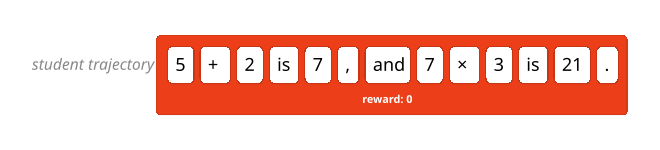
***RL** — rollout 전체에 정오답 하나. "21은 틀렸다"만 알 뿐, 연산 순서를 틀렸는지 산수를 틀렸는지는 모른다.*

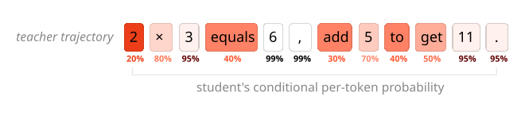
***Off-policy distillation (SFT)** — **teacher가 만든** 시퀀스의 토큰마다 학습. 색이 진할수록 student가 스스로 뽑을 확률이 낮았던 토큰 = 큰 업데이트. 신호는 촘촘하지만 판면이 남의 것이다.*

#### 용어 — episode / bits / sparse·dense

- **episode**: prompt 하나 → 종료 토큰까지의 rollout 하나. 길이 N 토큰짜리 시퀀스 하나가 1 episode.
- **bits**: 그 episode 하나에서 student가 실제로 얻는 학습 신호의 정보량. 엄밀한 정보이론 계산이라기보다 "rollout을 뽑는 데 쓴 compute 대비 돌려받는 supervision이 몇 개의 독립적인 숫자냐"의 order.
  - 이진 reward = 정확히 1 bit. 반면 vocab V ≈ 150k에서 정답 토큰 하나를 지정하는 것은 log₂(150k) ≈ **17 bits**, N=4,000 rollout이면 episode당 **~68,000 bits**.
- **sparse / dense**: RL의 **reward sparsity** 용어 그대로. **시간축(토큰 위치) 위에서 피드백이 얼마나 자주 붙는가**만 가리킨다. MoE sparsity·sparse attention 같은 연산 희소성과는 무관.
  - sparse = 궤적 끝에만 (미로에서 "출구 도달 시 +1")
  - dense = 매 스텝마다 (미로에서 "출구에 가까워질수록 +")
  - LLM에서는 **스텝 = 토큰 생성 1회**이므로, sparse는 4,000 토큰을 다 뽑고 나서야 정오답 하나, dense는 4,000개 위치 각각에 값이 붙는다.

**밀도는 이진값이 아니라 스펙트럼이다.** 위 2×2 표는 두 칸으로 나뉘지만 실제로는 granularity의 연속체다.

| granularity | per-episode | per-step | per-token | per-token 분포 전체 |
|---|---|---|---|---|
| 신호 개수 | 1 | 수십 | N | N × V |
| 대표 방법 | RLVR (outcome) | PRM (process) | **OPD / SFT** | logit distillation |

- Lightman et al. 2023(78.2% vs 72.4%, §2 통찰 3)은 per-episode → per-step으로 한 칸 올린 실험. OPD는 거기서 한 칸 더 올린 것.
- logit distillation은 OPD보다도 dense하지만 teacher forward가 루프 안에 있어야 하고 V차원 저장·전송이 무겁다. **OPD는 "샘플된 토큰 1개의 logprob"만 받아 per-token 밀도를 확보하는 지점**을 골랐다 (§4.1).

**정보량으로 본 credit assignment**: "어느 토큰이 잘못이었나"를 지목하려면 위치 특정에만 log₂(N) bits가 필요하다 (N=4,000이면 ~12 bits). sparse RL은 episode당 1 bit만 준다 — **원리적으로 부족하다.** GRPO가 시퀀스 전체에 같은 advantage를 바를 수밖에 없는 이유다.

**밀도에서 곧바로 따라나오는 결과**: partial rollout 가능 (§4.4 #2), 작은 batch로도 학습 (§4.4 #4, LoRA 격차 −13%→−6%), discount 0으로 단순화 (§4.1 — 각 위치에 이미 자기 몫의 신호가 있어 return을 되돌릴 필요가 없다).

> **주의: dense = 좋은 신호가 아니다.** 밀도는 양(量)의 축이지 질(質)의 축이 아니다.
> 사람이 설계한 전통적 dense reward shaping은 프록시라서 촘촘할수록 오히려 hacking되기 쉽다.
> OPD가 **unhackable**을 별도 성질로 주장하는 이유(§4.2)는 신호가 촘촘해서가 아니라 reward가 "teacher 분포와의 거리 그 자체"이기 때문이다. 밀도와 정합성은 독립적으로 확보해야 하는 두 성질이다.

### 기존 방법의 한계

| 방법 | 신호 밀도 | 분포 | 문제점 |
|---|---|---|---|
| SFT / off-policy distillation | dense — O(N) bits | 남의 것 | compounding error, 스타일만 모방 |
| RL (GRPO / DAPO) | sparse — O(1) bits | 자기 것 | credit assignment 부재, search에 compute 낭비 |
| **On-policy distillation** | **dense — O(N) bits** | **자기 것** | **두 함정 모두 회피** |

### 체스 비유 (원문)

| 방식 | 비유 | 무엇이 부족한가 |
|---|---|---|
| on-policy RL | 코치 없이 대국만 두기 | 승패는 내 수에서 나오지만 판당 1 bit, 어느 수가 결정적이었는지 모름 |
| off-policy distillation | 그랜드마스터 기보 관전 | 수는 훌륭하지만, 그 판면은 초보인 내가 실전에서 만날 상태가 아님 |
| **On-policy distillation** | **내 대국의 내 수마다 등급** | 코치가 내가 둔 수를 "blunder"부터 "brilliant"까지 등급 매김 |

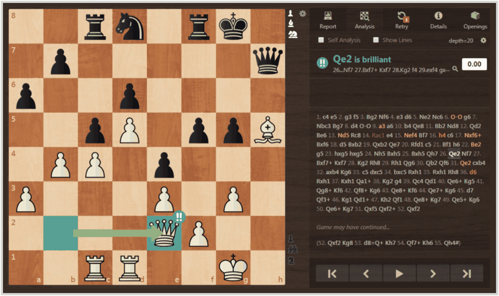
*chess.com 스크린샷. 분석 엔진이 **내가 둔 각 수**를 blunder(빨강)·mistake(주황)·inaccuracy(노랑)·brilliant(파랑)로 등급 매긴다 — OPD가 토큰마다 하는 일이 정확히 이것이다.*

### 계보 — 고전 KD의 두 갈래

| 갈래                                 | 방식                                             | 특성                                                                                      |
| ---------------------------------- | ---------------------------------------------- | --------------------------------------------------------------------------------------- |
| **Logit distillation**             | 각 위치에서 teacher의 다음 token 분포 전체(soft label)를 맞춤 | 정보량 최대, 그러나 teacher forward가 학습 루프 안에 있어야 하고 저장·전송이 무거움. 즉 teacher model을 같이 로딩해서 학습해야함 |
| **Sequence (sample) distillation** | teacher가 샘플링한 시퀀스를 정답으로 SFT                    | 시퀀스 샘플은 teacher 분포의 unbiased 추정 → 기대값으로 같은 목적함수. 데이터셋을 한 번 만들어 공개·재사용 (업계 표준)           |

- sequence distillation 성공 사례는 **전부 off-policy**: Alpaca(instruction following), OpenThoughts-3 / DeepSeek-R1-distill(수학·과학 추론), UltraChat(multi-turn chat)
- 주의: "unbiased 추정"은 **teacher 분포 위에서의 목적함수 추정**이 unbiased라는 뜻이지, student가 방문할 상태를 다룬다는 뜻이 아니다. 추정 문제와 분포 문제는 별개다.

### 선행 연구와의 관계

| 설계 항목  | MiniLLM (2023)                 | GKD (2023)             | **On-policy distillation (2025)**    |
| ------ | ------------------------------ | ---------------------- | ------------------------------------ |
| 샘플링 분포 | teacher-mixed (0.2p + 0.8q)    | λ 혼합 (최적은 λ=1)         | **순수 student (λ=1)**                 |
| 목적함수   | reverse KL + 누적 return R_t     | 선택형 divergence (직접 미분) | **per-token reverse KL, discount 0** |
| 최적화    | policy gradient + 안정화 3종       | supervised 식 gradient  | **advantage = −KL 로 기존 RL loss 재사용** |
| 추가 장치  | length norm, clipping, LM loss | 없음                     | **없음**                               |

- GKD의 핵심 발견: 요약·번역·수학 전부에서 **λ=1(순수 on-policy)이 최고**. RLHF의 reference 정규화 항을 teacher로 바꾸면 distillation이 RL 파이프라인에 올라탄다.
- **discount 0 이 단순화의 핵심**: MiniLLM의 누적 return R_t를 버리고 즉시 KL만 남기면 고분산의 원천이 사라지고, 그것을 누르던 안정화 장치도 불필요해진다.
- 같은 시기 **Qwen3**가 이 2단계(off-policy → on-policy distillation)를 제품 파이프라인에 넣었으나 **loss 수식과 KL 방향은 비공개**. 이 글의 기여는 그 빈칸을 구체 레시피로 채워 공개 재현한 것.

---

## 2. Motivation

### 핵심 통찰 1: off-policy의 함정 — 한 번 벗어나면 계속 벗어난다

teacher가 자주 가는 상태에서만 배우면, student는 **자기 실수에서 복구하는 법을 배우지 못한다.**

- **Compounding error**: student가 teacher는 하지 않을 초기 실수를 하면, 학습에서 관측한 상태로부터 점점 더 멀어진다. --> 특히 작은 사이즈의 LLM들에서 발생
- **DAgger (Ross et al. 2010)** — behavior cloning의 기대 오차는 horizon T에 대해 **O(T²)**. student가 자기 정책으로 방문한 상태에서 expert 라벨을 받으면 **O(uT)** 로 줄어든다.
- **Exposure bias (Bengio et al. 2015)** — 학습은 정답 prefix(teacher forcing), 추론은 자기 생성 prefix. 조건 분포가 어긋나 복구를 못 배운다.
- **False Promise (Gudibande et al. 2023)** — 말투·형식은 그럴듯해지지만 **사실성·능력 격차는 그대로**. 사람 평가자도 처음엔 속는다.

### 핵심 통찰 2: RL의 함정 — episode당 O(1) bits

on-policy라 분포 문제는 없지만, 피드백이 너무 성기다.

- rollout이 수천 token이어도 배우는 건 스칼라 하나. "21"이라는 오답을 낸 rollout에서 student가 배우는 것은 **"이 rollout 전체가 나빴다"** 뿐이다.
  - 연산 순서를 틀렸는지, 산수를 틀렸는지 모른다 → **credit assignment 부재**
- GRPO / DAPO도 마찬가지. group 상대 비교로 만든 advantage를 **시퀀스 전체에 똑같이 바른다.**
- 그 결과 RL은 compute의 대부분을 gradient 업데이트가 아니라 **search**(rollout을 뽑고 어쩌다 좋은 전략에 걸리기)에 쓴다.

### 핵심 통찰 3: dense feedback이 낫다는 근거는 이미 있었다

- **Let's Verify Step by Step (Lightman et al. 2023)** — process supervision(스텝별 채점)이 outcome supervision(최종 답 채점)보다 낫다.
  - 고정 generator에서 best-of-1860 선택 정확도 **78.2% vs 72.4%**
- 다만 process reward model(PRM)은 **라벨링 비용이 크다.**
- **OPD의 답**: 이미 있는 teacher 모델의 logprob이 곧 **공짜 per-token 채점기**다. PRM을 따로 학습하거나 라벨링할 필요가 없다.

---

## 3. Contributions

1. **비어 있던 사분면을 채우는 정식화**: post-training을 (sampling 축 × reward density 축)으로 정리하고, "dense × 자기 분포" 칸이 OPD임을 명확히 함.
2. **per-token reverse KL을 advantage로 쓰는 구체 레시피 공개**: Qwen3 테크리포트가 비공개로 남긴 loss 수식과 KL 방향을 채워 공개 재현. Tinker Cookbook 약 75줄, distillation 전용 loss 없이 기존 RL의 `train_step` 재사용.
3. **수학 추론에서 RL 대비 압도적 비용 효율 입증**: AIME'24 **74.4% (OPD, 1,800 GPU h) vs 67.6% (RL, 17,920 GPU h)** — 약 1/10 비용으로 더 높은 점수. 회계 기준에 따라 **9~30배** 절감.
4. **personalization에서 파괴적 망각 복구 입증**: 사내 문서 mid-training으로 무너진 instruction-following을, **mid-training 이전의 자기 자신을 teacher로** 삼아 지식 손실 없이 복구 (IF-eval 79% → 83%).
5. **continual learning 도구로서의 성질 제시**: teacher가 고정된 OPD는 항상 on-policy로 남기 때문에, 자기 샘플 SFT와 달리 시간이 지나도 열화되지 않는다.

---

## 4. Method

### 4.1 한 문장 정의와 목적함수

student가 rollout을 뽑고, teacher가 그 rollout의 **모든 token을** 채점한다.

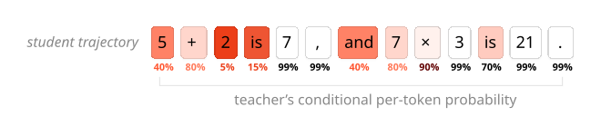
***On-policy distillation** — 시퀀스는 **student 자신의 rollout**이고, 채점은 **토큰마다** 이루어진다. 오답으로 이끈 토큰은 벌하고, 제대로 실행된 토큰은 강화한다. 위 §1의 RL·off-policy 그림과 나란히 놓고 보면 두 장점이 합쳐진 자리가 보인다.*

```
per-token reverse KL:

KL(π_θ || π_teacher)
  = E_{x ~ π_θ} [ log π_θ(x_{t+1} | x_1..t) − log π_teacher(x_{t+1} | x_1..t) ]

reward_t = − KL_t
advantage_t = − ( log π_θ(x_t | x_<t) − log π_teacher(x_t | x_<t) )
```

핵심 설계 3가지:

| 설계 | 내용 |
|---|---|
| **기대값이 student 분포 위** | x ~ π_θ 에서 잡힌다 — 이것이 "reverse"이자 동시에 "on-policy". student가 실제로 가는 상태에서만 차이를 잰다. |
| **샘플 하나로 계산** | student가 뽑은 token에서 `log π_θ − log π_teacher` 값 하나. teacher에게는 "이 token에 네 logprob이 얼마냐"만 물으면 된다. |
| **discount = 0** | 각 시점에서 바로 다음 token의 즉시 KL만 최적화. 미래 token에 미칠 영향(return)은 계산에 넣지 않는다. |

- student가 teacher와 완전히 같아지면 **KL = 0**.
- full distribution을 요구하는 logit distillation과 달리 **teacher forward pass 1번**이면 된다.

> **discount 0인데 장기 전략을 어떻게 배우나?**
> 각 상태에서 teacher의 조건부 분포를 따라가면 궤적 전체가 teacher의 장기 전략을 재현한다.
> 미래 크레딧은 teacher가 이미 자기 정책에 녹여놨다.

### 4.2 RL 기계에 그대로 태운다

새 loss를 만들지 않는다 — **per-token advantage를 −reverse KL로 세팅할 뿐**이다.

기존 두 방식(**AS-IS ① SFT / off-policy distillation**, **AS-IS ② RLVR**)과 **TO-BE(OPD)** 를 같은 축에 놓고 대조해 보면, OPD가 **양쪽 어느 쪽에서 출발해도 작은 변경**으로 도달하는 지점임이 드러난다.

| 출발점 | OPD까지 바꿔야 하는 것 |
|---|---|
| **SFT에서 출발** | 고정 데이터셋 → **student 실시간 rollout**, 정답 토큰 라벨 → **teacher가 그 자리에서 재라벨링** |
| **RLVR에서 출발** | verifier 스칼라 → **teacher logprob 차**, 시퀀스 broadcast → **토큰별 값** (loss·rollout은 그대로) |

#### 파이프라인 4단계 대조

| 단계 | **AS-IS ①** — SFT / off-policy distillation | **AS-IS ②** — RLVR (GRPO/DAPO) | **TO-BE** — On-policy distillation |
|---|---|---|---|
| **1. 준비** | teacher로 데이터셋 **사전 생성** (학습 루프 **밖**, 1회) | verifier / reward model 준비 (태스크마다 새로 제작) | **teacher sampling client 하나**. 샘플링은 안 하고 logprob만 계산 |
| **2. 시퀀스 확보** | 디스크에서 배치 로드 — **샘플링 없음** | student가 prompt당 G개 rollout 생성. student logprob도 이때 나옴 | **RLVR과 완전히 동일** |
| **3. 신호 생성** | 다음 토큰이 곧 라벨 — **advantage라는 개념 자체가 없음** | rollout **끝까지** 뽑은 뒤 정오답 채점 → group 정규화 → **시퀀스 스칼라 하나를 전 토큰에 broadcast** | teacher에게 **같은 토큰 시퀀스**의 logprob을 묻고 `−(student_lp − teacher_lp)`를 **토큰마다** 넣음 |
| **4. 학습** | cross-entropy | importance-sampling loss로 policy update | **RLVR과 동일한 loss를 그대로 호출** |

- **RLVR 대비**: 2번·4번은 손대지 않는다. 그래서 "새 loss 없음 / RL의 `train_step`을 그대로 import"가 성립한다.
- **SFT 대비**: 바뀌는 것은 2번(시퀀스를 누가 만드나)과 3번(라벨을 누가 주나)이다. **SFT가 학습 루프 밖에서 한 번에 끝낸 일을, OPD는 매 스텝 안으로 끌고 들어온다.**
- verl 대응: 2 = rollout + `old_log_prob`, 3 = teacher 서버 logprob 조회 + advantage 세팅, 4 = actor update.

#### 1단계에서 실제로 필요한 것 — 라벨의 종류

"labeling"이라는 한 단어가 서로 다른 네 가지를 가리켜서 혼동되기 쉽다. **셋 다 필요한 데이터가 다른 게 아니라, 라벨의 *종류*가 다르다.**

| 방법 | 필요한 데이터 | 라벨의 정체 | 누가 만드나 |
|---|---|---|---|
| **SFT / off-policy distillation** | prompt + **전체 정답 시퀀스** | 추론 과정을 포함한 완성된 응답 전체 | 사람이 작성하거나 **teacher가 생성** |
| **RLVR** | prompt + **최종 정답 키** | 짧은 answer key (수학=숫자, 코드=단위 테스트) | 사람/데이터셋 (또는 정답을 아는 teacher가 채점) |
| **OPD** | **prompt만** | **없음** | — (teacher의 logprob이 실시간 라벨) |

**RLVR — 라벨이 필요하다, 다만 아주 짧다**

- verifier가 "이 rollout이 맞았나"를 판정하려면 **정답을 알아야** 한다. 그래서 **검증 가능한(verifiable) 태스크로 제한**된다 — chat 품질·문체처럼 기계적 채점 기준을 쓸 수 없는 태스크에는 못 쓴다.
- 그런 태스크에는 reward model을 대신 쓰는데, **RM 자체가 선호 라벨(A vs B) 수십만 개로 학습**된 것이다. 라벨링 비용이 사라진 게 아니라 앞 단계로 옮겨간 것.
- 라벨링 **양**은 SFT보다 훨씬 적다(4,000토큰 풀이 전체 vs 최종 답 하나). 그 대가가 §2 통찰 2의 **O(1) bits** — 라벨이 짧은 만큼 신호도 짧다.

> 원문 표현으로는 채점을 사람이 할 수도, "정답을 안정적으로 맞히는 teacher 모델"이 할 수도 있다. 후자를 쓰면 answer key 없이도 RLVR을 돌릴 수 있지만, 신호는 여전히 episode당 스칼라 하나다.

**OPD — 라벨이 정말로 없다**

student가 뽑은 토큰 시퀀스를 teacher에게 그대로 넘기고 "네 logprob은 얼마냐"만 묻는다. **정답이 무엇인지 아무도 몰라도 된다.**

- **§5.3 수학**: OpenThoughts-3에서 **prompt만** 꺼내 쓴다(77k). 딸려 있는 정답 풀이는 OPD 단계에서 쓰지 않는다.
- **§5.4 personalization**: Tulu3 **prompt만**. instruction-following에는 애초에 answer key가 없고, teacher(= mid-training 이전의 자기 자신)의 분포가 곧 정답 기준이다.

> 요구사항이 **"정답을 아는 데이터" → "정답을 아는 모델"** 로 바뀐다.
> §2 통찰 3에서 "PRM의 80만 개 스텝 라벨을 teacher logprob이 대신한다"고 한 것의 실체가 이것이다.

**비용은 사라지지 않고 위치가 바뀐다**

| | 비용이 발생하는 시점 | 무엇을 지불하나 |
|---|---|---|
| SFT | **학습 전 1회** (데이터셋 생성) | teacher **전체 생성** — 2M prompt 분량의 샘플링 |
| RLVR | 학습 전 (answer key 수집) + 학습 중 (verifier 실행, 대개 쌈) | 정답 키 확보, 태스크가 검증 가능해야 함 |
| **OPD** | **학습 루프 안, 매 스텝** | teacher **forward 1회** — 이미 뽑힌 토큰의 logprob만 |

- 핵심 비대칭은 **생성 vs 채점**이다. SFT의 teacher는 토큰을 하나씩 autoregressive하게 **생성**해야 하지만, OPD의 teacher는 이미 존재하는 시퀀스를 **한 번의 forward로 병렬 채점**한다. §5.3 비용 회계의 9~30배가 여기서 나온다.
- 다만 OPD도 공짜는 아니다 — 학습할 **prompt 분포**는 확보해야 한다. 단 §5.5(b)처럼 prompt 하나를 20 step × 256 rollout으로 재사용해도 teacher 성능에 근접한다. 답을 외우는 게 아니라 분포를 배우기 때문이다. **RLVR에서 같은 짓을 하면 답을 암기해 버린다.**

#### 코드 대조

```python
# ───── AS-IS ①: SFT / off-policy distillation ─────  (개념적 재구성)
trajectories = dataset.next()                           # teacher가 미리 생성해 둔 시퀀스
                                                        # student 샘플링 없음 → student logprob도 없음
training_client.forward_backward(
    trajectories, loss_fn="cross_entropy")              # advantage를 넣을 자리 자체가 없음
```

```python
# ───── AS-IS ②: RLVR ─────  (개념적 재구성)
trajectories = do_group_rollout(student_client, builder)
sampled_logprobs = trajectories["logprobs"]

rewards = verifier.score(trajectories)                  # 정답 채점기 필요, episode 끝나야 나옴
trajectories["advantages"] = group_normalize(rewards)   # 시퀀스당 스칼라 1개 → 전 토큰에 broadcast

training_client.forward_backward(
    trajectories, loss_fn="importance_sampling")
```

```python
# ───── TO-BE: On-policy distillation ─────  (Tinker cookbook)
teacher_client = service_client.create_sampling_client(
    base_model=teacher_config.base_model)               # ← 추가: teacher client

trajectories = do_group_rollout(student_client, builder)  # ← ②와 동일 / ①에는 없던 단계
sampled_logprobs = trajectories["logprobs"]

teacher_logprobs = teacher_client.compute_logprobs(traj)  # ← ②의 verifier 자리를 teacher가 대체
reverse_kl = sampled_logprobs - teacher_logprobs          #    ①의 "정답 토큰" 라벨을 실시간 재라벨링으로 대체
trajectories["advantages"] = -reverse_kl                  # ← 토큰마다 값이 다름

training_client.forward_backward(
    trajectories, loss_fn="importance_sampling")        # ← ②와 동일
```

```
importance_sampling loss = clip 없는 per-token policy gradient

loss = -(exp(target_lp - sampling_lp) * advantages).sum()
```

> loss 수식에 `advantages`가 **이미 per-token 벡터로 들어가는 자리**가 있다. RLVR은 거기에 같은 값을 N번 채워 넣고 있었을 뿐이다. OPD는 그 자리에 진짜로 서로 다른 값을 채운다 — **loss를 바꾸는 게 아니라 비어 있던 표현력을 쓰는 것**이다.

#### 구성 요소 대조

| 항목              | **SFT / off-policy distillation** | **RLVR**                                     | **On-policy distillation**                                          |
| --------------- | --------------------------------- | -------------------------------------------- | ------------------------------------------------------------------- |
| 시퀀스 출처          | teacher (남의 것)                    | **student 자신**                               | **student 자신**                                                      |
| 채점자             | 없음 — 데이터셋의 다음 토큰이 곧 라벨            | verifier / reward model (태스크별 제작)            | **아무 instruction-tuned open-weight 모델** (`compute_logprobs`만 있으면 됨) |
| 채점 시점           | 사전 생성 시 고정                        | episode 종료 후                                 | **매 토큰 즉시**                                                         |
| 신호 형태           | 토큰당 one-hot target                | 시퀀스당 스칼라 1개                                  | **토큰당 스칼라 N개**                                                      |
| episode당 신호     | **O(N) bits**                     | O(1) bits                                    | **O(N) bits**                                                       |
| 학습 루프 안 teacher | **불필요** (데이터셋으로 대체)               | 불필요 (verifier는 필요)                           | 필요 — 단 **forward 1번**                                               |
| 샘플링 비용          | **0** (사전 1회 상각)                  | student 샘플링                                  | student 샘플링 + teacher forward                                       |
| 시퀀스 길이          | 데이터셋 그대로                          | 끝까지 뽑아야 함                                    | **partial rollout 가능** (§4.4 #2)                                    |
| batch size      | 크게 (대규모 SFT 기준)                   | 크게 잡아 노이즈를 눌러야 함                             | **작아도 됨** (§4.4 #4)                                                 |
| 데이터 재사용         | multi-epoch 시 과적합                 | 답 **암기** 위험                                  | **가능** — 분포를 배우므로 (§5.5 b)                                          |
| reward hacking  | 해당 없음                             | 프록시라서 가능                                     | **원리적으로 불가** (아래 reverse KL의 세 성질)                                  |
| 성능 상한           | teacher                           | 없음 (verifier가 정답을 안다)                        | **teacher**                                                         |
| 주 실패 모드         | **compounding error**, 스타일만 모방    | **credit assignment 부재**, search에 compute 낭비 | —                                                                   |

> 표를 세로로 읽으면 OPD 열은 **SFT 열의 밀도**와 **RLVR 열의 분포**를 그대로 물려받는다. §1 2×2 표의 "빈 칸"이 구현 수준에서 무엇이었는지가 이 열이다.

#### 코드 변경량 요약

- Tinker cookbook 실제 구현 **약 75줄**. distillation 전용 loss는 **0줄**.
- **KL 정규화를 쓰는 RL 구현이라면 사실상 한 줄 변경** — 이미 `KL(π_θ ‖ π_ref)` 항이 있으므로 **reference model을 teacher model로 바꾸기만** 하면 된다. 정규화 항이던 것이 목적함수 본체가 된다.
- **SFT 파이프라인에서 출발한다면** 변경량이 더 크다 — 샘플링 인프라(rollout 서버)와 teacher 서빙이 새로 필요하다. OPD가 "RL 스택 위의 재배선"이라고 불리는 이유이자, 이미 RL을 돌리는 팀에게 특히 싼 이유다.

#### advantage의 부호

| 상황 | KL | advantage | 결과 |
|---|---|---|---|
| student는 잘 뽑는데 teacher는 안 뽑을 token (자신만의 나쁜 습관) | 큼 | 큰 음수 | 확률을 깎는다 |
| teacher도 그 상태에서 뽑았을 token | ≈ 0 | ≈ 0 | 건드리지 않는다 |
| 샘플 1개짜리 추정이라 token 단위로 음수 KL이 나온 경우 | 음수 | 양수 | 오히려 강화된다 (기대값으로만 ≥ 0) |

#### reverse KL의 세 성질

1. **Mode-seeking** — 능력이 부족한 student에게는 "teacher의 스타일 전부"보다 **"teacher의 한 가지 좋은 전략"** 이 낫다. forward KL처럼 여러 mode 사이로 퍼지지 않는다.
2. **Unhackable** — 학습된 reward model은 프록시라서 허점을 파고들 수 있다. reverse KL이 낮다는 것 **자체가** "teacher 관점에서 바람직한 행동"이라 프록시와 목표가 일치한다.
3. **Exposure bias 감소** — 자기가 만든 prefix 위에서 배우므로 학습 분포와 추론 분포가 일치한다.

> RL 자체가 (KL penalty 형태에서) sequence-level reverse KL 계열을 최적화한다.
> OPD는 **같은 기하학을 per-token으로 촘촘하게 만든 것**이다.

### 4.3 실제 채점 예시 — 벌점은 forking token에 몰린다

#### 이 절의 목적 — 주장의 육안 검증

OPD의 주장 전체가 하나의 명제 위에 서 있다: **"dense 신호는 credit assignment를 해결한다."**
그런데 §2까지는 이것이 **이론적 가능성**일 뿐이다. per-token 값이 N개 나온다는 것과, 그 N개가 **의미 있는 곳에 몰린다**는 것은 전혀 다른 얘기다.

이 절은 실험이 아니라 **하나의 trajectory를 열어 보는 검증**(원문 제목도 "Illustration")이다. 확인하려는 것은 세 가지다.

| # | 검증 항목 | 실패했다면 |
|---|---|---|
| 1 | 신호가 **평평하지 않다** | KL이 토큰마다 비슷하다면 OPD는 시퀀스 신호를 N등분한 것에 불과 → credit assignment 주장은 공허해진다 |
| 2 | 뾰족한 곳이 **의미 있는 곳이다** | 벌점이 형식·문법 토큰에 붙는다면 dense하기만 하고 쓸모없다 |
| 3 | **최종 오답에는 벌점이 없다** | 오답에 큰 벌점이 붙는다면 reverse KL은 결국 outcome 신호의 변형일 뿐이다 |

#### 설정

- 문제: SimpleBench "프라이팬 위 각얼음 개수" — 정답은 B. 0 (얼음은 녹는다)
- student: Qwen3-4B-Instruct-2507 — 물리 맥락을 무시하고 **순수 산수 문제로** 풀었다
- teacher: Qwen3-235B-A22B-Instruct-2507 — 이 문제를 맞히는 모델

> **예시 선택의 단서**: SimpleBench는 **전제를 무시하면 틀리도록 설계된** 벤치마크다. 그래서 오류가 "여러 스텝에 흩어진 계산 실수"가 아니라 **단 하나의 의미적 결정**으로 응축되고, 분기점이 육안으로 보인다.
> 또한 이 조합(4B student / 235B teacher)은 §5 본 실험(8B / 32B)과 다르다 — **실험이 아니라 예시**다.

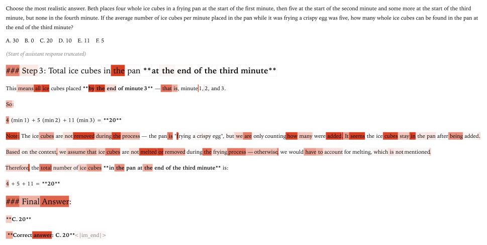
*teacher가 채점한 실제 student trajectory. **붉은색이 진할수록 reverse KL이 큰(= 벌점이 큰) 토큰**이다.*

#### 관측

| 관측                         | 해석                                                                                           |
| -------------------------- | -------------------------------------------------------------------------------------------- |
| **벌점이 큰 token**            | 잘못된 풀이 방향으로 갈라져 들어가는 문구의 시작점 — "단순 계산 문제다"라고 결정해버리는 지점 (**forking token**, Wang et al. 2025) |
| **최종 오답 token은 벌점이 거의 없다** | 앞의 잘못된 추론을 다 조건으로 넣고 보면 그 오답은 완전히 예측 가능하다 — teacher조차 같은 token을 뽑는다                          |

#### 관측 2가 뜻하는 것 — reverse KL은 정답성을 재지 않는다

이 절이 실제로 값을 하는 지점이 여기다. **최종 오답에 벌점이 없다**는 것은 reverse KL이 재는 대상을 드러낸다.

> reverse KL은 **"정답인가"** 를 재는 것이 아니라 **"이 지점에서 두 정책이 갈렸는가"** 를 잰다.
> 잘못된 추론을 전부 조건으로 넣고 나면 그 오답은 완전히 예측 가능하고, teacher조차 같은 토큰을 뽑는다 → KL ≈ 0.

같은 rollout에 세 방식이 무엇을 하는지 비교하면 차이가 선명하다.

| 방식 | 이 rollout에 붙는 신호 |
|---|---|
| **RLVR** | 시퀀스 **전체**에 벌점 하나 — 올바르게 실행된 산수 단계까지 똑같이 벌한다 |
| **PRM** (process supervision) | 틀린 **스텝들**을 "incorrect"로 표시 — 최종 오답 포함 |
| **OPD** | **갈라진 그 지점**에 벌점 집중, 최종 오답은 건드리지 않음 |

> 즉 OPD가 가르치는 것은 **"저 답이 틀렸다"가 아니라 "저기서 그 길로 꺾지 마라"** 이다.
> RL에 없던 것이 정확히 이것이다.

#### 여기서 닫히는 두 개의 논리 고리

**① §4.1의 "discount 0인데 장기 전략을 어떻게 배우나?"**

최종 오답에 벌점이 없다는 것은, 책임을 뒤에서 앞으로 **전파할 필요가 없다**는 뜻이다. 분기점이 이미 자기 몫의 벌점을 즉시 받았기 때문이다. **discount 0이 왜 손해가 아닌지의 경험적 근거**가 이 그림이다.

**② teacher 선택이 왜 결정적인가**

신호는 **teacher와 student가 갈리는 곳에만** 존재한다. teacher가 student와 똑같이 이 문제를 산수 문제로 착각한다면 **KL은 전 구간 0이고, 아무것도 학습되지 않는다.**

- §4.2 표의 "성능 상한 = teacher"가 추상적 진술이 아니라 토큰 단위에서 이렇게 나타난다.
- 원문이 굳이 **"이 문제를 맞히는 모델"** 인 Qwen3-235B를 teacher로 골라 보여준 이유다.
- 실무 함의: teacher는 크기가 아니라 **student가 틀리는 지점에서 옳아야** 한다. (§5.3에서 32B 대신 8B를 teacher로 쓴 것이 더 좋았던 것도 같은 맥락)

> sparse RL이라면 이 rollout 전체에 벌점 하나를 발랐을 것이다.
> OPD는 **"어디서 갈라졌는지"** 를 정확히 짚는다.

### 4.4 왜 싼가 — 비용 구조 네 가지

#### 먼저: 샘플링(생성) vs 채점(logprob) — LLM 비용의 핵심 비대칭

OPD의 비용 이야기는 전부 이 구분 위에 있다. **둘 다 "모델을 돌린다"이지만 성질이 완전히 다르다.**

- **샘플링(sampling / generation)** — 다음 토큰을 확률 분포에서 **뽑고**, 그것을 입력 뒤에 붙이고, **다시** 모델을 돌린다. 앞 토큰이 확정되어야 다음을 계산할 수 있으므로 **N개 토큰 = N번의 순차 forward**다. 되돌릴 수 없는 의존 사슬이라 병렬화가 원리적으로 막혀 있다.
- **채점(scoring / `compute_logprobs`)** — 이미 완성된 시퀀스를 통째로 넣고 "각 위치에서 이 토큰이 나올 확률이 얼마였나"를 읽기만 한다. 뽑을 것이 없으니 다음 토큰을 기다릴 이유가 없다. causal mask 덕분에 **N개 위치를 한 번의 forward로 동시에** 계산한다.

```
샘플링 (생성) — 순차 N 스텝
  x₁ ─▶ x₂ ─▶ x₃ ─▶ … ─▶ x_N        forward N번
   │     │     │          │           앞이 나와야 뒤를 계산 (병렬화 불가)
   └─────┴─────┴──────────┘           매 스텝 토큰 1개만 처리 → GPU 놀림

채점 (logprob) — 병렬 1 스텝
  [ x₁ x₂ x₃ … x_N ] ─────▶ forward 1번 ─────▶ logprob N개 한꺼번에
                                                전 토큰 동시 처리 → GPU 꽉 채움
```

| | **샘플링** | **채점** |
|---|---|---|
| forward 횟수 | **N번** (토큰 수만큼) | **1번** |
| 병렬화 | 불가 (순차 의존) | **가능** (전 위치 동시) |
| GPU 특성 | memory-bandwidth bound — 연산기가 논다 | compute bound — 연산기를 채운다 |
| 필요한 것 | 모델 + 디코딩 루프 + KV cache | 모델 + 토큰 시퀀스 |

> **FLOPs로 세면 둘이 비슷해 보인다** (양쪽 다 대략 2 × 파라미터 × 토큰 수).
> 그러나 **실제 wall-clock은 크게 다르다.** §5.3의 "FLOPs 기준은 logprob 계산의 실제 비용을 과대평가한다"는 단서가 이 뜻이고, 회계 기준에 따라 **9배(FLOPs) vs 18배(GPU hours)** 로 갈리는 이유다.

**그래서 OPD의 역할 분담이 결정적이다.**

| 역할 | 담당 | 하는 일 |
|---|---|---|
| **비싸고 순차적인 일** (샘플링) | **작은 student** | rollout 생성 |
| **싸고 병렬적인 일** (채점) | **큰 teacher** | 이미 뽑힌 토큰의 logprob 계산 |

- **off-policy distillation(SFT)은 정확히 반대다** — 큰 teacher가 데이터셋 전체를 **생성**해야 한다 (순차 N 스텝 × 2M prompt).
- **logit distillation**도 채점이지만 매 위치에서 V차원 분포 전체를 넘겨야 한다. OPD는 **뽑힌 토큰 1개의 logprob(스칼라)** 만 받는다.

#### 학습 한 스텝의 흐름

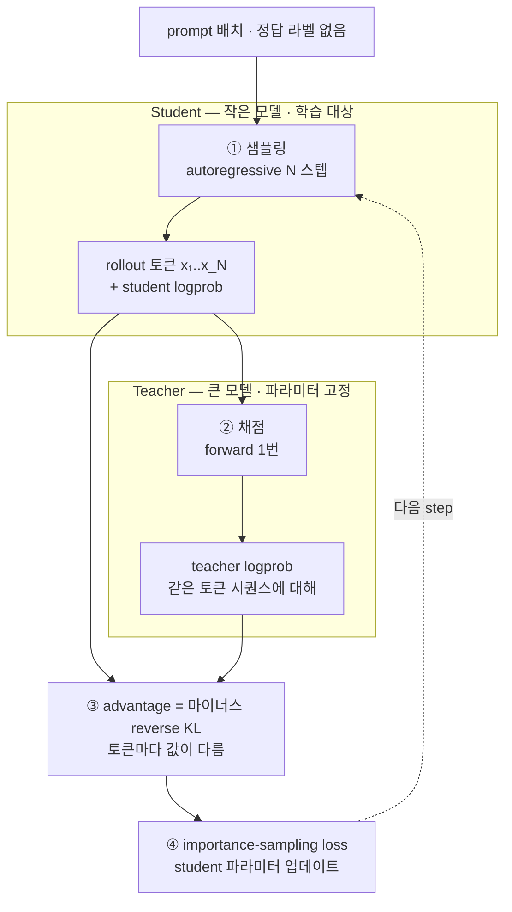

| 스텝 | 누가 | 비용 | 비고 |
|---|---|---|---|
| ① 샘플링 | student (작음) | 순차 N forward — **전체 비용의 지배항** | student logprob이 여기서 **덤으로** 나온다 (추가 비용 0) |
| ② 채점 | teacher (큼) | **병렬 1 forward** | teacher는 **학습되지 않는다** — backward 불필요 |
| ③ advantage | — | 뺄셈 | 새 모델·새 loss 없음 |
| ④ 업데이트 | student | 기존 RL과 동일 | |

- **teacher는 backward가 없다.** forward만 돌면 되므로 optimizer state·gradient 메모리가 필요 없고, 별도 서버에 띄워 여러 학습 job이 공유할 수도 있다.
- ①에서 나온 student logprob을 ③에서 재사용하므로 **student를 두 번 돌리지 않는다.**

#### 비용 구조 네 가지

| #   | 이유                           | 설명                                                                        |
| --- | ---------------------------- | ------------------------------------------------------------------------- |
| 1   | **teacher는 forward pass 1번** | 비싼 **샘플링**(순차 N 스텝)은 작은 student가 하고, 큰 teacher는 이미 뽑힌 token의 logprob만 **병렬 1회**로 계산 |
| 2   | **partial rollout 가능**       | reward가 시퀀스 끝에 걸려 있지 않으니, 끝까지 안 뽑아도 그 지점까지의 모든 token이 학습 신호를 만든다          |
| 3   | **별도 reward model이 없다**      | instruction-tuned open-weight 모델이면 무엇이든 `compute_logprobs`만으로 teacher가 된다 |
| 4   | **작은 batch로도 된다**            | episode당 O(N) bits를 주니 gradient 노이즈가 작다. sparse RL은 큰 batch로 노이즈를 눌러야 한다  |

> RL은 episode가 끝나야 reward가 나온다 — OPD는 그 제약이 없다.

#### #2 상세 — partial rollout이란 무엇이고 왜 필요한가

**무엇인가**: rollout을 **종료 토큰까지 뽑지 않고 중간에서 끊는 것**. 예컨대 4,000토큰까지 갈 답변을 512토큰에서 중단한다.

```
RL — 중간에 끊으면 신호 0
  x₁ x₂ … x₅₁₂ ✂ ────────────  최종 답이 없다 → 정오답 판정 불가
  └────────────┘                  이 512 토큰의 샘플링 비용은 전부 버려진다

OPD — 끊어도 신호 512개
  x₁ x₂ … x₅₁₂ ✂
   ↓  ↓      ↓                    각 토큰이 이미 자기 몫의 KL을 받았다
   r₁ r₂ …  r₅₁₂                  → 512개의 온전한 학습 신호
```

**왜 가능한가**: OPD의 reward는 **각 토큰에서 그 자리로 완결**된다(§4.1 discount 0). 뒤를 봐야 앞의 값이 정해지는 구조가 아니다. 반면 RLVR의 reward는 최종 답을 채점해야 나오므로, 끊긴 rollout은 **판정 자체가 불가능**하고 학습 신호가 0이다 — 샘플링에 쓴 compute가 통째로 버려진다.

**왜 필요한가** — 네 가지 실익:

| | 내용 |
|---|---|
| **① 지배항을 직접 줄인다** | 위 표에서 봤듯 비용의 대부분은 ①단계 샘플링(순차 N 스텝)이다. N을 절반으로 줄이면 비용도 대략 절반이 된다. 다른 최적화와 달리 **가장 비싼 축을 직접 자르는** 수단이다. |
| **② straggler 제거** | rollout 길이는 분산이 크다. RL은 배치에서 **가장 긴 rollout이 끝날 때까지** 나머지 GPU가 대기한다. partial rollout은 토큰 예산에서 일괄로 자르면 되므로 이 대기가 사라진다. |
| **③ 짧은 context로 학습 가능** | RL은 **평가 시 context 길이에 맞춰 학습해야** 한다 — 그래야 정책이 길이 제한을 익히고 format penalty를 피한다. distillation은 "끝까지 뽑은 궤적"과 "계속 이어질 궤적" 사이에 reward 단절이 없어서 **짧은 context로도 제대로 학습된다.** attention·KV 메모리가 함께 줄어든다. (§5.5 (a)의 50~100배 compute 절감에 이 항목이 포함된다) |
| **④ 길이 초과 처리 로직이 불필요** | RL은 잘린(overlong) rollout을 어떻게 처리할지 별도 설계가 필요하다(DAPO의 overlong reward shaping 등). OPD에는 "잘린 rollout"이라는 특수 케이스 자체가 없다. |

> 요약하면 partial rollout은 **dense 신호가 준 부수 효과**다.
> 신호가 토큰마다 완결되어 있으므로 시퀀스를 언제 끊든 손실이 없고, 그래서 가장 비싼 자원(샘플링 길이)을 자유롭게 조절할 수 있다.


---

## 5. Experiments

### 5.1 Dataset

|             | 실험 ① 수학 추론                             | 실험 ② Personalization                          |
| ----------- | -------------------------------------- | --------------------------------------------- |
| Student 초기화 | Qwen3-8B-Base                          | Qwen3-8B (이미 RL post-trained)                 |
| Teacher     | Qwen3-32B (Qwen3-8B이 더 좋기도 함)          | **mid-training 이전의 자기 자신 (Qwen3-8B)**         |
| 학습 데이터      | OpenThoughts-3 (teacher 생성 수학 추론 400k) | mid-train: 사내 문서 / OPD: **Tulu3 chat prompt** |
| 평가          | AIME'24, GPQA-Diamond                  | 사내 QA eval, IF-eval                           |

### 5.2 Implementation Details

#### 파이프라인 구조 — 순차가 아니라 **분기**다

§5.3 표의 `+` 기호는 **누적이 아니다.** RL을 돌린 뒤 그 위에 OPD를 얹은 것이 아니라, **같은 SFT 체크포인트에서 갈라지는 세 가지 대안**이다. 원문 표현: *"as an **alternative to** off-policy distillation or RL, we run on-policy distillation."*

```
Qwen3-8B-Base
      │
      ▼  ① off-policy distillation (SFT)
         OpenThoughts-3 400k  →  55.0% (Qwen3 표) / 60% (블로그 재현)
      │
      ├──────────────┬──────────────────┐
      ▼ ②-A          ▼ ②-B              ▼ ②-C
   SFT 계속 확대       Reinforcement       On-policy
   (2M prompt)        learning            distillation
   ~70% (외삽)         67.6%              74.4%
                      17,920 GPU h        1,800 GPU h
```

- 표의 `+`는 "이 초기화 **위에** 무엇을 얹었나"를 뜻한다. **마지막 한 단계만 바꾼 통제 비교**다.
- ②-A는 실측이 아니라 log-linear 곡선의 **외삽**이다 (§5.3 비용 회계).

#### 단계별 데이터 형식 — 한 샘플에 무엇이 들어 있나

**① off-policy distillation (SFT) — OpenThoughts-3**

```jsonc
{ "prompt":   "Evaluate the limit: lim_{x→∞} ...",
  "response": "<think> 먼저 유리화하면 ... </think> 따라서 답은 2/3" }
```

- prompt + **완성된 추론 전체**. OpenThoughts-3의 response는 **QwQ-32B가 생성**한 것이다 (사람이 쓴 것이 아니다).
- 400k 쌍으로 full fine-tuning → AIME'24 **60%**.

**②-B Reinforcement learning — (문제, 검증 가능한 정답) 쌍**

```jsonc
{ "problem": "Evaluate the limit: ...", "answer": "2/3" }     // 수학: 최종 답만
{ "problem": "...", "tests": ["assert f(1)==2", ...] }        // 코드: 단위 테스트
```

- **추론 과정이 없다.** verifier가 student rollout의 최종 답을 `answer`와 대조해 0/1을 매긴다.
- **주의**: 67.6% 행은 블로그가 직접 돌린 것이 아니라 **Qwen3 Technical Report Table 21에서 인용한 수치**다. Qwen3가 어떤 RL 데이터셋을 썼는지 블로그는 밝히지 않는다.
- 블로그가 **직접 돌린** RL은 §5.5 (a)의 비교 실험이고, 거기서는 **DeepMath**를 LoRA rank 128로 학습했다.

**②-C On-policy distillation — prompt만**

```jsonc
{ "prompt": "Evaluate the limit: ..." }     // 이게 전부
```

- 정답도, 추론 과정도 필요 없다. 라벨은 teacher가 **실시간으로** 만든다 (§4.2 "1단계에서 실제로 필요한 것").
- **77k prompts × 4 samples/prompt = 약 150 step**
- **teacher = Qwen3-8B** — 32B가 아니라 **student와 같은 8B의 instruct 버전**이다. 성능이 약간 더 좋아서 선택했고, compute 비교에서는 보수적으로 32B FLOPs로 계산했다.
- prompt 출처는 원문에 **명시되어 있지 않다.** 다만 §5.5 (b)가 "the dataset에서 무작위로 고른 prompt 하나"라고 쓴 것으로 보아 **같은 수학 prompt 풀(OpenThoughts-3의 prompt 부분)** 로 보인다. response는 쓰지 않고 **prompt만 재사용**하는 셈이다.

| | 초기화 | 데이터 형식 | 필요한 라벨 | 규모 |
|---|---|---|---|---|
| **① SFT** | Qwen3-8B-Base | prompt + **전체 추론 응답** | teacher 생성 응답 | 400k prompt |
| **②-B RL** | ①의 400k 체크포인트 | prompt + **최종 정답 키** | answer key | Qwen3 미공개 / 블로그 재현은 DeepMath |
| **②-C OPD** | ①의 400k 체크포인트 | **prompt만** | **없음** | 77k prompt × 4 samples |

#### 그 외 설정

- 공통 초기화: OpenThoughts-3 400k SFT (AIME'24 **60%**)
- LoRA 실험: rank 32 (personalization에서는 rank 32~256)
- 구현: Tinker Cookbook, `loss_fn="importance_sampling"`
- **모델 갱신 (2026.06)**: Tinker에서 Qwen3-32B / Qwen3-8B-Base가 퇴역해, cookbook 레시피는 **Qwen3.5-9B-Base(student) / Qwen3.5-9B(teacher)** 로 갱신되었다. 재현 시 참고.

### 5.3 Main Results — 실험 ① 수학 추론

Qwen3 Technical Report Table 21 — **같은 SFT 초기화 위에 마지막 단계만 바꾼** 비교.

| 방법                            | AIME'24   | GPQA-Diamond | GPU hours |
| ----------------------------- | --------- | ------------ | --------- |
| off-policy distillation (SFT) | 55.0%     | 55.6%        | 미보고       |
| + Reinforcement learning      | 67.6%     | 61.3%        | 17,920    |
| **+ On-policy distillation**  | **74.4%** | **63.3%**    | **1,800** |

> **RL의 약 1/10 비용으로 더 높은 점수.** 이 결과가 저자들이 재현에 나선 계기다.

#### 비용 회계 — 무엇을 비용에 넣느냐에 따라 9~30배 싸다

**던지는 질문은 하나다: "AIME'24를 60% → 70%로 올리는 데 얼마가 드나?"**

**비교 대상은 off-policy distillation(SFT) 하나뿐이다.** 두 방법의 도달 점수를 **~70%로 맞춰 놓고 비용만 비교**하는 구조다(iso-performance 비교). §5.2의 분기 그림에서 **②-A(SFT 계속 확대)와 ②-C(OPD)** 두 갈래에 각각 가격표를 붙이는 셈이고, 공통 접두사인 SFT-400K(60%)는 **양쪽 모두가 이미 지불한 비용**이라 비교에서 빠진다.

> RL(②-B)은 이 회계에 **들어가지 않는다.** Qwen3 리포트가 GPU hours만 보고하고 FLOPs를 밝히지 않아 같은 축에 올릴 수 없다. RL과의 비교는 §5.3 본 표(약 1/10 비용)와 §5.5 (a)에서 따로 다룬다.

| 방법                         | AIME'24 | Teacher FLOPs  | Student FLOPs  | CE vs SFT-2M |
| -------------------------- | ------- | -------------- | -------------- | ------------ |
| 초기화: SFT-400K              | 60%     | 8.5 × 10²⁰     | 3.8 × 10²⁰     | –            |
| SFT-2M (외삽)                | ~70%    | 3.4 × 10²¹     | 1.5 × 10²¹     | 1×           |
| **On-policy distillation** | **70%** | **8.4 × 10¹⁹** | **8.2 × 10¹⁹** | **9–30×**    |

**표 읽는 법**

- **Teacher / Student 열이 나뉜 이유**: 두 방법에서 teacher가 하는 일이 전혀 다르기 때문이다.

| | teacher가 하는 일 | student가 하는 일 |
|---|---|---|
| **SFT-2M** | 데이터셋 **생성** — 2M prompt × 응답 전체를 순차 샘플링 (§4.4) | 그 데이터로 forward/backward |
| **OPD** | **채점** — 이미 뽑힌 토큰의 logprob, forward 1회 | 샘플링(77k × 4) + 학습 |

- **CE = cost efficiency**, SFT-2M을 1×로 놓은 상대 배수.
- **SFT-2M 행은 실측이 아니라 외삽**이다 — 400k에서 60%인 log-linear 곡선을 연장해 70% 도달점을 2M prompt로 추정했다.

**숫자 감각**: OPD 단계 전체(teacher + student = 1.66 × 10²⁰)는 **초기화에 쓴 SFT-400K(1.23 × 10²¹)보다도 7배 이상 싸다.** 마지막 10%p를 올리는 데 처음 60%를 만드는 것보다 적은 compute를 쓴다.

#### 9× / 18× / 30× 는 어디서 나오나

배수가 범위인 이유는 **어느 항목을 비용에 넣을지 선택지가 있기 때문**이다. 실제 계산은 단순한 나눗셈이다.

```
OPD 총 FLOPs = 8.4×10¹⁹ (teacher 채점) + 8.2×10¹⁹ (student) = 1.66×10²⁰

┌ 30× ─ SFT의 teacher 생성비까지 전부 계상
│        (3.4×10²¹ + 1.5×10²¹) / 1.66×10²⁰ ≈ 29.5×
│
├ 18× ─ 같은 비교를 FLOPs가 아니라 실제 GPU hours로
│        (채점은 병렬화가 잘 돼 FLOPs보다 시간이 덜 든다)
│
└  9× ─ SFT 데이터셋이 이미 있다고 치고 teacher 생성비를 0으로
         1.5×10²¹ / 1.66×10²⁰ ≈ 9.0×
```

| 배수       | 회계 기준                                                                                      | 언제 이 숫자를 쓰나                               |
| -------- | ------------------------------------------------------------------------------------------ | ----------------------------------------- |
| **9×**   | SFT 데이터셋이 이미 있다고 칠 때. off-policy의 teacher 생성 비용은 **안 세고**, OPD의 teacher logprob 비용은 **센다** | OpenThoughts-3처럼 **공개 데이터셋이 이미 존재**하는 태스크 |
| **≈18×** | GPU hours 기준. teacher logprob 계산은 병렬화가 잘 돼서 FLOPs 수치보다 실제 시간이 덜 든다                         | **실무 체감 비용** (청구서에 찍히는 값)                 |
| **30×**  | 새 태스크라 데이터셋부터 만들 때. teacher 샘플링 비용까지 off-policy 쪽에 온전히 계상                                  | **사내 도메인 등 신규 태스크**                       |

> **9×는 OPD에 가장 불리한 회계다.** 상대에게는 데이터 생성비를 면제해 주고 자기는 teacher 비용을 전액 지불하는 조건인데도 9배가 나온다. 즉 **9배가 하한**이고, 조건이 공정해질수록 30배 쪽으로 간다.

> **FLOPs 회계는 OPD에 불리하게 치우친다.** FLOPs는 "연산량"만 세고 그 연산이 **순차인지 병렬인지**를 구분하지 못한다. SFT의 teacher 생성(순차 N 스텝)과 OPD의 teacher 채점(병렬 1회)이 FLOPs로는 비슷하게 계산되지만 실제 시간은 크게 다르다 (§4.4 참조). 9× → 18×의 차이가 정확히 이 보정이다.

- off-policy distillation은 400k prompt에서 60%, **log-linear scaling**을 따른다. 외삽하면 70% 도달에 약 **2M prompt** 필요.
- OPD는 **150 step (77k prompts)** 만에 70% 도달 — 약 **26배 적은 prompt**로 같은 지점에 간다.

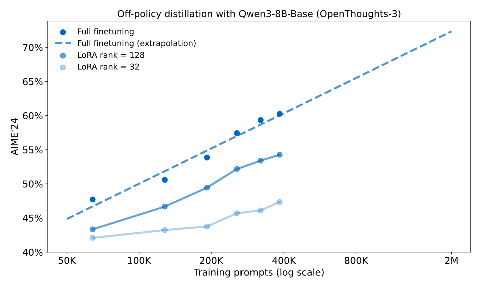
*off-policy distillation(SFT) 중 AIME'24 추이. 초기 50~100K prompt 이후로는 **예측 가능한 log-linear 곡선**을 따른다 — 초반 이득은 싸고 후반 이득은 비싸다. 고배치 대규모 SFT에서 LoRA가 full FT에 뒤처지는 것도 여기서 보인다("LoRA Without Regret"의 예측과 일치).*

#### LoRA 보너스

| 조건 | full FT 대비 격차 |
|---|---|
| 대용량·고배치 SFT 후 LoRA (rank 32) | **−13%** |
| + On-policy distillation 후 | **−6%** |

**격차가 절반 이하로 줄어든다.** 이것이 왜 "보너스"인지 이해하려면 세 단계를 나눠 봐야 한다.

**① LoRA는 무엇을 절약하나**

전체 파라미터 W를 갱신하는 대신, 저랭크 행렬 두 개(A·B)만 학습해 `W + BA` 로 쓴다. rank 32면 학습 대상이 원본의 1% 미만이다.

| | full fine-tuning | LoRA (rank 32) |
|---|---|---|
| 학습 파라미터 | 전체 | **1% 미만** |
| optimizer state 메모리 | 전체 × 2~3배 | 어댑터분만 |
| 체크포인트 크기 | 모델 전체 (수십 GB) | **수십 MB** |
| 배포 | 도메인마다 모델 하나 | **base 공유 + 어댑터 스와핑** |

**② 그런데 대규모 SFT에서는 LoRA가 뒤처진다**

- **용량 병목**: 400k~2M 시퀀스의 내용을 파라미터에 밀어 넣어야 하는데, rank r이 흡수할 수 있는 정보량에 한계가 있다 ("LoRA Learns Less and Forgets Less", Biderman et al. 2024).
- **고배치에서 특히 나쁘다**: 같은 팀의 이전 글 "LoRA Without Regret"이 예측한 현상이고, 위 SFT 스케일링 그림에서 실제로 관측된다.

**③ OPD 단계에서는 그 병목이 사라진다**

- **원문이 드는 이유**: OPD는 episode당 O(N) bits를 주므로 gradient 노이즈가 작고 **작은 batch로도 학습된다**(§4.4 #4). LoRA가 불리해지는 조건(대용량·고배치) 자체를 피해 간다.
- **덧붙이면**: OPD는 새 지식을 채워 넣는 단계가 아니라 이미 SFT로 배운 모델의 **행동을 다듬는** 단계다. 요구되는 파라미터 변화량이 작으니 저랭크로 충분하다.

**왜 실무적으로 중요한가 — 절감이 이중으로 겹친다**

| 축 | 절감 |
|---|---|
| 학습 compute | SFT 대비 **9~30배** |
| 메모리·체크포인트·서빙 | LoRA를 **쓸 수 있게 되어** 추가 절감 |

특히 §5.4의 personalization처럼 **도메인·고객사마다 모델을 따로 두는** 상황에서 어댑터 스와핑은 운영 비용을 크게 바꾼다.

> **주의 — §5.4의 LoRA 결과와 혼동하지 말 것.**
> 여기서 말하는 것은 **"성능 격차가 줄어든다"** 이지 **"LoRA가 파괴적 망각을 막는다"** 가 아니다.
> §5.4에서는 rank 32~256의 LoRA로 mid-training을 제약해도 **IF-eval 붕괴를 막지 못했다.** 두 결과는 서로 다른 질문에 대한 답이다.

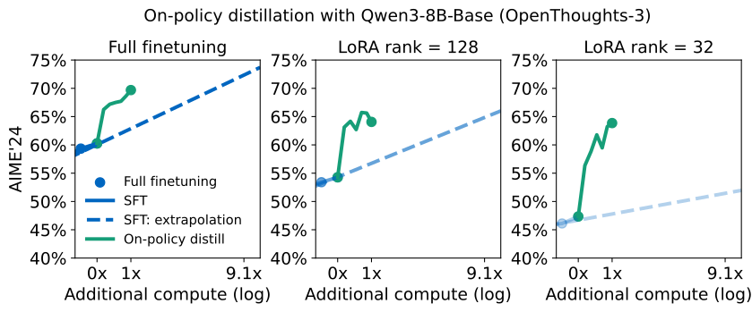
*on-policy distillation 중 AIME'24 추이 (x축은 추가 학습 FLOPs). SFT보다 훨씬 compute-efficient하며, **특히 LoRA 모델에서 격차가 크다** — rank 32에서 SFT 직후에는 full FT 대비 13% 뒤지지만 OPD 이후에는 6%까지 좁혀진다.*

### 5.4 Main Results — 실험 ② Personalization

**목표**: 도메인 지식(사내 문서) + post-train된 행동(instruction following)을 **둘 다** 가진 어시스턴트.

#### 문제: 파괴적 망각 (catastrophic forgetting)

| 모델 | 사내 QA | IF-eval |
|---|---|---|
| 원본 Qwen3-8B | 18% | 85% |
| + mid-train (문서 100%) | 43% | **45%** |
| + mid-train (문서 70% / chat 30%) | 36% | **79%** |
| **+ mid-train (70%) + On-policy distillation** | **41%** | **83%** |

- **어떤 혼합 비율로도 IF-eval 원래 성능을 유지하지 못했다.** background chat 데이터를 섞어도 마찬가지.

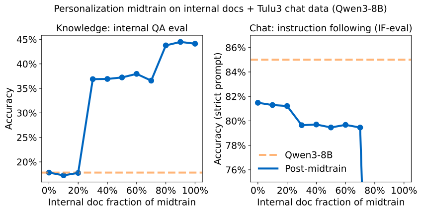
*mid-training의 사내 문서 : background chat 비율 sweep. chat 데이터를 조금 섞으면 파국적 회귀는 막지만, **어떤 가중치도 원래 IF-eval 성능을 유지하지 못한다** (chat 100%여도 마찬가지).*

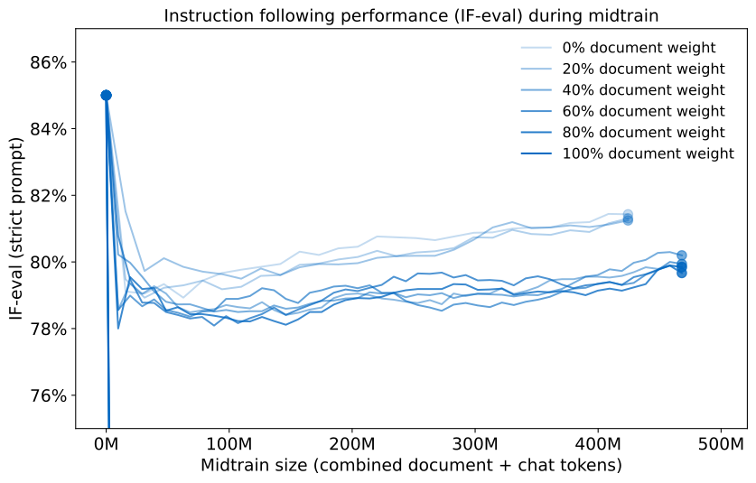
*모든 혼합 비율에서 mid-training 도중 IF-eval이 하락한다. linear LR을 쓰면 LR이 감쇠하면서 열화가 평탄해지고 조금 회복되지만, **끝까지 완전히 회복되지는 않는다.***

- **LoRA(rank 32~256)로 업데이트를 제약해도 실패** — "LoRA Learns Less and Forgets Less"를 재확인. 지식은 덜 배우면서 post-training 행동은 여전히 잊는다.

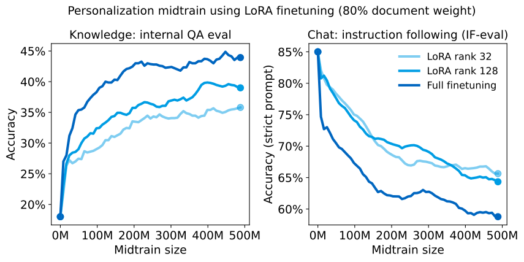
*post-train된 Qwen3-8B 위에 LoRA로 personalization mid-train을 한 경우. **지식은 덜 배우면서(learns less) 원래의 post-training 행동은 여전히 잊는다(still forgets).***

#### 해법: OPD로 행동 복구 — teacher는 과거의 자기 자신

- mid-training이 끝난 모델에, **mid-training 이전 버전(Qwen3-8B)을 teacher로** OPD.
- prompt는 **Tulu3**만 사용. **사내 문서는 전혀 쓰지 않는다.**
- 결과: IF-eval **79% → 83%** (원본 85%에 근접) 하면서 사내 QA는 **36% → 41%** 로 오히려 상승.

> 언어모델 자신을 reward model로 쓰는 셈이다 — 고확률 행동이 곧 보상.

### 5.5 Ablation / 추가 분석

세 개의 분석은 각각 **다른 변수 하나를 고립**시킨다. 무엇을 통제하고 무엇을 바꿨는지 먼저 정리한다.

|         | 묻는 질문                             | 통제한 것 (동일하게 맞춘 것)                                                 | 바꾼 것 (비교 축)                                   |
| ------- | --------------------------------- | ----------------------------------------------------------------- | --------------------------------------------- |
| **(a)** | 같은 정책을 얻는 데 RL과 **OPD** 중 무엇이 빠른가 | 초기화(Qwen3-8B-Base), 아키텍처(LoRA rank 128), **도달 목표 = RL이 찾아낸 그 정책** | 학습 방식 (RL vs OPD)                             |
| **(b)** | prompt를 재사용해도 되는가                 | 학습량(batch당 256 samples), teacher                                  | **prompt 다양성** (64개/batch → 1개/batch → 전체 1개) |
| **(c)** | "on-policy 데이터"면 SFT도 괜찮은가        | 데이터가 **KL=0**(자기 자신의 샘플), 학습률                                     | 학습 방식 (자기 샘플 SFT vs OPD)                      |

#### (a) RL과의 직접 비교 — dense supervision의 효율

**설계 — self-distillation으로 능력 격차를 0으로 만든다**

1. **Qwen3-8B-Base**에서 출발 (추가 SFT 없음)
2. **DeepMath**로 RL 학습 — "LoRA Without Regret"과 동일한 절차, **LoRA rank 128**. 이렇게 얻은 모델이 ③의 **teacher**가 된다
3. 그 RL 학습된 모델을 **같은 base 모델(①)에 on-policy distill**

③의 distillation은 **on-policy distillation(OPD)** 이다 — 원문 표현 그대로 *"on-policy distill … back into the base model"*. 즉 이 절의 "distillation"은 전부 OPD를 가리킨다.

이 설계의 핵심은 **teacher가 student와 같은 뿌리에서 나왔다**는 점이다(self-distillation). 능력 격차·아키텍처 차이·초기화 차이가 전부 0이므로, 남는 변수는 **"이미 존재하는 정책을 습득하는 속도"** 하나뿐이다. RL이 그 정책을 **찾는 데** 든 비용과, OPD가 그것을 **배우는 데** 드는 비용을 직접 뺄 수 있다.

| 항목 | 결과 |
|---|---|
| 동등 성능 도달 속도 | RL 대비 **약 7~10배 빠름** (동일 아키텍처 기준) |
| 구체 수치 | reverse KL이 0 근처로 떨어지고 AIME가 회복되는 데 **10 step 미만** vs RL **70 step** |
| 총 compute 환산 | **50~100배 절감** (문맥 길이·batch size 요구 차이 반영) |

**7~10배(step)가 50~100배(compute)로 벌어지는 이유** — step 수 외에 두 축이 더 싸다.

| 축 | RL | OPD |
|---|---|---|
| **문맥 길이** | **평가 시 context 길이에 맞춰** 학습해야 한다. 그래야 정책이 길이 제한을 익히고 format penalty를 피한다 | 끝난 궤적과 이어질 궤적 사이에 **reward 단절이 없어서** 짧은 context로도 학습된다 (§4.4 partial rollout) |
| **batch size** | 노이즈를 누르려면 크게 | episode당 bits가 많아 **작아도 된다** |

> **단서**: batch size 이점은 **SFT 초기화가 강할 때**, 즉 teacher 정책이 student 정책의 support 안에 있을 때 성립한다. §5.3의 "distillation for reasoning"처럼 그렇지 않은 경우에는 **훨씬 큰 batch가 필요하다.**

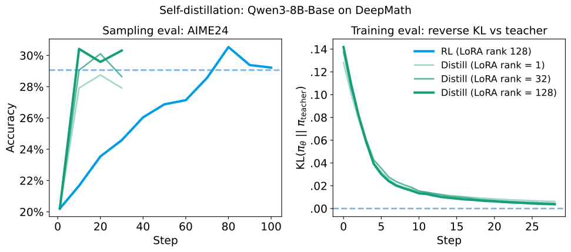
*같은 초기화(Qwen3-8B-Base)에서 출발했을 때, on-policy distillation은 RL이 찾아낸 정책을 **약 7~10배 적은 gradient step**으로 학습한다 (compute 기준 50~100배). reverse KL이 0 근처로 떨어지고 AIME 점수가 회복되는 데 **10 step 미만** — RL은 같은 수준에 70 step이 걸렸다.*

> **해석**: RL은 rollout search로 전략을 탐색한다. OPD는 중간 전략들을 건너뛰고 **최종 의미 전략만** 직접 배운다.

#### (b) 데이터 재사용 — 단일 prompt 실험

**동기**: 실무에서 학습 prompt를 대량으로 모으는 일은 어렵고 오래 걸린다. **같은 prompt를 여러 번 써도 되는가?**

**설계 — prompt 다양성만 줄여 나가는 3개 arm**

| arm | batch 구성 | prompt 다양성 |
|---|---|---|
| 기본 설정 | 64 prompts × 4 samples | 높음 |
| 1 prompt / batch | 1 prompt × 256 samples | batch 안에서 하나 |
| **1 prompt total** | **데이터셋 전체가 prompt 1개** | **최소** |

- 세 arm 모두 **batch당 256 samples로 학습량을 맞췄다** — 바뀌는 것은 prompt 다양성뿐이다.
- 단일 prompt는 무작위로 골랐다: *"Evaluate the limit: lim_{x→∞} √x (∛(x+1) − ∛(x−1))"*
- 그 prompt 하나로 **20 step 연속** 학습, step당 **256 rollout** → **총 5,120 시퀀스**. 보통이라면 확실히 과적합할 조건이다.
- 결과: **teacher의 AIME'24 성능에 근접**

**RL과의 대비가 이 실험의 요점**

| | 같은 prompt를 반복하면 |
|---|---|
| **RL** | 최종 **답을 암기**한다 (특히 큰 모델에서). 신호가 "정답 여부" 하나뿐이라 외울 것이 답밖에 없다 |
| **OPD** | reverse KL 최소화 = teacher의 **분포 전체를 근사**하는 것이라, 같은 prompt에서도 매번 다른 rollout에 대해 다른 신호가 나온다 |

> 반례도 있다 — Wang et al. 2025 *"RL for Reasoning in LLMs with One Training Example"* 은 일부 세팅에서 RL도 단일 예제로 학습되는 긍정적 결과를 보고했다.

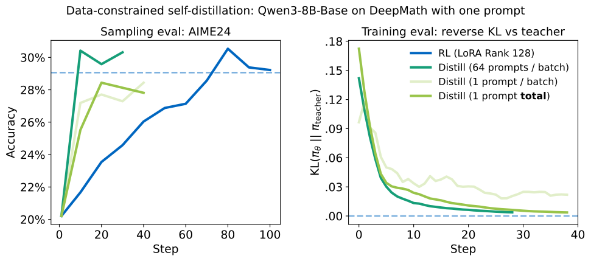
*단 하나의 학습 예제 위에서의 multi-epoch 학습만으로 teacher의 AIME'24 성능을 distill하기에 충분하다. (기본 설정은 batch당 64 prompt × 4 samples; 그림의 모든 방법은 batch당 256 samples. 오른쪽은 **training KL**이라 "1 prompt total"이 "1 prompt/batch"를 앞서는 것이 자연스럽다.)*

> 답을 외우는 것이 아니라 **분포를 배운다**는 증거. RL과 달리 데이터 재사용이 효과적으로 가능하다.

#### (c) continual learning 관점 — 자기 샘플 SFT는 왜 안 되나

**출발점 — 자연스러운 반론 하나를 검증한다**

§5.4에서 사내 문서 SFT가 IF-eval을 무너뜨리는 것을 봤다. 여기에 대한 상식적인 반론이 있다:

> *"그건 문서가 **다른 분포**라서 그런 거 아닌가? 모델 자신이 만든 데이터로 학습하면 분포가 같으니 아무 일도 안 일어나야 하지 않나?"*

이 반론은 실무적으로도 중요하다. 자기 샘플 재학습(self-training)은 데이터를 무한히 찍어낼 수 있는 매력적인 방법이기 때문이다. **(c)는 이 반론을 가장 유리한 조건에서 시험하고, 그럼에도 실패함을 보인다.**

**설계 — "이론상 아무 일도 일어나지 않아야 하는" 조건을 만든다**

1. **Tulu3 prompt**를 가져와
2. **Qwen3-32B가 직접 샘플링** — temperature 1.0, 필터링·best-of-n·후처리 **전혀 없음**
3. 따라서 이 데이터셋은 Qwen3-32B의 분포에서 **그대로 뽑은 표본**이다 → **KL이 정확히 0** ("truly on-policy" 데이터)
4. 이 데이터로 **Qwen3-32B 자신을 SFT**

> **왜 "아무 일도 안 일어나야" 하나 — 수식 없는 설명**
> SFT의 목적함수는 "데이터에 나온 토큰의 확률을 높여라"다. 그런데 그 데이터가 **모델 자신의 출력**이라면, 모델은 이미 그 토큰들에 자기가 매긴 만큼의 확률을 주고 있다.
> cross-entropy는 **예측 분포 = 데이터 분포**일 때 최소가 되므로, 지금 모델은 **이미 최소점에 서 있다.** 기댓값으로 gradient는 **0**이고, 모델은 제자리에 있어야 한다.

- 학습률은 §5.4 personalization과 **동일한 값**을 썼다 (실무 성능 기준으로 sweep한 값).

| 방식 | 이론상 KL | 실제 결과 |
|---|---|---|
| 모델 자신의 샘플로 SFT | 0 | **IF-eval 열화** — "0보다 큰 어떤 학습률에서도 성능이 떨어진다" |
| **OPD (teacher 고정)** | — | **항상 on-policy로 남는다** |

- linear LR 스케줄을 쓰면 forward KL / IF-eval의 **무한 회귀는 막지만**, LR이 0으로 감쇠하기 전까지 **성능을 되돌리지는 못한다.**
- 관련 배경: 같은 팀의 이전 글 *"Defeating Nondeterminism in LLM Inference"* 가 "진짜 KL=0 데이터"를 만드는 것의 어려움을 다룬다.

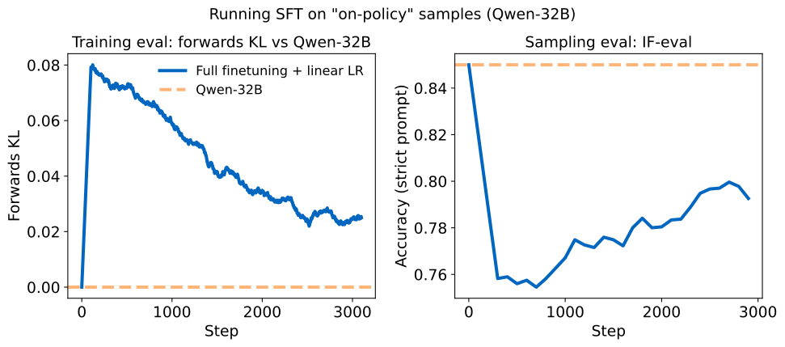
*Qwen3-32B가 **자기 자신의 샘플**(temperature 1.0, KL=0인 데이터)로 SFT하면 성능이 오히려 떨어진다. linear LR은 forward KL / IF-eval의 무한 회귀는 막지만, LR이 0으로 감쇠하기 전까지 성능을 **회복시키지는 못한다**.*

**왜 KL=0인데도 망가지나 — 세 단계로 무너진다**

**① 기댓값으로는 0, 유한 batch로는 0이 아니다**

주사위를 600번 굴려도 각 눈이 정확히 100번씩 나오지는 않는다. 마찬가지로 모델 분포에서 뽑은 유한한 배치는 **원래 분포와 미세하게 다르다.** 그 미세한 치우침이 **0이 아닌 gradient**를 만들고, 모델은 아주 조금 움직인다.

**② 한 번 움직이면 데이터가 낡는다**

데이터셋은 **움직이기 전의 모델(θ₀)** 이 만든 것이다. 모델이 θ₁로 움직인 순간, 그 데이터는 더 이상 "자기 샘플"이 아니다 — **평범한 off-policy 데이터가 된다.**

```
step 0   데이터 KL = 0   ← 이 순간에만 참
step 1   모델이 조금 움직임 → 데이터는 이제 살짝 off-policy
step 2   더 움직임         → 더 off-policy
  ⋮                          (고정 데이터셋은 따라오지 못한다)
```

**③ 그 다음은 §2 통찰 1의 재현**

off-policy가 된 이상 compounding error가 그대로 작동한다. 자기 회귀 생성에서 스텝마다의 미세한 편차가 **곱해지며 누적**되고, 긴 시퀀스일수록 격차가 커진다.

- 하필 **IF-eval이 먼저 무너지는** 이유: instruction-following은 RL로 학습된 행동이고, RL은 원본 모델의 **작은 subnetwork만** 건드린다는 선행 연구가 있다 (Mukherjee et al. 2025, §5.4에서 인용). 얇게 얹힌 행동이라 작은 드리프트에도 취약하다.

> **이 실험이 정교화하는 개념: on-policy는 데이터의 속성이 아니라 *관계*의 속성이다.**
> 어떤 데이터셋이 on-policy인지 아닌지는 그 파일만 봐서는 정해지지 않는다. **지금 학습 중인 모델과의 관계**로 정해진다.
> 그래서 "on-policy 데이터를 만들어 저장해 둔다"는 발상 자체가 성립하지 않는다 — 저장하는 순간부터 낡기 시작한다.

**OPD가 이 문제를 어떻게 피하나**

teacher가 **고정**되어 있고 데이터는 **매 스텝 student가 새로 만든다.** student가 어디로 움직이든 teacher는 **그 지점에서 다시 채점**하므로 on-policy성이 유지된다 — 데이터셋이 아니라 **함수**를 라벨러로 쓰기 때문에 가능하다.

| | 시퀀스 출처 | 라벨 출처 | step이 지나면 |
|---|---|---|---|
| **자기 샘플 SFT** | θ₀가 만들어 **저장해 둔 데이터셋** | 그 데이터의 다음 토큰 | **둘 다 낡는다** |
| **OPD** | **매 스텝 현재 student가 새로 생성** | 고정 teacher가 **그 자리에서 채점** | **항상 최신** |

> **"OPD도 teacher가 고정인데 왜 안 낡나?"** — 고정된 것이 **샘플이 아니라 모델**이기 때문이다.
> 저장된 샘플은 특정 시점의 **스냅샷**이라 모델이 움직이면 쓸모가 떨어지지만, teacher는 **어떤 상태를 물어봐도 답할 수 있는 함수**다. student가 어디로 가든 그 지점에서 다시 채점한다.
> 같은 이유가 §2 통찰 1(scheduled sampling이 왜 불충분한가)에도 그대로 적용된다.

> → **continual learning에 매우 유망한 도구.** 새 지식을 학습하는 단계와 행동을 복구하는 OPD 단계를 **번갈아 돌리는** 구성이 가능하다 (Cobbe et al. 2020의 Phasic Policy Gradient에서 탐색된 phase-alternating 발상).
> 참고: on-policy 학습(RL)이 off-policy보다 덜 잊는다는 결과가 선행 연구에 있다 (*"RL's Razor: Why Online RL Forgets Less"*, Shenfeld et al. 2025). 다만 RL은 **행동만 다듬을 뿐 새 지식을 가르치지 못해** 그 자체로는 continual learning에 충분하지 않다.

---

## 6. Key Takeaways

1. **OPD = dense × on-policy.** RL의 on-policy 관련성(자기 상태 분포에서 학습)과 distillation의 dense 신호(token당 피드백)를 한 칸에 모은다. 두 함정(compounding error, credit assignment 부재)을 **동시에** 회피한다.

2. **구현은 사실상 한 줄.** 새 loss가 필요 없다. per-token advantage를 `−reverse_kl`로 세팅하고 기존 RL의 importance-sampling loss를 그대로 호출한다. Tinker Cookbook 기준 **약 75줄**.

3. **비용 효율이 압도적.** AIME'24에서 **74.4% / 1,800 GPU h (OPD)** vs **67.6% / 17,920 GPU h (RL)** — 약 **1/10 비용에 더 높은 점수**. FLOPs 회계 기준으로도 **9~30배** 절감.

4. **벌점은 forking token에 몰린다.** 최종 오답 token이 아니라 **추론이 갈라지는 지점**에 큰 KL이 붙는다. sparse RL이 rollout 전체에 벌점 하나를 바르는 것과 대비되는, credit assignment의 실질적 해결.

5. **파괴적 망각의 실용적 해법.** 사내 문서 mid-training으로 IF-eval이 85%→79%(문서 100%면 45%)까지 무너진 모델을, **mid-training 이전의 자기 자신을 teacher로** 삼아 **83%까지 복구**하면서 사내 QA는 36%→41%로 오히려 상승. **복구 단계에 사내 문서를 전혀 쓰지 않는다**는 점이 핵심.

6. **분포를 배우지 답을 외우지 않는다.** 단일 prompt에 20 step × 256 rollout(5,120 시퀀스)만으로 teacher 성능에 근접 — RL과 달리 **데이터 재사용이 가능**하다. teacher가 고정되어 항상 on-policy로 남으므로 **continual learning 도구**로서도 유망하다.

7. **reverse KL은 unhackable하다.** 학습된 reward model과 달리 reward가 "teacher 분포와의 거리 그 자체"라 프록시와 목표가 원리적으로 일치한다. reward hacking이 성립하지 않는다.

---

## 참고: 후속 연구

→ [`opd_follow_up_research.md`](opd_follow_up_research.md) 참조 (2026.07 기준 후속 연구 정리 및 읽기 순서)
