# Rethinking On-Policy Distillation of Large Language Models: Phenomenology, Mechanism, and Recipe

> **Venue**: arXiv preprint (2026.04.15, v2)
> **Authors**: Yaxuan Li¹², Yuxin Zuo¹, Bingxiang He¹ (공동 1저자), Jinqian Zhang¹, Chaojun Xiao¹, Cheng Qian³, Tianyu Yu¹, Huan-ang Gao¹, Wenkai Yang⁴, Zhiyuan Liu¹, Ning Ding¹
> ¹Tsinghua University · ²ShanghaiTech University · ³UIUC · ⁴Renmin University of China
> **arXiv**: [2604.13016v2](https://arxiv.org/abs/2604.13016)
> **Code**: https://github.com/thunlp/OPD

**한 줄 정의**: OPD는 "teacher가 좋으면 된다"가 아니다. **thinking pattern이 호환되고 + teacher가 student가 본 적 없는 능력을 실제로 갖고 있을 때만** 작동하며, 그 성공은 student가 방문한 상태의 **고확률 공유 토큰(확률질량의 97~99%)에 대한 점진적 정렬**이라는 단 하나의 시그니처로 나타난다.

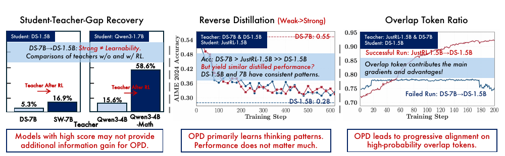

> **Figure 1** (원문 p.1) — 논문 전체 요약. **왼쪽** Student-Teacher-Gap Recovery: 같은 파이프라인 teacher(DS-7B **5.3%**, Qwen3-4B **15.6%**) vs RL post-trained teacher(SW-7B **16.9%**, Qwen3-4B-Math **58.6%**) → *"높은 점수가 OPD에 추가 정보 이득을 주지는 않는다."* **가운데** Reverse Distillation (Weak→Strong): 점수가 더 높은 DS-7B(0.55)로 distill해도 결과는 DS-1.5B(0.28)로 distill한 것과 같다 → *"OPD는 근본적으로 thinking pattern을 배운다. 성능은 별로 중요하지 않다."* **오른쪽** Overlap Token Ratio: 성공 run만 overlap이 상승한다 → *"OPD는 고확률 overlap 토큰에 대한 점진적 정렬로 이어진다."*

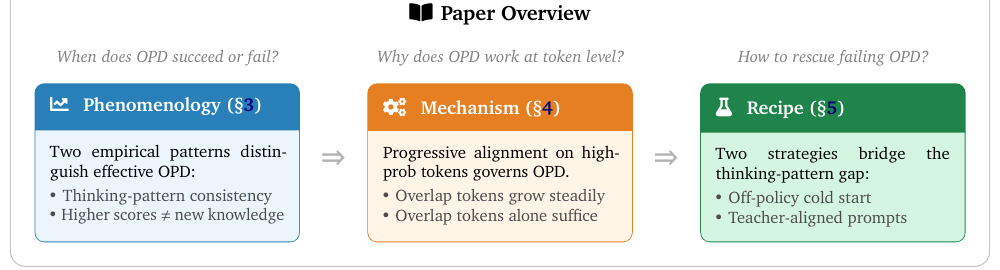

> **Paper Overview** (원문 p.2) — 논문의 3단 구성. **Phenomenology(§3)** 언제 성공/실패하는가 → **Mechanism(§4)** 토큰 수준에서 왜 작동하는가 → **Recipe(§5)** 실패한 OPD를 어떻게 살리는가. 아래 §5.2 / §5.3 / §5.4가 각각 이에 대응한다.

---

## 1. Background

### OPD 채택 현황과 다시 생각해야 할 이유

- OPD는 이미 산업 파이프라인의 표준 부품이다. **Qwen3**, **MiMo**, **GLM-5** 가 모두 post-training에 OPD를 넣고 유의미한 이득을 보고했고, **Thinking Machines Lab**(원문 블로그)이 Qwen3 레시피를 RL compute의 일부만으로 재현했다.
- 최근에는 **self-distillation**(단일 모델이 privileged information을 조건으로 자기 teacher 역할)까지 확장되며, continual self-improvement를 구동할 수 있다는 주장으로 이어졌다.

그런데 저자들이 관찰한 것은 **striking failure mode** 하나다 — **더 강한 teacher가 student를 전혀 개선하지 못하는데, 더 약한 teacher는 성공한다.** 이는 "teacher 점수가 높을수록 좋다"는 암묵적 전제와 정면 충돌하지만, 왜 teacher의 token-level 신호가 student 분포를 원하는 방향으로 움직이는지, 어떤 조건에서 실패하는지를 체계적으로 조사한 연구는 거의 없었다.

### 기존 방법·기존 이해의 한계

| 관점                                           | 기존 이해                                                                                                           | 이 논문이 지적하는 빈칸                                                      |
| -------------------------------------------- | --------------------------------------------------------------------------------------------------------------- | ------------------------------------------------------------------ |
| Off-policy distillation (SFT) → **OPD (통설)** | 고정 teacher 시퀀스의 exposure bias를, dense reward + on-policy로 회피                                                    | 진단은 원문 블로그와 동일. 그러나 **언제 실패하는지에 대한 조건이 없다**                        |
| Teacher 선정                                   | "open-weight면 아무거나"                                                                                             | 같은 계열 상위 모델은 **student 관점에서 분포적으로 구분 불가**할 수 있다                    |
| Capacity gap 연구                              | Cho & Hariharan(2019), Mirzadeh(2020), Busbridge(2025) 의 distillation scaling law, Li(2025)의 "learnability gap" | 전부 **off-policy KD 중심**. OPD에서의 capacity gap·distillability는 미탐구   |
| Reward 신뢰성                                   | reverse KL은 unhackable하므로 안전                                                                                    | **globally informative ≠ locally exploitable** — 신뢰성이 궤적 깊이에 따라 붕괴 |

---

## 2. Motivation

### 핵심 통찰 1: thinking pattern 호환성이 벤치마크 점수를 이긴다

student가 뽑은 prefix 위에서 teacher의 조건부 분포를 재는 것이 OPD다. 그렇다면 신호의 품질을 결정하는 것은 teacher의 **절대 실력**이 아니라, **student가 만드는 상태에서 teacher가 얼마나 자연스럽게 반응하는가**이다.

- Qwen3-1.7B-Base(base 모델)를 student로 두면, 같은 base에서 zero-RL로 만든 **Qwen3-4B-Base-GRPO**가 instruction-tuned **Qwen3-4B (Non-thinking)** 보다 초기 overlap ratio가 높다.
- 두 teacher의 벤치마크는 사실상 대등하다 — AMC 2023에서는 오히려 Non-thinking 쪽이 **0.700 vs 0.599** 로 크게 앞선다.
- 그럼에도 **student는 GRPO teacher 쪽에서 일관되게 더 잘 배운다.** 초기 thinking-pattern 불일치로 잃은 이득은 학습 후반에 overlap 곡선이 수렴해도 **회복되지 않는다.**

### 핵심 통찰 2: 높은 점수 ≠ 새로운 지식

thinking pattern이 맞고 점수도 높은데 OPD가 실패하는 경우가 남는다. 그 이유는 **teacher가 student에게 전달할 것이 실제로는 없기 때문**이다.

- 같은 데이터·같은 레시피로 학습된 모델 쌍은 규모가 달라도 **각자의 스케일에서 유사한 분포로 수렴**한다. 점수 차이는 "같은 데이터에 대한 fit 정도의 차이"일 뿐 **새 능력이 아니다.** 반대로 teacher에 **추가 RL post-training** 이 들어가면 그 능력은 OPD로 잘 전이된다 — 같은 base checkpoint에서 파생되어 thinking pattern은 이미 정렬되어 있고 차이는 순수하게 **새 능력**이기 때문이다.

이 두 조건을 동시에 검증하기 위해 저자들이 설계한 것이 **reverse distillation**(weak-to-strong)이다. 강한 student를 약한 teacher 쪽으로 되돌려 보내면, teacher가 "능력 공급자"가 아니라 **"분포 자석"** 임이 드러난다.

---

## 3. Contributions

1. **OPD의 성공/실패를 가르는 두 조건 규명** — (i) thinking-pattern consistency, (ii) higher scores ≠ new knowledge. 두 조건이 **함께** 충족될 때만 실질적 이득이 난다.
2. **reverse distillation을 통한 검증** — 같은 계열 1.5B/7B teacher가 student 관점에서 **분포적으로 구분 불가**함을 보이고, OPD의 학습 역학이 teacher 벤치마크 성능과 **완전히 분리(decoupled)** 될 수 있음을 입증.
3. **토큰 수준 메커니즘 규명** — 성공한 OPD는 student가 방문한 상태의 고확률 top-k 토큰에 대한 **점진적 정렬**(overlap ratio 72% → 91% 이상)로 특징지어지며, 그 공유 집합이 확률질량의 **97~99%** 를 차지한다. **overlap 토큰만 최적화해도 표준 OPD와 동등**함을 ablation으로 확인. 또한 sampled-token / full-vocabulary / top-k 세 granularity를 통일 표기로 정리하고 **sampled-token만으로 이미 충분**함을 보임(단 Top-1은 붕괴).
4. **실패한 OPD의 복구 레시피 2종** — off-policy cold start(teacher rollout SFT warmup), teacher-aligned prompt selection(template·content 정렬). 둘 다 자연 성공 run과 **동일한 dynamic signature**를 복원한다.
5. **dense supervision의 비용 규명** — reward 품질이 **궤적 깊이에 따라 체계적으로 열화**하고, 불안정성이 **후반 토큰에서 시작해 앞으로 전파**됨을 보임. 나아가 globally informative한 reward가 locally exploitable하지 않을 수 있음을 제시하며 **long-horizon distillation 확장 가능성에 의문**을 던짐.

---

## 4. Method / Analysis

이 논문은 새 알고리즘이 아니라 **분석** 논문이다. 기여의 핵심은 "무엇을 측정할 것인가"를 정의한 데 있다.

### 4.1 OPD 목적함수와 세 가지 supervision granularity

prompt x에서 student π_θ가 응답 ŷ = (ŷ_1, ..., ŷ_T)를 뽑고, 두 모델이 **student가 만든 prefix ŷ_<t** 위에서 다음 토큰 분포를 낸다: p_t(v) = π_θ(v | x, ŷ_<t), q_t(v) = π_T(v | x, ŷ_<t).

```
sequence-level 목적 및 정확히 동치인 autoregressive 분해:
L_OPD(θ) = E_{x ~ D_x} [ D_KL( π_θ(·|x) || π_T(·|x) ) ]
         = E_{x ~ D_x, ŷ ~ π_θ(·|x)} [ Σ_{t=1..T} D_KL( p_t || q_t ) ]

Top-k 변형의 재정규화 (S_t = TopK(p_t, k)), q̄_t 도 동일:
p̄_t(v) = p_t(v)·1[v ∈ S_t] / Σ_{u ∈ S_t} p_t(u)
L_OPD^top-k(θ) = E [ Σ_{t=1..T} D_KL( p̄_t || q̄_t ) ]
```

구현은 이 per-token reverse KL을 **어떻게 계산하느냐**에서 갈린다.

| granularity | 계산 | 특성 |
|---|---|---|
| **Sampled-token OPD** | `ℓ_t = log p_t(ŷ_t) − log q_t(ŷ_t)` — student가 실제로 뽑은 토큰 1개 | 원문 블로그·Qwen3·MiMo가 쓰는 방식. token-level KL의 **unbiased 단일 샘플 추정량** |
| **Full-Vocabulary OPD** | 전 vocab에 대해 D_KL(p_t‖q_t) | gradient가 가장 dense. 메모리 O(B·T·M), M = 어휘 크기 |
| **Top-k OPD** | 위 재정규화 분포의 subset KL | full-vocab의 근사. teacher 질의 비용을 크게 줄이면서 multi-token supervision 유지 |

기본 설정은 **Student Top-K (k = 16)** — student가 가장 높은 확률을 준 16개 토큰을 support로 쓴다.

### 4.2 진단 지표 3종 — 이 논문의 실질적 도구

학습 내내 모니터링하는 세 지표. student의 top-k 집합을 S_t^(p) = TopK(p_t, k), teacher의 것을 S_t^(q) = TopK(q_t, k)로 둔다.

```
(1) Overlap Ratio  — 후보 공간의 정렬도
    M_overlap = E_t [ |S_t^(p) ∩ S_t^(q)| / k ]
    낮으면 student 질량이 teacher와 안 겹치는 토큰에 몰림(mode mismatch). 1.0 근처면 support 영역을 찾아낸 것.

(2) Overlap-Token Advantage  — 겹치는 영역 안에서의 분포 일치도
    A_t(v) = p̄_t(v) · ( log q̄_t(v) − log p̄_t(v) )
    M_adv  = E_t [ (1 / |S_t^(p) ∩ S_t^(q)|) · Σ_{v ∈ S_t^(p) ∩ S_t^(q)} A_t(v) ]
    0에 가까우면 teacher 선호 토큰에 적절한 확신으로 질량 배치. 큰 음수면 교집합 내부에서 student가 overconfident.

(3) Entropy Gap  — 확신·다양성의 mode 정렬도
    ΔH_t = | H(q_t) − H(p_t) |
    크면 같은 방문 상태에서 두 모델의 확신·다양성이 어긋남. 0으로 수렴하면 불확실성 프로파일까지 맞춘 것.
```

여기에 더해, teacher와 student의 절대 점수 차가 제각각이므로 성능은 **gap recovery rate** 로 정규화한다 — `( Acc_after_OPD − Acc_before_OPD ) / ( Acc_teacher − Acc_before_OPD )`. 이 지표가 §5.2의 핵심 수치들을 만든다.

---

## 5. Experiments

### 5.1 Setup

| 항목 | 값 |
|---|---|
| 학습 데이터 | DAPO-Math-17K (기본), OpenThoughts3-1.2M math subset (cold start), DeepMath (dedup subset) |
| 평가 | AIME 2024, AIME 2025, AMC 2023 — 문제당 16 solution, temp 0.7, top-p 0.95, validation max response 31,744 tokens, **avg@16** |
| OPD 기본 하이퍼파라미터 | training temp 1.0, global/mini batch 64, rollout 4, LogProb top-K 16, Student Top-K 전략, top-p 1.0, max prompt 1,024, max response 7,168, lr 1e-6, epoch 1, **KL coefficient 0.0** |
| Teacher GRPO (Qwen3-4B-Base-GRPO) | DAPO-Math-17K, n=8, batch 64, lr 1e-6, temp 1.0, KL reg 0.0, token-mean, 1 epoch, 8×A800 80G |
| Cold-start SFT | LLaMA-Factory, full-parameter, seq len 14,336, lr 1e-5, cosine, warmup 0.05, BF16, 1 epoch |

| 실험별 모델 쌍 | Student | Teacher A | Teacher B |
|---|---|---|---|
| §3.1 thinking pattern | Qwen3-1.7B-Base | Qwen3-4B (Non-thinking) | Qwen3-4B-Base-GRPO |
| §3.2 new knowledge (DeepSeek) | R1-Distill-1.5B | R1-Distill-7B | Skywork-OR1-Math-7B (7B에 RL) |
| §3.2 new knowledge (Qwen) | Qwen3-1.7B (Non-thinking) | Qwen3-4B (Non-thinking) | Qwen3-4B-Non-Thinking-RL-Math (DeepMath 57K에 RL) |
| §3.3 reverse distillation | **JustRL-1.5B** (R1-Distill-1.5B에 RL) | R1-Distill-1.5B (자기 pre-RL checkpoint) | R1-Distill-7B |
| §4 mechanism | R1-Distill-1.5B | **JustRL-1.5B (성공)** | **R1-Distill-7B (실패)** |
| Appendix B.3 교차 검증 | R1-Distill-7B | Skywork-OR1-Math-7B (성공) | R1-Distill-14B (실패) |

### 5.2 Phenomenology — 성공/실패를 가르는 두 조건

#### (a) 조건 1 — thinking-pattern consistency

두 teacher의 능력은 대등하지만, student와의 초기 정렬도가 다르다.

| Teacher | AIME 2024 | AIME 2025 | AMC 2023 | student 학습 결과 |
|---|---|---|---|---|
| Qwen3-4B (Non-thinking) | 0.212 | 0.210 | **0.700** | 200 step 후 평균 약 0.15 |
| Qwen3-4B-Base-GRPO | 0.204 | **0.242** | 0.599 | 200 step 후 평균 약 **0.20** |

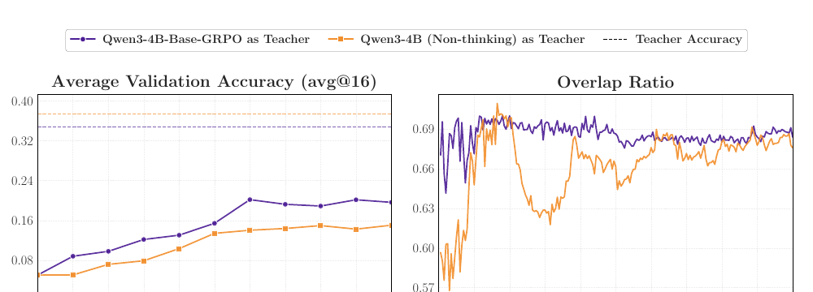

> **Figure 2** (원문 p.6) — thinking pattern이 다른 두 teacher로부터 같은 student(Qwen3-1.7B-Base)로의 OPD. **왼쪽** validation accuracy: GRPO teacher(보라)가 일관되게 앞선다. 점선은 각 teacher의 성능. **오른쪽** overlap ratio: GRPO teacher 쪽이 **초기부터 더 높고**, Non-thinking teacher(주황)는 step 40~90 구간에서 뚜렷하게 떨어졌다가 회복한다. 두 곡선은 후반에 수렴하지만 **왼쪽의 성능 격차는 끝까지 유지된다.**

- GRPO teacher가 **초기 overlap ratio가 더 높다**(base 모델 student와 thinking pattern이 가깝다). 벤치마크별 분해(Appendix A.3)에서도 AMC 2023·AIME 2024에서 격차가 크고 AIME 2025에서 작지만 방향은 동일하다.
- 두 overlap 곡선은 학습 후반에 수렴하지만 **성능 격차는 끝까지 유지**된다 → **초기 mismatch로 잃은 distillation 이득은 나중에 복구되지 않는다.**

#### (b) 조건 2 — 높은 점수 ≠ 새로운 지식

같은 파이프라인에서 나온 teacher와, 거기에 **추가 RL을 얹은** teacher를 비교한다.

| 계열 | Teacher | 초기 overlap ratio | **gap recovery rate** |
|---|---|---|---|
| DeepSeek (student: R1-Distill-1.5B) | R1-Distill-7B (same-pipeline) | 74.2% | **5.3%** |
| DeepSeek | Skywork-OR1-Math-7B (RL post-trained) | 71.5% | **16.9%** |
| Qwen (student: Qwen3-1.7B) | Qwen3-4B (same-pipeline) | 75.7% | **15.6%** |
| Qwen | Qwen3-4B-RL-Math (RL post-trained) | 70.3% | **58.6%** |

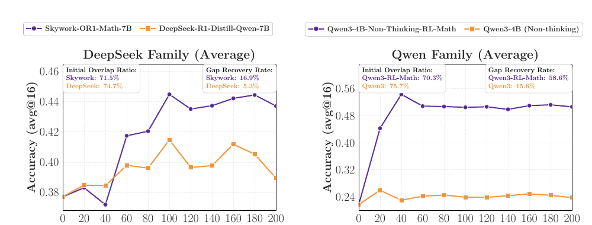

> **Figure 4** (원문 p.7) — teacher에 **추가 RL post-training**이 있는 경우와 없는 경우의 OPD 비교. **왼쪽** DeepSeek 계열, **오른쪽** Qwen 계열. 두 계열 모두 same-pipeline teacher(주황)는 개선이 미미하고, post-trained teacher(보라)는 훨씬 큰 이득을 낸다. 각 패널 안의 박스가 **초기 overlap ratio와 gap recovery rate**를 병기하는데, **overlap은 낮은 쪽이 recovery는 높다**는 역전이 여기서 바로 읽힌다.

> 주목할 점: post-trained teacher 쪽이 오히려 **초기 overlap ratio는 더 낮다**(71.5% < 74.2%, 70.3% < 75.7%). 그럼에도 gap recovery는 3~4배 높다. 즉 **overlap은 조건 1의 대리 지표일 뿐, 조건 2를 대신하지 못한다.** 두 조건은 독립적으로 필요하다.

#### (c) reverse distillation — 두 조건을 동시에 검증하는 결정적 실험

**설계**: JustRL-1.5B(R1-Distill-1.5B에 RL을 걸어 만든 강한 모델)를 **student**로 두고, ① 자기 pre-RL checkpoint인 R1-Distill-1.5B ② 더 크고 벤치마크 점수도 약간 높은 R1-Distill-7B 를 각각 teacher로 쓴다.

| AIME 2024 (avg@16) | 시작점 / teacher 점수 | 600 step distill 후 |
|---|---|---|
| Student JustRL-1.5B | 약 **0.54** | — |
| ① teacher = R1-Distill-1.5B | **0.28** | 약 **0.30** (pre-RL 수준으로 거의 정확히 회귀) |
| ② teacher = R1-Distill-7B | **0.55** | 약 **0.30** — ①과 **거의 구분 불가** |

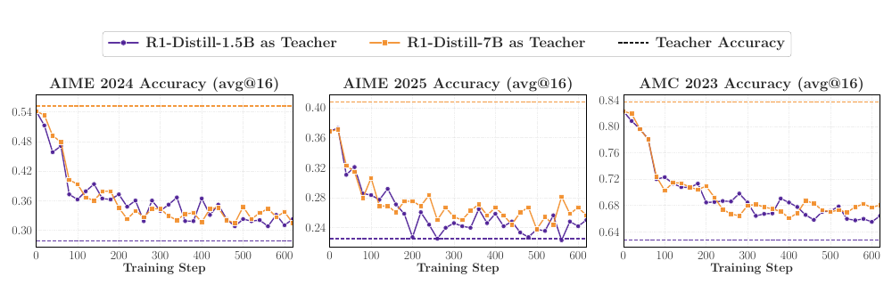

> **Figure 5** (원문 p.8) — JustRL-1.5B를 student로, 같은 계열 두 teacher(R1-Distill-1.5B / R1-Distill-7B)로 reverse distillation. 세 벤치마크 모두에서 **두 곡선이 거의 겹친 채 함께 내려간다.** R1-Distill-7B가 JustRL-1.5B보다 점수가 높은데도(위쪽 주황 점선) student를 같은 수준으로 퇴행시킨다. **OPD의 학습 역학이 teacher의 벤치마크 성능이 아니라 thinking pattern에 지배된다**는 것을 가장 직접적으로 보여주는 그림이다.

여기서 세 가지 결론이 따라온다.

1. **OPD는 근본적으로 thinking pattern을 배운다.** student가 RL로 획득한 이득이 전부 지워지고 teacher의 패턴으로 덮어써진다. 격차가 너무 크면 student가 아예 배우지 못하는 이유가 여기 있다.
2. **벤치마크 성능은 OPD 결과를 예측하지 못한다.** R1-Distill-7B는 JustRL-1.5B보다 점수가 높은데도 개선이 아니라 **퇴행**을 만든다. 학습 역학이 teacher 점수와 완전히 분리될 수 있고, 방향이 반대일 수도 있다.
3. **크기 차이는 새 지식을 뜻하지 않는다.** 1.5B와 7B가 student에게 **거의 동일한 local target 분포**를 유도한다는 것은, 7B의 높은 점수가 "같은 데이터에 대한 fit 정도"의 차이일 뿐임을 시사한다.

### 5.3 Mechanism — 토큰 수준에서 무슨 일이 일어나는가

같은 student(R1-Distill-1.5B)에 성공 teacher(JustRL-1.5B)와 실패 teacher(R1-Distill-7B)를 붙여 dynamic을 비교한다.

| 지표 | 성공 run (JustRL-1.5B) | 실패 run (R1-Distill-7B) |
|---|---|---|
| AIME 2024 avg@16 | 0.28 → 약 **0.47** | 0.30 → 약 0.32 (정체) |
| AIME 2025 avg@16 | 0.22 → 약 **0.325** | 약 0.24 정체 |
| AMC 2023 avg@16 | 0.63 → 약 **0.78** | 약 0.66 정체 |
| **Overlap ratio** | 약 72% → **91% 이상** 꾸준히 상승 | 약 78%에서 **정체** |
| **Overlap-token advantage** | 0을 향해 개선 | 개선 없음 |
| **Entropy gap** | 좁아짐 | 초기부터 **지속적 불일치** |
| gap recovery | **80% 이상** | 없음 |

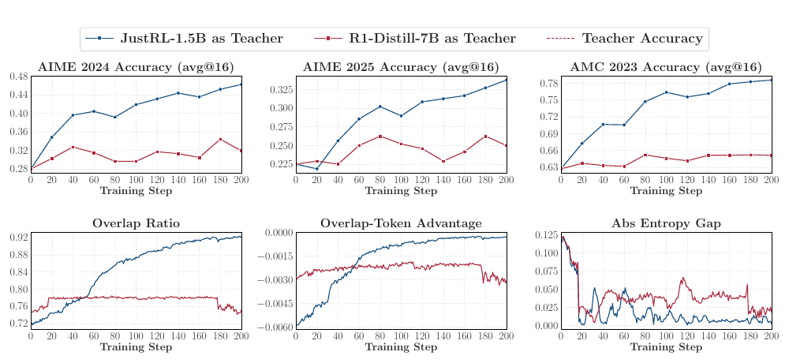

> **Figure 6** (원문 p.9) — 같은 student(R1-Distill-1.5B)에 성공 teacher(JustRL-1.5B, 파랑)와 실패 teacher(R1-Distill-7B, 빨강)를 붙인 비교. **위 3개** 세 벤치마크 avg@16 — 파랑만 상승하고 빨강은 정체한다(점선은 teacher 성능). **아래 3개** 진단 지표 — overlap ratio는 **0.72 → 0.92**로 꾸준히 오르는 반면 빨강은 **0.78 부근에서 평탄**하고 후반에는 오히려 하락한다. overlap-token advantage는 파랑만 0으로 접근하고, entropy gap도 파랑이 더 작게 유지된다. **이 논문에서 가장 중요한 그림**으로, 세 지표가 동시에 움직이는 것이 성공의 시그니처다.

- **overlap 토큰이 확률질량의 97~99% 를 차지한다** (Appendix B.1, student·teacher 양쪽 모두, 학습 전 구간). 즉 overlap ratio 상승은 **집합 수준의 우연한 일치가 아니라, 확률적으로 지배적인 토큰들 위에서의 정렬**이다.
- overlap-token advantage의 개선은 OPD의 주 최적화 신호가 **overlap 영역 바깥이 아니라 그 안에서 확률을 재배분하는 것**임을 시사한다.

#### overlap 토큰만으로 충분한가 — 인과성 ablation

성공 설정(JustRL-1.5B → R1-Distill-1.5B)에서 loss가 덮는 토큰 집합만 바꾼다 (k = 16).

| 변형 | supervision 대상 | 결과 |
|---|---|---|
| **Student Top-k** | S_t^(p) 전체 | 기준선 |
| **Overlap Top-k** | S_t^(p) ∩ S_t^(q) | **세 벤치마크 모두에서 Student Top-k 성능을 그대로 회복** |
| **Non-Overlap Top-k** | 대칭차 S_t^(p) △ S_t^(q) | 일관되게 **뚜렷하게 약함** |

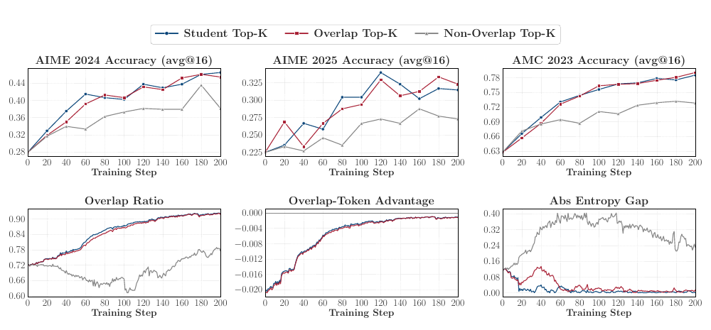

> **Figure 7** (원문 p.10) — Top-k OPD의 최적화 support를 바꾼 ablation. **위 3개** 벤치마크에서 **Overlap Top-k(빨강)가 Student Top-k(파랑)를 그대로 따라가고**, Non-Overlap Top-k(회색)만 일관되게 아래에 있다. **아래 3개** 진단 지표 — overlap ratio에서 파랑·빨강은 겹쳐서 0.90 이상으로 오르지만 회색은 **먼저 0.62까지 떨어진 뒤 부분적으로만 회복**한다. overlap-token advantage도 파랑·빨강이 구분되지 않고, 회색은 entropy gap이 끝까지 크게 남는다.

- Student Top-k와 Overlap Top-k의 advantage 곡선은 **거의 구분 불가**하고, overlap ratio도 똑같이 72% → 91% 이상으로 오른다. Non-Overlap은 advantage 크기가 훨씬 작아 **실효 gradient가 약하며**, overlap ratio가 먼저 하락한 뒤 부분적으로만 회복한다.
- 저자들의 해석 — **overlap 최적화는 self-reinforcing 하다.** 어떤 토큰이 공유 고확률 영역에 들어와 teacher의 선호를 받으면, reverse-KL 업데이트가 그 토큰에 질량을 더 몰아주고 경쟁하던 non-overlap 토큰을 student의 top-k 밖으로 밀어낸다. overlap 영역은 최적화에도 **불구하고**가 아니라 최적화 **때문에** 커진다.

#### 보조 진단 (Appendix B.2 · B.3)

| 지표 | 성공 run | 실패 run |
|---|---|---|
| PG loss | 큰 초기 mismatch에서 시작해 **꾸준히 감소** 후 낮은 값에서 평탄화 | 처음부터 **작고** 이후 거의 변화 없음 |
| Gradient norm | 초기부터 크고 학습 상당 구간 **유지** | 일관되게 **훨씬 작음** |
| 최대 advantage 토큰의 확률 차 p_t − q_t | 꾸준히 **감소** | 큰 격차를 **끝까지 유지** |

> 실패 run의 작은 loss는 "이미 잘 맞아서"가 아니다. **처음부터 teacher가 만들어내는 학습 신호가 약한 것**이며, 그 신호가 정책을 움직일 만큼 커지지 않는다.

**교차 검증**: student를 R1-Distill-7B로, teacher를 Skywork-OR1-Math-7B(성공) / R1-Distill-14B(실패)로 바꿔도 동일 패턴이 재현된다. 성공 run은 overlap ratio가 약 0.96까지 상승하고 advantage가 0에 접근하며 entropy gap이 작다.

### 5.4 Recipe — 실패하는 OPD를 살리는 두 전략

조건 2(새 지식)는 teacher의 **본질적 속성**이라 학습 설계로 바꿀 수 없다. 반면 조건 1(thinking-pattern gap)은 **좁힐 수 있다.**

#### (a) Off-policy cold start — student를 teacher 쪽으로 옮긴다

**설계**: Qwen3-1.7B-Base(student) / Qwen3-4B Non-thinking(teacher). OpenThoughts3-1.2M math subset에서 200K prompt를 뽑아 teacher가 응답 1개씩 생성(temp 0.7, top-p 0.95, max 12,288 tokens, 미완성·반복 응답 필터링) → 이걸로 full-parameter SFT하여 **Qwen3-1.7B-SFT**를 만든 뒤, SFT prompt와 중복 제거한 나머지 약 **30K prompt**로 OPD 계속. 대조군은 cold start 없이 Base에서 바로 OPD.

| 벤치마크 (avg@16, 200 step) | SFT + OPD | Only OPD |
|---|---|---|
| AIME 2024 | 약 0.075 → **0.125** | 약 0.02 → 0.07 |
| AIME 2025 | 약 0.060 ~ **0.075** 유지 | 약 0.015 → 0.05 |
| AMC 2023 | 약 0.36 → **0.40** | 약 0.12 → 0.26 |

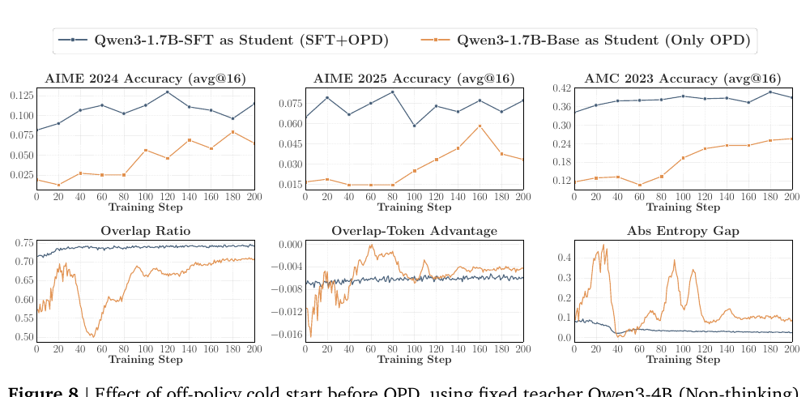

> **Figure 8** (원문 p.12) — OPD 이전의 off-policy cold start 효과. teacher는 Qwen3-4B (Non-thinking)로 고정하고, student 초기화만 **Qwen3-1.7B-SFT(파랑)** vs **Qwen3-1.7B-Base(주황)** 로 다르게 한 두 run. **위 3개** 세 벤치마크에서 SFT 초기화가 시종일관 위에 있다. **아래 3개** SFT 초기화는 overlap ratio가 **높은 값에서 매끄럽게 유지**되는 반면 Base 초기화는 **0.75에서 0.49까지 급락**했다가 서서히 회복하며, entropy gap도 Base 쪽만 반복적으로 크게 튄다.

- **성능 격차가 학습 내내 유지된다** → cold start는 초기 최적화만 돕는 게 아니라 **후속 OPD의 최종 성능 상한 자체를 올린다.** overlap dynamic도 같은 결론: SFT 초기화 student는 훨씬 높은 overlap ratio에서 시작해 **매끄럽고 안정적**인 궤적을 그리는 반면, Base 초기화는 낮게 시작해 **뚜렷한 불안정**(약 0.70 → 0.50 급락 후 서서히 회복)을 겪고 entropy gap도 처음부터 크다.
- **overlap mass** (Appendix C.2)가 더 결정적이다. SFT 초기화는 student·teacher overlap mass를 각각 약 1.0 / 0.97 이상으로 **일관되게 높게 유지**한다. Base 초기화는 최저 약 **0.55** 까지 떨어진다. → overlap-token advantage만 보면 오해할 수 있다(교집합 위에서만 평균내므로, **교집합 자체가 중요한 teacher 토큰을 놓쳐도 좋아 보인다**). overlap mass가 이를 보완한다.

#### (b) Teacher-aligned prompt selection — 데이터 쪽에서 정렬한다

**(b-1) prompt template**: teacher JustRL-1.5B / student R1-Distill-1.5B, 동일 DAPO-Math-17K, **템플릿만** 다르게. 원본 DAPO 템플릿(`Solve the following math problem step by step. ... Answer: ...`) vs JustRL post-training 형식(`{Question} Please reason step by step, and put your final answer within \boxed{}.`).

| 지표 | Original DAPO | Teacher-aligned |
|---|---|---|
| 평균 validation accuracy (200 step) | 약 0.51 | 약 **0.54** |
| overlap ratio 시작 → 종료 | 0.74 → 0.92 | **0.82 → 0.95** |
| teacher 성능 회복 비율 (Appendix C.4) | 약 **80%** | 약 **85%** |

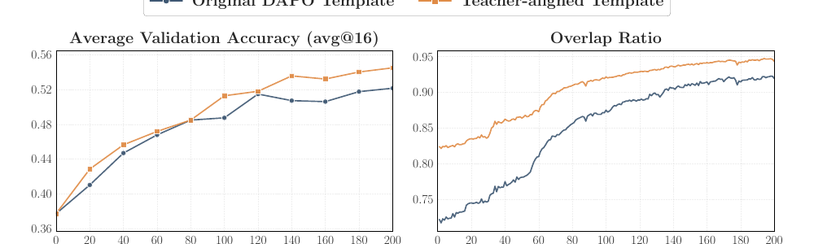

> **Figure 9** (원문 p.13) — prompt **템플릿** 정렬의 효과. **왼쪽** 평균 validation accuracy — teacher-aligned(주황)가 후반에 벌어진다. **오른쪽** overlap ratio — teacher-aligned는 **0.82에서 시작해 0.95로**, 원본 DAPO(파랑)는 **0.74에서 0.92로** 간다. 문제 자체는 동일하고 **제시 형식만 다른데** 시작점과 도달점이 모두 올라간다.

> **동일한 문제, 동일한 teacher, 바뀐 것은 프롬프트 형식 한 줄뿐**인데 gap recovery가 80% → 85% 로 움직인다. 템플릿이 student의 생성 상태를 teacher와 더 호환되게 만들기 때문이다.

**(b-2) prompt content**: teacher Qwen3-4B-Base-GRPO / student Qwen3-1.7B-Base. teacher의 RL 학습 데이터인 **DAPO-Math-17K** vs 그것과 중복 제거한 **DeepMath subset**(exact-match + all-mpnet-base-v2 임베딩 코사인 유사도 0.6 이상 제거, Appendix C.3). 크기는 맞췄다.

| 지표 | Deduplicated DeepMath | DAPO-Math-17K (teacher prompt) |
|---|---|---|
| 다운스트림 성능 | 낮음 | **높음** |
| overlap ratio | 약 0.70 | 약 0.68 (**오히려 낮다**) |
| overlap 토큰에 대한 student 확률합 | 0.3 ~ 0.8 사이 크게 요동 | 약 **0.85 ~ 0.90 안정** |
| student entropy | 약 3 ~ 6 | 약 **1.5** (급격히 낮음) |

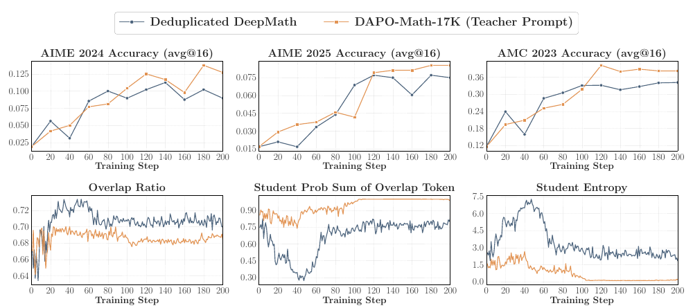

> **Figure 10** (원문 p.13) — prompt **내용** 정렬의 효과. **위 3개** 세 벤치마크에서 DAPO-Math-17K(주황, teacher의 RL 학습 데이터)가 dedup DeepMath(파랑)보다 낫다. **아래 3개가 핵심이다** — overlap ratio는 오히려 **주황이 더 낮은데**(≈0.68 vs ≈0.70), overlap 토큰에 대한 student 확률합은 **주황이 0.9 이상에서 안정**이고 파랑은 **0.3까지 붕괴했다가 회복**한다. student entropy는 주황이 **1.5 부근으로 급락**한다. 즉 **집합의 크기가 아니라 그 위의 질량이 성능을 설명하며**, 그 대가로 탐색 여력이 줄어든다.

- teacher-aligned prompt는 **overlap 집합은 더 작지만 그 위의 질량은 훨씬 크다** — "적지만 더 강하게 공유되는 토큰"에 집중하므로 **실효 정렬이 더 강하다.**
- **단, 대가가 있다.** teacher의 post-training 데이터만으로 OPD를 돌리면 policy entropy가 과도하게 줄어 **탐색 여력이 사라진다.** 저자들의 권고는 **teacher-aligned prompt에 out-of-distribution prompt를 섞는 것.**

### 5.5 Cost of Dense Supervision — free lunch가 아니다

지금까지의 논의는 "student가 방문한 상태에서 teacher의 token-level reward가 신뢰할 만하다"는 가정 위에 있다. 논문 §6은 그 가정을 깬다.

#### (a) reward 품질이 궤적 깊이에 따라 열화한다

R1-Distill-1.5B ← JustRL-1.5B, max response length 6종(0.5K / 1K / 3K / 7K / 10K / 15K)으로 200 step.

- **0.5K·1K**는 supervised token이 너무 적어 sample-efficiency 부족, **3K·7K가 가장 강한 성능(sweet spot)**, **10K·15K는 정체 또는 하락**.
- 10K·15K는 **late-stage collapse**: 약 step 200~220에서 overlap ratio가 급락하고 student entropy와 gradient norm이 동시에 스파이크.

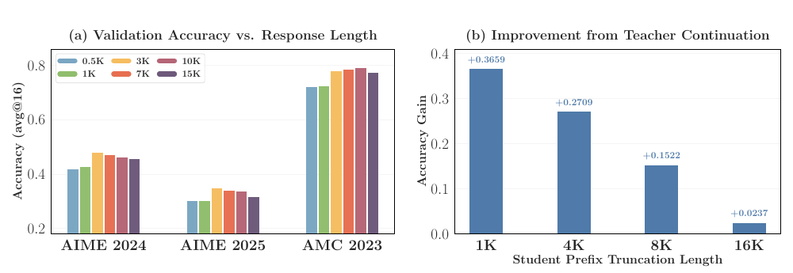

> **Figure 11** (원문 p.14) — dense supervision이 깊이에 치르는 대가. **(a)** max response length 6종별 세 벤치마크 성능 — 세 벤치마크 모두에서 **3K·7K(노랑·주황)가 정점**이고 **15K(보라)에서 내려온다.** **(b)** student prefix를 여러 길이에서 자르고 teacher가 이어 풀게 했을 때의 정확도 이득 — **1K에서 +0.3659 → 16K에서 +0.0237.** 궤적이 깊어질수록 teacher의 우위가 사실상 소멸한다.

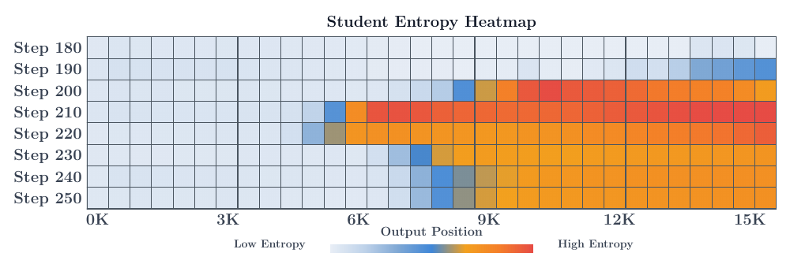

> **Figure 13** (원문 p.15) — 15K max response length 설정에서 **출력 위치별 student entropy를 step 180~250에 걸쳐** 측정한 히트맵. step 190에서는 **응답 맨 끝(13K~15K 부근)에서만** 고엔트로피(파랑)가 나타나지만, step 200~220에서 붉은 영역이 **왼쪽으로 번져 6K 지점까지 도달**한다. **불안정이 뒤에서 시작해 앞으로 전파된다**는 주장의 직접적 시각 증거다.

- **불안정성은 뒤에서 시작해 앞으로 전파된다.** 15K 설정에서 출력 위치별 student entropy 히트맵(step 180→250)을 보면, 고엔트로피가 **응답 끝에서 먼저 나타나 학습이 진행될수록 앞쪽 토큰으로 번진다.** teacher entropy도 동일한 suffix-to-prefix 패턴(Appendix D.1) — **teacher가 점점 낯선 prefix를 만나 더 noisy한 reward를 내고, 그것이 student를 불안정하게 만든다.**

**teacher continuation도 prefix 깊이에 따라 무력해진다.** DAPO-Math-17K에서 2K prompt를 뽑아 student full rollout을 생성, **16K 토큰을 넘는 것들만** 골라 여러 지점에서 자르고 그 prefix에서 **teacher가 이어서 풀게** 한다.

| student prefix 절단 길이 | 1K | 4K | 8K | 16K |
|---|---|---|---|---|
| teacher 이어풀기의 정확도 이득 | **+0.3659** | +0.2709 | +0.1522 | **+0.0237** |

> **1K prefix에서 +0.37이던 teacher의 우위가 16K prefix에서는 +0.02로 사라진다.** prefix가 teacher에게 익숙한 상태에서 멀어질수록 teacher는 더 나은 continuation을 제공하지 못한다. **extended chain-of-thought나 agentic multi-turn 같은 long-horizon 설정으로 OPD가 깔끔하게 확장되지 않을 수 있다는 직접 증거다.**

#### (c) globally informative reward ≠ locally exploitable reward

실패 run의 reward가 애초에 정보가 없는 것인지 확인한다. rollout당 sequence mean reward를 `r̄(y) = (1/T) · Σ_{t=1..T} [ log π_T(y_t | x, y_<t) − log π_θ(y_t | x, y_<t) ]` 로 정의하고 정답/오답 분포를 비교한다 (정답 N = 2,828, 오답 N = 1,451).

| Teacher | AUROC (정답 vs 오답 판별) | OPD 결과 |
|---|---|---|
| JustRL-1.5B | **0.7333** | 성공 |
| R1-Distill-7B | **0.7511** | **실패** |

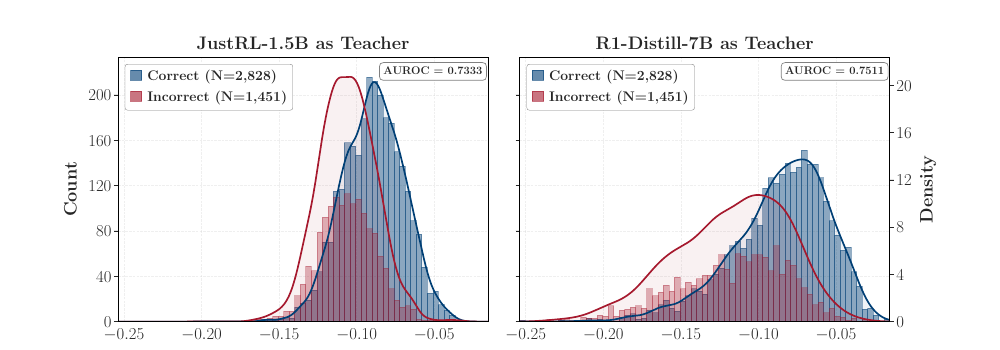

> **Figure 14** (원문 p.16) — 정답(파랑) / 오답(빨강) rollout의 sequence mean reward 분포. **왼쪽** 성공 teacher JustRL-1.5B **AUROC 0.7333**, **오른쪽** 실패 teacher R1-Distill-7B **AUROC 0.7511**. 양쪽 모두 정답 rollout에 더 높은 reward를 주며, **실패하는 teacher 쪽이 오히려 판별력이 약간 높다.** 즉 실패의 원인은 **신호의 전역적 품질이 아니다.**

- **실패하는 7B teacher의 reward가 오히려 AUROC가 더 높다** → 실패는 신호 품질(global correlation)의 문제가 **아니다.** 그런데 §5.3에서 이 run은 학습 후반 **overlap-token advantage의 크기가 더 큰데도 gradient norm은 지속적으로 더 작았다.**
- 저자들의 가설 — **anisotropy**. 7B teacher의 per-token advantage는 개별로는 크지만 시퀀스 내 위치별로 **방향이 제각각**이라 gradient로 합쳐질 때 **부분적으로 상쇄**된다. 반대로 thinking pattern이 호환되는 JustRL-1.5B는 advantage를 **일관된 토큰 부분집합에 집중**시켜, 개별 신호가 작아도 방향이 일치해 reverse KL의 mode-seeking이 증폭시킬 수 있다. 저자들은 이 가설을 **직접 검증하지 않았음을 명시**하고 future work로 남긴다.

#### (d) sampled-token reward만으로 이미 충분하다

R1-Distill-1.5B ← JustRL-1.5B 설정에서 support size k를 바꾼다.

| avg@16 | Sampled-token | Top-1 | Top-4 | Top-16 | Top-64 |
|---|---|---|---|---|---|
| AIME 2024 | **0.454** | 0.446 | **0.473** | 0.458 | 0.463 |
| AIME 2025 | 0.327 | **0.310** | 0.331 | 0.338 | 0.338 |
| AMC 2023 | 0.782 | **0.772** | **0.793** | 0.791 | 0.785 |

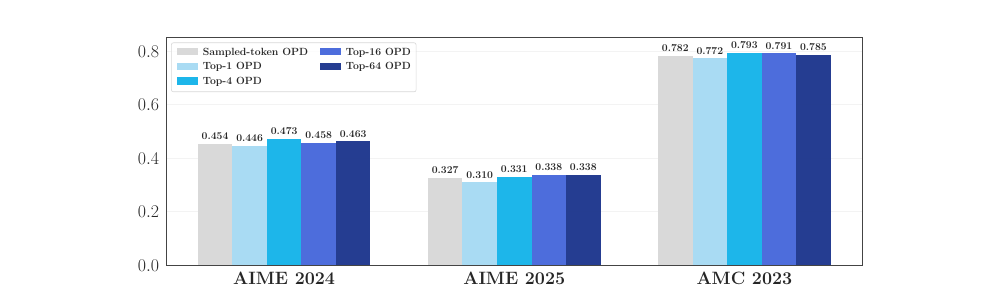

> **Figure 15** (원문 p.17) — Top-k OPD의 support size `k` 효과 (avg@16). 세 벤치마크 모두에서 **Sampled-token(회색)이 Top-16·Top-64와 사실상 구분되지 않고**, 유일하게 낮은 것은 **Top-1(연한 파랑)** 이다. `k`를 4 이상으로 키워도 이득은 소수점 셋째 자리에 머문다.

- sampled-token OPD가 top-k 계열 평균과 **대등**하다. k를 4 이상으로 키워도 이득은 미미하고 연산 오버헤드만 늘어난다. **명확히 나쁜 것은 Top-1 하나뿐** — overlap 성장이 불안정하고 entropy·gradient norm에 급격한 스파이크가 난다(Top-4는 안정적이나 후반 dip, Top-16/64는 끝까지 매끄러움).
- **Top-1의 실패 원인은 "토큰이 적어서"가 아니라 "편향된 mode-집중 선택 규칙이라서"이다.** 항상 argmax를 고르므로 작은 정책 변화가 rank-1 토큰을 뒤집고, 학습 과정에서 평균화되지 않는 불안정한 reward가 생긴다. 반면 sampled-token은 매 step **student 분포에 비례해 다른 토큰을 뽑으므로** 고확률 영역을 unbiased하게 커버한다.

---

## 6. Key Takeaways

1. **teacher 선정에는 두 개의 독립 조건이 있다.** (i) thinking-pattern 호환성 (ii) student가 학습 중 본 것을 **넘어서는 새 능력**. 같은 파이프라인의 상위 모델은 gap recovery **5.3%**(DS-7B) / **15.6%**(Qwen3-4B)에 그치지만, 여기에 RL post-training을 얹은 teacher는 **16.9%**(Skywork-OR1-Math-7B) / **58.6%**(Qwen3-4B-RL-Math)를 낸다. 결정적으로 post-trained teacher는 **초기 overlap이 오히려 낮다**(71.5% vs 74.2%, 70.3% vs 75.7%) — 두 조건은 서로를 대신하지 못한다.
2. **벤치마크 점수는 OPD 결과를 예측하지 못하며, 방향이 반대일 수도 있다.** reverse distillation에서 AIME'24 **0.54** 짜리 JustRL-1.5B를, 점수가 더 높은 **0.55** 짜리 R1-Distill-7B로 distill해도 결과는 **0.28** 짜리 R1-Distill-1.5B로 distill한 것과 구분 불가하게 **약 0.30 으로 퇴행**한다. 같은 계열의 1.5B와 7B는 **student 관점에서 거의 동일한 local target 분포**를 유도한다.
3. **성공한 OPD의 시그니처는 단 하나다 — 고확률 공유 토큰에 대한 점진적 정렬.** overlap ratio **72% → 91% 이상** 상승, overlap-token advantage가 0으로 접근, entropy gap 축소. 그 공유 토큰 집합이 student·teacher 양쪽에서 확률질량의 **97~99%** 를 차지한다. 실패 run은 세 지표가 **처음부터 정체**한다.
4. **overlap 토큰만 최적화해도 표준 OPD와 동등하고, granularity는 생각보다 덜 중요하다.** Overlap Top-k가 Student Top-k를 세 벤치마크 모두에서 재현하는 반면 Non-Overlap Top-k는 일관되게 약하다. overlap 최적화는 **self-reinforcing**이다 — reverse KL이 공유 고확률 토큰에 질량을 몰아주고 경쟁 토큰을 top-k 밖으로 밀어내면서 overlap 영역이 최적화 **때문에** 커진다. 같은 이유로 support size도 크게 중요하지 않다: sampled-token OPD가 AIME'24 **0.454** 로 Top-64 **0.463** 과 대등하고, 유일하게 나쁜 Top-1(0.446)의 문제는 토큰 수가 아니라 **argmax만 고르는 편향된 mode-집중 선택 규칙**이다.
5. **실패한 OPD는 두 가지로 되살릴 수 있고, 둘 다 조건 1만 건드린다.** off-policy cold start(teacher rollout 200K SFT)는 AMC 2023을 **0.26 → 0.40** 수준으로 올리며 **최종 성능 상한 자체**를 올린다. teacher-aligned prompt는 템플릿 한 줄 교체만으로 gap recovery를 **80% → 85%** 로 올린다. 단 teacher post-training prompt만 쓰면 student entropy가 약 3~6에서 **약 1.5** 로 붕괴하므로 OOD prompt를 섞어야 한다.
6. **dense token-level reward는 free lunch가 아니다 — 깊이에 대가를 낸다.** max response length는 **3K~7K가 sweet spot**이고 10K/15K는 step 200 부근에서 붕괴한다. 불안정은 **응답 끝에서 시작해 앞으로 전파**된다. teacher continuation의 정확도 이득은 prefix 1K에서 **+0.37**, 16K에서 **+0.02** — 즉 **긴 궤적에서 teacher의 안내는 사실상 소멸한다.** long-horizon reasoning과 agentic multi-turn으로의 확장이 열린 문제로 남는다.
7. **globally informative reward가 locally exploitable reward를 보장하지 않는다.** 실패하는 R1-Distill-7B teacher의 sequence mean reward는 rollout 정오답 판별 **AUROC 0.75** 로, 성공하는 JustRL-1.5B의 **0.73** 보다 오히려 높다. 그런데 per-token advantage는 더 큰데 gradient norm은 더 작다. 저자 가설은 **anisotropy로 인한 gradient 상쇄**이며(직접 검증되지 않음), 이는 "reward가 정확하면 학습된다"는 직관에 대한 근본적 반례다.

---

## 7. 원문 블로그 대비 갱신점

Thinking Machines Lab 블로그(2025.10.27)의 8개 주장에 이 논문이 무엇을 했는가.

| # | 원문 주장 | 이 논문의 판정 | 근거 |
|---|---|---|---|
| ① | OPD = dense × on-policy, 두 함정 동시 회피 | **조건부 정밀화** | 회피는 **중간 길이 궤적에서만** 성립. 3K~7K가 sweet spot이고 10K/15K는 후반 붕괴. dense supervision의 신뢰성이 깊이에 따라 열화 |
| ② | `advantage = −reverse_kl` 한 줄이면 구현 끝 | **부분 지지** (드문 옹호) | granularity 축에서는 블로그가 옳다. sampled-token OPD가 AIME'24 **0.454** 로 Top-64 **0.463** 과 대등. 단 Top-1(0.446)은 붕괴하므로 "argmax만 쓰는 변형"은 금지 |
| ③ | discount 0 덕분에 안정화 장치 불필요 | **반박** | 10K/15K 설정에서 step 200~220에 overlap ratio 급락 + entropy·grad norm 스파이크. Top-1 OPD도 step 80 부근 붕괴. **길이·support 설계가 곧 안정화 장치** |
| ④ | reverse KL의 mode-seeking이 장점 | **조건부** | mode-seeking이 이득이 되려면 advantage가 **일관된 토큰 부분집합에 집중**되어야 한다. 호환되지 않는 큰 teacher에서는 per-token advantage가 anisotropic해 합쳐질 때 상쇄된다(가설, 미검증) |
| ⑤ | reverse KL은 unhackable | **정밀화 — unhackable ≠ usable** | 실패 teacher의 reward가 AUROC **0.75** 로 성공 teacher **0.73** 보다 높다. hacking이 문제가 아니라 **student 정책 주변에서 reward landscape가 국소적으로 평평한 것**이 문제 |
| ⑥ | teacher가 사실상 성능 상한 | **강한 반박 — teacher는 상한이 아니라 자석** | reverse distillation에서 student가 **0.54 → 0.30** 으로 끌려 내려간다. teacher는 천장이 아니라 **student를 자기 분포로 끌어당기는 인력**이며, 아래로도 끌어당긴다 |
| ⑦ | **어떤 open-weight teacher든 쓸 수 있다** | **가장 강한 반박 — 선정 조건이 존재** | 같은 계열 상위 모델은 **student 관점에서 분포적으로 구분 불가**(1.5B와 7B가 같은 결과). gap recovery **5.3% vs 16.9%**, **15.6% vs 58.6%** 가 그 대가. teacher는 "점수가 높은 모델"이 아니라 **"student가 아직 못 본 능력을 가진, 패턴이 호환되는 모델"** 이어야 한다 |
| ⑧ | continual learning에 유망 | **제한 조건 추가** | 두 방향의 제약. (i) long-horizon에서 teacher 안내가 소멸(prefix 16K에서 **+0.02**) → 반복 적용의 지평이 짧다. (ii) teacher post-training prompt만 반복 사용하면 student entropy가 **약 1.5** 로 붕괴 → 탐색 여력 상실 |

### 블로그가 다루지 않았던 새 축

- **prompt 선택** — 블로그는 personalization에서 Tulu3 prompt를 썼을 뿐 prompt 정렬을 논점화하지 않았다. 이 논문은 **템플릿 한 줄**이 gap recovery를 80% → 85% 로 바꿈을 보인다.
- **cold start의 역할** — 블로그의 2단계(off-policy → on-policy)는 "성능 부트스트랩"으로 설명되었다. 이 논문은 그것이 **thinking-pattern gap을 좁히는 장치**이며 후속 OPD의 **성능 상한 자체**를 올린다고 재해석.
- **진단 지표** — overlap ratio / overlap-token advantage / entropy gap / overlap mass 4종 → 학습을 끝까지 돌리지 않고도 **초기 수십 step만 보고 실패를 예측**할 수 있게 한다.
- **capacity gap** — 기존 capacity-gap 연구(Busbridge의 distillation scaling law, Li의 learnability gap)는 전부 off-policy KD 대상. **OPD에서의 distillability를 처음으로 정면 조사.**

### 저자들이 남긴 open problem

- **수학 외 도메인 / pre-training 데이터의 영향** — 전 실험이 수학 벤치마크라 코드·open-ended에서의 성립 여부는 미확인. 또한 "새 지식" 조건은 결국 pre-training corpus 차이에 의존하는데, 이를 분리하려면 cross-family distillation(Qwen → LLaMA)이 필요하고 그건 tokenizer 불일치·아키텍처 차이와 교란된다. 통제된 pre-training ablation은 비용상 불가.
- **self-distillation 체제** — thinking-pattern 일관성이 **보장되고** 새로움이 별도 teacher가 아닌 **privileged access**에서 나오는 경우로의 확장.
- **long-horizon 하이브리드** — 짧은 구간엔 dense token-level supervision, 긴 지평엔 sparse outcome reward를 결합하고, 학습 중 supervised horizon을 점진적으로 늘리는 curriculum.

---

> **그림 출처**: 이 문서의 모든 그림은 원논문 [arXiv:2604.13016v2](https://arxiv.org/abs/2604.13016) (Li et al., 2026)의 Figure를 해당 페이지에서 캡처한 것이며, 출처 표시 하에 개인 학습 목적으로 인용했다. 캡션의 해설은 이 문서의 것이다.

---

[← 후속 연구 정리](../opd_follow_up_research.md) · [원문 요약](on_policy_distillation.md) · [Code](https://github.com/thunlp/OPD)
