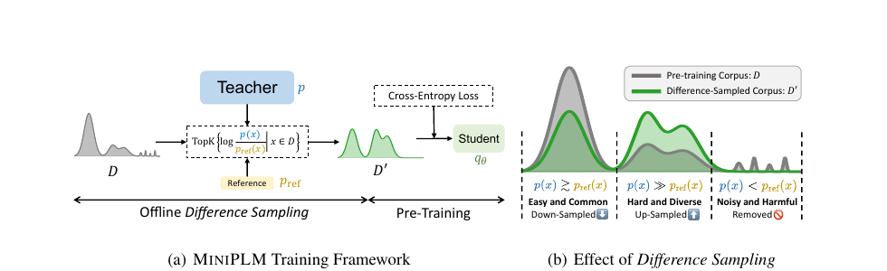
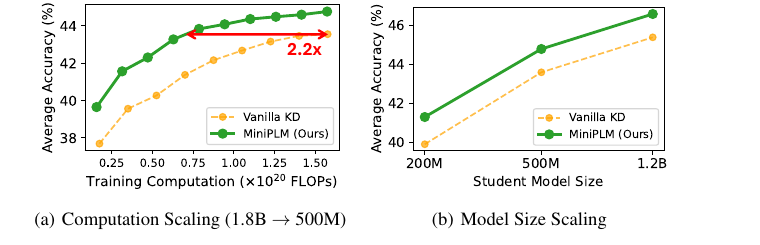

# MiniPLM: Knowledge Distillation for Pre-training Language Models

> **Venue**: ICLR 2025 (Conference paper) · arXiv:2410.17215v3, 2025.03.19
> **Authors**: Yuxian Gu¹², Hao Zhou², Fandong Meng², Jie Zhou², Minlie Huang¹
> ¹The CoAI Group, Tsinghua University · ²WeChat AI, Tencent Inc., China
> **Code / Data / Models**: https://github.com/thu-coai/MiniPLM

**한 줄 정의**: KD를 **student의 학습 루프에서 떼어내 pre-training corpus 자체로 옮긴다.** teacher LM `p`와 아주 작은 reference LM `p_ref`의 **확률 차이 `log p(x)/p_ref(x)`** 로 corpus를 offline 재표집(*Difference Sampling*)한 뒤, student는 그 corpus에서 **평범한 cross-entropy로 from scratch pre-training**한다. teacher inference가 학습 시간에 전혀 개입하지 않으므로 **tokenizer·architecture가 달라도 되고**, 한 번 만든 corpus를 **여러 student가 재사용**한다.

---

## 1. Background

### 1.1 왜 하필 "작은 LM의 pre-training"인가

LM 성능은 scale로 올라왔지만 그만큼 **inference 비용**이 커졌다. 실제로 배포되는 것은 200M~1.2B급 작은 LM인데, 이들에게는 **학습 연산(training computation)이 곧 병목**이다. 이유는 Chinchilla scaling law와 실제 학습 관행의 괴리에 있다.

```
Chinchilla compute-optimal  :  파라미터 1개당 약 20 token
  → 200M 모델의 "최적" 학습량 =  약 4B token

실제 이 논문의 학습 설정      :  200M 모델을 50B token 으로 학습
  → compute-optimal 지점의 약 12배를 초과해서 학습
```

> 작은 LM은 **일부러 compute-optimal을 한참 넘겨서** 학습된다. 배포 시 inference 비용이 파라미터 수로 결정되므로, "파라미터를 늘리는" 대신 "토큰을 더 먹이는" 쪽으로 성능을 짜내기 때문이다. 그 결과 **같은 파라미터 수에서 얼마나 적은 연산으로 더 좋은 성능을 뽑느냐**가 핵심 문제가 된다. → KD가 매력적인 이유.

그런데 **KD는 fine-tuning 단계에서만 검증**되어 있고, LM이 foundation 능력을 획득하는 **결정적 단계인 pre-training에서의 역할은 미탐구** 상태였다.

### 1.2 pre-training에 KD를 붙이는 두 가지 방법

| 구분 | 정의 | 구체적으로 무슨 일이 일어나는가 | 대표 방법 |
|---|---|---|---|
| **Online KD** | student 학습 중에 **teacher가 매 스텝 inference**하여 token-level supervision 제공 | student가 배치를 받으면, **같은 배치를 teacher에도 통과**시켜 각 위치의 vocab 분포를 얻고, student 분포와의 KLD를 loss에 더한다 | Vanilla KD, MiniLLM |
| **Offline KD** | teacher가 **미리 생성한 텍스트**로 student를 학습 | 학습 전에 teacher로 corpus를 생성해 디스크에 저장. 학습 중에는 teacher를 **전혀 부르지 않고** 그 텍스트로 평범한 cross-entropy | SeqKD |

**예시로 보는 Online KD 한 스텝** — the Pile 문서 `"The mitochondrion is the powerhouse of the ___"`

```
student q_θ(· | prefix) :  cell 0.55,  organism 0.08,  plant 0.05, ...   (151,646차원)
teacher p(· | prefix)   :  cell 0.82,  organism 0.03,  eukaryote 0.02, ... (151,646차원)
loss += KL[ p || q_θ ]   ← 이 분포를 얻으려면 teacher를 매번 돌려야 한다
```

정답 토큰 하나(`cell`)만 알려주는 일반 pre-training과 달리, **오답들의 상대적 순위까지** 전달되는 것이 online KD의 이득이다. 문제는 그 대가다.

### 1.3 Online KD의 문제 ① — 비용: teacher inference가 student 학습보다 비싸다

논문 설정(teacher 1.8B, student 200M)에 표준 FLOPs 회계(forward ≈ `2N`, forward+backward ≈ `6N`)를 대입해보면 규모가 바로 드러난다.

```
student 200M 학습 (fwd+bwd)   :  6 × 0.2B = 1.2 GFLOPs / token
teacher 1.8B 추론 (fwd only)  :  2 × 1.8B = 3.6 GFLOPs / token
------------------------------------------------------------
Vanilla KD 총 비용            :  4.8 GFLOPs / token   ← 학습만 할 때의 4배
```

> **즉 같은 FLOPs 예산이라면, Vanilla KD는 KD 없이 학습할 때의 1/4 토큰밖에 못 본다.** 이것이 Figure 2의 두 막대가 뒤집히는 이유다 — **step 수를 맞추면** KD가 이기지만, **FLOPs를 맞추면** 모든 KD 방법이 Pre-Train w/o KD와 비슷하거나 더 나쁘다.
>
> 이 회계는 **student가 커질수록 오버헤드 비중이 줄어든다**는 것도 설명한다. student가 1.2B면 `7.2 : 3.6`이라 총 1.5배에 그친다. Table 1에서 **Vanilla KD가 큰 student에서만 baseline을 이기는** 현상이 여기서 나온다.

**"그럼 teacher 분포를 미리 계산해서 저장해두면 되지 않나?"** — 이 반문이 자연스럽지만, 산수를 해보면 막힌다.

```
50B token × 150K vocab × 4 byte = 3 × 10^16 byte ≈ 30 PB
```

> 위 예시 문장 한 위치마다 **151,646개 실수**를 저장해야 한다. 토큰 하나당 600KB, 50B 토큰이면 **30페타바이트**다. 저장이 불가능하므로 **online 계산이 강제**된다. (논문 각주 2)

### 1.4 Online KD의 문제 ② — 경직성: tokenizer가 같아야 한다

위 예시의 KL은 **두 분포가 같은 vocab 위에, 같은 위치에 정렬되어 있어야** 계산된다. 그런데 model family가 다르면 이 전제가 깨진다.

```
문자열: "mitochondrion"

Qwen-1.5   (vocab 151,646) :  ["mit", "ochond", "rion"]      → 3개 위치
Llama3.1   (vocab 128,256) :  ["m", "itoch", "ond", "rion"]  → 4개 위치
```

*(분할 결과는 도식화한 예시이며, vocab 크기는 실제 값이다.)*

> 위치 개수도 다르고 vocab 축도 다르므로 `KL[p || q_θ]`를 **정의할 수조차 없다.** 그래서 Vanilla KD·MiniLLM은 **Qwen teacher → Llama/Mamba student** 같은 cross-family KD에 원리적으로 적용 불가다. (Table 3에 두 방법이 등장하지 않는 이유)

### 1.5 Offline KD(SeqKD)의 문제 — 싸고 유연하지만 데이터 품질이 무너진다

SeqKD는 teacher가 생성한 텍스트로 학습하므로 위 두 문제가 전부 사라진다. 학습 중 teacher 호출 0회, tokenizer 무관. 대신 **데이터가 망가진다.**

논문의 SeqKD baseline 구성 방식으로 보면 명확하다 — 각 instance의 **앞 768 token을 prompt로 주고 나머지를 teacher가 생성**한다.

```
원본 (the Pile, 실제 웹/논문/코드 텍스트)
  "... 이 커널의 batch-invariance는 reduction 순서가 batch size에 의존하기
   때문에 깨지며, split-K 전략에서 특히 두드러진다. 해결책은 ..."
        ↑ 희소하고 구체적인 기술적 사실. 어렵지만 배울 가치가 있다

teacher 생성 (같은 prompt에서 sampling)
  "... 이는 매우 중요한 문제이며, 여러 연구자들이 다양한 방법으로
   접근해 왔다. 앞으로도 지속적인 연구가 필요할 것이다."
        ↑ 유창하지만 정보량이 없는 generic한 문장
```

> LM은 **자기 확률분포의 mode 쪽으로** 생성하므로, 생성 corpus는 **흔하고 쉬운 패턴으로 수렴**한다. student는 그 위에 overfit되어 downstream generalization을 잃는다. 이것은 인상비평이 아니라 측정된다 — 논문의 Table 4에서 **teacher-generated corpus의 semantic diversity는 30.16으로, 원본 corpus(32.25)보다도 낮다.** 즉 SeqKD는 원본을 개선하기는커녕 **다양성을 깎아먹는다.** 회피하려면 광범위한 prompt engineering이 필요하고, 그건 human expertise 비용이다.

### 정리 — 세 축의 trade-off

| | 효율성 (train-time 오버헤드) | 유연성 (cross-family) | 효과성 (데이터 품질) |
|---|---|---|---|
| **Vanilla KD** (online) | ✗ 4배 비용 | ✗ tokenizer 종속 | ○ token-level 정밀 신호 |
| **MiniLLM** (online) | ✗ inference + sampling | ✗ tokenizer 종속 | ○ reverse KLD |
| **SeqKD** (offline) | ○ 0 | ○ 무관 | ✗ 다양성 하락 (30.16) |
| **MiniPLM** | **○ 0** | **○ 무관** | **○ 다양성 상승 (36.70)** |

> **정리**: online은 **비싸고 경직**되어 있고, offline은 **싸고 유연하지만 데이터 품질이 무너진다.** MiniPLM은 **offline의 비용 구조를 그대로 유지한 채 데이터 품질 문제만** 해결하려 한다 — 그 수단이 teacher 생성이 아닌 **teacher를 이용한 원본 corpus의 재표집**이다.

---

## 2. Motivation

### 핵심 통찰 1: FLOPs를 통제하면 기존 KD의 이득이 증발한다

논문은 200M student / 1.8B teacher 설정에서 KD 방법들을 **① 같은 training step** 과 **② 같은 training-time FLOPs** 두 기준으로 비교했다 (Figure 2).

```
Controlled Training Steps   :  Vanilla KD(Online), MiniLLM(Online) 이 우세
Controlled Training FLOPs   :  모든 KD 방법이 Pre-Train w/o KD 와 비슷하거나 더 나쁨
```

> **함의**: online KD의 이득은 상당 부분 **"teacher inference에 쓴 추가 연산"의 대가**였다. 그 연산을 그냥 pre-training 연장에 쓰면 비슷한 결과가 나온다. 따라서 **training-time 연산을 전혀 늘리지 않는 KD**가 아니면 pre-training 단계에서는 의미가 약하다.

### 핵심 통찰 2: KD를 reward maximization으로 재정식화하면 offline 최적화가 열린다

fine-tuning 단계에서 효과가 검증된 **reverse KLD** 목적함수를 reward 최대화로 다시 쓴다.

```
θ = argmin_θ KL[q_θ || p]
  = argmin_θ E_{x~q_θ} log( q_θ(x) / p(x) )
  = argmax_θ E_{x~q_θ} r(p, q_θ, x)          ... (1)

  where  r(p, q_θ, x) = log( p(x) / q_θ(x) )
```

- **reward의 의미**: `log p(x)`가 높다 = teacher가 선호하는 텍스트 / `log q_θ(x)`가 낮다 = student에게 아직 어렵고 다양한 텍스트. 즉 **"teacher는 좋아하지만 student는 아직 모르는" 데이터**에 높은 점수가 붙는다.
- reverse KLD는 `q_θ`가 `p`의 저확률 영역을 과대추정하는 것을 막아준다.

### 핵심 통찰 3: Best-of-N의 두 가지 `q_θ` 의존성이 재사용을 막는다

(1)을 최적화하는 단순한 방법은 Best-of-N이다.

```
D'_q_θ = top-K { r(p, q_θ, x) | x ∈ D_q_θ },   D_q_θ = { x_m | x_m ~ q_θ }   ... (2)
```

그런데 이 방식은 `q_θ`에 **두 번** 의존한다.

| 의존성 | 결과 |
|---|---|
| **① 데이터를 `q_θ`에서 sampling** | student가 바뀌면 후보 집합이 통째로 바뀐다 |
| **② reward를 `q_θ`로 계산** | student가 바뀌면 점수도 다시 매겨야 한다 |

> 그래서 `D'_q_θ`는 **다른 student LM의 pre-training에 전용(transfer)될 수 없다.** 또한 `q_θ`에서 뽑은 M개 후보의 난이도·다양성을 보장하려면 결국 prompt engineering이 필요해진다. **Difference Sampling은 이 두 의존성을 각각 제거하는 것이 전부다.**

---

## 3. Contributions

1. **Difference Sampling**: teacher `p`와 tiny reference LM `p_ref`의 확률 비 `log p(x)/p_ref(x)`로 pre-training corpus를 offline 재표집하는 KD 프레임워크. **student에 비의존적이므로 corpus를 여러 student가 재사용**한다.
2. **Proposition 2.1 (이론적 근거)**: `|D|`와 `|D_q_θ|`가 충분히 크면, **원 corpus `D`에서 뽑은 top-K와 `q_θ`가 생성한 `D_q_θ`에서 뽑은 top-K가 확률 1로 일치**한다. 즉 위 의존성 ①을 제거해도 손해가 없다.
3. **3축 이점의 동시 달성**: **효율성**(training-time 오버헤드 0) · **유연성**(corpus만 건드리므로 tokenizer/architecture 무관, 최적화된 pre-training 파이프라인에 그대로 삽입) · **효과성**(난이도·다양성 향상).
4. **실증**: 1.8B teacher → 200M/500M/1.2B student, 9개 downstream task에서 전 baseline 상회. **500M student 기준 동일 성능에 연산 2.2배 절감**, **data-limited 설정에서 데이터 요구량 2.4배 절감**, **Llama3.1·Mamba로의 cross-family KD** 성공.

---

## 4. Method



> **Figure 3**: MiniPLM 전체 구조. **(a) Training Framework** — teacher `p`와 reference LM `p_ref`의 확률 차이로 원 corpus `D`에서 `D'`를 offline으로 뽑아내고(*Offline Difference Sampling*), student `q_θ`는 `D'` 위에서 평범한 cross-entropy로 pre-training한다. **(b) Effect of Difference Sampling** — 쉽고 흔한 구간은 down-sample, 어렵고 다양한 구간은 up-sample, noisy·harmful 구간은 제거된다.

### 4.1 Difference Sampling — 두 의존성의 제거

#### 출발점: 무엇이 문제인지 다시 확인

§2의 「핵심 통찰 3」에서 본 Best-of-N 식(2)에는 student `q_θ`가 **두 군데** 등장한다.

```
D'_q_θ = top-K { r(p, q_θ, x)  |  x ∈ D_q_θ },     D_q_θ = { x_m ~ q_θ }
             ↑ ② 채점자가 student      ↑ ① 후보를 student가 생성
```

**왜 이게 치명적인가** — 200M / 500M / 1.2B student 세 개를 만들고 싶다고 하자.

```
Best-of-N :  200M용 후보 생성 → 200M으로 채점 → corpus A → 200M 학습
             500M용 후보 생성 → 500M으로 채점 → corpus B → 500M 학습
             1.2B용 후보 생성 → 1.2B으로 채점 → corpus C → 1.2B 학습
             → 전처리를 student 수만큼 반복. teacher 추론도 그만큼 반복
```

게다가 후보가 **student의 생성물**이므로, §1.5의 SeqKD와 똑같은 함정(생성 텍스트의 다양성 붕괴)에 빠진다. 피하려면 prompt engineering이 필요하다.

> **Difference Sampling은 ①과 ②를 각각 하나씩 떼어내는 작업이 전부다.** 아래 두 절이 정확히 그 두 개다.

#### (a) 의존성 ① 제거 — `q_θ`가 만든 후보 대신, 원본 `D`에서 뽑는다

**하려는 일**: `D_q_θ`(student 생성물)를 `D`(원본 corpus)로 갈아끼운다. 언뜻 보면 "다른 데이터에서 뽑는 것"이니 결과가 달라질 것 같지만, 그렇지 않다는 것이 Proposition 2.1이다.

**Proposition 2.1.** 표본공간 `S` 위의 두 분포 `p₁, p₂`에 대해 `X₁..X_N ~ p₁`, `Y₁..Y_M ~ p₂`이고 `r(·): S → R`가 단사(injective), 모든 `x ∈ S`에서 `p₁(x) > 0`, `p₂(x) > 0`이라 하자. 고정된 `K`(`1 ≤ K ≤ min{N, M}`)에 대해 `N → +∞`, `M → +∞`일 때

```
P( top-K{ r(X_n) | 1 ≤ n ≤ N }  =  top-K{ r(Y_m) | 1 ≤ m ≤ M } )  →  1    ... (3)
```

여기서 `p₁`은 `D`의 데이터 분포, `p₂ = q_θ`다.

**증명의 직관 (Appendix A)** — 어렵지 않다. 핵심은 **두 분포 모두 모든 `x`에서 확률이 양수**라는 가정이다.

```
K = 1 인 경우로 생각하자.  x* = argmax_{x ∈ S} r(x)   (표본공간 전체의 1등)

p₁(x*) > 0  →  N번 뽑으면 언젠가 x* 가 나온다.  N → ∞ 에서 확률 1
p₂(x*) > 0  →  M번 뽑아도 마찬가지로 x* 가 나온다. 확률 1
                              ↓
양쪽 표본집합 모두 x* 를 포함  →  양쪽의 argmax 가 둘 다 x*  →  일치
```

> 즉 **"두 표본집합이 서로 닮아서" 겹치는 게 아니라, 충분히 뽑으면 양쪽 다 결국 같은 정답 `x*`에 도달하기 때문에** 겹친다. `p₁`과 `p₂`가 아무리 달라도 상관없다 — support만 겹치면 된다. 일반 `K`도 2등, 3등…에 같은 논리를 반복하면 된다.

**현실에서의 의미** — 이 정리는 표본이 클수록 좋다고 말하는데, `D`는 그 조건에 이상적으로 맞는다.

| | 후보 집합 크기 | 성격 |
|---|---|---|
| `D_q_θ` (Best-of-N) | student가 생성한 M개 | 생성 비용이 들고, student의 mode에 쏠림 |
| **`D` (MiniPLM)** | **100B token 규모의 원본** | 생성 비용 0. 실제 웹·논문·코드의 자연스러운 다양성 |

> 후보를 많이 볼수록 고-reward instance를 찾기 유리하므로, `D`로 바꾸는 것은 **타협이 아니라 오히려 개선**이다.

#### (b) 의존성 ② 제거 — 채점자를 `q_θ`에서 `p_ref`로 바꾼다

reward `r(p, q_θ, x) = log p(x)/q_θ(x)` 에는 아직 student가 남아 있다. 이걸 **tiny reference LM `p_ref`** 로 갈아끼운다.

```
r(p, q_θ,  x) = log p(x)/q_θ(x)      →      r(p, p_ref, x) = log p(x)/p_ref(x)
```

- `p_ref`는 **`D`에서 균일 표집한 작은 부분집합 `D_ref`로 from scratch 학습한 tiny LM**. 실험에서는 **104M을 5B token으로** 학습했다 — student(200M~1.2B)보다도 작다.

**왜 바꿔도 되는가** — `q_θ`가 분모에서 하는 일은 **"이 instance가 작은 모델에게 얼마나 어려운가"를 재는 것**뿐이다. 그리고 **난이도의 상대적 순서는 모델이 바뀌어도 대체로 보존된다.**

```
어떤 작은 모델에게든:   결정학 장비 boilerplate  <  일반 서술문  <  긴 지식집약 문서  <  고품질 코드
                        (쉬움) ──────────────────────────────────────────────→ (어려움)
```

절대적인 loss 값은 모델마다 다르지만 **순위는 흔들리지 않는다.** top-K 선택은 절대값이 아니라 순위만 쓰므로, 이 정도면 충분하다.

**실증 (Appendix D.4, Table 11)** — 500M student의 `log p/q_θ`를 정답으로 놓고, 크기가 다른 reference LM의 `log p/p_ref`와 비교했다.

| `N_ref` | Pearson | Spearman | Sampling Acc. |
|---|---|---|---|
| 45M | 0.743 | 0.774 | 80.6 |
| **104M** (본 실험 설정) | **0.826** | **0.840** | **87.4** |
| 200M | 0.856 | 0.879 | 89.5 |

> **Sampling Acc.** = "선택/폐기 판정이 student 기준과 일치한 비율". 104M짜리 대리 채점자가 **87.4%를 같게 판정**한다. 완벽하진 않지만, **student마다 채점을 다시 하는 비용을 없애는 대가로는 충분히 싼 근사**다. reference LM을 키우면 상관도 올라가지만(200M → 0.856) **효과는 포화**하므로(Figure 8), 굳이 키울 이유가 없다.

#### 최종 형태

```
D' = top-K { log( p(x) / p_ref(x) )  |  x ∈ D − D_ref },     K = α·|D − D_ref|   ... (4)
```

- **`q_θ`가 식에서 완전히 사라졌다.** → corpus는 **한 번 만들면 어떤 student에도 재사용**된다. 앞의 세 student 예시가 이렇게 바뀐다:

```
MiniPLM :  D' 한 번 생성  →  200M 학습 / 500M 학습 / 1.2B 학습 / Llama3.1 학습 / Mamba 학습
                              ↑ 전처리는 재사용. student가 늘어도 추가 비용 0
```

- `α`: sampling ratio (실험에서 0.5 또는 0.25).
- **`D − D_ref`인 이유**: `p_ref`는 `D_ref`로 학습됐으므로 그 위에서는 **과적합되어 `p_ref(x)`가 비정상적으로 높다.** 그러면 `log p/p_ref`가 인위적으로 낮아져 **멀쩡한 데이터가 "쉬운 것"으로 오분류되어 버려진다.** 그래서 채점 대상에서 `D_ref`를 빼둔다.

#### 숫자로 보는 한 instance (Appendix Table 13, Instance #1)

논문이 실제로 폐기한 사례 — Bruker 회절분석기 측정 조건이 나열된 결정학 boilerplate:

```
−log p(x)      = 1.24      (teacher 1.8B 가 보기에 쉬움)
−log p_ref(x)  = 1.28      (104M 도 거의 똑같이 쉬움)
------------------------------------------------
log p(x)/p_ref(x) = 1.28 − 1.24 = 0.04  ≈ 0   →  down-sample
```

> **큰 모델이 작은 모델보다 나은 게 거의 없는 텍스트**(격차 0.04)라서 KD로 전달할 지식이 없다. 반대로 긴 지식집약 문서·in-context learning 예제·고품질 코드는 격차가 크게 벌어져 살아남는다(Table 14). 그리고 `log p/p_ref < 0`인 노이즈는 **전체의 6.3%**에 불과하다 — Difference Sampling의 주된 일은 노이즈 제거가 아니라 **난이도 재분배**라는 뜻이다.

### 4.2 Difference Sampling이 만드는 세 가지 효과

| 조건 | 해석 | 처리 |
|---|---|---|
| `p(x) ≳ p_ref(x)`, `log p/p_ref ≳ 0` | teacher와 reference **둘 다 잘 맞히는** 쉽고 흔한 패턴 | **Down-sample** |
| `p(x) ≫ p_ref(x)`, `log p/p_ref ≫ 0` | **큰 teacher는 습득했지만 작은 reference는 못 다루는** 어렵고 다양한 지식 | **Up-sample** |
| `p(x) < p_ref(x)`, `log p/p_ref < 0` | teacher가 reference보다도 **낮은 확률을 주는** noisy·harmful instance | **제거** |

> **`p_ref`가 없으면 왜 안 되는가**: `p`와 `p_ref`의 **비교** 없이 `p(x)`만 쓰면 첫 번째 효과(쉬운 패턴 down-sample)가 사라지고, **흔한 패턴이 지배하는 corpus**가 만들어진다. 이것이 SeqKD류 offline KD가 실패하는 지점이며, MiniPLM이 그들을 이기는 이유다.

### 4.3 Pre-Training on Difference-Sampled Corpus

student는 특별할 것 없이 **표준 next-token cross-entropy**로 학습한다.

```
L(q_θ, D') = − (1/|D'|) Σ_{x ∈ D'}  (1/|x|) Σ_{t=1..|x|}  log q_θ(x_t | x_<t)      ... (5)
```

### 4.4 전체 파이프라인

| 단계 | 내용 |
|---|---|
| **1** | pre-training corpus `D`에서 부분집합 `D_ref`를 균일 표집 (`|D_ref| ≪ |D|`) |
| **2** | `D_ref`에서 reference LM을 from scratch 학습 → `p_ref` |
| **3** | `p_ref`와 teacher `p`로 **Difference Sampling** 수행 → Eq.(4)로 `D − D_ref`에서 `D'` 생성 |
| **4** | `D'`에서 student LM들을 from scratch pre-training (Eq.(5)) |

> **3단계까지가 student와 무관한 일회성 전처리다.** 4단계만 student마다 반복된다.

### 4.5 효율성·유연성의 근거 — 저장 비용 회계

MiniPLM이 필요로 하는 것은 **각 sequence에 대한 `p(x)`, `p_ref(x)` 단 두 개의 부동소수점**이다.

| 방식 | 저장해야 하는 것 | 50B token 기준 용량 |
|---|---|---|
| **Online KD** (token-level 분포) | `50B × 150K × 4byte` | **≈ 30 PB** (사실상 불가) |
| **MiniPLM** (sequence-level 확률) | sequence당 float 1개 (seq len 1,024) | **≈ 200 MB** |

- 이 차이가 **offline 사전 계산을 가능하게** 만들고, 그 결과 **training-time 오버헤드가 0**이 된다.
- 또한 per-token 분포를 맞출 필요가 없으므로 **tokenizer 일치 요구가 사라진다** → cross-family KD.
- **학습 데이터만 수정**하므로 architecture·tokenization에 제약을 걸지 않고, 고도로 최적화된 기존 pre-training 프레임워크에 그대로 통합된다.

### 학습 vs 추론

| 단계 | 과정 |
|---|---|
| **전처리 (1회)** | `D_ref` 표집 → `p_ref` 학습 → `p`·`p_ref`로 전체 `D`에 대해 sequence 확률 계산 → `D'` 구성 |
| **학습 (student마다)** | `D'`에서 표준 cross-entropy pre-training. **teacher 개입 없음** |
| **추론** | student 단독. adapter·teacher 등 추가 구성요소 없음 |

---

## 5. Experiments

### 5.1 Dataset & Setup

| 항목 | 내용 |
|---|---|
| **Architecture** | Qwen-1.5 |
| **Teacher LM** | Qwen-1.5 **1.8B** (공식 릴리스 모델) |
| **Student LM** | **200M / 500M / 1.2B** (Qwen family) |
| **Reference LM** | **104M**, **5B token**으로 학습 |
| **Pre-training corpus** | **the Pile**. 최대 **50B token**, sequence length **1,024** |
| **주 설정** | `D` = 105B token → `D_ref` = 5B 예약, 나머지 100B에 `α = 0.5`로 Difference Sampling → **`D'` = 50B token**, **1 epoch** 학습 |
| **평가** | 9개 downstream task **zero-shot accuracy** + **DCLM** subset에서의 language modeling test loss |

> **DCLM을 language modeling 평가에 쓰는 이유**: DCLM은 정교한 파이프라인으로 큐레이션된 고품질·고다양성 corpus이며, 그 정제 과정에는 **쉽고 흔한 패턴을 제거하는 단계**가 포함된다. 즉 DCLM에서의 낮은 loss는 **어렵고 다양한 지식을 잘 학습했다**는 신호로 읽힌다.

### 5.2 Implementation Details — Baselines

| 방법                   | 성격                       | 내용                                                                                                                                                                                                                                                                                                                     |
| -------------------- | ------------------------ | ---------------------------------------------------------------------------------------------------------------------------------------------------------------------------------------------------------------------------------------------------------------------------------------------------------------------- |
| **Pre-Train w/o KD** | —                        | the Pile에서 균일 표집한 50B corpus로 학습. teacher 미사용                                                                                                                                                                                                                                                                          |
| **Vanilla KD**       | Online                   | token-level **forward KLD** 최소화. teacher **online inference 필요**                                                                                                                                                                                                                                                       |
| **SeqKD**            | Offline                  | teacher-generated 텍스트로 학습. 50B 전량 생성은 불가하므로 각 instance의 **앞 768 token을 prompt로 주고 나머지를 teacher가 offline 생성**                                                                                                                                                                                                           |
| **MiniLLM**          | Online                   | **reverse KLD**를 PPO로 최소화. teacher **online inference + online sampling** 모두 필요. 앞 768 token을 prompt로 `q_θ`에서 **256 token을 sampling**하며 PPO exploration                                                                                                                                                                |
| **MiniPLM** *(제안)*   | **Offline (data-level)** | **원본 corpus를 재표집**해서 얻은 `D'`로 학습. teacher는 **학습 전 확률 계산에만** 등장하고 학습 루프에는 **개입하지 않는다** — ▸ reference LM **104M**을 `D_ref` **5B token**으로 from scratch 학습 ▸ `D` = the Pile에서 균일 표집한 **105B token**, 그중 **5B을 `D_ref`로 예약** ▸ 나머지 **100B**에 Eq.(4)를 `α = 0.5`로 적용 → **`D'` = 50B token** ▸ student를 `D'`에서 **1 epoch** 학습 |

> **구현 팁**: 모든 instance의 길이가 1,024로 동일하므로, 논문은 `log p(x)/p_ref(x)` 대신 **teacher와 reference LM의 loss 차이**를 그대로 썼다 — 길이가 같으면 두 값은 상수배 차이라 top-K 순위가 동일해 Eq.(4)와 **등가**다.

> **공정성 통제 — 무엇을 맞췄는가**: 네 baseline과 MiniPLM 모두 **student가 보는 토큰은 최대 50B**, 그리고 **총 training-time FLOPs가 같도록** 맞췄다. online 방법(Vanilla KD·MiniLLM)은 teacher 추론분만큼 **training step을 줄여서** 예산을 맞춘다(§1.3의 4배 회계). 반대로 **MiniPLM과 SeqKD는 train-time 오버헤드가 0**이므로 step을 줄이지 않는다.
>
> **주의 — 통제 밖에 있는 비용**: MiniPLM은 학습 전에 `p_ref` 학습(104M × 5B)과 **100B token에 대한 teacher·reference 추론**을 한다. 이 offline 비용은 위 FLOPs 통제에 포함되지 않는다. 논문의 논지는 이것이 **① student 학습과 무관하게 한 번만 들고 ② 여러 student가 나눠 갖는다**는 것 — student가 하나뿐이면 이 회계는 덜 유리해진다. (Appendix E는 proxy model로 이 offline 비용을 더 줄이는 방법을 제시한다.)

### 5.3 Main Results

#### 9개 downstream task zero-shot accuracy (Table 1)

| Student | Pre-Train w/o KD | Vanilla KD | MiniLLM | SeqKD | **MiniPLM** |
|---|---|---|---|---|---|
| **200M** | 39.9 | 39.9 | 39.0 | 39.7 | **41.3** |
| **500M** | 43.2 | 43.6 | 41.5 | 42.3 | **44.8** |
| **1.2B** | 44.9 | 45.4 | 43.6 | 44.3 | **46.6** |

세 가지 관찰:

1. **baseline 중에서는 Vanilla KD만이**, 그것도 **상대적으로 큰 student**에서만 Pre-Train w/o KD를 이긴다. 고정 연산 예산 하에서 **pre-training KD에는 개선 여지가 크다** — 특히 teacher-student 격차가 클 때.
2. MiniPLM은 대부분의 task에서 최고 성능. online 방법 대비 **training-time 오버헤드가 없어 더 많은 step을 돌릴 수 있고**, offline 방법(SeqKD) 대비 **reference LM이 난이도·다양성을 보장**한다.
3. **Vanilla KD 대비 개선폭이 student size에 따라 커진다** (Figure 1b).

#### Language modeling — DCLM test loss (Table 2, Scaling Law 외삽)

| `N_stu` | Method | `L_1T` | `L_10T` |
|---|---|---|---|
| **200M** | Pre-Train w/o KD | 3.35 | 3.32 |
| | Vanilla KD | 3.39 | 3.35 |
| | **MiniPLM** | **3.28** | **3.26** |
| **500M** | Pre-Train w/o KD | 3.12 | 3.08 |
| | Vanilla KD | 3.12 | 3.07 |
| | **MiniPLM** | **3.06** | **3.04** |
| **1.2B** | Pre-Train w/o KD | 2.98 | 2.94 |
| | Vanilla KD | 2.95 | 2.91 |
| | **MiniPLM** | **2.92** | **2.88** |

> `L_1T`, `L_10T`는 각각 **1T / 10T token 처리 시의 loss를 Scaling Law로 외삽**한 값. **최근 대형 LM의 pre-training 규모(~10T token)까지 MiniPLM의 이점이 유지된다**는 것이 이 표의 요지다.

#### 연산 절감 (Figure 1)



> **Figure 1**: student LM의 (a) computation scaling, (b) model size scaling. teacher는 1.8B. y축은 9개 downstream task zero-shot 성능. **(a)에서 MiniPLM은 Vanilla KD와 같은 성능에 도달하는 데 연산을 2.2배 적게 쓴다.** (b)에서 개선폭은 student size가 커질수록 벌어진다.

- **가속의 원인**: Difference Sampling이 **초기에 금방 외워지는 쉬운 지식**을 down-sample하고 **수렴을 늦추는 noisy signal**을 걸러내므로, student가 연산을 낭비하지 않는다.

### 5.4 Ablation Study

#### (a) KD across model families (Table 3)

Qwen family의 teacher·reference LM으로 **다른 tokenizer·architecture**의 student를 학습.

| | Llama3.1 (212M) Acc. | Llama3.1 Loss | Mamba (140M) Acc. | Mamba Loss |
|---|---|---|---|---|
| Pre-Train w/o KD | 41.0 | 3.52 | 41.6 | 3.24 |
| SeqKD | 40.8 | 3.54 | 41.0 | 3.27 |
| **MiniPLM** | **41.8** | **3.43** | **42.6** | **3.15** |

> **Vanilla KD와 MiniLLM은 이 표에 아예 등장할 수 없다** — tokenizer가 다르면 적용 자체가 불가능하기 때문이다. 이것이 MiniPLM의 유연성을 가장 직접적으로 보여주는 결과다.

#### (b) Data-limited setting (Figure 5)

`D`를 **50B token으로 고정**하고, `α`를 바꿔 얻은 `D'`를 **여러 epoch** 반복 학습해 총 학습 token 수를 맞춘다 (`|D|/(α|D − D_ref|) ≈ 1/α` epoch).

| `α` | epoch 수 | 결과 |
|---|---|---|
| 0.5 | ~2 | Difference Sampling의 품질·다양성 이점이 덜 발휘됨 |
| **0.25** | **~4** | **최적** |
| 0.125 | ~8 | student가 **급속히 over-fitting** |

> **`α = 0.25`, 4 epoch가 최적**이라는 결과는 Muennighoff et al. (2023)의 관찰과 일치한다. Pre-Train w/o KD의 loss curve를 data-constrained Scaling Law로 외삽하면, **이 성능에 도달하려면 68B token을 추가로 학습해야 한다** → **데이터 요구량 2.4배 절감.** 웹 크롤 corpus 고갈 문제에 대한 실용적 함의가 있다.

#### (c) Teacher size의 영향 (Figure 6)

pre-training FLOPs를 맞추고 300M / 500M / 1.8B / 4B teacher로 200M student를 학습.

- **Vanilla KD**: teacher가 커질수록 **오버헤드가 커져** distillation 이득이 잠식된다.
- **MiniPLM**: **500M teacher가 200M student에 가장 효과적.**
  - 너무 작은 teacher(300M)는 pre-training 분포에서 **어렵지만 가치 있는 부분을 식별할 capacity가 부족**하다.
  - 너무 큰 teacher(4B)는 `log p(x)`의 **값 스케일이 reference LM 대비 지나치게 커져**, Difference Sampling이 사실상 `p_ref(x)`만 보는 표집으로 **퇴화**한다.
- 저자들은 **teacher 크기 최적화 또는 `log p`·`log p_ref`의 스케일 차이 완화**를 future work로 남긴다.

#### (d) Difference-Sampled 데이터의 다양성 (Table 4)

| Pre-Training Corpus | 사용 방법 | Semantic Diversity |
|---|---|---|
| Original | Pre-Train w/o KD, Vanilla KD | 32.25 |
| Teacher-Generated | SeqKD | 30.16 |
| **Difference-Sampled** | **MiniPLM** | **36.70** |

> **반직관적 결과**: Difference Sampling은 **reverse KLD 최소화에서 유도**되었고 reverse KLD는 **mode-seeking**(다양성을 줄이는 방향)이다. 그럼에도 다양성이 **올라간다.** 저자들의 설명 — down-sample되는 것은 **반복 콘텐츠가 많은 쉬운 부분**이고, up-sample되는 것은 **다양한 텍스트로 구성된 어려운 부분**이며 이 둘이 teacher LM의 주요 mode를 이룬다. **mode-seeking이 제거하는 것은 noise이고, 그 다양성 손실은 hard·diverse 구간의 up-sampling이 보상한다.**

#### (e) MiniPLM + Vanilla KD 결합 (Table 5)

| `N_stu` | Vanilla KD | MiniPLM | MiniPLM + Vanilla KD |
|---|---|---|---|
| 200M | 39.9 | **41.3** | 40.7 |
| 500M | 43.6 | 44.8 | **44.9** |
| 1.2B | 45.4 | 46.6 | **48.1** |

> **500M·1.2B에서는 결합이 더 낫다.** 두 방법이 **상보적**이기 때문이다 — MiniPLM은 **coarse-grained sequence-level 지식**을 pre-training 데이터를 통해 전달하고, Vanilla KD는 **fine-grained token-level 분포**를 직접 정렬한다. 다만 **200M에서는 결합이 MiniPLM 단독보다 나쁘다** (40.7 < 41.3).

---

## 6. Key Takeaways

1. **KD를 학습 루프가 아니라 데이터로 옮긴 것이 이 논문의 전부이자 핵심이다.** teacher inference를 offline으로 밀어내면 **training-time 오버헤드 0 · tokenizer 무관 · corpus 재사용**이라는 세 이점이 동시에 따라온다. FLOPs를 통제하면 online KD의 이득이 사라진다는 Figure 2의 관찰이 이 설계를 강제했다.

2. **`p_ref`와의 "차이"가 핵심이지 `p` 자체가 아니다.** `log p(x)/p_ref(x)`는 **"큰 모델은 알지만 작은 모델은 모르는 것"** 을 골라낸다. `p(x)`만 쓰면 흔한 패턴이 corpus를 지배해 offline KD의 고질적 실패를 반복한다. 세 효과(easy down-sample / hard up-sample / noisy 제거)는 전부 이 **비교**에서 나온다.

3. **저장 비용 회계가 실현 가능성을 가른다.** token-level 분포 사전 계산은 50B token에 **30PB**가 필요해 불가능하지만, sequence-level 확률 두 개는 **200MB**면 된다. 5개 자릿수 차이가 "online이 강제된다"와 "offline이 가능하다"를 나눈다.

4. **성능·연산·데이터 세 축에서 동시에 이득이다.** 9개 task 평균에서 200M **41.3** / 500M **44.8** / 1.2B **46.6** 으로 전 baseline 상회, **연산 2.2배 절감**(500M 기준 Vanilla KD 대비), **데이터 요구량 2.4배 절감**(data-limited 설정). Scaling Law 외삽 결과 **10T token 규모까지 이점이 유지**된다.

5. **mode-seeking임에도 다양성이 오른다 (32.25 → 36.70).** reverse KLD 유도 방법이 데이터 다양성을 **높이는** 이 결과는, mode-seeking이 제거하는 것이 다양성이 아니라 **noise**임을 시사한다. SeqKD의 teacher-generated corpus는 오히려 원본보다 다양성이 낮다(30.16).

6. **cross-family KD가 실제로 열린다.** Qwen teacher로 **Llama3.1 212M(41.8)** 과 **Mamba 140M(42.6)** 을 개선했다 — Vanilla KD·MiniLLM은 tokenizer 불일치로 **적용조차 불가능한** 설정이다. 새로운 architecture나 tokenizer를 쓰는 모델이 기존 LM의 지식을 상속받는 경로가 된다.

7. **한계는 teacher 확률에 대한 접근성이다.** MiniPLM은 pre-training corpus 텍스트에 대한 **teacher의 확률값**을 요구하므로, **close-source LM에 대한 black-box KD가 어렵다.** 일부 API는 softmax bias 지정으로 token별 확률을 얻을 수 있으나 **API 호출량이 막대해진다.** 또한 teacher가 지나치게 크면 Difference Sampling이 퇴화하므로 **teacher 크기 선택 자체가 하이퍼파라미터**다.

---

## 7. 이 저장소의 다른 문서와의 연결

| 문서 | 연결점 |
|---|---|
| [`../2026-07-26/minillm.md`](../2026-07-26/minillm.md) | MiniLLM은 이 논문의 **baseline이자 출발점**이다. 같은 reverse KLD 목적함수를 쓰지만 MiniLLM은 **PPO로 online 최적화**하고, MiniPLM은 **offline 데이터 재표집으로 근사**한다. FLOPs 통제 하에서 MiniLLM은 오히려 Pre-Train w/o KD보다 나빴다 (200M 기준 39.0 vs 39.9) |
| [`../2026-07-26/on_policy_distillation.md`](../2026-07-26/on_policy_distillation.md) | OPD의 "episode당 bits" 프레임과 대조적이다. OPD는 **per-token dense signal로 정보량을 늘리는** 방향이고, MiniPLM은 **정보량을 늘리는 대신 데이터의 난이도 분포를 재배치**한다. 둘 다 "supervision을 어디서 얻는가"에 대한 답이지만 **비용이 붙는 위치가 다르다** — OPD는 학습 시간, MiniPLM은 전처리 |
| [`../2026-07-26/gkd_on_policy_distillation.md`](../2026-07-26/gkd_on_policy_distillation.md) | GKD는 fine-tuning 단계의 on-policy distillation. MiniPLM은 **pre-training 단계**를 겨냥하며, 논문 스스로 "기존 연구는 fine-tuning KD에 집중했으나 pre-training이 core capability를 세운다"고 위치를 잡는다 |
