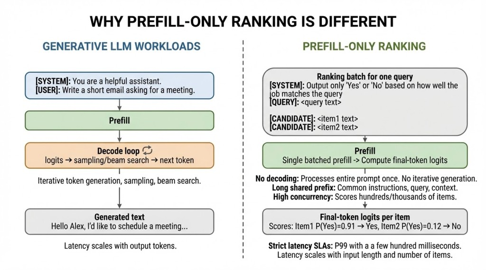
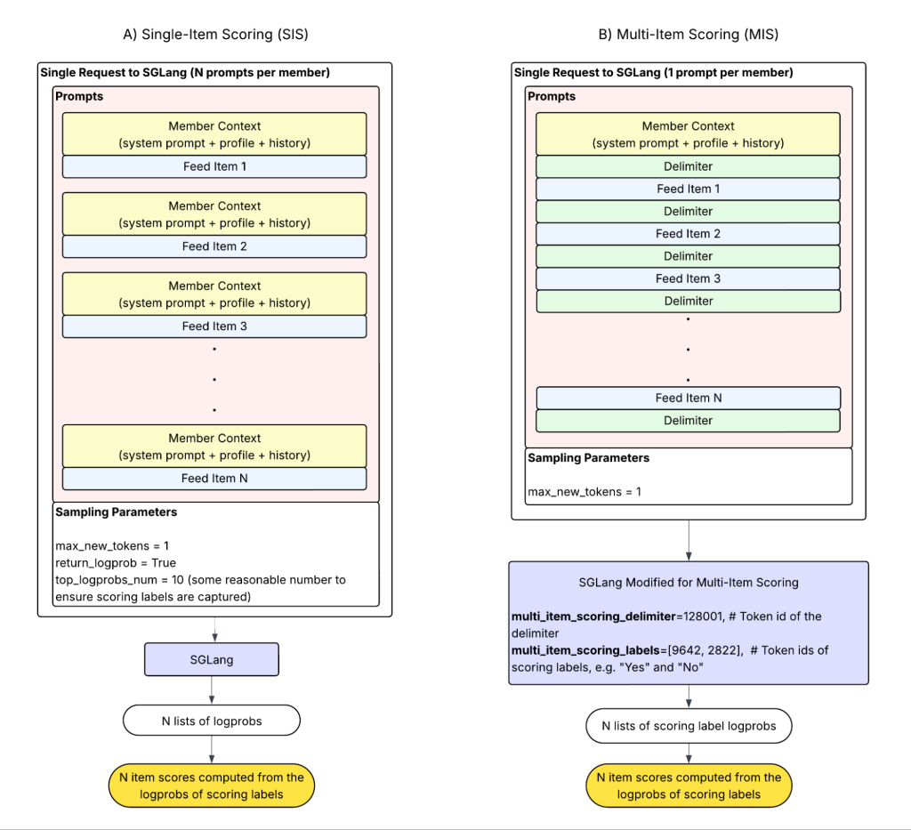
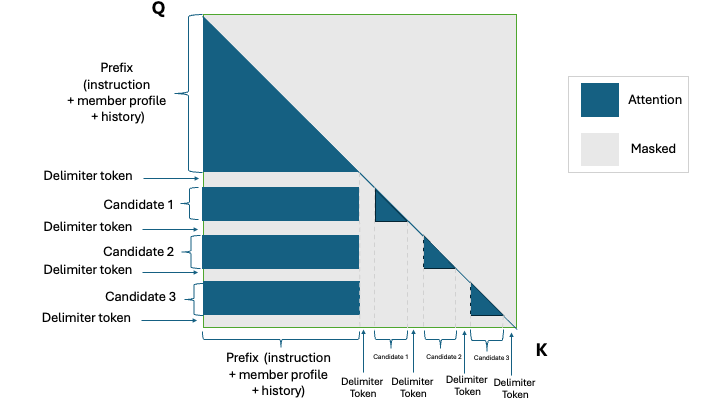
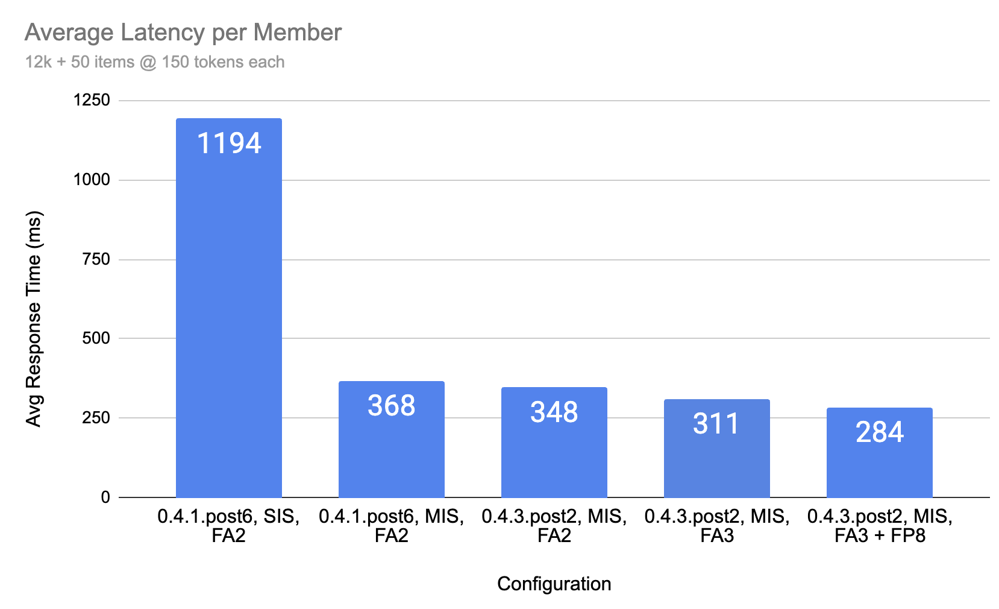
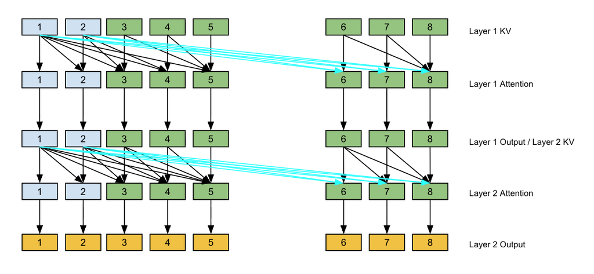
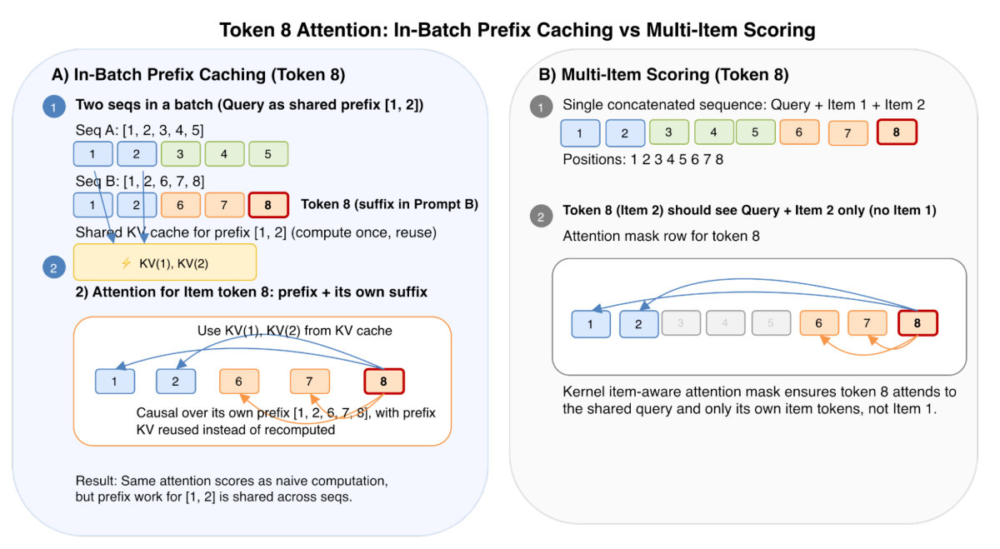
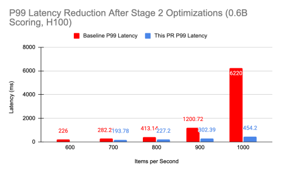
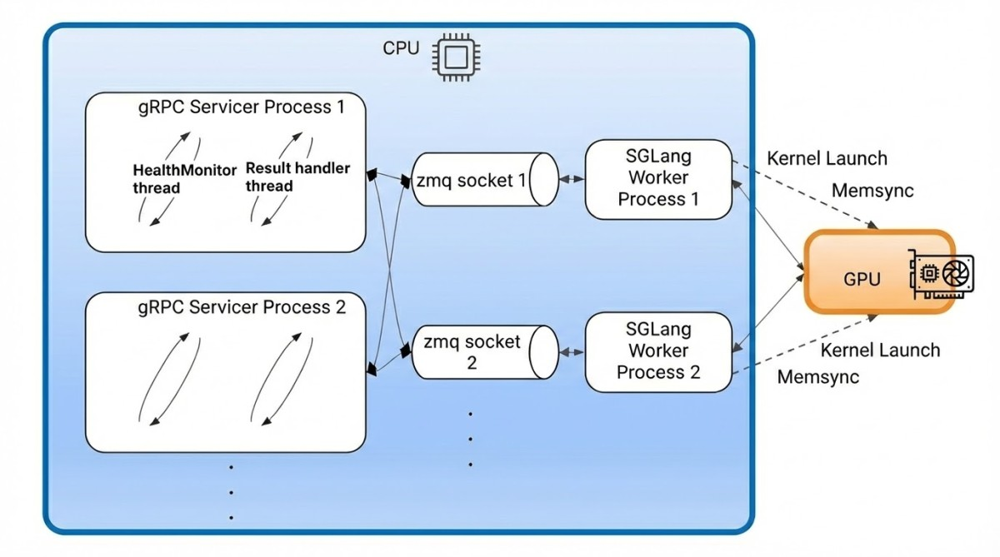
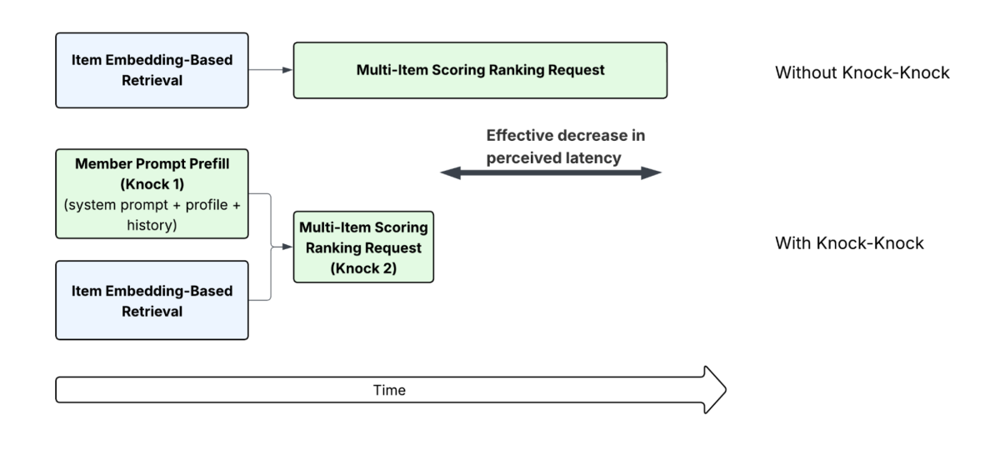

# MixLM: High-Throughput and Effective LLM Ranking via Text-Embedding Mix-Interaction

> **Venue**: Preprint (ACM 형식) · arXiv:2512.07846v2, 2026.01.31
> **Authors**: Guoyao Li, Ran He, Shusen Jing, Kayhan Behdin, Yubo Wang, Sundara Raman Ramachandran, Chanh Nguyen, Jian Sheng, Xiaojing Ma, Chuanrui Zhu, Sriram Vasudevan, Muchen Wu, Sayan Ghosh, Lin Su, Qingquan Song, Xiaoqing Wang, Zhipeng Wang, Qing Lan, Yanning Chen, Jingwei Wu, Luke Simon, Wenjing Zhang, Qi Guo, Fedor Borisyuk (LinkedIn, Mountain View, CA)
> **Platform**: **LinkedIn AI-driven Job Search** — Semantic Job Search에 **전 트래픽 배포**
>
> **관련 1차 자료** (§7에서 통합)
> - **Blog A**: [Turbocharging LinkedIn's Recommendation Systems with SGLang](https://www.linkedin.com/blog/engineering/ai/turbocharging-linkedins-recommendation-systems-with-sglang) · 2025-12-09 · Steven Shimizu 외 10인 — MIS 커널, FP8, FA3, Knock-Knock
> - **Blog B**: [Scaling LLM-Based Ranking Systems with SGLang at LinkedIn](https://www.linkedin.com/blog/engineering/ai/scaling-llm-based-ranking-systems-with-sglang-at-linkedin) · 2026-02-20 · Sundara Raman Ramachandran 외 4인 — prefill-only ranking 4단계 최적화. **본문에서 MixLM을 이름으로 언급한다**
> - **자매 논문**: [arXiv:2510.22101](https://arxiv.org/abs/2510.22101) — *Scaling Up Efficient Small Language Models Serving and Deployment for Semantic Job Search* (LinkedIn). **본 논문의 "Summarized, Pruned" baseline이 이 시스템이다** (§7.8)

**한 줄 정의**: LLM cross-encoder ranker의 병목은 **item text가 만드는 긴 prefill**이다. MixLM은 item 문서를 **encoder LLM으로 소수의 embedding token으로 압축**해 nearline cache에 저장하고, 서빙 시에는 **query text + embedding token을 섞어(mix-interaction)** ranker LLM에 넣는다. **동일 latency 예산에서 throughput 10.0× (요약 텍스트 대비) / 75.9× (full text 대비)**, 랭킹 품질은 full-text의 1.8 NDCG 포인트 이내.

---

## 1. Background

### 산업 검색·추천에서의 LLM ranking 현황

- LLM은 어휘 매칭이 놓치는 **미묘한 언어적 단서와 개념적 관계**를 포착해 relevance ranking에서 강력한 성능을 낸다.
- 그러나 **엄격한 latency·throughput 제약** 하에서의 배포는 여전히 어렵다. 특히 **cross-encoder** 방식은 user query와 candidate item text를 하나의 prompt로 합치므로 **수천 token**에 이르고, **prefill이 지배적**이며 attention 비용은 **context length에 대해 quadratic**하다.
- 그 결과 실무에서는 **① 더 작은 LLM으로 교체**하거나 **② 정보량이 큰 feature를 서빙 파이프라인에서 제거**하는 선택을 강요당한다.

### 기존 접근의 한계

| 방법 | 성격 | 문제점 | NDCG@10 | QPS (items/s/GPU) |
|---|---|---|---|---|
| **Bi-encoder (embedding retrieval)** | query·document를 **독립적으로** 임베딩 | **query–item interaction이 없다.** 세밀한 의미 매칭 불가 → **coarse first-stage filter 용도로만** 적합 | 0.8380 | > 1.6 × 10⁹ |
| **Full-text cross-encoder** | 전체 item text를 prompt에 포함 | **최고 품질이지만 배포 불가 수준의 비용** | **0.9432** | **290** |
| **Summarized / Pruned text** | item text를 요약·절단 | throughput은 오르지만 **품질 손실** | 0.9218 | 2,200 |

> **긴장 관계**: 품질(cross-encoder의 query–item interaction)과 효율(짧은 context) 중 하나를 포기해야 하는 구조였다. MixLM은 **interaction은 유지하되 context 길이만 줄이는** 제3의 축을 연다.

---

## 2. Motivation


> **Figure 1**: MixLM의 아키텍처. **오프라인 단계**에서 item 문서를 **encoder LLM**으로 처리해 compact embedding으로 만들고 **nearline cache**에 저장한다. **서빙 시점**에는 이 임베딩을 가져와 사용자의 query 및 선택적 보조 텍스트 feature와 **연결(concatenate)** 하고, 이 혼합 입력을 **ranker LLM**에 넘겨 relevance score를 얻는다.

### 핵심 통찰 1: 비용을 만드는 것은 query가 아니라 item text다

cross-encoder ranker의 prompt는 다음과 같이 구성된다.

```
prompt(q, i) = system prefix, q, i                                  ... (1)
p_yes(q, i) = P( i is relevant to q ) ∈ [0, 1]                      ... (2)
```

- 실제 운영에서 **item text는 중앙값 ~900 token**, **p99에서 `T_E` = 2,100 token**에 이른다.
- 반면 **query prefix `T_R`은 짧고**, 하나의 요청은 **같은 query로 수백~수천 개 item을 스코어링**한다.

> **따라서 압축의 표적은 명확하다** — item side다. 그리고 item text는 **query에 의존하지 않으므로 오프라인에서 미리 인코딩해 둘 수 있다.** 이것이 설계의 출발점이다.

### 핵심 통찰 2: item을 embedding token으로 바꿔도 mix-interaction은 유지된다

- bi-encoder는 query와 item을 **각자 벡터로 만든 뒤 내적**하므로 상호작용이 없다.
- MixLM은 item만 embedding token으로 바꾸고 **ranker LLM의 입력 시퀀스 안에서 query text token과 나란히 놓는다.** 그러면 **transformer의 attention이 그 둘 사이의 상호작용을 그대로 수행**한다.
- 결과: **입력 길이는 bi-encoder에 가깝고, 상호작용은 cross-encoder에 가깝다.**

### 핵심 통찰 3: 같은 query를 공유하므로 prefix를 상각할 수 있다

- 하나의 요청에서 수백~수천 item이 **동일한 query와 user context를 공유**한다.
- item token을 극단적으로 줄이고 나면(**~900 → 프로덕션에서 1 token**), 남은 비용은 **query-prefix 계산의 반복**이 지배한다.
- 따라서 **KV cache를 공유하는 in-batch prefix caching**이 두 번째 축의 최적화가 된다. **입력 압축과 prefix 상각은 곱해져서 효과를 낸다.**

---

## 3. Contributions

1. **MixLM 프레임워크**: 긴 item text를 **compact embedding token**으로 대체해 prompt 길이를 줄이는 mixed-input LLM ranking 구조.
2. **end-to-end 학습 파이프라인**: **full-text LLM ranker의 행동을 mixed-input 아키텍처로 옮기는 distillation loss**를 포함한 3단계 학습 레시피. encoder와 ranker를 **공동 학습**한다.
3. **프로덕션 서빙 스택**: mixed-input LLM ranking을 위한 서빙 시스템 — GPU throughput에서 **order-of-magnitude 개선**.
4. **전 트래픽 배포 사례**: LinkedIn semantic job search에 **full production scale로 배포**하고 실무 교훈을 공유. **DAU +0.47%.**

---

## 4. Method

### 4.1 아키텍처 — 두 개의 LLM

LLM을 세 부분으로 분해한다: **input embedding layer**, **transformer blocks**, **optional output head**.

```
Ranker LLM   :  F_R(·; Θ_R) = (f_R ∘ g_R)(·; θ_R)  :  V^T → [0, 1]        ... (3)
                  g_R : V^T → R^{T×H}   (input embedding layer)
                  f_R : R^{T×H} → [0,1] (decoder + binary classification head)

Encoder LLM  :  F_E(·; Θ_E) = (f_E ∘ g_E)(·; ω_E, θ_E) : V^T → R^{T×H}    ... (4)
                  output head 없음 — hidden representation 을 그대로 낸다
```

### 4.2 Mix-Interaction — prompt의 분해와 압축

prompt를 **ranker 파트**와 **encoder 파트**로 쪼갠다.

```
X_R = tokenize([system prefix, q]) ∈ V^{T_R}
X_E = tokenize([i])                ∈ V^{T_E}                              ... (5)
```

> **핵심 성질**: `X_E`는 **query `q`에 의존하지 않고 item description `i`에만 의존**한다. 따라서 **인코딩 결과를 nearline cache에 저장**할 수 있다.

압축 과정:

```
h_E = tokenize→encode(X_E) ∈ R^{T_E × H}
h_S = Samp( F_E(X_E) )     ∈ R^{T_S × H}          T_S ≪ T_E

  MixLM 은 last-N sampling 사용 — h_E 의 마지막 T_S 개 입력 token 에 대응하는 임베딩을 취한다.
  T_S = 1 이면 마지막 입력 token 의 임베딩만 사용.
```

최종 예측:

```
h_R = g_R(X_R)                                       # ranker 의 input embedding layer
p_yes(q, i; Θ) = f_R( [h_R ; h_S ; h_EOS] ) ∈ [0,1]  ... (6)

  [h_R ; h_S ; h_EOS] ∈ R^{(T_R + T_S + 1) × H}
  Θ = [Θ_R, Θ_E]
```

**효과적 시퀀스 길이의 변화**:

```
before :  T_R + T_E              (T_E = 2,100 at p99)
after  :  T_R + T_S + 1          (T_S = 1 in production)
```

- 요구 조건은 하나뿐이다 — **ranker의 hidden size가 encoder의 output dimension과 일치**할 것. 그 외에는 두 모델의 아키텍처가 달라도 된다. (실제로는 단순성과 학습 효율을 위해 **양쪽 모두 0.6B 동일 아키텍처**를 사용)
- **추가 이점**: 여러 item을 랭킹할 때 **모든 prompt가 같은 user와 query에 대응**하므로, **`X_R`의 KV cache를 공유**할 수 있다.

### 4.3 3단계 학습 (Table 1)

| | **Stage I**<br>Domain-specific Fine-Tuning | **Stage II**<br>Ranking Teacher Training | **Stage III**<br>Joint Encoder-Ranking Training |
|---|---|---|---|
| **Data** | Reasoning Dataset | Ranking Dataset | Ranking Dataset |
| **Samples** | **180k** | **10.9M** | **10.9M** |
| **Input Prompt Type** | Text (chain-of-thoughts) | Text | **Text + Embedding** |
| **Max Sequence Length** | 2,048 | 2,048 | **2,176** |
| **Trainable Module(s)** | Pretrained LLM | Ranker LLM | **Encoder LLM & Ranker LLM** |
| **Training Objective** | Distillation from relevance judge | SFT | SFT + Distillation from ranking teacher + Self-alignment |

#### 레이블 생성

- 실사용 로그에서 query–item 쌍을 표집하고, **7B in-house LLM을 relevance judge**로 써서 **5점 등급 점수 + 근거(rationale)** 를 생성한다. 정수 레이블은 **[0, 1]의 연속값 `p*_yes(q, j)`** 로 정규화된다.

#### Stage I: Domain Reasoning Fine-Tuning

- **7B relevance judge를 0.6B pretrained model로 증류**한다 — 두 모델의 **logit 사이 KL divergence** 사용.
- 데이터: **180K 샘플** + judge의 **chain-of-thought 응답**.
- 목적: query–item 쌍에 대한 **논리적 추론과 문맥 이해 능력**을 강화하여, 점수 부여의 **근거(rationale)** 를 모델이 파악하게 한다.

#### Stage II: Ranking Teacher Training

- Stage I 체크포인트에서 출발해 **10.9M 예제로 SFT** (**KL divergence loss**).
- 이 모델은 **긴 입력 prompt 때문에 온라인 서빙이 불가능**하지만, **Stage III의 teacher** 역할을 한다.
- 출력 분포를 `(p̂_yes, p̂_no)`로 표기.

#### Stage III: Joint Encoder-Ranking Training


> **Figure 2**: Stage III 학습 파이프라인. Ranker LLM은 **SFT Loss**(ground truth), **Distill Loss**(pure-text Teacher Ranker), **Self-Alignment Loss**(full-text prompt를 통과시킨 자기 자신의 출력)의 세 신호를 동시에 받는다. Encoder LLM은 ranker의 내부 표현과 정렬되도록 함께 학습된다.

- **초기화**: ranker는 **Stage I 체크포인트**, encoder는 **0.6B GTE (General Text Embedding, contrastive learning으로 학습)**.
- 학습 대상: `Θ = [Θ_R, Θ_E]` **전체**.

**손실 함수 4종**

```
① Soft-Label SFT Loss — ground truth 와의 정렬
   L_SFT(Θ) = KL( (p*_yes, p*_no) || (p_yes(Θ), p_no(Θ)) )

② Ranking Distillation Loss — Stage II teacher 와의 정렬
   L_distill(Θ) = KL( (p̂_yes, p̂_no) || (p_yes(Θ), p_no(Θ)) )

③ Self-Alignment Loss — mixed input 과 full-text input 의 내부 표현 정렬
   full text prompt 를 ranker(Θ_R)에 통과시켜 얻은
     출력 분포 (p̃_yes, p̃_no) 와 마지막 입력 token 의 최종 hidden state h̃_last ∈ R^H 를 수집

   L_hidden-align(Θ) = 1 − cossim( h_last(Θ),  h̃_last(Θ_R) )
   L_pred-align(Θ)   = KL( (p̃_yes(Θ_R), p̃_no(Θ_R)) || (p_yes(Θ), p_no(Θ)) )
   L_align(Θ)        = α · L_pred-align(Θ)  +  β · L_hidden-align(Θ)          α, β ≥ 0

④ 전체
   L_total(Θ) = L_SFT(Θ) + λ_distill · L_distill(Θ) + λ_align · L_align(Θ)
```

> **teacher가 student보다 작을 수도 있다는 점이 특이하다.** 일반적인 KD는 큰 teacher → 작은 student지만, 여기서 student(encoder + ranker)는 **teacher보다 클 수 있다.** teacher의 존재 이유는 **capacity가 아니라 입력 형태**다 — pure text로 동작하는 teacher는 **학습이 쉬워 원 데이터셋 레이블보다 깨끗한 예측**을 제공하고, 이것이 **gradient variance를 줄여 수렴을 돕는다.**

> **Self-alignment의 역할**: 저자들은 이를 **regularization 효과**로 설명한다 — overfitting을 방지한다. `L_pred-align`과 `L_hidden-align`은 각각 `Θ_R`만의 함수인 full-text 경로와, `Θ` 전체의 함수인 mixed-input 경로를 **같은 곳으로 수렴시킨다.**

**Phased Curriculum Learning**

| Phase | `λ_align` | `λ_distill` | 목적 |
|---|---|---|---|
| **Phase 1** | **증가** | 감소 | **space alignment 우선** — encoder가 ranker의 내부 표현과 매끄럽게 통합되는 임베딩을 만들도록 |
| **Phase 2** | 감소 | **증가** | **ranker LLM 조정** — relevance score 예측 정확도 개선 |

### 학습 vs 추론

| 단계 | 과정 |
|---|---|
| **오프라인** | encoder LLM이 item text를 인코딩 → `h_S`를 **nearline cache**에 저장 |
| **학습** | 3단계. Stage III에서 encoder·ranker **공동 학습**, 4종 손실 + 2단계 curriculum |
| **추론** | cache에서 item embedding fetch → query text + 보조 텍스트 feature와 concat → ranker LLM 1회 forward. **effective sequence length = `T_R + T_S + 1`** |

---

## 5. Inference Engine Optimization

> 📌 이 절은 논문의 서술이다. 같은 내용을 LinkedIn 엔지니어링 블로그가 **PR 단위로 훨씬 자세히** 공개했다 — **§7**에서 통합했다. 특히 여기의 multi-item scoring은 §7.3, in-batch prefix caching은 §7.4, §5.3의 CPU 오버헤드 절감은 §7.5가 전모다.

### 5.1 Text–Embedding Mixed Input

- 서빙 인터페이스를 확장해 **사전 계산된 embedding tensor를 텍스트와 함께** 받도록 했다.
- gRPC 요청 스키마에 **`feature payload`** 를 추가: **binary tensor buffer + data type + optional serialization format(NumPy)**.
- 서버 측 전처리 모듈이 payload를 native tensor로 디코딩·검증하고 **metadata 기반 reshaping/casting** 후 모델 입력 컨텍스트에 붙인다.
- **text-only 요청과 완전 후방 호환**되며 직렬화 오버헤드가 미미하다.

### 5.2 Shared-Prefix Prefill Optimization

item token을 **중앙값 ~900 → 프로덕션 수 token**으로 줄이고 나면, **query-prefix 반복 계산이 비용을 지배**한다.

```
T_q = query-prefix length,  T_i = full-text item length,  N_i = ranking depth
Attention ∝ L²,   Linear ∝ L

Naïve prefill (full-text)
  F_att  ∝ N_i (T_q + T_i)²                       F_lin ∝ N_i (T_q + T_i)

Amortized prefill (full-text)   — query-prefix attention 을 1회 계산 후 재사용
  F_att  ∝ T_q² + N_i (2 T_i T_q + T_i²)          F_lin ∝ T_q + N_i T_i

Amortized prefill + MixLM       — item 압축 계수 K, item token 은 T_i/K
  F_att  ∝ T_q² + N_i ( 2 (T_i/K) T_q + (T_i/K)² )
  F_lin  ∝ T_q + N_i T_i / K
```

**`N_i = 250`, `K = 450` 대입 (Table 2)**

| Conditions | Total attention cost | Total linear-layer cost |
|---|---|---|
| Naive, `N_i = 250` | ∝ 250 (T_q + T_i)² | ∝ 250 (T_q + T_i) |
| Amortized, `N_i = 250` | T_q² + 500 T_i T_q + 250 T_i² | T_q + 250 T_i |
| **Amortized + MixLM** | **T_q² + (10/9) T_i T_q + (1/810) T_i²** | **T_q + (5/9) T_i** |

> **item-side 비용이 대략 `K` 배만큼 줄어든다.** `T_i²` 항의 계수가 **250 → 1/810** 으로 5자릿수 감소하는 것이 핵심이다.

상각의 구현 두 가지:

| 메커니즘 | 내용 |
|---|---|
| **In-batch prefix caching** | 첫 prompt의 **KV state를 재사용**해 batch 내 모든 item이 같은 query-prefix 계산을 공유. suffix token은 (1) dense paged attention으로 첫 prompt의 prefix token 전체에 attend, (2) regular causal attention으로 자기들끼리 attend |
| **Multi-item scoring** | 여러 item을 **구분자로 이어 하나의 시퀀스**로 만든다. FlashInfer의 **item-aware masking**으로 item 간 cross-attention을 차단 |

> ⚠️ **용어 주의 — 이 마스킹은 attention을 "여는" 것이 아니라 "막는" 것이다.** 목적은 패킹된 multi-item 스코어링을 **개별 스코어링과 동치로 만드는 것**이며, 순수한 효율 장치다(§5는 Inference Engine Optimization 절이다). 실제로 논문은 **"suffix tokens attend to themselves via regular causal attention"** 이라고 명시한다 — 즉 **MixLM의 decoder는 전 구간 causal이고, prefix-LM이나 bidirectional attention을 쓰지 않는다.** query 토큰이 item을 보지 못하는 구조적 한계는 그대로 남아 있으며, 논문의 baseline(Table 3)에 **BERT cross-encoder가 없다는 점**과 함께 읽어야 한다.

### 5.3 Inference Engine CPU Overhead Reduction

SGLang 엔진 최적화 이후 **Python gRPC 서비스가 지배적 병목**으로 드러났다 — 비동기 Python 사용에도 **GIL**로 인해 요청 역직렬화·feature 디코딩·컨텍스트 구성이 제약되었다.

| 최적화 | 내용 | 효과 |
|---|---|---|
| **Multi-Process gRPC** | gRPC frontend를 SGLang 엔진에서 **분리**. 요청 처리·전처리를 다중 CPU 프로세스로 병렬화 | **throughput +40%** |
| **Batch Send** | 한 query의 모든 item prompt를 **단일 ZMQ 메시지**로 직렬화·전송 → 스케줄러가 batch를 **원자적으로** 처리해 in-batch prefix caching이 확실히 적용됨 | prefix caching 신뢰성 확보 |
| **Multi-Process Parallelization** | GPU당 **스케줄러 프로세스 5개**, 각각 **GPU 메모리 20%** 할당 | CPU 스케줄링 병렬화, GPU 활용률 유지 |
| **Redundant KV-Cache 제거** | SGLang의 기본 KV-cache 동작은 **autoregressive decoding용**인데, 이 워크로드는 **prefill-only scoring**이다. 요청 완료 즉시 KV cache 메모리를 해제 | CPU 오버헤드 감소 + **유효 GPU 메모리 증가 → 더 큰 batch, 더 높은 동시 throughput** |

---

## 6. Experiments

### 6.1 Setup

- 오프라인 평가: **내부 LLM relevance judge가 레이블링한 held-out test set**
- 지표: **NDCG@10**, 그리고 **p99 end-to-end latency 500ms 제약** 하에서의 **GPU당 초당 스코어링 item 수**
- 학습 인프라: **8 노드 × 8 NVIDIA H100**, **PyTorch FSDP**(decoder 파라미터·gradient·optimizer state 샤딩), 노드 내 **NVLink** / 노드 간 **InfiniBand**. layer-wise prefetching, **Liger Kernel**(fused RMSNorm, RoPE, SwiGLU, fused CrossEntropy)
- **총 학습 비용: 70B token에 대해 약 700 H100 GPU-hours**

### 6.2 Main Results

#### 랭킹 품질 (Table 3)

| Model | NDCG@10 |
|---|---|
| Full Text | 0.9432 |
| Summarized, Pruned | 0.9218 |
| **MixLM** | **0.9239** |
| Embedding Retrieval | 0.8380 |

#### GPU 효율 (Table 4, 500ms latency 예산)

| Model | QPS (Items/s/GPU) | Latency | GPU |
|---|---|---|---|
| Full Text | 290 | < 500 ms | H100 |
| Summarized, Pruned | 2,200 | < 500 ms | H100 |
| **MixLM** | **22,000** | **< 500 ms** | H100 |
| Embedding Retrieval | > 1.6 × 10⁹ | < 100 ms | A100 |

> **정리**: MixLM은 **요약 텍스트 대비 10.0× / full-text 대비 75.9×** throughput을 내면서, full-text 대비 NDCG 손실은 **1.8 포인트**에 그친다. 또한 **요약 텍스트보다 품질이 오히려 약간 높다** (0.9239 vs 0.9218) — **압축이 요약보다 정보를 덜 잃는다**는 뜻이다.

#### Online A/B Test (Table 5)

| Experiment Group | ΔDAU |
|---|---|
| Classic Job Search | — |
| **Semantic Job Search (MixLM)** | **+0.47%** |

- 기존 프로덕션 baseline(요약 텍스트 LLM + 공격적 ranker pruning)과 **동등한 relevance**를 유지하면서 **10배 throughput**을 확보 → **LLM 랭킹 기반 Semantic Job Search를 최초로 전 트래픽 배포**했고, 그 결과가 **DAU +0.47%** 다.

### 6.3 Ablation Study

#### (a) 학습 데이터 규모 (Table 6)

| Training Samples | ΔNDCG@10 |
|---|---|
| 160K | — |
| 400K | +0.0250 |
| 800K | +0.0280 |
| 1.08M | +0.0334 |

#### (b) item당 embedding token 수 (Table 7)

| Tokens / Item | ΔNDCG@10 |
|---|---|
| 1 | — |
| 5 | +0.0017 |
| 10 | +0.0044 |
| 20 | +0.0111 |
| 30 | +0.0158 |
| 40 | +0.0172 |
| 50 | +0.0198 |

> **품질은 token 수에 단조 증가하지만, 프로덕션은 latency 제약 때문에 `T_S = 1`을 택했다.** 이 표는 **남아 있는 품질 여유(50 token까지 +0.0198)를 명시적으로 보여준다** — latency 예산이 늘면 바로 회수할 수 있는 몫이다.

#### (c) Domain Reasoning Fine-Tuning (Stage I)의 효과 (Table 8)

| Ranker Base Model | ΔNDCG@10 |
|---|---|
| Vanilla LLM | — |
| **Domain-Reasoning Tuned LLM** | **+0.0185** |

#### (d) 보조 손실의 기여 (Table 9)

| Setup | ΔNDCG@10 |
|---|---|
| No auxiliary loss | — |
| + self-alignment | +0.0014 |
| + distillation | +0.0091 |
| **+ self-alignment + distillation** | **+0.0108** |

> **distillation이 지배적 기여(+0.0091)** 이고, self-alignment는 단독으로는 미미(+0.0014)하지만 **결합했을 때 추가 이득**을 준다 (0.0091 → 0.0108).

#### (e) Curriculum 전략 (Table 11, small sub-dataset)

| Curriculum Strategy | NDCG@10 |
|---|---|
| no curriculum learning (Task) | — |
| **two-phase (Alignment → Task)** | **+0.0020** |
| three-phase (Alignment → Balanced → Task) | +0.0015 |

> **2단계가 3단계보다 낫다.** 저자들의 해석 — **alignment 중심에서 task 중심으로의 직접 전환**이 중간 균형 단계를 두는 것보다 효과적이다. ranker–encoder 정렬이 충분히 확립되고 나면 **점진적 중간 단계 없이 바로 downstream task를 최적화**하는 편이 낫다.

#### (f) 추론 최적화의 기여 (Table 10, < 500ms latency)

| Configuration | Prefix Optimization | QPS (Items/s/GPU) |
|---|---|---|
| **Raw-text** | None | 270 |
| | Multi-Item Scoring | 275 |
| | In-Batch Prefix Cache | 290 |
| **Summarized, Pruned** | None | 1,650 |
| | Multi-Item Scoring | 2,100 |
| | In-Batch Prefix Cache | 2,200 |
| **MixLM** | None | 3,000 |
| | Multi-Item Scoring | 20,000 |
| | **In-Batch Prefix Cache** | **22,000** |

> **이 표가 §2 통찰 3을 정량적으로 확증한다.** raw-text에서 prefix 최적화의 효과는 **270 → 290 (+7%)** 로 미미하다. 그러나 MixLM에서는 **3,000 → 22,000 (7.3×)** 이다. **입력 압축이 먼저 이루어져야 prefix 상각이 의미를 갖는다** — 두 최적화는 더해지는 것이 아니라 **곱해진다.**

---

## 7. LinkedIn 엔지니어링 블로그 2편 — 논문 밖의 서빙 스택

> 논문 §5는 서빙 스택을 서너 문단으로 요약하고 넘어간다. LinkedIn 엔지니어링 블로그 2편이 그 내부를 PR 단위로 공개하며, **논문이 밝히지 않은 사실 여럿을 확정한다** — 특히 `Summarized, Pruned` baseline의 정체(§7.8)와 프로덕션 입력 형태(§7.8).
>
> 이 절의 서술은 블로그 원문에 근거한다. 원문에 없는 해석은 **(해석)** 으로 표시했다.

### 7.1 두 글의 위치

| | **Blog A** | **Blog B** |
|---|---|---|
| **제목** | Turbocharging LinkedIn's Recommendation Systems with SGLang | Scaling LLM-Based Ranking Systems with SGLang at LinkedIn |
| **날짜** | 2025-12-09 | 2026-02-20 |
| **저자** | Steven Shimizu, Qing Lan, Tejas Dharamsi, Sundara Raman Ramachandran, Arup De, Yubo Wang, Akhilesh Gupta, Yanning Chen, Ata Fatahi, Zhipeng Wang, Biao H. | Sundara Raman Ramachandran, Qing Lan, Chanh Nguyen, Jian Sheng, Chuanrui Zhu |
| **범위** | Multi-Item Scoring 커널, FP8, FlashAttention 3, Knock-Knock | prefill-only ranking의 4단계 최적화 여정 |
| **MixLM 논문과의 관계** | **§5.2의 multi-item scoring이 여기서 나왔다** | **§5.3의 전모. 본문에서 MixLM을 이름으로 언급한다** |

**타임라인**

```
2025-12-09  Blog A
2025-12     MixLM arXiv v1 (2512.07846)
2026-01-31  MixLM arXiv v2  ← 이 문서가 요약한 판본
2026-02-20  Blog B          ← 가장 최신 서술
```

- **저자가 크게 겹친다.** Qing Lan, Chanh Nguyen, Jian Sheng, Chuanrui Zhu, Sundara Raman Ramachandran, Yubo Wang, Yanning Chen, Zhipeng Wang 등이 MixLM 논문 저자 목록에 있다. 세 문서는 **같은 팀의 같은 작업**을 서로 다른 각도에서 서술한 것이다.
- 따라서 블로그를 "참고 자료"가 아니라 **논문 §5의 확장판**으로 읽는 것이 맞다.

---

### 7.2 prefill-only ranking이라는 워크로드 규정 (Blog B)



> **Figure B-1**: text generation과 prefill-only ranking의 대비. 생성은 프롬프트를 한 번 읽고 토큰을 하나씩 이어 붙이지만, 랭킹은 프롬프트를 한 번 읽고 **마지막 토큰의 logit만** 꺼낸다. *(출처: Blog B, Figure 1)*

Blog B는 논문이 하지 않는 일을 한다 — **왜 범용 LLM 서빙 스택이 이 워크로드에 맞지 않는지**를 네 가지 성질로 규정한다.

| 성질 | 내용 | 범용 스택에서 낭비되는 것 |
|---|---|---|
| **No decoding** | 프롬프트를 1회 처리하고 **마지막 토큰의 logit만** 반환. 반복 생성·sampling·beam search 없음 | decode loop, sampling, KV cache 갱신 |
| **Long shared prefix** | 한 query의 모든 prompt가 **system instruction + query text + member context를 공유**. item suffix만 다르다 | prefix KV 반복 계산 |
| **High concurrency** | 단일 query가 **수백~수천 item**을 스코어링 | 요청 단위로 설계된 스케줄링 |
| **Strict latency SLA** | 부하 상태에서 **end-to-end p99가 수백 ms 이내** | 대화형·저동시성 가정의 코드 경로 |

> **이 규정이 논문의 §2 통찰 3과 정확히 같은 관찰이다.** 논문은 이것을 압축 설계의 근거로 썼고, 블로그는 **서빙 엔진 개조의 근거**로 썼다. 같은 관찰에서 두 갈래의 작업이 나왔다.

---

### 7.3 Multi-Item Scoring의 내부 (Blog A) — 논문 §5.2가 한 줄로 넘긴 것



> **Figure A-1**: single-item scoring(SIS)과 multi-item scoring(MIS)의 대비. SIS는 N개 prompt를 각각 보내 member prefix를 N번 반복하고, MIS는 하나의 prompt로 합친다. *(출처: Blog A, Figure 1)*

**prompt 포맷**

```
<member prefix (system prompt + profile + history)><DELIM><item 1><DELIM><item 2>...<DELIM><item N><DELIM>
```

**attention mask**



> **Figure A-2**: MIS attention mask. 파란색이 attend, 회색이 masked. *(출처: Blog A, Figure 2)*

> **이 그림이 §10.2의 논지를 시각적으로 그대로 확증한다.** 읽는 법:
> - **prefix 블록은 하삼각형이다** — prefix 내부도 **causal**이지 bidirectional이 아니다.
> - **오른쪽 위 전체가 회색이다** — prefix 행은 어떤 candidate도 보지 못한다. 즉 **`q → item` 차단**.
> - 각 candidate는 **prefix 전체(꽉 찬 사각형)** 와 **자기 자신(작은 삼각형)** 만 본다 — `item → q`는 full, `item ↔ item`은 차단.
>
> 곧 §10.2 설계 공간 표의 **causal 행 그대로**이며, prefix-LM도 block-bidirectional도 아니다.

**FlashInfer 커널 개조** — 네이티브 FlashInfer도 custom mask를 지원하긴 했으나, **전체 attention score를 계산한 뒤 마스크를 덧씌우는** 방식이라 item을 따로 보내는 것보다 오히려 느렸다. 그래서 커널 자체를 고쳤다.

1. FA2·FA3 템플릿에 **효율적인 MIS mask** 구현
2. FA3가 **batch size > 1**을 지원하도록 확장
3. **skip tiles** 구현 — causal mask 이상으로 계산을 건너뛴다
4. mask를 **L1 cache(thread register)에 preload**

**SGLang 측 변경** — 서버를 MIS 모드로 초기화할 때 파라미터 두 개를 받는다: **delimiter token ID**와 **scoring-label token ID 목록**. 추론 시 각 item 경계에서 **delimiter 직전 토큰의 logit**을 취하고 지정된 label token의 log-prob을 읽어 **N × K 행렬**(N items × K labels)을 낸다.

> **그리고 결정적인 한 줄** — *"Positional encoding is also adjusted accordingly to make sure each item aligns with its single item scoring position."*
>
> **§10.4-③이 제기한 position id 문제가 실재했고, LinkedIn은 이미 해결했다.** 각 item의 위치는 패킹된 시퀀스 상의 위치가 아니라 **단독 스코어링이었을 때의 위치**로 맞춰진다. (단, Blog B의 Figure B-8 패널 B는 MIS를 `Positions: 1 2 3 4 5 6 7 8`로 그린다 — 그 그림은 마스킹을 설명하는 도식이고, 위치 처리에 관해서는 이를 구현한 Blog A의 서술이 우선한다.)

**결과**



> **Figure A-3**: 요청당 평균 응답시간. 워크로드는 **12k token prefix + 50 items × 150 token**. *(출처: Blog A, Figure 3)*

| 구성 | 평균 latency | 직전 대비 |
|---|---|---|
| 0.4.1.post6, **SIS**, FA2 (prefix caching 켬) | **1,194 ms** | — |
| 0.4.1.post6, **MIS**, FA2 | **368 ms** | **−69%** |
| 0.4.3.post2, MIS, FA2 *(버전 업만)* | 348 ms | −5% |
| 0.4.3.post2, MIS, **FA3** | 311 ms | −11% |
| 0.4.3.post2, MIS, FA3 + **FP8** | **284 ms** | −9% |

> **누적 1,194 → 284 ms, 4.2×.** 블로그 본문은 각 단계를 백분율로만 서술하는데, 그림에 절대값이 있어 사슬 전체가 드러난다.

> **주의 — MIS의 이득은 워크로드가 정한다. (해석)**
> 여기서 MIS는 **−69%** 인데, 논문 Table 10의 raw-text 행에서는 **270 → 275 (+2%)** 로 사실상 무의미하다. 모순이 아니라 **prefix/item 길이 비율의 문제**다.
>
> | 워크로드 | prefix | item | 공유되는 몫 | MIS 효과 |
> |---|---|---|---|---|
> | Blog A (feed 랭킹) | **12,000 token** | 150 token | 압도적 | **−69%** |
> | 논문 Table 10 raw-text | 짧은 query | ~900 token (중앙값) | 미미 | +2% |
>
> **상각할 prefix가 커야 prefix 상각이 의미를 갖는다.** 논문 §2 통찰 3의 "같은 query를 공유하므로 prefix를 상각할 수 있다"는 명제는, item을 먼저 압축해 **상대적으로** prefix가 지배적이 된 뒤에야 발동한다. 논문의 Table 10과 Blog A의 그림은 그 명제를 양쪽 극단에서 각각 보여준다.

---

### 7.4 In-Batch Prefix Caching의 내부 (Blog B)

논문 §5.2가 MIS와 나란히 언급한 두 번째 메커니즘. SGLang의 기존 prefix cache는 **forward pass가 2회** 필요하다 — 캐시를 채우는 pass 하나, item을 스코어링하는 pass 하나. 큰 랭킹 배치에서는 이 추가 pass가 throughput을 제한한다. IBPC는 **단일 forward pass 안에서** prefix KV를 재사용해 그 오버헤드를 없앤다.

**동작**



> **Figure B-7**: in-batch prefix caching. 배치 첫 prompt에서 계산한 prefix KV(하늘색 화살표)를 나머지 prompt의 suffix 토큰이 **모든 레이어에서** 재사용한다. *(출처: Blog B, Figure 7)*

배치에 두 prompt가 있다고 하자.

```
Prompt A: [1, 2, 3, 4, 5]
Prompt B: [1, 2, 6, 7, 8]

공유 prefix [1, 2] 는 동일한 hidden state 와 KV 를 만든다.
→ Prompt B 에서 다시 계산하지 않고 Prompt A 의 prefix KV 를 그대로 쓴다.
```

prefix KV를 배치 첫 prompt로 1회 계산한 뒤, **KV 계산과 attention 사이에서 forward pass를 가로채** 나머지 item이 그 KV를 직접 쓰게 한다.

**attention merging** — suffix 토큰의 attention은 두 조각을 합쳐 만든다.

```
prefix attention : suffix 토큰이 공유 prefix KV 에 attend
suffix attention : suffix 토큰끼리 표준 causal attention

두 결과를 log-sum-exp 로 결합  →  수치적으로 정확, scoring semantics 불변
```

> **`log-sum-exp` 결합이 §10.2의 핵심 주장을 다시 확증한다.** 이 병합이 성립하려면 prefix KV가 **item과 무관하게 한 번 계산된 값**이어야 한다. Figure B-7에서 prefix 토큰 1, 2는 **모든 레이어에서 자기들끼리만** attend하고 6, 7, 8을 보지 않는다. 즉 `캐시 재사용 ⟺ query 표현이 item에 독립`이라는 항등식이 레이어 단위로 그림에 그려져 있다.

**MIS와의 비교** — pruned 0.4B 모델, query ~60 token, item ~145 token 기준:

| 방식 | Throughput (items/s) |
|---|---|
| Multi-Item Scoring | ~2,100 |
| **In-Batch Prefix Caching** | **~2,200** |



> **Figure B-8**: Item 2의 Token 8이 attention을 계산하는 방식 비교. **(A) IBPC** — 배치 입력을 그대로 두고 prefix KV만 재사용. **(B) MIS** — 하나로 이어 붙인 시퀀스에 커널 수준 item-aware masking. *(출처: Blog B, Figure 8)*

> **성능은 대등하고, 차이는 "최적화가 어느 층위에 사는가"다.**
>
> | | **MIS** | **In-Batch Prefix Caching** |
> |---|---|---|
> | 층위 | attention **커널 내부** | 실행 스택 **상위** |
> | 입력 | 여러 item을 하나로 concat | **표준 배치 입력 유지** |
> | 필요한 것 | item-aware mask를 넣은 전용 커널 | 커널 수준 마스킹 불필요 |
> | 대가 | **커널 구현과 강하게 결합** | 결합도 낮음 |
>
> 논문은 두 메커니즘을 병렬로 나열하기만 하는데, 블로그는 **왜 둘 다 유지하는지**를 설명한다 — 같은 값을 다른 결합도로 사는 선택지다. MIS는 PR #10979로 SGLang에 업스트림되었다.

---

### 7.5 4단계 최적화 여정 (Blog B) — 논문 §5.3의 전모

| Stage | 문제 | 해결 | PR | 실측 |
|---|---|---|---|---|
| **1. 배칭** | 한 요청에 prompt가 여러 개여도 **토크나이즈가 순차**였다. item 100개 × 2k token이면 GPU가 관여하기도 전에 수백 ms 소모 | in-request **batch tokenization** | **#5141** | — |
| | embedding처럼 **단일 prompt 요청이 꾸준히 흘러드는** 워크로드는 애초에 배치가 안 된다 | **Async Dynamic Batch Tokenizer** — asyncio로 동시 도착 요청을 모아 ThreadPoolExecutor로 일괄 토크나이즈. batch-size·timeout 임계값으로 조절 | **#9382** | Embedding-0.6B, 500 token, QPS 500: **P99 4,583 → 464 ms (≈10×)** |
| | 배치로 토크나이즈해도 **tokenizer manager가 ZMQ로 하나씩 전송**해 스케줄러 도달 시 배치 구조가 소실. 50개가 12 + 38로 쪼개져 forward pass가 늘었다 | **Batch send** — 토크나이즈된 배치를 **단일 ZMQ 메시지**로 전송 | **#9436** | 0.6B, 300 token, batch 50: **70.39 → 41.12 ms (−41.5%)** |
| **2. scoring 전용 경로** | 랭킹에 필요 없는 decode loop·sampling·KV cache 갱신을 기본 경로가 그대로 탔다 | 전용 **scoring API** 도입 + scoring 최적화 실행 경로. prefill 계산은 생성 경로와 **동일하게** 두어 정확도 보존, 나머지를 제거 | **#6460** | — |
| | decode를 건너뛴 뒤에도 GPU가 CPU를 기다렸다 — 불필요한 per-token logprob 추출, 잘게 쪼개진 GPU→CPU memcpy, 커널 실행을 지연시키는 동기화 지점 | per-token logprob 추출 생략, 다수의 작은 복사를 **단일 vectorized gather**로, CPU 후처리를 GPU 실행과 **오버랩** | **#8840**, **#9748** | 0.6B, 300 token: **P99 6,220 → 454 ms (13.7×)**, throughput **+25%** |
| **3. prefix 상각** | 모든 candidate가 같은 query prefix를 쓰는데 매번 KV를 재계산 | **In-Batch Prefix Caching** (→ §7.4) / **MIS** (→ §7.3) | **#10979** | pruned 0.4B: MIS ~2,100 / IBPC ~2,200 items/s |
| **4. Python 런타임** | 세대별 GC가 장수 객체를 훑으며 **수 초마다 100–300 ms 정지**. sub-500ms p99에서는 치명적 | 트래픽 투입 전 서버를 **warm-up**해 장수 객체를 확정한 뒤 **`gc.freeze()`** 로 스캔 대상에서 제외. 런타임 freeze/unfreeze 훅 추가 | **#9241** | 주기적 latency spike 소멸 |
| | Python gRPC 계층의 **GIL** — 요청 처리·역직렬화·전처리가 프로세스당 CPU 코어 하나로 직렬화 | **multi-process 서빙** — gRPC servicer 프로세스가 네트워크 I/O와 전처리를, 별도 SGLang 엔진 프로세스가 추론을 담당. 프로세스 간은 ZMQ | — | — |
| | gRPC 병목을 걷어내자 **SGLang 스케줄러 자체가 CPU-bound**. GPU에 여유가 있는데 배치 준비·디스패치가 못 따라갔다 | GPU당 **스케줄러 프로세스 다중화** + GPU 메모리 분할 | — | **throughput +40%** |



> **Figure B-6**: Stage 2 최적화 전후 P99 latency (0.6B, 300 token, H100). 빨강이 baseline, 파랑이 최적화 후. *(출처: Blog B, Figure 6)*

> **13.7×는 포화점의 수치다. (해석)** 그림의 x축은 items/s 600 → 1,000이다.
>
> | items/s | baseline P99 | 최적화 후 | 배수 |
> |---|---|---|---|
> | 700 | 282 ms | 194 ms | 1.5× |
> | 800 | 413 ms | 227 ms | 1.8× |
> | 900 | 1,201 ms | 302 ms | 4.0× |
> | **1,000** | **6,220 ms** | **454 ms** | **13.7×** |
>
> 균일한 가속이 아니라 **baseline이 무릎을 꺾는 지점을 뒤로 미는** 것이다. 헤드라인 13.7×는 baseline이 이미 붕괴한 부하에서 측정된 값이며, 실질적 의미는 "**500 ms 예산 안에서 감당 가능한 부하가 800 → 1,000 items/s로 올라갔다**"에 가깝다.



> **Figure B-9**: gRPC servicer 프로세스와 SGLang worker 프로세스 구성. *(출처: Blog B, Figure 9)*

> ⚠️ **논문과 블로그의 스케줄러 구성 수치가 다르다.**
>
> | | 구성 | 메모리 |
> |---|---|---|
> | **논문 §5.3** | GPU당 스케줄러 **5개** | 각 **20%** |
> | **Blog B** | "예: **2 workers**" | "예: 각 **~50%**" |
>
> 블로그는 명시적으로 예시(e.g.)로 제시하므로 모순은 아니다. **논문 쪽이 프로덕션 구성**으로 읽는 편이 자연스럽고, 블로그는 메커니즘 설명을 위한 최소 예시를 든 것으로 보인다. *(해석)*

> **Blog B가 MixLM을 이름으로 지목하는 대목이 여기다.**
>
> > *"For some deployments—especially those using **aggressive context compression techniques (like MixLM)**, input lengths became short enough that GPU prefill completed very quickly, **shifting the bottleneck from GPU execution to CPU-side scheduling** inside SGLang."*
>
> 논문 Key Takeaway 7("병목은 결국 GPU가 아니라 CPU였다")의 **1차 근거**다. 그리고 인과가 명시되어 있다 — **MixLM이 입력을 너무 짧게 만들어서** CPU가 병목이 되었다. 압축이 성공한 결과로 병목이 이동한 것이지, 별개의 문제가 아니다.

---

### 7.6 Knock-Knock — MixLM에는 쓸 자리가 없는 최적화 (Blog A)



> **Figure A-7**: Knock-Knock 유무의 타임라인 대비. 위는 retrieval이 끝나야 랭킹 요청이 시작되고, 아래는 **member prompt prefill(Knock 1)이 retrieval과 병렬로** 진행된 뒤 item이 도착하면 Knock 2가 캐시된 KV를 재사용한다. *(출처: Blog A, Figure 7)*

**원리** — 추천 파이프라인은 retrieval → ranking → 후처리의 다단계다. 이때 **user feature(프로필, 상호작용 이력)는 어떤 후보가 뽑히든 변하지 않는다.** 그래서 retrieval이 도는 동안 **미리 user context에 LLM을 돌려** member prompt prefill을 retrieval 뒤에 숨긴다. 후보가 도착하면 item을 이어 붙여 **같은 SGLang 인스턴스에 두 번째 요청**을 보내 첫 요청의 KV cache를 재사용한다.

- 구현: 클라이언트 → SGLang **streaming gRPC** 연결. 첫 chunk에 member context, 둘째 chunk에 item context.
- 라우팅: 후속 호출이 **올바른 DP(data-parallel) worker**에 꽂혀야 하므로, SGLang이 요청별 **DP rank를 반환**하고 **DP rank를 입력으로 받아** round-robin을 오버라이드하도록 고쳤다.
- 효과: **520 ms → 200 ms (~38%)**. 대가는 GPU 연산 증가(요청 2회)이며, latency 민감 애플리케이션에서는 유리한 교환이다.

> **MixLM 맥락에서의 해석 — 블로그는 이 대비를 하지 않는다. (해석)**
>
> Knock-Knock이 감추는 것은 **query-side prefill**이다. Blog A의 워크로드는 prefix가 **12k token**이라 숨길 값어치가 컸다. 그런데 **MixLM 프로덕션의 query prefix는 60 token**이다(§7.8) — 숨길 것이 사실상 없다.
>
> | | 공격 대상 | 방법 | MixLM에서 |
> |---|---|---|---|
> | **Knock-Knock** | query/member prefix | 시간 뒤로 **숨긴다** | prefix가 60 token — **무의미** |
> | **MixLM** | item text | 오프라인으로 **밀어낸다** | 본체 |
>
> **두 기법은 같은 prefill 비용을 반대편에서 공격한다.** 그리고 MixLM이 성립하면 Knock-Knock의 이득은 소멸한다. 이는 서빙 최적화가 **서로 독립이 아니라는** 사례다 — §10.4-⑥에서 다시 다룬다.

---

### 7.7 FP8 — 랭킹이 생성보다 정밀도에 민감한 이유 (Blog A)

BF16 → FP8이면 성능이 두 배일 것 같지만 그렇지 않다. FP8 양자화는 **linear layer(MLP, attention의 QKV/output projection)에만** 적용된다.

**online FP8의 함정** — 활성값을 실시간 양자화하면 linear layer가 GEMM 커널 하나에서 **세 번의 커널 실행**으로 늘어난다.

```
① segmented max reduction   — per-tensor scaling factor 탐색
② scaling + FP8 quantization — BF16 활성값을 FP8 로 변환
③ GEMM on FP8 inputs
```

GEMM 자체는 빨라지지만 **전처리(①②)가 그 이득을 상쇄하고도 남아 BF16보다 +7.1% 느려졌다.**

**정확도가 더 큰 문제였다** — 초기 SGLang FP8 커널은 **per-tensor scaling factor**만 썼고, 랭킹 지표가 눈에 띄게 나빠졌다. 블로그의 설명이 핵심이다.

> *"While generative use cases may not see a noticeable effect, **because the candidate item score is the relative probability of a single token**, we are much more sensitive to any accuracy loss."*

- 생성은 수백 토큰에 걸쳐 오차가 희석되지만, **랭킹 점수는 단일 토큰의 상대 확률 하나**다. 그 하나가 흔들리면 순위가 바뀐다.
- 그래서 검증 지표를 **NDCG@1** 로 잡았다 — **top-1이 BF16 baseline과 그대로 일치하는가.**
- 해결은 **`sgl_per_token` 커널** — per-tensor가 아닌 **per-token** 단위 scaling으로 정확도를 확보하면서 BF16 대비 **−9.0%** 의 실이득을 냈다.

> **MixLM에 대한 시사점. (해석)** `T_S = 1`이면 **item 정보 전체가 벡터 하나**에 실린다(§4.2). 텍스트 토큰 수백 개에 정보가 분산된 경우보다 양자화 오차에 더 민감할 개연성이 있다. 논문은 quantization을 전혀 다루지 않으므로, MixLM을 FP8로 서빙하려면 **NDCG@1 동치 검증을 별도로** 해야 한다 — §10.4-⑦.

---

### 7.8 프로덕션 실측표와 논문 Table 4·10의 대조 (Blog B)

Blog B가 결론에 싣는 표다. **H100, p99 ≤ 500 ms** 조건이며, 배칭·scoring 전용 실행·prefix 상각·런타임 다중화의 **누적 효과**다.

| Workload | Model | Input Structure | Query / Item Tokens | Throughput (items/s/GPU) | Gain | Reference |
|---|---|---|---|---|---|---|
| Text-based ranking | **375M** decoder-only ranker | Query + item text | Query: 50 / Item: 150 / Batch: 50 | **750 → 2,200** | ~3× | arXiv:**2510.22101** |
| Mixed-input (embedding-based) ranking | **0.6B** decoder-only ranker | Query text + item embeddings | **Query: 60 / Item: 1 embedding + 1 special token** / Batch: 50 | **10k → 22k** | ~2.2× | arXiv:**2512.07846** |

#### ① 프로덕션 입력 형태가 확정되었다

논문 Eq.(6)의 `[h_R ; h_S ; h_EOS]` 가 실물로 확인된다.

```
T_R = 60      query text token
T_S = 1       item embedding token
+1            special token   ← Eq.(6) 의 h_EOS
batch = 50    forward pass 당 item 수
```

> **§10.2의 비용 계산이 쓴 가정(`T_q = 500`, `N_i = 250`)이 실측과 다르다.** 해당 절에서 재계산했다.

#### ② 두 throughput 표는 baseline 정의가 다르다 — 곱하거나 같은 축에 놓으면 안 된다

| | 출발점 | 도착점 | 배수 | 무엇을 분리한 수치인가 |
|---|---|---|---|---|
| **논문 Table 10** | 3,000 | 22,000 | 7.3× | **prefix 최적화만** (MIS / IBPC) |
| **Blog B** | 10,000 | 22,000 | 2.2× | **서빙 스택 누적** (배칭 + scoring 경로 + prefix 상각 + 런타임) |

> **도착점 22,000은 같고 출발점만 다르다.** 두 표는 같은 시스템을 서로 다른 절단면으로 본 것이며, 배수를 곱해서는 안 된다. 함께 읽어 나오는 결론은 하나다 — **22,000에 도달하려면 모델 수준의 압축과 서빙 스택 재작성이 둘 다 필요하다.** 어느 한쪽만으로는 그 지점에 닿지 않는다.

#### ③ 논문의 `Summarized, Pruned` baseline은 **375M 모델**이다 — 논문이 밝히지 않은 사실

논문은 Table 3·4·10에서 `Summarized, Pruned` 를 baseline으로 쓰면서 **그 모델의 크기를 한 번도 말하지 않는다.** 블로그가 채운다.

| 근거 | 수치 |
|---|---|
| 논문 **Table 10**, `Summarized, Pruned` 행 | MIS **2,100** / IBPC **2,200** |
| Blog B **§MIS 비교**: "pruned **0.4B**, query ~60 tok, item ~145 tok" | MIS **~2,100** / IBPC **~2,200** |
| Blog B **프로덕션 표**: text-based ranking | **375M** decoder-only, 750 → **2,200**, ref **arXiv:2510.22101** |
| 논문 **Table 4**, `Summarized, Pruned` | **2,200** |

- **네 수치가 모두 맞물린다.** `Summarized, Pruned` = arXiv:2510.22101의 시스템 = **~375M decoder-only ranker**.
- arXiv:2510.22101은 *Scaling Up Efficient Small Language Models Serving and Deployment for Semantic Job Search* (LinkedIn, 저자 상당수가 MixLM과 중복). **최대 40% pruning + 최대 10× context compression + 서빙 최적화로 10× throughput**을 보고한다. `0.6B × 0.6 ≈ 0.36B ≈ 375M` 로 크기도 정합한다.

> **그래서 Table 3의 품질 비교는 동일 조건이 아니다.**
>
> | | 모델 크기 | NDCG@10 |
> |---|---|---|
> | **MixLM** | **0.6B** | 0.9239 |
> | Summarized, Pruned | **~0.375B** | 0.9218 |
>
> **파라미터가 1.6배 차이 난다.** "압축이 요약보다 정보를 덜 잃는다"(Key Takeaway 3)는 여전히 그럴듯하지만, **이 표만으로는 도출되지 않는다** — +0.0021의 격차가 압축 방식의 우위인지 1.6배의 용량 차이인지 분리되지 않는다. 동일 backbone에서의 비교가 있어야 하는데 논문에 없다. *(해석)*
>
> 반대로 **throughput 비교는 MixLM에 불리한 조건에서 나온 수치**다 — **더 큰 모델(0.6B)로 더 작은 모델(0.375B)의 10배**를 냈다. 이쪽은 오히려 과소평가다.

---

### 7.9 오픈소스 기여

두 블로그가 밝힌 업스트림 목록. **논문은 PR을 하나도 언급하지 않는다** — 재현·응용 시 실제로 읽어야 할 코드는 여기 있다.

| PR / 항목 | 내용 | 출처 |
|---|---|---|
| **SGLang #5141** | in-request batch tokenization | Blog B |
| **SGLang #6460** | 전용 scoring API | Blog B |
| **SGLang #8840**, **#9748** | CPU–GPU 동기화·메모리 오버헤드 감소 | Blog B |
| **SGLang #9241** | `gc.freeze()` 기반 GC 정지 제거 | Blog B |
| **SGLang #9382** | Async Dynamic Batch Tokenizer | Blog B |
| **SGLang #9436** | batch send (ZMQ 배치 경계 보존) | Blog B |
| **SGLang #10979** | Multi-Item Scoring | Blog B |
| **FlashInfer** | FA2·FA3 MIS mask, FA3 batch>1, skip tiles, mask L1 preload | Blog A |
| **SGLang** | **FlashAttention 3를 Hopper GPU 기본 attention backend로 승격** (LinkedIn이 주도·기여) | Blog A |
| **SGLang** | FP8 `sgl_per_token` 커널 관련 기여 | Blog A |

- LinkedIn은 **SGLang을 포크하지 않는 것**을 원칙으로 삼았다 — *"execution is treated as a prefill-only workload inside SGLang—not a fork"*. 랭킹에 불필요한 것만 제거하고 나머지 성능·정확성 개선은 그대로 상속받는다.
- **SGLang Prefill-Only Roadmap**이 공개되어 있으며, prefill-only ranking을 오픈소스 생태계의 1급 시민으로 만드는 것이 목표라고 밝힌다.

---

## 8. Key Takeaways

1. **MixLM의 핵심은 "상호작용을 포기하지 않고 context만 줄인다"는 점이다.** bi-encoder는 길이를 줄이는 대신 query–item interaction을 잃고(NDCG 0.8380), full-text cross-encoder는 interaction을 얻는 대신 배포가 불가능하다(290 items/s/GPU). MixLM은 **item만 embedding token으로 바꿔 ranker의 시퀀스 안에 넣음으로써** attention이 상호작용을 그대로 수행하게 한다.

2. **압축 대상이 query가 아니라 item인 것은 우연이 아니라 구조적 필연이다.** `X_E`는 **query에 의존하지 않으므로** 오프라인에서 인코딩해 nearline cache에 저장할 수 있다. 이 비대칭이 전체 설계를 가능하게 한다.

3. **압축이 요약보다 낫다 — 단, 동일 조건 비교는 아니다.** MixLM(0.9239)이 summarized/pruned(0.9218)보다 품질이 높으면서 throughput은 10배다. **텍스트를 사람이 읽을 수 있는 형태로 줄이는 것보다, 모델의 표현 공간에서 줄이는 것이 정보를 덜 잃는다**는 것이 논문의 주장이다.
   > ⚠️ **[Blog B 확인]** 그 baseline은 **~375M 모델**이고 MixLM은 **0.6B**다(§7.8-③). 파라미터가 1.6배 차이 나므로 **+0.0021의 격차가 압축 방식의 우위인지 용량 차이인지 이 표만으로는 분리되지 않는다.** 반대로 **throughput 10배는 더 큰 모델로 낸 수치**여서 오히려 과소평가다.

4. **두 최적화는 더해지지 않고 곱해진다.** in-batch prefix caching은 raw-text에서 **+7%**(270→290)에 불과하지만 MixLM에서는 **7.3×**(3,000→22,000)다. item token을 줄이고 나서야 query-prefix가 지배적 비용이 되기 때문이다. 최종 **22,000 items/s/GPU**는 두 축의 곱이다.
   > **[Blog B 확인]** Blog B는 같은 도착점 22,000을 **10k → 22k (2.2×)** 로 보고한다. 논문 Table 10의 3,000 → 22,000은 **prefix 최적화만** 분리한 수치이고, 블로그의 10k → 22k는 **서빙 스택 전체의 누적**이다. **baseline 정의가 다르므로 두 배수를 곱하면 안 된다**(§7.8-②).

5. **teacher가 student보다 클 필요가 없다 — 여기서 teacher의 역할은 capacity가 아니라 입력 형태다.** pure-text teacher(Stage II)는 학습이 쉬워 **원 레이블보다 깨끗한 예측**을 내고, 이것이 gradient variance를 줄여 mixed-input student의 수렴을 돕는다. ablation에서 **distillation이 보조 손실 기여의 대부분(+0.0091 / +0.0108)** 을 차지한다.

6. **품질 여유가 명시적으로 남아 있다.** 프로덕션은 latency 때문에 **item당 1 token**을 쓰지만, 50 token까지 올리면 **+0.0198 NDCG**를 회수할 수 있다(Table 7). 학습 데이터도 1.08M에서 **+0.0334**까지 단조 증가 중이다(Table 6). **현재 성능은 상한이 아니라 latency 예산이 정한 지점이다.**

7. **병목은 결국 GPU가 아니라 CPU였다 — 그리고 그것은 압축이 성공한 결과다.** 모델·엔진 최적화 후 **Python gRPC 서비스의 GIL**이 지배적 제약이 되었고, gRPC frontend 분리(**+40%**), batch send, GPU당 스케줄러 5개, prefill-only 워크로드에 맞춘 KV-cache 즉시 해제가 필요했다. **모델 수준 압축만으로는 order-of-magnitude 이득이 실현되지 않는다.**
   > **[Blog B 확인]** Blog B가 MixLM을 이름으로 지목해 인과를 명시한다 — *"especially those using **aggressive context compression techniques (like MixLM)**, input lengths became short enough that GPU prefill completed very quickly, **shifting the bottleneck from GPU execution to CPU-side scheduling**"*. 별개의 문제가 아니라 **압축이 성공했기 때문에 병목이 이동한 것**이다. GIL 외에 **세대별 GC의 100–300 ms 정지**도 있었고 `gc.freeze()`로 제거했다(§7.5).

8. **전 트래픽 배포와 DAU +0.47%.** 동일 latency 예산에서 요약 텍스트 대비 **10.0×**, full-text 대비 **75.9×** throughput. 이 여유가 **LinkedIn Job Search 전 트래픽에 LLM 랭킹을 최초로 배포**하게 만들었고, 그것이 DAU 증가로 이어졌다.

9. **22,000 items/s/GPU는 논문 한 편의 결과가 아니다.** *(§7 통합에서 추가)* 그 수치에 도달하기까지 **4단계·8개 이상의 SGLang PR·FlashInfer 커널 개조**가 필요했다 — 순차 tokenization 제거, ZMQ 배치 경계 보존, scoring 전용 실행 경로, prefix 상각, GC freeze, GIL 우회, 스케줄러 다중화. 각 단계는 **이전 단계가 드러낸 다음 병목**이었다. Blog B의 표현대로 *"each optimization exposed the next ceiling."* **모델 압축과 서빙 스택 재작성은 각각 절반의 지분을 갖는다**(§7.8-②).

---

## 9. 이 저장소의 다른 문서와의 연결

| 문서 | 연결점 |
|---|---|
| [`./privileged_features_distillation.md`](./privileged_features_distillation.md) | **같은 전략의 다른 변주다.** PFD는 **비싼 feature를 학습 시점으로** 밀어내 서빙에서 제거하고, MixLM은 **비싼 입력(item text)을 오프라인 인코딩으로** 밀어내 서빙에서 제거한다. 둘 다 distillation을 **"서빙 밖으로 밀어낸 정보를 되찾는 수단"** 으로 쓴다. PFD에서 서빙 모델이 privileged feature에 의존하지 않듯, MixLM의 ranker는 full item text에 의존하지 않는다 |
| [`../2026-07-26/on_policy_distillation.md`](../2026-07-26/on_policy_distillation.md) | MixLM의 Stage III는 **off-policy distillation**이다 — teacher가 고정된 데이터셋에 대해 낸 예측을 student가 모방한다. OPD가 지적하는 distribution mismatch 문제는 여기서 크지 않은데, **student와 teacher가 같은 query–item 쌍을 보고 입력 형태만 다르기** 때문이다. self-alignment loss가 정확히 그 **입력 형태 차이를 메우는** 장치다 |
| [`../2026-06-03/autoregressive_ranking_stoical.md`](../2026-06-03/autoregressive_ranking_stoical.md) | 같은 "LLM을 랭킹에 쓰되 비용을 감당한다"는 문제의식. MixLM은 **cross-encoder를 포기하지 않는 쪽**의 답이다 |
| [`../2026-06-03/pplx_embed_diffusion_embeddings.md`](../2026-06-03/pplx_embed_diffusion_embeddings.md) | MixLM이 first-stage filter로만 적합하다고 평가한 **embedding retrieval**(NDCG@10 0.8380)의 품질을 끌어올리려는 반대 방향의 시도 |

---

## 10. 논문 밖 논의 — 재현·응용 시 검토 사항

> 이 절은 원 논문에 없는 내용이다. 논문을 읽고 실제로 응용하려 할 때 걸리는 지점들을 정리했다. **논문이 보증하는 범위와 그 밖의 추론을 명시적으로 구분**했다.

### 10.1 base model이 전부 익명이다

| 구성요소 | 논문이 밝힌 것 | 밝히지 않은 것 |
|---|---|---|
| **Ranker LLM** | "0.6B **pretrained** model" | 모델 계열 |
| **Encoder LLM** | "0.6B **GTE**(General Text Embedding) model trained with contrastive learning" | 모델 계열. **인용조차 없다** |
| **Relevance judge** | "**7B in-house** LLM" | 모델 계열 |

- GTE는 본문에 **두 번 등장하는데 둘 다 참고문헌 번호가 없다.** 다른 기법에는 인용을 붙이는 논문이므로, **공개 모델을 가리키는 게 아니라는 신호**로 읽힌다.
- 공개 GTE 라인업(Alibaba Tongyi Lab)에는 **0.6B가 없다** — 인코더 계열은 0.4B 언저리에서 끊기고 LLM backbone 계열(gte-Qwen2)은 1.5B부터다. **ranker와 같은 0.6B backbone 위에 contrastive로 직접 학습한 사내 모델**로 보는 편이 자연스럽다. 여기서 "GTE"는 특정 모델명보다 **"contrastive로 학습된 범용 텍스트 임베딩 모델"이라는 일반명사**에 가깝게 쓰인 듯하다. *(추정)*
- **재현성 관점의 실질적 한계다.** 세 모델 모두 계열을 모르면 baseline 재현이 불가능하다.

### 10.2 MixLM의 attention은 전 구간 causal이다

§5.2의 "masking"이 attention을 여는 장치로 오해되기 쉬우나, **정반대다.**

> "(2) suffix tokens attend to themselves via **regular causal attention**."
> "FlashInfer applies **item-aware masking** to prevent cross-item attention."

> ✅ **[Blog A·B 확인 — 이 절의 주장은 1차 자료로 확증되었다]**
>
> 1. **Blog A의 MIS attention mask 그림**(§7.3, Figure A-2)이 마스크 전체를 그린다. **prefix 블록이 하삼각형**(prefix 내부도 causal), **오른쪽 위 전체가 회색**(prefix 행은 어떤 candidate도 보지 못함). 아래 설계 공간 표의 **causal 행 그대로**다.
> 2. **Blog B의 in-batch prefix caching**(§7.4)은 prefix attention과 suffix causal attention을 **`log-sum-exp`로 병합**한다. 이 병합이 성립하려면 prefix KV가 item과 무관한 값이어야 한다. Figure B-7에서 prefix 토큰은 **모든 레이어에서** 자기들끼리만 attend한다 — 아래 항등식이 레이어 단위로 그려져 있다.

| | **item-aware masking** (논문) | **bidirectional 계열** (논문 밖) |
|---|---|---|
| 하는 일 | attention을 **더 막는다** | attention을 **더 연다** |
| 목적 | 패킹된 multi-item 스코어링을 **개별 스코어링과 동치**로 | 표현력 확장 |
| 정확도 영향 | **없다**(동치가 목표) | 있다 |
| 수록 위치 | §5 **Inference Engine Optimization** | — |

#### 핵심 항등식

```
query prefix 캐시 재사용  ⟺  query 표현이 item에 독립  ⟺  query → item attention 차단
```

**최적화 선택이 아니라 항등식이다.** query가 item을 조금이라도 보면 query 표현이 item마다 달라지고, 재사용할 prefix가 존재하지 않게 된다. 즉 **진짜 query↔item 양방향 상호작용은 §5.2의 상각 구조와 수학적으로 양립 불가**다.

#### 설계 공간

| | q↔q | item→q | **q→item** | item↔item | prefix 캐시 |
|---|---|---|---|---|---|
| **causal** (MixLM) | causal | full | ✗ | causal | ✓ |
| 표준 prefix-LM (UniLM 계열) | **bi** | full | ✗ | causal | ✓ |
| block-bidirectional | **bi** | full | ✗ | **bi** | ✓ |
| full bidirectional | bi | full | **bi** | bi | **✗** |

> **캐시를 지키는 세 행에서 `q→item`은 전부 ✗다.** 캐시를 유지하면서 얻을 수 있는 것은 **query 내부 양방향**과 **item 내부 양방향**뿐이다. 특히 `query > item` 순서에서 **item은 causal에서도 이미 query 전체를 본다** — prefix-LM으로 바꿔도 그쪽에서 새로 열리는 것은 없다.
>
> 실질적 이득이 있다면 **item 내부 양방향**이다. item description이 긴 key-value 나열이면 causal에서는 **뒤쪽 속성이 앞쪽 속성을 못 본다.**

> ⚠️ **[Blog B 확인 — "item 내부 양방향" 논의는 프로덕션 구성에서 무효다]**
> 프로덕션 item은 **1 embedding token + 1 special token**이다(§7.8-①). **item 내부라는 것이 존재하지 않는다.** 위 문단은 `T_S`를 키운 뒤에야 의미가 생긴다 — Table 7의 50 token 옵션까지 올리면 그때 유효한 논점이 된다.
>
> 뒤집어 말하면, **`T_S = 1`인 한 설계 공간 표의 네 행은 사실상 두 행으로 줄어든다**: `q→item`을 여느냐 마느냐. 중간 절충지가 없다.

#### 깊이 하이브리드의 비용

하위 레이어는 causal(캐시 가능), 상위 `M`개만 bidirectional로 여는 절충이 가능하다. 다만 **forward pass당 item 수 `N_i`가 곱해져** 비용이 커진다.

```
query-side attention 비용  ∝  M · N_i · T_q²  +  (L − M) · T_q²
                              └ bi 레이어: item 마다 재계산 ┘   └ causal 레이어: 1회 상각 ┘

full bidirectional (M = L) 일 때 causal 대비 배수 = N_i   ← 상한은 오직 N_i 가 정한다
```

**프로덕션 실측값** `T_q = 60, T_s = 1, N_i = 50(batch size), L = 28` 기준 *(§7.8-① 확인)*:

| | query-side attention 비용 | causal 상각 대비 |
|---|---|---|
| causal 상각 | ≈ 1.0 × 10⁵ | 1× |
| 상위 **1개** 레이어만 bi | ≈ 2.8 × 10⁵ | **≈ 2.8×** |
| 상위 4개 레이어 bi | ≈ 8.1 × 10⁵ | ≈ 8× |
| full bidirectional | ≈ 5.0 × 10⁶ | ≈ 50× |

> ⚠️ **[정정]** 이 표의 이전 판은 `T_q = 500, N_i = 250`을 **가정**해 9× / 36× / 250×를 냈고, "단 한 레이어만 열어도 9배, 상호작용은 조금씩 사올 수 있는 물건이 아니다"라고 결론지었다. **Blog B가 실측값을 공개하면서 그 가정이 과대평가였음이 드러났다** — query prefix는 500이 아니라 **60 token**, forward pass당 item은 250이 아니라 **50**이다.
>
> | 가정 | 1개 레이어 | 4개 레이어 | full bi |
> |---|---|---|---|
> | 이전 판 (`T_q=500, N_i=250`) | 9× | 36× | 250× |
> | **실측 (`T_q=60, N_i=50`)** | **2.8×** | **8×** | **50×** |
>
> **결론 조정** — 항등식(캐시 재사용 ⟺ `q→item` 차단)은 그대로 성립하고, 이는 여전히 협상 불가능한 구조적 제약이다. 다만 **비용의 크기는 협상 가능한 범위**다. 상위 1개 레이어를 여는 대가가 **query-side에서 ≈2.8배**이고, 시스템은 **22,000 items/s/GPU**의 여유를 갖고 있다(요약 baseline의 10배). 정확도가 부족한 상황이라면 **그 여유의 일부를 상호작용으로 되사는 거래는 검토할 가치가 있다.**
>
> 다만 두 가지를 함께 봐야 한다. ① 이 계산은 **query-side attention만** 센 것이고, 캐시 경로가 깨지면 §7.5가 쌓아 올린 배칭·스케줄링 최적화의 전제도 함께 흔들린다. ② `N_i`가 배수를 정하므로, **배치 크기를 키울수록 이 거래는 급격히 불리해진다.**

#### 함의 — 논문의 baseline에 cross-encoder가 없다

Table 3의 비교 대상은 ① bi-encoder retrieval ② 자기 자신의 pure-text 버전 ③ 프로덕션 요약+pruning baseline이 전부다. **잘 튜닝된 BERT cross-encoder와의 비교가 없다.** 위 causal 구조를 함께 놓고 보면 이 공백은 우연이 아닐 수 있다 — 소형 causal decoder는 모든 레이어에서 query↔item 양방향을 쓰는 cross-encoder 대비 구조적으로 불리하다. **"MixLM이 cross-encoder를 이긴다"는 이 논문에서 도출되지 않는다.**

### 10.3 encoder와 ranker에 다른 계열을 써도 되는가

논문의 제약은 하나다 — **"ranker의 hidden size = encoder의 output dimension"**. 계열이 다르면 이 조건이 깨지지만, **projection layer 하나로 해결된다**(논문 밖 확장. Eq.(6)에 projector는 없다).

**진짜 제약은 차원이 아니라 공간이다.** Eq.(6)의 `h_R = g_R(X_R)`는 ranker의 **input embedding layer** 출력이므로, `h_S`도 **input embedding 공간**에 살아야 한다. hidden state 공간이 아니다.

> **그런데 이게 문제가 안 되는 이유가 설계 안에 있다** — Stage III의 trainable module은 **`Θ = [Θ_R, Θ_E]` 전체**이고, Phase 1 커리큘럼이 `λ_align`을 올려 **space alignment를 먼저** 시킨다. 정렬은 상속받는 게 아니라 **학습된다.** 이종 계열의 간극을 흡수할 메커니즘이 이미 있다.

#### tokenizer / vocab mismatch는 무해하다

| | 인터페이스 | tokenizer 일치 필요? |
|---|---|---|
| Vanilla KD | 위치별 **vocab 분포**에 KL | **필수** |
| **MixLM** | **dense vector `T_S`개** | **불필요** |

item text는 **encoder의 tokenizer로만**, query/prefix는 **ranker의 tokenizer로만** 잘린다. **ranker는 item의 토큰을 보지 않는다.** 위치 대응도 공유 vocab 축도 없다. 논문이 "the two models may differ architecturally"라고 말할 수 있는 근거가 이것이다 — **인터페이스가 분포가 아니라 벡터**이기 때문이다. vocab 크기도 서빙 비용과 무관하다(`F_E`는 output head가 없다).

**다만 tokenizer가 개입하는 지점 셋:**

1. **Stage I 증류(judge → ranker)는 logit KL**이라 여기는 tokenizer가 맞아야 한다 (ranker 계열 내부 문제).
2. **Self-Alignment Loss**: `L_hidden-align`의 타깃인 full-text 경로는 item을 **ranker의 tokenizer로** 자른다. encoder와 ranker가 같은 item을 다르게 분절한 상태에서 정렬을 요구하게 된다 — 깨지지는 않으나 난이도가 오른다.
3. **`T_S=1` + last-N sampling**: 전체 item이 마지막 토큰 하나의 벡터로 압축되므로, "마지막 토큰이 무엇인가"가 tokenizer에 따라 달라진다.

#### 비대칭 배분(큰 encoder + 작은 ranker)은 합리적인가

**방향은 논문의 대칭 구성(0.6B/0.6B)보다 오히려 낫다.** encoder는 **nearline/offline·캐시**라 비용이 item당 1회로 상각되고, ranker는 **online·(query×item)마다** 실행되어 latency 예산에 직격한다. 용량을 쓸 돈이 싼 쪽이 encoder다.

**다만 순서를 뒤집는 편이 낫다:**

- **① 현재 병목은 encoder 품질이 아니라 token 예산일 수 있다.** Table 7은 `T_S` 1→50에서 **단조 +0.0198**을 보인다. encoder를 키워도 **1개 벡터라는 채널 용량**은 그대로다. `T_S` 확대가 먼저다.
- **② Stage III 학습 비용이 커진다.** 0.6B+0.6B에서 **70B token / 700 H100-hours**다. 회피책으로 큰 encoder를 freeze하면 **정렬 부담이 projector 하나에 전부 얹히는데, 논문의 커리큘럼은 `Θ_E`가 학습 가능하다는 전제 위에 있다.** freeze 구성은 검증된 적이 없다.
- **③ nearline 재인코딩 비용**이 모델 크기에 비례한다. item이 갱신되는 도메인이면 실질 운영비다.

### 10.4 레시피를 응용할 때의 점검 목록

**① Stage 대응을 착각하기 쉽다.**

| MixLM | 내용 | 흔한 응용 |
|---|---|---|
| **Stage I** | judge의 **CoT(rationale)를 증류** — 180K reasoning dataset | **생략되는 경우가 많다** |
| **Stage II** | ranking SFT — 10.9M | 보통 여기부터 시작 |
| **Stage III** | joint encoder-ranker | — |

Table 8이 재는 것이 정확히 Stage I의 효과이며 **+0.0185, 논문 전체 최대 단일 ablation**이다. judge에서 **점수만 뽑고 rationale을 버리면** 이 몫을 통째로 포기하는 것이다.

**② 천장을 먼저 확인하라.** 압축(Stage III)은 **pure-text 성능을 넘을 수 없다.** MixLM에서 이 압축이 장사가 된 이유는 Full Text가 **0.9432로 압도적**이었기 때문이다. pure-text 단계가 기존 baseline에 못 미치면 embedding 경로·정렬·`T_S` 확대는 전부 의미가 없다. **`T_S`를 늘려도 단조 증가만 있고 baseline에 못 미친다면, 병목은 압축이 아니라 천장이다.**

**③ 학습/서빙 동치성을 검증하라.** 학습이 (query, item) 쌍 단위이고 서빙이 multi-item 패킹이면, item-aware masking을 구현해도 **position id가 남는다.** 학습에서 item은 항상 `T_q~T_q+T_i`에 있었는데, 서빙에서 뒤쪽 슬롯 item은 학습에서 본 적 없는 RoPE 위치를 받는다. 각 item의 position이 `T_q`부터 리셋되어야 동치다.

> **검증은 "개선되는가"가 아니라 "동일한가"로 하라** — 같은 (query, item)을 ① 단독 시퀀스 ② 배치의 여러 슬롯에 넣어 스코어링했을 때 **logit이 fp 오차 범위에서 일치**해야 한다.

> ✅ **[Blog A·B 확인 — 실재하는 문제였고, LinkedIn은 이미 해결했다]**
> - **Blog A**: *"**Positional encoding is also adjusted accordingly** to make sure each item aligns with its **single item scoring position**."* 위 문단이 요구한 바로 그 리셋이다. 논문 §5.2는 이 조정을 언급하지 않으므로, **논문만 보고 MIS를 구현하면 놓치기 쉬운 지점**이다.
> - **Blog B**는 같은 기준을 명시적 설계 목표로 삼는다 — scoring 전용 경로가 *"maintains **exact semantic equivalence** with the standard generation path"*, in-batch prefix caching이 *"ensuring numerical correctness and **unchanged scoring semantics**"*.
>
> **세 문서가 같은 검증 기준에 도달한다** — 서빙 최적화의 합격선은 "빨라졌는가"가 아니라 "**결과가 동일한가**"다.

**④ 데이터 규모.** Stage II는 **10.9M**이고 Table 6은 160K→1.08M에서 **+0.0334**로 계속 오른다. 이 레시피는 백만 단위를 전제한다.

**⑤ 정확도가 목표라면 구조부터 확인하라.** 소형 causal decoder가 cross-encoder에 못 미친다면, 마스크 절충이나 하이퍼파라미터로 메울 문제인지부터 판별해야 한다. **full bidirectional로 상한선을 먼저 재고**(서빙 고려 없이), 거기서도 못 넘으면 소형 LLM 경로 자체를 재고하는 편이 빠르다. 넘는다면 그때 §10.2의 비용표를 놓고 **정확도 대 throughput을 협상**하면 된다.

**⑥ 서빙 스택이 절반의 지분을 갖는다.** *(§7 통합에서 추가)* 모델을 압축해도 **22,000 items/s/GPU는 자동으로 오지 않는다.** Blog B의 4단계는 각각 독립된 실측 이득을 가졌다.

| 병목 | 조치 | 실측 |
|---|---|---|
| 순차 tokenization | batch tokenization + async dynamic batching | P99 **4,583 → 464 ms** |
| ZMQ가 배치 경계를 파괴 | batch send | **70.39 → 41.12 ms** |
| 생성용 decode/sampling 경로 | scoring 전용 실행 경로 | P99 **6,220 → 454 ms** |
| query prefix 반복 계산 | MIS / in-batch prefix caching | **~2,100 / ~2,200** items/s |
| GC 정지 100–300 ms | warm-up 후 `gc.freeze()` | latency spike 소멸 |
| Python GIL, 스케줄러 CPU-bound | multi-process gRPC + 스케줄러 다중화 | **+40%** |

> 그리고 **최적화들은 서로 독립이 아니다.** ① prefix 상각은 item을 먼저 압축해야 의미를 갖고(Table 10: raw-text +7% vs MixLM 7.3×), ② MIS의 이득은 prefix/item 길이 비율이 정하며(§7.3: 12k prefix에서 −69%, 짧은 prefix에서 +2%), ③ Knock-Knock은 MixLM이 성립하면 숨길 것이 없어져 무의미해진다(§7.6). **자기 워크로드의 길이 프로파일을 먼저 재지 않으면 남의 최적화 목록은 이식되지 않는다.** Blog B의 결론도 같다 — *"optimization is only as good as how well you profile and understand the workload characteristics."*

**⑦ quantization은 생성 품질이 아니라 랭킹 지표로 검증하라.** *(§7.7에서 추가)* **랭킹 점수는 단일 토큰의 상대 확률 하나**다. 생성처럼 수백 토큰에 걸쳐 오차가 희석되지 않으므로 정밀도 손실에 훨씬 민감하다. LinkedIn은 per-tensor FP8에서 실제로 랭킹 지표 저하를 겪었고, **per-token scaling**(`sgl_per_token`)으로 전환해 해결했다. 검증 지표는 **NDCG@1 — top-1이 BF16 baseline과 그대로 일치하는가**.

> ③과 같은 종류의 기준임에 주목하라. quantization도 **"빨라졌는가"가 아니라 "동일한가"** 로 검증한다. 그리고 online FP8은 GEMM 하나가 3커널이 되어 **오히려 +7.1% 느려질 수 있다** — 양자화는 공짜가 아니다.
>
> **MixLM 특유의 위험. (해석)** `T_S = 1`이면 item 정보 전체가 벡터 하나에 실린다. 정보가 토큰 수백 개에 분산된 경우보다 양자화 오차에 취약할 개연성이 있으며, 논문은 quantization을 전혀 다루지 않는다.
