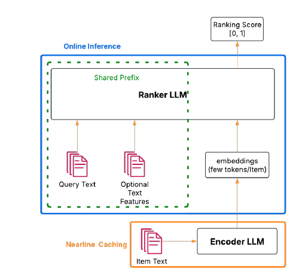
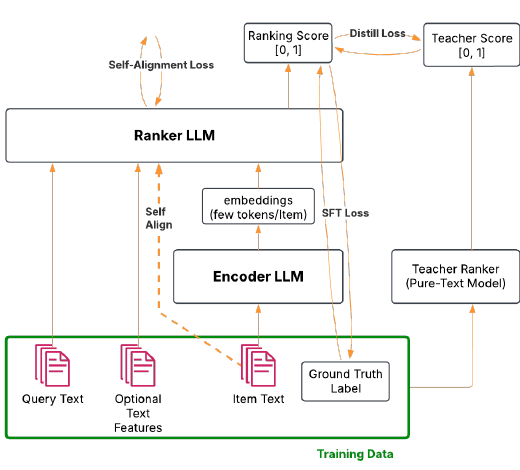

# MixLM: High-Throughput and Effective LLM Ranking via Text-Embedding Mix-Interaction

> **Venue**: Preprint (ACM 형식) · arXiv:2512.07846v2, 2026.01.31
> **Authors**: Guoyao Li, Ran He, Shusen Jing, Kayhan Behdin, Yubo Wang, Sundara Raman Ramachandran, Chanh Nguyen, Jian Sheng, Xiaojing Ma, Chuanrui Zhu, Sriram Vasudevan, Muchen Wu, Sayan Ghosh, Lin Su, Qingquan Song, Xiaoqing Wang, Zhipeng Wang, Qing Lan, Yanning Chen, Jingwei Wu, Luke Simon, Wenjing Zhang, Qi Guo, Fedor Borisyuk (LinkedIn, Mountain View, CA)
> **Platform**: **LinkedIn AI-driven Job Search** — Semantic Job Search에 **전 트래픽 배포**

**한 줄 정의**: LLM cross-encoder ranker의 병목은 **item text가 만드는 긴 prefill**이다. MixLM은 item 문서를 **encoder LLM으로 소수의 embedding token으로 압축**해 nearline cache에 저장하고, 서빙 시에는 **query text + embedding token을 섞어(mix-interaction)** ranker LLM에 넣는다. **동일 latency 예산에서 throughput 10.0× (요약 텍스트 대비) / 75.9× (full text 대비)**, 랭킹 품질은 full-text의 1.8 NDCG 포인트 이내.

---

## 1. Background

### 산업 검색·추천에서의 LLM ranking 현황

- LLM은 어휘 매칭이 놓치는 **미묘한 언어적 단서와 개념적 관계**를 포착해 relevance ranking에서 강력한 성능을 낸다.
- 그러나 **엄격한 latency·throughput 제약** 하에서의 배포는 여전히 어렵다. 특히 **cross-encoder** 방식은 user query와 candidate item text를 하나의 prompt로 합치므로 **수천 token**에 이르고, **prefill이 지배적**이며 attention 비용은 **context length에 대해 quadratic**하다.
- 그 결과 실무에서는 **① 더 작은 LLM으로 교체**하거나 **② 정보량이 큰 feature를 서빙 파이프라인에서 제거**하는 선택을 강요당한다.

### 기존 접근의 한계

| 방법 | 성격 | 문제점 | NDCG@10 | QPS (items/s/GPU) |
|---|---|---|---|---|
| **Bi-encoder (embedding retrieval)** | query·document를 **독립적으로** 임베딩 | **query–item interaction이 없다.** 세밀한 의미 매칭 불가 → **coarse first-stage filter 용도로만** 적합 | 0.8380 | > 1.6 × 10⁹ |
| **Full-text cross-encoder** | 전체 item text를 prompt에 포함 | **최고 품질이지만 배포 불가 수준의 비용** | **0.9432** | **290** |
| **Summarized / Pruned text** | item text를 요약·절단 | throughput은 오르지만 **품질 손실** | 0.9218 | 2,200 |

> **긴장 관계**: 품질(cross-encoder의 query–item interaction)과 효율(짧은 context) 중 하나를 포기해야 하는 구조였다. MixLM은 **interaction은 유지하되 context 길이만 줄이는** 제3의 축을 연다.

---

## 2. Motivation



> **Figure 1**: MixLM의 아키텍처. **오프라인 단계**에서 item 문서를 **encoder LLM**으로 처리해 compact embedding으로 만들고 **nearline cache**에 저장한다. **서빙 시점**에는 이 임베딩을 가져와 사용자의 query 및 선택적 보조 텍스트 feature와 **연결(concatenate)** 하고, 이 혼합 입력을 **ranker LLM**에 넘겨 relevance score를 얻는다.

### 핵심 통찰 1: 비용을 만드는 것은 query가 아니라 item text다

cross-encoder ranker의 prompt는 다음과 같이 구성된다.

```
prompt(q, i) = system prefix, q, i                                  ... (1)
p_yes(q, i) = P( i is relevant to q ) ∈ [0, 1]                      ... (2)
```

- 실제 운영에서 **item text는 중앙값 ~900 token**, **p99에서 `T_E` = 2,100 token**에 이른다.
- 반면 **query prefix `T_R`은 짧고**, 하나의 요청은 **같은 query로 수백~수천 개 item을 스코어링**한다.

> **따라서 압축의 표적은 명확하다** — item side다. 그리고 item text는 **query에 의존하지 않으므로 오프라인에서 미리 인코딩해 둘 수 있다.** 이것이 설계의 출발점이다.

### 핵심 통찰 2: item을 embedding token으로 바꿔도 mix-interaction은 유지된다

- bi-encoder는 query와 item을 **각자 벡터로 만든 뒤 내적**하므로 상호작용이 없다.
- MixLM은 item만 embedding token으로 바꾸고 **ranker LLM의 입력 시퀀스 안에서 query text token과 나란히 놓는다.** 그러면 **transformer의 attention이 그 둘 사이의 상호작용을 그대로 수행**한다.
- 결과: **입력 길이는 bi-encoder에 가깝고, 상호작용은 cross-encoder에 가깝다.**

### 핵심 통찰 3: 같은 query를 공유하므로 prefix를 상각할 수 있다

- 하나의 요청에서 수백~수천 item이 **동일한 query와 user context를 공유**한다.
- item token을 극단적으로 줄이고 나면(**~900 → 프로덕션에서 1 token**), 남은 비용은 **query-prefix 계산의 반복**이 지배한다.
- 따라서 **KV cache를 공유하는 in-batch prefix caching**이 두 번째 축의 최적화가 된다. **입력 압축과 prefix 상각은 곱해져서 효과를 낸다.**

---

## 3. Contributions

1. **MixLM 프레임워크**: 긴 item text를 **compact embedding token**으로 대체해 prompt 길이를 줄이는 mixed-input LLM ranking 구조.
2. **end-to-end 학습 파이프라인**: **full-text LLM ranker의 행동을 mixed-input 아키텍처로 옮기는 distillation loss**를 포함한 3단계 학습 레시피. encoder와 ranker를 **공동 학습**한다.
3. **프로덕션 서빙 스택**: mixed-input LLM ranking을 위한 서빙 시스템 — GPU throughput에서 **order-of-magnitude 개선**.
4. **전 트래픽 배포 사례**: LinkedIn semantic job search에 **full production scale로 배포**하고 실무 교훈을 공유. **DAU +0.47%.**

---

## 4. Method

### 4.1 아키텍처 — 두 개의 LLM

LLM을 세 부분으로 분해한다: **input embedding layer**, **transformer blocks**, **optional output head**.

```
Ranker LLM   :  F_R(·; Θ_R) = (f_R ∘ g_R)(·; θ_R)  :  V^T → [0, 1]        ... (3)
                  g_R : V^T → R^{T×H}   (input embedding layer)
                  f_R : R^{T×H} → [0,1] (decoder + binary classification head)

Encoder LLM  :  F_E(·; Θ_E) = (f_E ∘ g_E)(·; ω_E, θ_E) : V^T → R^{T×H}    ... (4)
                  output head 없음 — hidden representation 을 그대로 낸다
```

### 4.2 Mix-Interaction — prompt의 분해와 압축

prompt를 **ranker 파트**와 **encoder 파트**로 쪼갠다.

```
X_R = tokenize([system prefix, q]) ∈ V^{T_R}
X_E = tokenize([i])                ∈ V^{T_E}                              ... (5)
```

> **핵심 성질**: `X_E`는 **query `q`에 의존하지 않고 item description `i`에만 의존**한다. 따라서 **인코딩 결과를 nearline cache에 저장**할 수 있다.

압축 과정:

```
h_E = tokenize→encode(X_E) ∈ R^{T_E × H}
h_S = Samp( F_E(X_E) )     ∈ R^{T_S × H}          T_S ≪ T_E

  MixLM 은 last-N sampling 사용 — h_E 의 마지막 T_S 개 입력 token 에 대응하는 임베딩을 취한다.
  T_S = 1 이면 마지막 입력 token 의 임베딩만 사용.
```

최종 예측:

```
h_R = g_R(X_R)                                       # ranker 의 input embedding layer
p_yes(q, i; Θ) = f_R( [h_R ; h_S ; h_EOS] ) ∈ [0,1]  ... (6)

  [h_R ; h_S ; h_EOS] ∈ R^{(T_R + T_S + 1) × H}
  Θ = [Θ_R, Θ_E]
```

**효과적 시퀀스 길이의 변화**:

```
before :  T_R + T_E              (T_E = 2,100 at p99)
after  :  T_R + T_S + 1          (T_S = 1 in production)
```

- 요구 조건은 하나뿐이다 — **ranker의 hidden size가 encoder의 output dimension과 일치**할 것. 그 외에는 두 모델의 아키텍처가 달라도 된다. (실제로는 단순성과 학습 효율을 위해 **양쪽 모두 0.6B 동일 아키텍처**를 사용)
- **추가 이점**: 여러 item을 랭킹할 때 **모든 prompt가 같은 user와 query에 대응**하므로, **`X_R`의 KV cache를 공유**할 수 있다.

### 4.3 3단계 학습 (Table 1)

| | **Stage I**<br>Domain-specific Fine-Tuning | **Stage II**<br>Ranking Teacher Training | **Stage III**<br>Joint Encoder-Ranking Training |
|---|---|---|---|
| **Data** | Reasoning Dataset | Ranking Dataset | Ranking Dataset |
| **Samples** | **180k** | **10.9M** | **10.9M** |
| **Input Prompt Type** | Text (chain-of-thoughts) | Text | **Text + Embedding** |
| **Max Sequence Length** | 2,048 | 2,048 | **2,176** |
| **Trainable Module(s)** | Pretrained LLM | Ranker LLM | **Encoder LLM & Ranker LLM** |
| **Training Objective** | Distillation from relevance judge | SFT | SFT + Distillation from ranking teacher + Self-alignment |

#### 레이블 생성

- 실사용 로그에서 query–item 쌍을 표집하고, **7B in-house LLM을 relevance judge**로 써서 **5점 등급 점수 + 근거(rationale)** 를 생성한다. 정수 레이블은 **[0, 1]의 연속값 `p*_yes(q, j)`** 로 정규화된다.

#### Stage I: Domain Reasoning Fine-Tuning

- **7B relevance judge를 0.6B pretrained model로 증류**한다 — 두 모델의 **logit 사이 KL divergence** 사용.
- 데이터: **180K 샘플** + judge의 **chain-of-thought 응답**.
- 목적: query–item 쌍에 대한 **논리적 추론과 문맥 이해 능력**을 강화하여, 점수 부여의 **근거(rationale)** 를 모델이 파악하게 한다.

#### Stage II: Ranking Teacher Training

- Stage I 체크포인트에서 출발해 **10.9M 예제로 SFT** (**KL divergence loss**).
- 이 모델은 **긴 입력 prompt 때문에 온라인 서빙이 불가능**하지만, **Stage III의 teacher** 역할을 한다.
- 출력 분포를 `(p̂_yes, p̂_no)`로 표기.

#### Stage III: Joint Encoder-Ranking Training



> **Figure 2**: Stage III 학습 파이프라인. Ranker LLM은 **SFT Loss**(ground truth), **Distill Loss**(pure-text Teacher Ranker), **Self-Alignment Loss**(full-text prompt를 통과시킨 자기 자신의 출력)의 세 신호를 동시에 받는다. Encoder LLM은 ranker의 내부 표현과 정렬되도록 함께 학습된다.

- **초기화**: ranker는 **Stage I 체크포인트**, encoder는 **0.6B GTE (General Text Embedding, contrastive learning으로 학습)**.
- 학습 대상: `Θ = [Θ_R, Θ_E]` **전체**.

**손실 함수 4종**

```
① Soft-Label SFT Loss — ground truth 와의 정렬
   L_SFT(Θ) = KL( (p*_yes, p*_no) || (p_yes(Θ), p_no(Θ)) )

② Ranking Distillation Loss — Stage II teacher 와의 정렬
   L_distill(Θ) = KL( (p̂_yes, p̂_no) || (p_yes(Θ), p_no(Θ)) )

③ Self-Alignment Loss — mixed input 과 full-text input 의 내부 표현 정렬
   full text prompt 를 ranker(Θ_R)에 통과시켜 얻은
     출력 분포 (p̃_yes, p̃_no) 와 마지막 입력 token 의 최종 hidden state h̃_last ∈ R^H 를 수집

   L_hidden-align(Θ) = 1 − cossim( h_last(Θ),  h̃_last(Θ_R) )
   L_pred-align(Θ)   = KL( (p̃_yes(Θ_R), p̃_no(Θ_R)) || (p_yes(Θ), p_no(Θ)) )
   L_align(Θ)        = α · L_pred-align(Θ)  +  β · L_hidden-align(Θ)          α, β ≥ 0

④ 전체
   L_total(Θ) = L_SFT(Θ) + λ_distill · L_distill(Θ) + λ_align · L_align(Θ)
```

> **teacher가 student보다 작을 수도 있다는 점이 특이하다.** 일반적인 KD는 큰 teacher → 작은 student지만, 여기서 student(encoder + ranker)는 **teacher보다 클 수 있다.** teacher의 존재 이유는 **capacity가 아니라 입력 형태**다 — pure text로 동작하는 teacher는 **학습이 쉬워 원 데이터셋 레이블보다 깨끗한 예측**을 제공하고, 이것이 **gradient variance를 줄여 수렴을 돕는다.**

> **Self-alignment의 역할**: 저자들은 이를 **regularization 효과**로 설명한다 — overfitting을 방지한다. `L_pred-align`과 `L_hidden-align`은 각각 `Θ_R`만의 함수인 full-text 경로와, `Θ` 전체의 함수인 mixed-input 경로를 **같은 곳으로 수렴시킨다.**

**Phased Curriculum Learning**

| Phase | `λ_align` | `λ_distill` | 목적 |
|---|---|---|---|
| **Phase 1** | **증가** | 감소 | **space alignment 우선** — encoder가 ranker의 내부 표현과 매끄럽게 통합되는 임베딩을 만들도록 |
| **Phase 2** | 감소 | **증가** | **ranker LLM 조정** — relevance score 예측 정확도 개선 |

### 학습 vs 추론

| 단계 | 과정 |
|---|---|
| **오프라인** | encoder LLM이 item text를 인코딩 → `h_S`를 **nearline cache**에 저장 |
| **학습** | 3단계. Stage III에서 encoder·ranker **공동 학습**, 4종 손실 + 2단계 curriculum |
| **추론** | cache에서 item embedding fetch → query text + 보조 텍스트 feature와 concat → ranker LLM 1회 forward. **effective sequence length = `T_R + T_S + 1`** |

---

## 5. Inference Engine Optimization

### 5.1 Text–Embedding Mixed Input

- 서빙 인터페이스를 확장해 **사전 계산된 embedding tensor를 텍스트와 함께** 받도록 했다.
- gRPC 요청 스키마에 **`feature payload`** 를 추가: **binary tensor buffer + data type + optional serialization format(NumPy)**.
- 서버 측 전처리 모듈이 payload를 native tensor로 디코딩·검증하고 **metadata 기반 reshaping/casting** 후 모델 입력 컨텍스트에 붙인다.
- **text-only 요청과 완전 후방 호환**되며 직렬화 오버헤드가 미미하다.

### 5.2 Shared-Prefix Prefill Optimization

item token을 **중앙값 ~900 → 프로덕션 수 token**으로 줄이고 나면, **query-prefix 반복 계산이 비용을 지배**한다.

```
T_q = query-prefix length,  T_i = full-text item length,  N_i = ranking depth
Attention ∝ L²,   Linear ∝ L

Naïve prefill (full-text)
  F_att  ∝ N_i (T_q + T_i)²                       F_lin ∝ N_i (T_q + T_i)

Amortized prefill (full-text)   — query-prefix attention 을 1회 계산 후 재사용
  F_att  ∝ T_q² + N_i (2 T_i T_q + T_i²)          F_lin ∝ T_q + N_i T_i

Amortized prefill + MixLM       — item 압축 계수 K, item token 은 T_i/K
  F_att  ∝ T_q² + N_i ( 2 (T_i/K) T_q + (T_i/K)² )
  F_lin  ∝ T_q + N_i T_i / K
```

**`N_i = 250`, `K = 450` 대입 (Table 2)**

| Conditions | Total attention cost | Total linear-layer cost |
|---|---|---|
| Naive, `N_i = 250` | ∝ 250 (T_q + T_i)² | ∝ 250 (T_q + T_i) |
| Amortized, `N_i = 250` | T_q² + 500 T_i T_q + 250 T_i² | T_q + 250 T_i |
| **Amortized + MixLM** | **T_q² + (10/9) T_i T_q + (1/810) T_i²** | **T_q + (5/9) T_i** |

> **item-side 비용이 대략 `K` 배만큼 줄어든다.** `T_i²` 항의 계수가 **250 → 1/810** 으로 5자릿수 감소하는 것이 핵심이다.

상각의 구현 두 가지:

| 메커니즘 | 내용 |
|---|---|
| **In-batch prefix caching** | 첫 prompt의 **KV state를 재사용**해 batch 내 모든 item이 같은 query-prefix 계산을 공유. suffix token은 (1) dense paged attention으로 첫 prompt의 prefix token 전체에 attend, (2) regular causal attention으로 자기들끼리 attend |
| **Multi-item scoring** | 여러 item을 **구분자로 이어 하나의 시퀀스**로 만든다. FlashInfer의 **prefix-aware masking**으로 item 간 cross-attention을 차단 |

### 5.3 Inference Engine CPU Overhead Reduction

SGLang 엔진 최적화 이후 **Python gRPC 서비스가 지배적 병목**으로 드러났다 — 비동기 Python 사용에도 **GIL**로 인해 요청 역직렬화·feature 디코딩·컨텍스트 구성이 제약되었다.

| 최적화 | 내용 | 효과 |
|---|---|---|
| **Multi-Process gRPC** | gRPC frontend를 SGLang 엔진에서 **분리**. 요청 처리·전처리를 다중 CPU 프로세스로 병렬화 | **throughput +40%** |
| **Batch Send** | 한 query의 모든 item prompt를 **단일 ZMQ 메시지**로 직렬화·전송 → 스케줄러가 batch를 **원자적으로** 처리해 in-batch prefix caching이 확실히 적용됨 | prefix caching 신뢰성 확보 |
| **Multi-Process Parallelization** | GPU당 **스케줄러 프로세스 5개**, 각각 **GPU 메모리 20%** 할당 | CPU 스케줄링 병렬화, GPU 활용률 유지 |
| **Redundant KV-Cache 제거** | SGLang의 기본 KV-cache 동작은 **autoregressive decoding용**인데, 이 워크로드는 **prefill-only scoring**이다. 요청 완료 즉시 KV cache 메모리를 해제 | CPU 오버헤드 감소 + **유효 GPU 메모리 증가 → 더 큰 batch, 더 높은 동시 throughput** |

---

## 6. Experiments

### 6.1 Setup

- 오프라인 평가: **내부 LLM relevance judge가 레이블링한 held-out test set**
- 지표: **NDCG@10**, 그리고 **p99 end-to-end latency 500ms 제약** 하에서의 **GPU당 초당 스코어링 item 수**
- 학습 인프라: **8 노드 × 8 NVIDIA H100**, **PyTorch FSDP**(decoder 파라미터·gradient·optimizer state 샤딩), 노드 내 **NVLink** / 노드 간 **InfiniBand**. layer-wise prefetching, **Liger Kernel**(fused RMSNorm, RoPE, SwiGLU, fused CrossEntropy)
- **총 학습 비용: 70B token에 대해 약 700 H100 GPU-hours**

### 6.2 Main Results

#### 랭킹 품질 (Table 3)

| Model | NDCG@10 |
|---|---|
| Full Text | 0.9432 |
| Summarized, Pruned | 0.9218 |
| **MixLM** | **0.9239** |
| Embedding Retrieval | 0.8380 |

#### GPU 효율 (Table 4, 500ms latency 예산)

| Model | QPS (Items/s/GPU) | Latency | GPU |
|---|---|---|---|
| Full Text | 290 | < 500 ms | H100 |
| Summarized, Pruned | 2,200 | < 500 ms | H100 |
| **MixLM** | **22,000** | **< 500 ms** | H100 |
| Embedding Retrieval | > 1.6 × 10⁹ | < 100 ms | A100 |

> **정리**: MixLM은 **요약 텍스트 대비 10.0× / full-text 대비 75.9×** throughput을 내면서, full-text 대비 NDCG 손실은 **1.8 포인트**에 그친다. 또한 **요약 텍스트보다 품질이 오히려 약간 높다** (0.9239 vs 0.9218) — **압축이 요약보다 정보를 덜 잃는다**는 뜻이다.

#### Online A/B Test (Table 5)

| Experiment Group | ΔDAU |
|---|---|
| Classic Job Search | — |
| **Semantic Job Search (MixLM)** | **+0.47%** |

- 기존 프로덕션 baseline(요약 텍스트 LLM + 공격적 ranker pruning)과 **동등한 relevance**를 유지하면서 **10배 throughput**을 확보 → **LLM 랭킹 기반 Semantic Job Search를 최초로 전 트래픽 배포**했고, 그 결과가 **DAU +0.47%** 다.

### 6.3 Ablation Study

#### (a) 학습 데이터 규모 (Table 6)

| Training Samples | ΔNDCG@10 |
|---|---|
| 160K | — |
| 400K | +0.0250 |
| 800K | +0.0280 |
| 1.08M | +0.0334 |

#### (b) item당 embedding token 수 (Table 7)

| Tokens / Item | ΔNDCG@10 |
|---|---|
| 1 | — |
| 5 | +0.0017 |
| 10 | +0.0044 |
| 20 | +0.0111 |
| 30 | +0.0158 |
| 40 | +0.0172 |
| 50 | +0.0198 |

> **품질은 token 수에 단조 증가하지만, 프로덕션은 latency 제약 때문에 `T_S = 1`을 택했다.** 이 표는 **남아 있는 품질 여유(50 token까지 +0.0198)를 명시적으로 보여준다** — latency 예산이 늘면 바로 회수할 수 있는 몫이다.

#### (c) Domain Reasoning Fine-Tuning (Stage I)의 효과 (Table 8)

| Ranker Base Model | ΔNDCG@10 |
|---|---|
| Vanilla LLM | — |
| **Domain-Reasoning Tuned LLM** | **+0.0185** |

#### (d) 보조 손실의 기여 (Table 9)

| Setup | ΔNDCG@10 |
|---|---|
| No auxiliary loss | — |
| + self-alignment | +0.0014 |
| + distillation | +0.0091 |
| **+ self-alignment + distillation** | **+0.0108** |

> **distillation이 지배적 기여(+0.0091)** 이고, self-alignment는 단독으로는 미미(+0.0014)하지만 **결합했을 때 추가 이득**을 준다 (0.0091 → 0.0108).

#### (e) Curriculum 전략 (Table 11, small sub-dataset)

| Curriculum Strategy | NDCG@10 |
|---|---|
| no curriculum learning (Task) | — |
| **two-phase (Alignment → Task)** | **+0.0020** |
| three-phase (Alignment → Balanced → Task) | +0.0015 |

> **2단계가 3단계보다 낫다.** 저자들의 해석 — **alignment 중심에서 task 중심으로의 직접 전환**이 중간 균형 단계를 두는 것보다 효과적이다. ranker–encoder 정렬이 충분히 확립되고 나면 **점진적 중간 단계 없이 바로 downstream task를 최적화**하는 편이 낫다.

#### (f) 추론 최적화의 기여 (Table 10, < 500ms latency)

| Configuration | Prefix Optimization | QPS (Items/s/GPU) |
|---|---|---|
| **Raw-text** | None | 270 |
| | Multi-Item Scoring | 275 |
| | In-Batch Prefix Cache | 290 |
| **Summarized, Pruned** | None | 1,650 |
| | Multi-Item Scoring | 2,100 |
| | In-Batch Prefix Cache | 2,200 |
| **MixLM** | None | 3,000 |
| | Multi-Item Scoring | 20,000 |
| | **In-Batch Prefix Cache** | **22,000** |

> **이 표가 §2 통찰 3을 정량적으로 확증한다.** raw-text에서 prefix 최적화의 효과는 **270 → 290 (+7%)** 로 미미하다. 그러나 MixLM에서는 **3,000 → 22,000 (7.3×)** 이다. **입력 압축이 먼저 이루어져야 prefix 상각이 의미를 갖는다** — 두 최적화는 더해지는 것이 아니라 **곱해진다.**

---

## 7. Key Takeaways

1. **MixLM의 핵심은 "상호작용을 포기하지 않고 context만 줄인다"는 점이다.** bi-encoder는 길이를 줄이는 대신 query–item interaction을 잃고(NDCG 0.8380), full-text cross-encoder는 interaction을 얻는 대신 배포가 불가능하다(290 items/s/GPU). MixLM은 **item만 embedding token으로 바꿔 ranker의 시퀀스 안에 넣음으로써** attention이 상호작용을 그대로 수행하게 한다.

2. **압축 대상이 query가 아니라 item인 것은 우연이 아니라 구조적 필연이다.** `X_E`는 **query에 의존하지 않으므로** 오프라인에서 인코딩해 nearline cache에 저장할 수 있다. 이 비대칭이 전체 설계를 가능하게 한다.

3. **압축이 요약보다 낫다.** MixLM(0.9239)이 summarized/pruned(0.9218)보다 품질이 높으면서 throughput은 10배다. **텍스트를 사람이 읽을 수 있는 형태로 줄이는 것보다, 모델의 표현 공간에서 줄이는 것이 정보를 덜 잃는다.**

4. **두 최적화는 더해지지 않고 곱해진다.** in-batch prefix caching은 raw-text에서 **+7%**(270→290)에 불과하지만 MixLM에서는 **7.3×**(3,000→22,000)다. item token을 줄이고 나서야 query-prefix가 지배적 비용이 되기 때문이다. 최종 **22,000 items/s/GPU**는 두 축의 곱이다.

5. **teacher가 student보다 클 필요가 없다 — 여기서 teacher의 역할은 capacity가 아니라 입력 형태다.** pure-text teacher(Stage II)는 학습이 쉬워 **원 레이블보다 깨끗한 예측**을 내고, 이것이 gradient variance를 줄여 mixed-input student의 수렴을 돕는다. ablation에서 **distillation이 보조 손실 기여의 대부분(+0.0091 / +0.0108)** 을 차지한다.

6. **품질 여유가 명시적으로 남아 있다.** 프로덕션은 latency 때문에 **item당 1 token**을 쓰지만, 50 token까지 올리면 **+0.0198 NDCG**를 회수할 수 있다(Table 7). 학습 데이터도 1.08M에서 **+0.0334**까지 단조 증가 중이다(Table 6). **현재 성능은 상한이 아니라 latency 예산이 정한 지점이다.**

7. **병목은 결국 GPU가 아니라 CPU였다.** 모델·엔진 최적화 후 **Python gRPC 서비스의 GIL**이 지배적 제약이 되었고, gRPC frontend 분리(**+40%**), batch send, GPU당 스케줄러 5개, prefill-only 워크로드에 맞춘 KV-cache 즉시 해제가 필요했다. **모델 수준 압축만으로는 order-of-magnitude 이득이 실현되지 않는다.**

8. **전 트래픽 배포와 DAU +0.47%.** 동일 latency 예산에서 요약 텍스트 대비 **10.0×**, full-text 대비 **75.9×** throughput. 이 여유가 **LinkedIn Job Search 전 트래픽에 LLM 랭킹을 최초로 배포**하게 만들었고, 그것이 DAU 증가로 이어졌다.

---

## 8. 이 저장소의 다른 문서와의 연결

| 문서 | 연결점 |
|---|---|
| [`./privileged_features_distillation.md`](./privileged_features_distillation.md) | **같은 전략의 다른 변주다.** PFD는 **비싼 feature를 학습 시점으로** 밀어내 서빙에서 제거하고, MixLM은 **비싼 입력(item text)을 오프라인 인코딩으로** 밀어내 서빙에서 제거한다. 둘 다 distillation을 **"서빙 밖으로 밀어낸 정보를 되찾는 수단"** 으로 쓴다. PFD에서 서빙 모델이 privileged feature에 의존하지 않듯, MixLM의 ranker는 full item text에 의존하지 않는다 |
| [`../2026-07-26/on_policy_distillation.md`](../2026-07-26/on_policy_distillation.md) | MixLM의 Stage III는 **off-policy distillation**이다 — teacher가 고정된 데이터셋에 대해 낸 예측을 student가 모방한다. OPD가 지적하는 distribution mismatch 문제는 여기서 크지 않은데, **student와 teacher가 같은 query–item 쌍을 보고 입력 형태만 다르기** 때문이다. self-alignment loss가 정확히 그 **입력 형태 차이를 메우는** 장치다 |
| [`../2026-06-03/autoregressive_ranking_stoical.md`](../2026-06-03/autoregressive_ranking_stoical.md) | 같은 "LLM을 랭킹에 쓰되 비용을 감당한다"는 문제의식. MixLM은 **cross-encoder를 포기하지 않는 쪽**의 답이다 |
| [`../2026-06-03/pplx_embed_diffusion_embeddings.md`](../2026-06-03/pplx_embed_diffusion_embeddings.md) | MixLM이 first-stage filter로만 적합하다고 평가한 **embedding retrieval**(NDCG@10 0.8380)의 품질을 끌어올리려는 반대 방향의 시도 |
