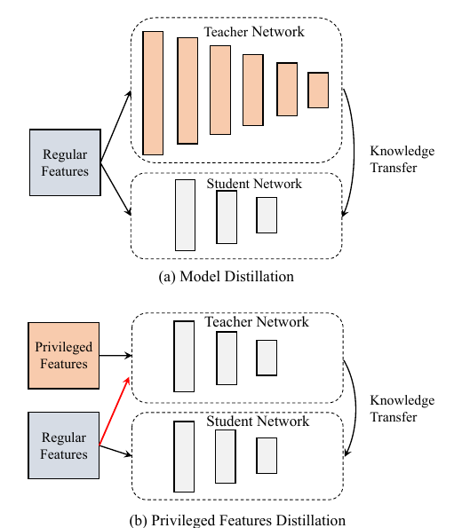
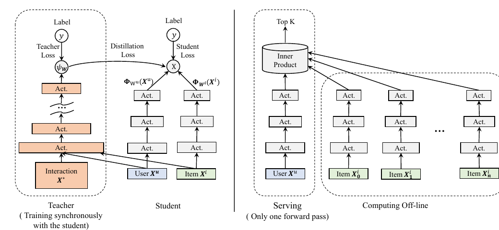

# Privileged Features Distillation at Taobao Recommendations

> **Venue**: arXiv:1907.05171v2, 2020.02.26 (ACM 템플릿 preprint — PDF의 "Woodstock '18" 표기는 ACM 샘플 템플릿의 placeholder이며 실제 venue가 아니다)
> **Authors**: Chen Xu\*, Quan Li\*, Junfeng Ge, Jinyang Gao, Xiaoyong Yang, Changhua Pei, Fei Sun, Jian Wu, Hanxiao Sun, Wenwu Ou (\*equal contribution)
> **Affiliation**: Alibaba Group, Beijing, China
> **Platform**: **Taobao Recommendations** — "Guess You Like" 시나리오, **전량 배포(fully deployed)**

**한 줄 정의**: **학습 때는 쓸 수 있지만 서빙 때는 못 쓰는 feature**(= *privileged features*)를 teacher에게만 먹이고, 그 지식을 distillation으로 student에 넘긴다. **서빙되는 것은 privileged feature에 전혀 의존하지 않는 student 뿐**이므로 학습–서빙 일관성이 유지된다. 원조 LUPI와의 결정적 차이는 **teacher가 privileged feature뿐 아니라 regular feature도 함께 본다**는 점이다.

---

## 1. Background

### 추천 시스템에서 feature가 갖는 위치

- DNN은 추천의 예측 태스크에서 큰 성과를 냈지만, 대부분의 연구가 **모델 구조**에 집중했다. 그러나 입력의 **feature 측면이 모델 성능의 상한을 결정**한다.
- 실무의 제약: **오프라인 학습과 온라인 서빙의 일관성**을 위해 **양쪽 모두에서 가용한 feature만** 쓴다. 그 결과 **학습 시점에만 존재하는 판별력 높은 feature들이 통째로 버려진다.**

### Taobao의 cascaded ranking 구조

```
Item Corpus ──▶ Candidate Generation ──▶ Coarse-Grained Ranking ──▶ Fine-Grained Ranking
   ~10^10             ~10^5                      ~10^3                     ~10^2
```

단계가 진행될수록 모델은 복잡해지고 latency 비용도 커진다. **PFD는 뒤의 두 ranking 단계에 적용된다.**

### 두 종류의 privileged features

| 태스크 | 단계 | privileged features | 왜 서빙에서 못 쓰나 |
|---|---|---|---|
| **CTR** | Coarse-grained ranking | **Interacted features** — 최근 24시간 내 해당 **카테고리에서의 클릭 수**, 해당 **상점에서의 클릭 수** 등 | user와 특정 item **양쪽에 동시에 의존**하므로 inner product 구조에 넣을 수 없다. **latency가 급증** |
| **CVR** | Fine-grained ranking | **Post-event features** — 상세 페이지 **체류 시간(dwell time)**, 댓글 열람 여부, 판매자와의 소통 여부 | **클릭이 일어난 뒤에야 생기는** 정보인데, CVR은 **클릭 이전에** 예측해야 한다 |

> **CVR의 정의가 문제의 핵심이다**: CVR = "사용자가 **클릭했다면** 구매할 확률". 정의상 클릭 이후의 행동이 가장 유용한 신호인데, **랭킹은 클릭 전에** 끝나야 한다. e-commerce의 목표인 GMV는 `CTR × CVR × Price`로 분해되므로 CVR 추정을 포기할 수도 없다.

### 기존 방법의 한계

| 방법 | 문제점 |
|---|---|
| **동일 feature 사용 (관행)** | 판별력 높은 feature를 **일괄 폐기**. 모델 성능의 상한이 낮아진다 |
| **Multi-task learning (MTL)** | 각 privileged feature를 보조 태스크로 예측. ① **no-harm 보장이 없다** — 보조 태스크가 원 모델의 학습을 해칠 수 있다 ② privileged feature **예측 자체가 원 문제보다 어려울 수 있다** ③ **수십 개**를 동시에 쓰면 손실 가중치 튜닝이 사실상 불가능 |
| **LUPI** (Lopez-Paz et al.) | teacher가 **privileged features `X*`만** 본다. privileged feature는 사용자 선호를 **부분적으로만** 기술하므로, **regular feature만 쓴 모델보다도 teacher가 약할 수 있다.** 잘못된 지식을 student에 주입할 위험 |
| **Model Distillation (MD)** | teacher와 student가 **같은 입력**을 쓰고 teacher만 capacity가 크다. **feature 측면을 활용하지 않는다** |

---

## 2. Motivation



> **Figure 1**: **Model Distillation(MD)** 과 **Privileged Features Distillation(PFD)** 의 대비. MD는 **같은 regular features**를 양쪽에 넣고 teacher만 더 복잡한 network를 쓴다(위). PFD는 teacher에게 **privileged features와 regular features를 모두** 주고 student에게는 regular features만 준다(아래). 이 점에서 PFD는 **teacher가 privileged features만 보는 원조 LUPI와도 다르다.**

### 핵심 통찰 1: interacted features는 "정보가 없어서"가 아니라 "너무 비싸서" 버려진다

Coarse-grained ranking은 **inner product model**을 쓴다.

```
f(X^u, X^i; W^u, W^i) ≜ ⟨ Φ_{W^u}(X^u),  Φ_{W^i}(X^i) ⟩        ... (3)
```

- **왜 inner product인가**: user side와 item side가 **분리**되어 있으므로, **모든 item의 mapping `Φ_{W^i}(·)`를 오프라인에서 미리 계산**해 둘 수 있다. 요청이 오면 **user mapping 한 번만 forward** 하고 전체 후보와 내적하면 된다.
- **interacted feature를 넣으면 이 분리가 깨진다.** feature가 user와 특정 item에 동시에 의존하므로, 비선형 mapping `Φ_W(·)`를 **후보 수(10^5)만큼 반복 실행**해야 한다.

**정량 비교** (입력 1024차원, `Φ_W`는 1024→512→256→128 MLP 가정):

```
mapping 1회        : 1024×512 + 512×256 + 256×128  ≈  6.9 × 10^5  fused multiply-adds
inner product 1회  : 128 flops
                     ────────────────────────────────
이론 비율          : ~5,400×

실측 (10^5회 반복) : mapping 89.695 s   vs   inner product 0.108 s   →  ~830× 느림
```

> **결론**: 이 feature들은 **정보가 없어서 버려진 게 아니다.** 실험에서 확인되듯 넣으면 성능이 크게 오르지만, **서빙 latency가 감당되지 않는다.** 그래서 "학습에만 쓰고 지식만 넘긴다"는 발상이 성립한다.

### 핵심 통찰 2: LUPI의 teacher는 오히려 student를 오도할 수 있다

원조 LUPI는 teacher에게 `X*`만 준다.

```
min_{W_s}  (1−λ)·L_s( y, f(X; W_s) )  +  λ·L_d( f(X*; W_t),  f(X; W_s) )      ... (2)
```

**구체적 실패 사례** (CVR 추정):

> 비싼 상품은 구매 결정에 **시간이 오래 걸리므로 dwell time이 길다.** 그러나 **실제 전환율은 오히려 낮다.** dwell time만 보는 teacher는 **비싼 상품에 false positive**를 낸다.

- **처방**: teacher에게 **regular features(예: item price)도 함께** 준다. 그러면 dwell time은 "전환 확률" 자체가 아니라 **"같은 가격대 안에서의 선호 정도"** 를 나타내는 신호로 올바르게 해석된다.

```
min_{W_s}  (1−λ)·L_s( y, f(X; W_s) )  +  λ·L_d( f(X, X*; W_t),  f(X; W_s) )   ... (4)
```

> **이 한 줄의 수정이 PFD의 핵심이다.** 실험에서 CTR teacher AUC는 **LUPI 0.6687 → PFD 0.6921** 로 뛴다. **"regular feature를 teacher에 추가하는 것은 자명하지 않으며, LUPI 성능을 크게 개선한다"** 는 것이 저자들의 주장이다.

### 핵심 통찰 3: teacher를 먼저 학습시키는 것은 산업 환경에서 비현실적이다

Eq.(4)는 `W_t`가 **미리 고정**되어 있음을 전제한다. 그러나 Taobao 규모에서는 teacher 학습에만 오랜 시간이 걸리고, **실시간성이 요구되는 online learning에서는 도입 자체가 불가능**하다.

```
min_{W_s, W_t}  (1−λ)·L_s( y, f(X; W_s) ) + λ·L_d( f(X, X*; W_t), f(X; W_s) )
                + L_t( y, f(X, X*; W_t) )                                       ... (5)
```

- teacher와 student를 **동시에(synchronously)** 학습한다.
- **불안정성 문제**: 초기에 teacher가 덜 학습된 상태에서 `L_d`가 student를 교란한다. → **warm-up**: 초기 `k` step 동안 `λ = 0`, 이후 사전 정의값으로 고정.
- **mutual learning과의 차이**: student만 teacher로부터 배우게 한다. 양방향이면 **teacher가 student에 co-adapt되어 성능이 퇴화**한다. 따라서 `W_t`에 대한 gradient 계산에서 **`L_d`를 제외**한다.

---

## 3. Contributions

1. **Taobao의 privileged features 식별 + PFD 제안**: MTL이 각 privileged feature를 개별 예측하는 것과 달리, PFD는 **전부를 하나로 묶어 단일 distillation loss만 추가**하는 one-stop 해법이다. **feature 개수와 무관하게 loss가 하나**이므로 균형 조정이 쉽다.
2. **teacher가 regular features도 처리** (LUPI와의 차별점): teacher가 student를 훨씬 잘 지도한다. 또한 **MD와 상보적**이므로 결합(**PFD+MD**)해 추가 개선을 얻는다.
3. **synchronous training + 공통 입력 컴포넌트 공유**: 전통적인 비동기·독립 학습 대비 **동등하거나 더 나은 성능**을, **훨씬 적은 비용**으로 얻는다. 실시간 연산이 요구되는 **online learning에 채택 가능**한 수준.
4. **두 핵심 태스크에서의 online A/B 검증**: CTR **click +5.0%**, CVR **conversion +2.3%**. **전량 배포 완료.**

---

## 4. Method



> **Figure 4**: **(a) PFD+MD로 inner product model을 학습**하는 구조. `X^u`와 `X^i`의 **interaction `X*`(privileged features)** 와 **더 복잡한 DNN 모델**이 결합되어 강력한 teacher를 이룬다. teacher는 student와 **동시에** 학습된다. **(b) 서빙** — 모든 item의 mapping `Φ_{W^i}(·)`를 **오프라인에서 미리 계산**해 두고, 요청이 오면 **user mapping `Φ_{W^u}(X^u)` 단 한 번의 forward pass**만 실행한 뒤 내적한다.

### 4.1 손실 함수의 계보

| 식 | 방법 | teacher 입력 | 특징 |
|---|---|---|---|
| (1) | **MD** | `X` (student와 동일) | teacher의 capacity만 큼 |
| (2) | **LUPI** | `X*` 만 | privileged feature 전용, **오도 위험** |
| (4) | **PFD** | `X`, `X*` **둘 다** | teacher가 student보다 확실히 강함 |
| (5) | **PFD (synchronous)** | `X`, `X*` | teacher loss `L_t` 추가, **동시 학습** |

```
공통 형태:  min (1−λ)·L_s(y, f_s)  +  λ·L_d(f_t, f_s)

  L_s : hard label y ∈ {0,1} 에 대한 student 손실
  L_d : teacher의 soft label 에 대한 student 손실
  λ ∈ [0,1] : 두 손실의 균형 (기본값 0.5)
```

- `L_d`는 **regularization**으로 작동한다. `L_s`만 최소화하면 student는 **over-confident한 예측으로 학습셋에 overfit**되기 쉽다. teacher의 **softened output**을 근사하게 만들면 일반화가 좋아진다.

### 4.2 Algorithm 1 — warm-up을 포함한 동시 학습

```
Input: hyper-parameter λ, swapping step k, learning rate η
 1: Initialize (W_s, W_t),  i = 0
 2: while not converged do
 3:     Get training data (y, X, X*)
 4:     if i < k then
 5:         W_s = W_s − η ∇_{W_s} L_s                         # warm-up: distillation 미적용
 6:     else
 7:         W_s = W_s − η ∇_{W_s} { (1−λ)·L_s + λ·L_d }
 8:     end if
 9:     W_t = W_t − η ∇_{W_t} L_t                             # L_d 제외 (co-adaptation 방지)
10:     i = i + 1
11: end while
Output: (W_s, W_t)
```

- 실험 설정: **`λ = 0.5`, `k = 10^6`**

### 4.3 손실 함수 상세

레이블이 0/1(클릭/구매 여부)이므로 **log-loss**를 쓴다.

```
L_{t/s} ≜ (1/N) Σ_{i=1..N} ( y_i·log(1 + e^{−f_{t/s,i}}) + (1−y_i)·log(1 + e^{f_{t/s,i}}) )   ... (6)
```

- `L_d`는 **cross entropy**: 위 식의 `y_i`를 **`1/(1 + e^{−f_{t,i}})`** (teacher의 예측 확률)로 치환한다.
- 평가는 **AUC**, next-day hold-out data 기준.

### 4.4 PFD+MD — feature 축과 model 축의 결합

- PFD는 **privileged features**로부터, MD는 **더 복잡한 teacher model**로부터 지식을 뽑는다. 두 축은 직교하므로 결합할 수 있다.
- **coarse-grained ranking에서의 구현**: inner product model은 `Φ_W(·)`가 비선형이더라도 **내적이라는 bi-linear 구조가 capacity를 본질적으로 제약**한다. 그래서 teacher를 **DNN**으로 교체한다.
  > 이론적 근거: 곱 연산은 **은닉층 뉴런 4개짜리 2층 신경망으로 임의 정밀도로 근사**될 수 있다(Theorem 1 of [22]). 따라서 **DNN의 성능은 inner product model에 의해 하한이 잡힌다** — teacher가 student보다 약할 수 없다.
- 이때 teacher는 **fine-grained ranking에 쓰이는 모델과 동일**하다. 즉 **PFD+MD는 fine-grained ranking의 지식을 coarse-grained ranking으로 증류하는 것**으로 볼 수 있다.

### 4.5 학습 비용을 되돌리는 두 가지 장치

동시 학습은 **파라미터 수와 연산량을 대략 2배**로 만든다. Taobao 규모(**student 임베딩만 최대 150GB**)에서는 그대로 두면 도입이 불가능하다.

| 장치 | 내용 | 효과 |
|---|---|---|
| **공통 입력 컴포넌트 공유** | teacher와 student가 **임베딩 등 공통 입력 컴포넌트를 공유**한다. 임베딩이 서버 저장공간의 대부분을 차지하므로, **worker–server 간 통신량이 거의 절반**으로 줄어든다 | 통신량 ~50% 절감 |
| **user id 임베딩 분리** (CTR 한정, `Share*&Sync`) | interacted features는 **사용자의 개인적 관심**을 반영한다. 공통 컴포넌트를 **전부** 공유하면 student 성능이 퇴화하므로, **user id에만 독립 임베딩을 할당**해 privileged features에서 오는 추가 선호를 흡수시킨다 | 성능 퇴화 완화 |

### 학습 vs 추론

| 단계 | 과정 |
|---|---|
| **학습** | teacher `f(X, X*; W_t)` 와 student `f(X; W_s)` 를 **동시에** 학습. 초기 `k` step은 warm-up(λ=0). teacher는 `L_t`로만 업데이트(`L_d` 제외). 공통 입력 컴포넌트 공유 |
| **추론** | **student만 추출.** privileged features에 **전혀 의존하지 않는다.** coarse-grained ranking에서는 모든 item mapping을 오프라인 사전 계산해 두고, 요청 시 **user mapping 1회 forward + 내적**만 수행 |

> **이것이 PFD 전체 설계의 목적이다** — 학습–서빙 일관성을 깨지 않으면서 학습 시점에만 존재하는 정보를 소진한다.

---

## 5. Experiments

연구 질문:

- **RQ1**: coarse-grained ranking의 CTR과 fine-grained ranking의 CVR에서 PFD의 성능은?
- **RQ2**: PFD 단독 대비 **PFD+MD**로 추가 개선이 가능한가?
- **RQ3**: PFD는 하이퍼파라미터 `λ`에 민감한가?
- **RQ4**: **동시 학습 + 공통 컴포넌트 공유**의 효과는?

### 5.1 Dataset

| | **CTR** (coarse-grained) | **CVR** (fine-grained) |
|---|---|---|
| 출처 | Taobao 앱 첫 화면 "Guess You Like" 트래픽 로그 | 동일 |
| 대상 트래픽 | 전체 **impression** | 전체 **click** |
| 1구간 | **1 Day**: 9.35×10⁷ users / 2.67×10⁷ items / 5.03×10⁸ clicks / 1.09×10¹⁰ impressions | **30 Days**: 2.78×10⁸ users / 3.74×10⁷ items / 6.97×10⁷ purchases / 1.40×10¹⁰ clicks |
| 2구간 | **10 Days**: 2.88×10⁸ / 4.45×10⁷ / 4.57×10⁹ / 9.90×10¹⁰ | **60 Days**: 3.36×10⁸ / 5.27×10⁷ / 1.32×10⁸ / 2.71×10¹⁰ |

### 5.2 Implementation Details

| 항목 | 내용 |
|---|---|
| **공통** | 모든 feature를 categorical로 변환 후 임베딩 학습 (수치형은 사전 정의 경계로 이산화). 활성화 **LeakyReLU**, 그 앞에 **batch normalization** |
| **학습 인프라** | **parameter server** — 파라미터는 서버, 연산은 worker |
| **Optimizer** | **asynchronous Adagrad**. 첫 100만 step 동안 LR을 0.01까지 **선형 증가** 후 고정. **batch size 1024**, epoch 수 **1** |
| **CTR student** | inner product model. user/item mapping 모두 `Input→512→Act.→256→Act.→128→ℓ₂-normalize`. 내적 시 값 축소 보상을 위해 **스칼라 5를 곱함** |
| **CTR teacher** | LUPI/MD/PFD+MD는 **3층 MLP (512, 256, 128)**. **PFD는 teacher도 inner product model**을 쓰되 privileged features를 **user side**에 배치 |
| **CVR student** | **3층 MLP (512, 256, 128)** |
| **CVR teacher** | PFD·LUPI는 student와 동일 구조. MD·PFD+MD는 **7층 MLP (8192, 4096, 2048, 1024, 512, 256, 128)** |
| **사용자 행동 모델링** | **multi-head self-attention** (heads 4, subspace dim 32, sequence length k=50), 이후 **mean pooling**. position encoding 대신 **"현재로부터의 경과 시간", "해당 item에서의 dwell time"** 등 추가 feature를 삽입 — 상대 위치뿐 아니라 **item의 중요도**까지 반영되어 성능이 크게 향상 |
| **하이퍼파라미터** | `λ = 0.5`, swapping step `k = 10^6` (별도 언급 없는 한) |
| **MTL 비교** | hard parameter sharing 버전. 연속형 보조 태스크(dwell time)는 MSE, 이진형(댓글 열람 여부)은 log-loss. 보조 손실 가중치는 `{0.01, 0.02, 0.05, 0.1, 0.2, 0.5, 1, 2}`에서 경험적 선택. **CTR에서는 수십 개 privileged feature 예측이 너무 번거로워 비교에서 제외** |

### 5.3 Main Results

#### CTR at Coarse-Grained Ranking (Table 2)

| Methods | 1 Day Student | 1 Day Teacher | 10 Days Student | 10 Days Teacher |
|---|---|---|---|---|
| Baseline | 0.6625 | — | 0.7042 | — |
| LUPI | 0.6637 | 0.6687 | — | — |
| MD | 0.6704 | 0.6892 | — | — |
| **PFD** | **0.6712** | **0.6921** | — | — |
| **PFD+MD** | **0.6745** | **0.7110** | **0.7160** | **0.7411** |

- **interacted features의 가치 확인**: PFD teacher(0.6921)가 baseline(0.6625)을 크게 상회 → **이 feature들이 실제로 판별력이 높다.**
- **PFD > LUPI (0.6712 vs 0.6637)**: 같은 privileged features를 쓰는데도 차이가 난다. 원인은 **teacher의 품질** — PFD teacher **0.6921** vs LUPI teacher **0.6687**. **regular feature를 teacher에 넣은 것의 효과다.**
- **PFD+MD가 최고 (0.6745)**. 10일 데이터로 확장해도 baseline 대비 **+0.0118** 로 격차가 유지된다.

#### CVR at Fine-Grained Ranking (Table 4)

| Methods | 30 Days Student | 30 Days Teacher | 60 Days Student | 60 Days Teacher |
|---|---|---|---|---|
| Baseline | 0.9040 | — | 0.9082 | — |
| MTL | 0.9045 | — | 0.9077 | — |
| LUPI | 0.8965 | 0.9651 | 0.9003 | 0.9659 |
| MD | 0.9052 | 0.9058 | 0.9093 | 0.9103 |
| **PFD** | **0.9084** | 0.9901 | 0.9135 | 0.9923 |
| PFD+MD | 0.9082 | 0.9911 | **0.9138** | 0.9929 |

- **LUPI가 baseline보다도 나쁘다 (0.8965 < 0.9040)** — teacher AUC는 **0.9651**로 매우 높은데도 그렇다. **§2 통찰 2의 실패가 그대로 재현된다**: post-event feature만 보는 teacher는 강력해 보이지만 **student를 오도**한다.
- **PFD는 baseline 대비 +0.0044(30일) / +0.0053(60일)** 개선.
- **PFD+MD가 PFD 대비 우위가 없다** (0.9082 vs 0.9084). MD 자체의 개선폭이 작기 때문이다. 따라서 **CVR에서는 연산이 훨씬 싼 PFD를 선호**한다.

> **CTR과 CVR에서 결론이 갈린다**: CTR은 student가 구조적으로 제약된 inner product model이라 **MD의 여지가 크고**, CVR은 student가 이미 MLP라 **MD의 여지가 작다.** 이는 "PFD+MD가 항상 낫다"가 아니라 **student가 얼마나 제약되어 있느냐에 달렸다**는 뜻이다.

### 5.4 Ablation Study

#### (a) 하이퍼파라미터 `λ` 민감도 (RQ3, Table 5·6)

**CTR (1 Day)**

| λ | 0.1 | 0.3 | 0.5 | 0.7 | 0.9 |
|---|---|---|---|---|---|
| LUPI | 0.6648⁺ | 0.6640 | 0.6637 | 0.6631 | 0.6624⁻ |
| MD | 0.6695⁻ | 0.6697 | 0.6704 | 0.6706⁺ | 0.6700 |
| PFD | 0.6711 | 0.6709 | 0.6712⁺ | 0.6700 | 0.6696⁻ |
| PFD+MD | 0.6741 | 0.6740 | 0.6745 | 0.6747⁺ | 0.6739⁻ |

**CVR (30 Days)**

| λ | 0.1 | 0.3 | 0.5 | 0.7 | 0.9 |
|---|---|---|---|---|---|
| LUPI | 0.9024⁺ | 0.8998 | 0.8965 | 0.8876 | 0.8613⁻ |
| MD | 0.9047⁻ | 0.9054⁺ | 0.9052 | 0.9050 | 0.9049 |
| PFD | 0.9081⁻ | 0.9082 | 0.9084⁺ | 0.9082 | 0.9082 |
| PFD+MD | 0.9081 | 0.9085⁺ | 0.9082 | 0.9083 | 0.9080⁻ |

- **MD·PFD·PFD+MD는 `λ`에 견고**하다. **최악의 `λ`에서도 baseline을 여유 있게 상회**한다.
- **LUPI만 민감**하다. CVR에서는 `λ`가 커질수록 **baseline과의 격차가 벌어지며(0.9024 → 0.8613) 끝까지 baseline 아래**에 머문다. teacher를 신뢰할수록 나빠진다는 뜻으로, LUPI teacher가 오도한다는 진단을 뒷받침한다.

#### (b) 학습 방식의 효과 (RQ4, Table 7·8)

**CTR (1 Day)** — `Ind` = 독립 입력 컴포넌트, `Share` = 공유, `Async`/`Sync` = 비동기/동시, `*` = user id만 제외하고 공유

| | Student | Teacher | Time | Relative |
|---|---|---|---|---|
| Baseline | 0.6625 | — | 9.24 h | 0% |
| Ind&Async | 0.6751 | 0.7112 | 18.43 h | **+99.5%** |
| Ind&Sync | 0.6748 | 0.7112 | 14.32 h | +55.0% |
| Share&Sync | 0.6717 | 0.7108 | 9.51 h | **+2.9%** |
| **Share\*&Sync** | **0.6745** | 0.7110 | 10.29 h | **+11.4%** |

**CVR (30 Days)**

| | Student | Teacher | Time | Relative |
|---|---|---|---|---|
| Baseline | 0.9040 | — | 12.22 h | 0% |
| Ind&Async | 0.9067 | 0.9887 | 26.85 h | +119.7% |
| Ind&Sync | 0.9069 | 0.9887 | 20.56 h | +67.4% |
| Share&Sync | 0.9082 | 0.9911 | 14.97 h | +22.5% |
| **Share&Sync†** (= PFD) | **0.9084** | 0.9901 | **12.67 h** | **+3.6%** |

핵심 관찰:

1. **동시 학습이 비동기 학습보다 못하지 않다.** CTR 0.6748 vs 0.6751 (동등), CVR 0.9069 vs 0.9067 (오히려 우위).
2. **공통 컴포넌트 공유는 CVR에서 성능을 더 올린다** (0.9069 → 0.9082). teacher가 더 정확해지고 그 지식이 student로 넘어간다.
3. **CTR에서는 전면 공유가 student를 퇴화시킨다** (0.6748 → 0.6717). **user id만 분리**하면 회복된다 (0.6745).
4. **비용이 결정적이다**: `Ind&Async`는 학습 시간이 **+99.5% / +119.7%** 로 두 배 이상이지만, `Share&Sync`는 **+2.9% / +3.6%** 에 그친다. **거의 공짜로 같은 성능**을 얻는다는 것이 실무 채택의 조건이었다.

### 5.5 Online A/B Test

| Task | Metric | 개선폭 |
|---|---|---|
| **CTR** (coarse-grained ranking) | **Click** | **+5.0%** |
| **CVR** (fine-grained ranking) | **Conversion** | **+2.3%** (장기간 안정적) |

- CTR은 **PFD+MD**, CVR은 **PFD**를 배포. **프로덕션에 전량 배포 완료(fully deployed).**

---

## 6. Key Takeaways

1. **PFD의 본질은 "학습–서빙 비대칭을 손실 함수로 흡수하는 것"이다.** 서빙에서 못 쓰는 feature를 포기하는 대신, teacher에게만 주고 **그 예측 분포를 student가 모방**하게 한다. 서빙되는 student는 privileged feature에 **전혀 의존하지 않으므로** 일관성이 유지된다.

2. **LUPI와의 차이는 한 줄이지만 결과는 정반대다.** teacher에게 **regular features를 함께 주는가**가 전부다. CTR teacher AUC **0.6687 → 0.6921**, student **0.6637 → 0.6712**. CVR에서는 더 극적이어서, **LUPI는 baseline보다 나쁘고(0.8965 < 0.9040) PFD는 낫다(0.9084)** — teacher AUC가 0.9651로 높은데도 그렇다. **강한 teacher ≠ 좋은 teacher.**

3. **버려진 feature는 정보가 없어서가 아니라 비싸서 버려졌다.** interacted features를 inner product model에 넣으면 mapping을 후보 수(10⁵)만큼 실행해야 하고, 이는 내적 대비 **이론상 ~5,400× / 실측 ~830×** 느리다. PFD는 이 비용을 **학습 시점으로 이전**한다.

4. **CTR과 CVR에서 최적 구성이 갈린다.** CTR은 student가 bi-linear 구조로 제약되어 **MD의 여지가 크므로 PFD+MD(0.6745)** 가 유리하고, CVR은 student가 이미 MLP라 **MD 여지가 작아 PFD(0.9084) 단독**이 선호된다. **student가 얼마나 제약되어 있는지가 판단 기준이다.**

5. **산업 채택을 가른 것은 정확도가 아니라 학습 비용이었다.** 순진한 `Ind&Async`는 학습 시간을 **+99.5% / +119.7%** 늘리지만, **동시 학습 + 공통 입력 컴포넌트 공유**는 **+2.9% / +3.6%** 로 같은 성능을 낸다. 이 덕분에 **실시간성이 요구되는 online learning에도 적용 가능**해졌다.

6. **하이퍼파라미터 견고성이 실무 가치를 만든다.** MD·PFD·PFD+MD는 `λ ∈ [0.1, 0.9]` 전 구간에서 **최악의 경우에도 baseline을 상회**한다. 반면 LUPI만 민감하며 `λ`가 커질수록 나빠진다 — teacher를 신뢰할수록 나빠진다는 사실 자체가 진단이다.

7. **MTL 대비 one-stop이라는 점이 확장성을 준다.** MTL은 privileged feature마다 보조 태스크와 손실 가중치가 필요해 **수십 개 규모에서 튜닝이 붕괴**하고, no-harm 보장도 없다(CVR에서 MTL 0.9045 vs baseline 0.9040 — 사실상 무개선). PFD는 **feature가 몇 개든 distillation loss 하나**만 추가한다.

---

## 7. 이 저장소의 다른 문서와의 연결

| 문서 | 연결점 |
|---|---|
| [`../2026-07-26/on_policy_distillation.md`](../2026-07-26/on_policy_distillation.md) | 둘 다 distillation이지만 **격차의 축이 다르다.** OPD는 **capacity 격차**(큰 teacher → 작은 student)를 다루고, PFD는 **정보 격차**(teacher만 보는 feature)를 다룬다. PFD의 teacher와 student는 **크기가 같아도 된다** — 실제로 CVR의 PFD teacher는 student와 동일 구조다 |
| [`./mixlm.md`](./mixlm.md) | 같은 산업 랭킹 문제를 **정반대 방향**에서 푼다. PFD는 **비싼 feature를 학습으로 밀어내고** 서빙에서는 싼 모델만 남긴다. MixLM은 **비싼 입력(item text)을 오프라인 인코딩으로 밀어내고** 서빙에서는 압축된 임베딩만 쓴다. **"비싼 계산을 서빙 밖으로 옮긴다"** 는 동일한 전략의 두 변주다 |
| [`./miniplm.md`](./miniplm.md) | MiniPLM 역시 **teacher 연산을 학습 루프 밖(오프라인 전처리)으로 밀어낸다.** 세 논문 모두 **"어느 시점에 비용을 지불할 것인가"** 를 재배치하는 문제로 볼 수 있다 |
